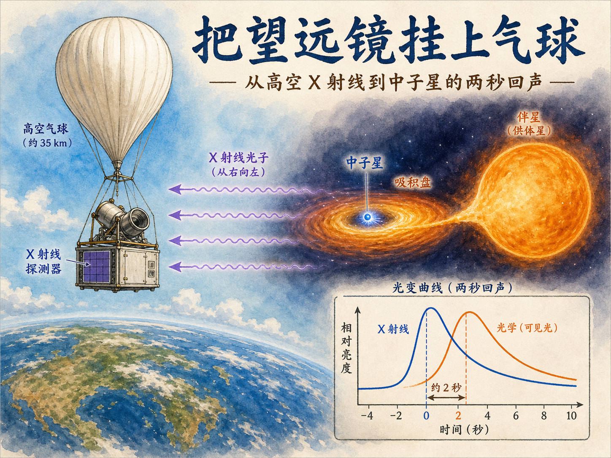
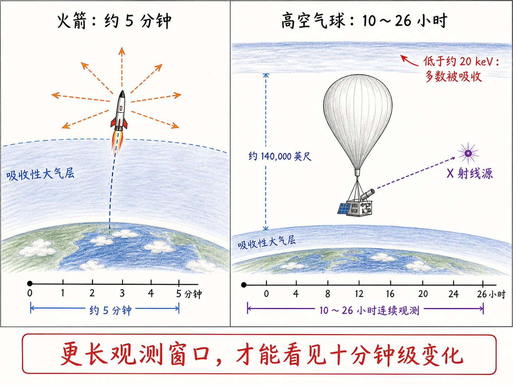
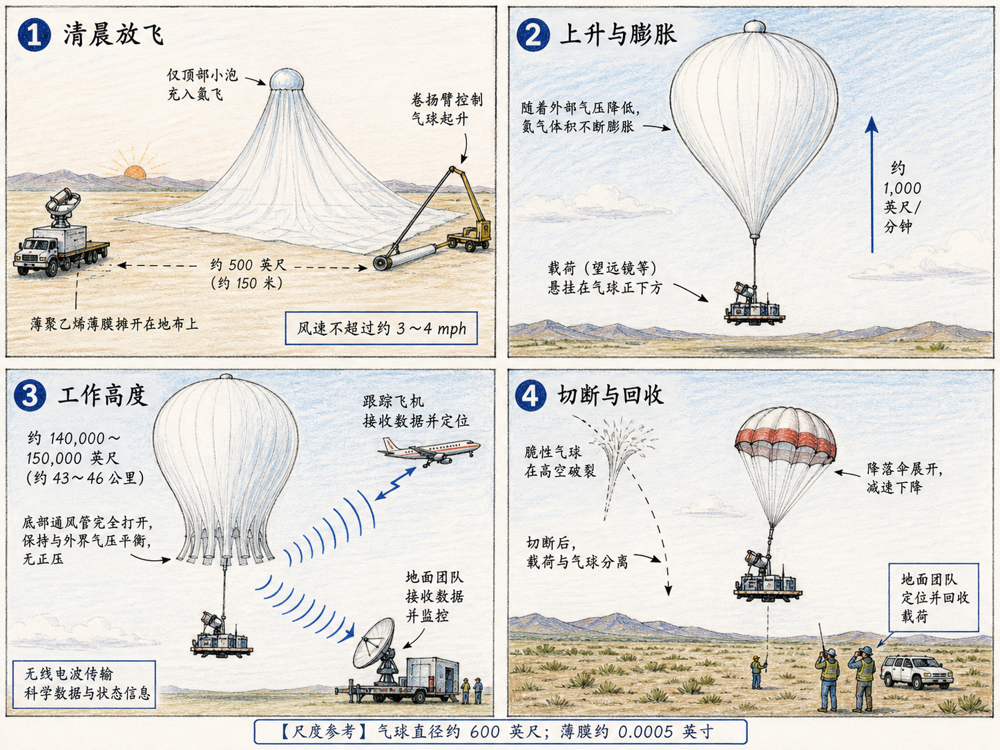
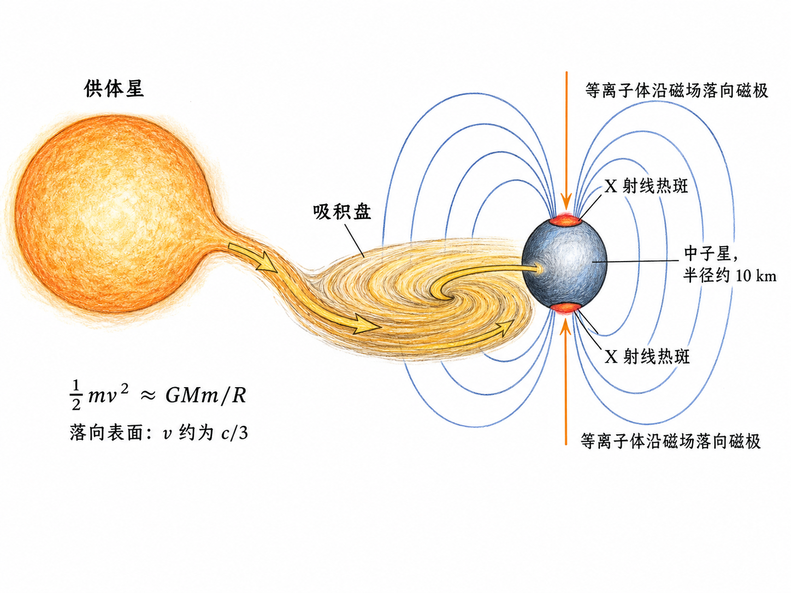
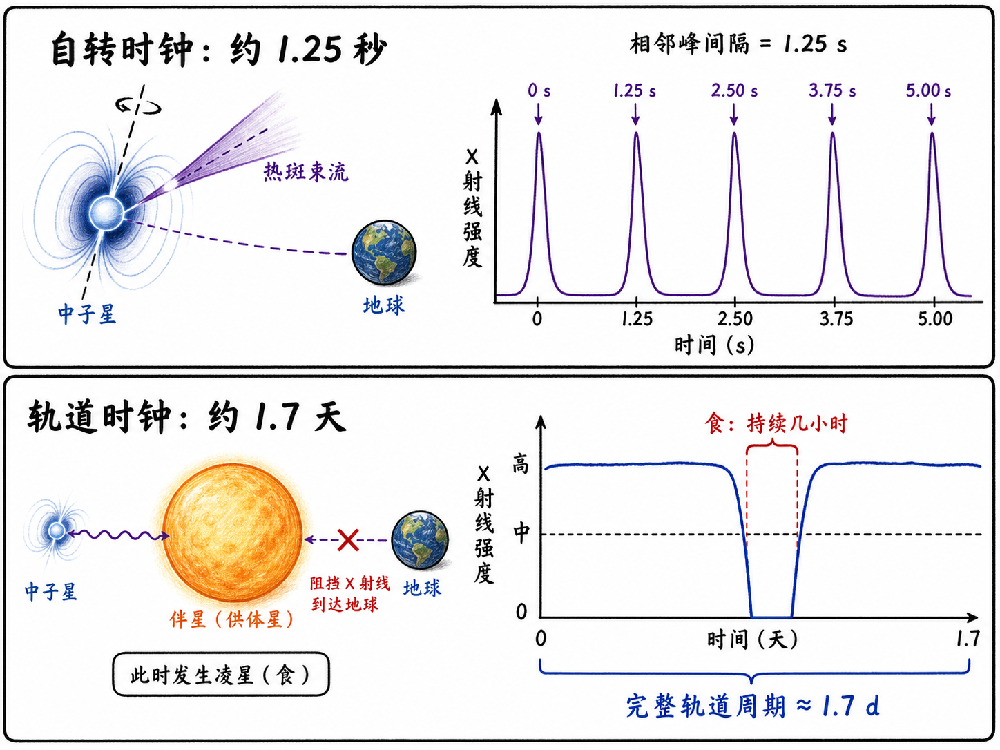
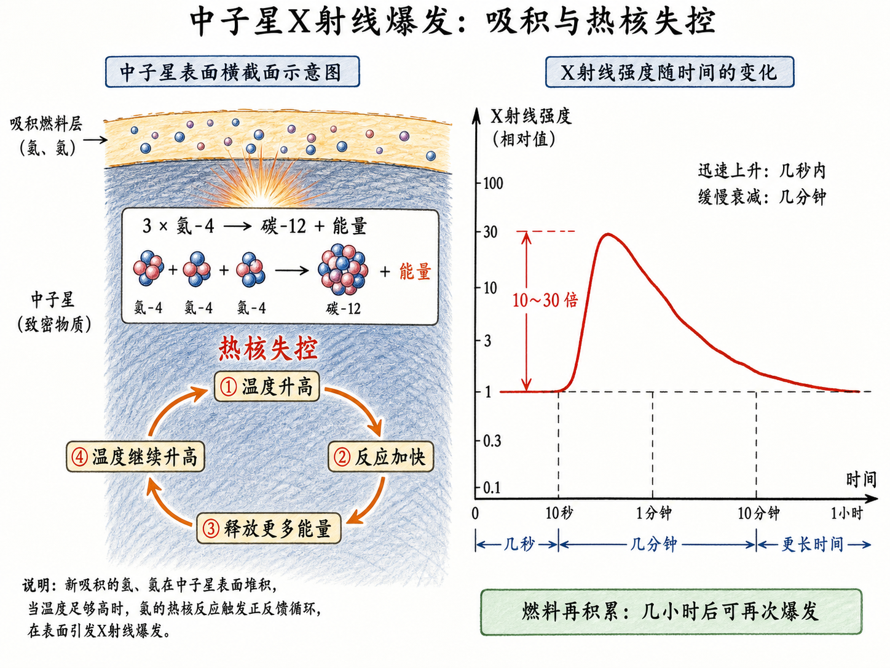
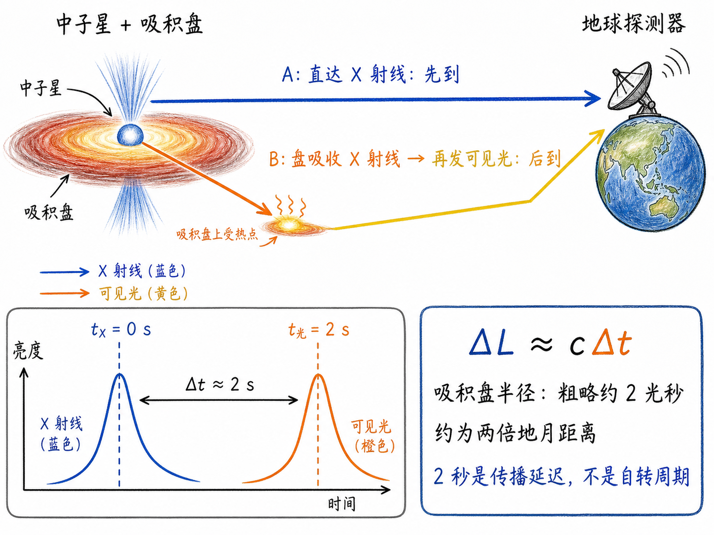

# 把望远镜挂上气球：一堂课怎样追到中子星的两秒回声

最后一堂课，最容易讲成告别。

Walter Lewin 却先把学生带到一个地球表面几乎看不见的宇宙：X 射线天空。然后，他用一只价值不菲、薄得比保鲜膜还夸张的巨型气球，一颗只有城市大小却能把物质加速到光速三分之一的中子星，以及一道迟到约两秒的可见光，串起了自己几十年的研究。

这不是“讲完最后几个知识点”。它真正想回答三个问题：我们怎样看见原本看不见的东西？一串周期信号怎样暴露天体的结构？为什么两秒钟的延迟，竟能变成一把测量遥远吸积盘的尺子？

## 第一关：地面上的望远镜为什么看不见 X 射线天空

可见光光子的能量大约只有 2 eV，这堂课讨论的 X 射线却可以达到数十 keV。两者都属于电磁波，差别不在“是不是光”，而在单个光子的能量尺度。

地球大气层替生命挡住了大部分高能辐射，也顺手挡住了 X 射线天文学家的视线。你在地面架一台再精密的 X 射线望远镜，收到的也不是完整的宇宙信号。要看 X 射线，就必须把探测器送到大气层上方，或者至少送到极高空。

早期科学家先用火箭。火箭能短暂冲出大气层，却只能留下大约 5 分钟的观测时间，还要在这几分钟里迅速扫描天空。1962 年，科学家就是在这样艰难的条件下发现了太阳系外的 X 射线源 Sco X-1。

这个发现之所以震撼，不只是“天空中多了一个点”。太阳的 X 射线功率只占可见光和红外功率的大约 $10^{-7}$，X 射线只是副产品；Sco X-1 却完全反过来，X 射线强得惊人，可见光反倒像副产品。它显然不是另一颗普通太阳，而是某种全新的“野兽”。

可火箭只能看 5 分钟。如果一个天体在 10 分钟内变亮三倍，火箭很可能只撞见变化中的一个瞬间，根本不知道它在变化。于是问题从“能不能上去”变成了“能不能在上面待得够久”。

## 第二关：把一吨重的望远镜挂到一层极薄的塑料下面

Lewin 所在的团队选择了高空气球。

气球到不了真正的太空，因此能量低于约 20 keV 的 X 射线仍会被上方残余大气吸收。但它有一个火箭无法相比的优点：能连续观测十几个小时，运气好甚至超过一天。一次最长飞行达到了 26 小时。

代价是，你必须先完成一项近乎荒诞的工程。

望远镜重约 1,000 千克，研制约需两年。气球要升到约 140,000 英尺，直径约 600 英尺；它由厚度只有约 0.0005 英寸的聚乙烯制成，比厨房保鲜膜还薄。气球和氦气都很昂贵，而发射并不保证成功。薄膜可能在地面被刮破，也可能在穿越低温区域时变脆、爆裂。一场失败的飞行，甚至可能连带终结一个研究生的博士课题。

发射通常选在清晨，因为地面风必须非常稳定，速度不能超过约每小时 3～4 英里。巨大的气球先平铺在地布上，顶部只充入一小部分氦气。升力必须暂时由压重的滚轮臂控制；几百英尺外，卡车载着望远镜缓慢配合。放飞顺序稍有错误，柔软的薄膜就可能与地面摩擦出洞，或者突然拉扯有效载荷。

离地之后，气球才开始展示它真正的样子。随着外界气压降低，氦气不断膨胀，原先只鼓起一小团的顶部最终撑满整个巨大外壳。气球底部必须留有巨大的排气口，因为这层薄膜承受不了明显过压。它以每分钟约 1,000 英尺的速度上升，通常要两三个小时才能抵达工作高度。

然后，地面团队开始追。

探测数据通过无线电传回；飞机追踪气球，地面人员结合雷达和天气资料预测落点。若气球接近海洋或禁飞区，团队会发出无线电指令，把有效载荷与气球分离，让望远镜由降落伞带回地面。真正困难的最后一步不是“让它掉下来”，而是在荒野里把它找回来。

这套系统笨重、昂贵、脆弱，还需要许多人协同。但它换来了火箭给不了的东西：时间。

## 时间一拉长，天空就开始“动”

团队很早就发现了 5 个新的 X 射线源，其中一些源的亮度变化得非常快。有一个源在约 10 分钟内增强到原来的 3 倍；名为 GX 1+4 的源则显示出约 2.3 分钟的周期信号。

如果只拍一张照片，这些天体只是亮点。连续盯住它们，亮点就变成了曲线；曲线一旦出现周期、突降或爆发，就开始泄露天体的结构。

这是一条很重要的科学经验：测量仪器不只要“更灵敏”，还要在正确的时间尺度上工作。5 分钟与 20 小时看到的，不是同一幅宇宙。

## 一颗普通恒星，怎样喂养一颗中子星

许多明亮的 X 射线源来自双星系统。一颗仍在进行核燃烧的普通恒星，与一颗中子星——有时也可能是黑洞——彼此绕转。如果两者靠得足够近，普通恒星外层的一部分物质会被紧凑天体夺走。

这些物质不会直直砸下去，因为它们带着角动量。它们先绕着中子星旋转，逐渐向内迁移，形成吸积盘。提供物质的普通恒星叫供体星。

一小团质量为 $m$ 的物质，从远处落到质量为 $M$、半径为 $R$ 的中子星表面。用最简单的能量估算：

$$
\frac{1}{2}mv^2 \approx \frac{GMm}{R}.
$$

约去 $m$，得到

$$
v\approx\sqrt{\frac{2GM}{R}}.
$$

关键在 $R$。中子星质量与太阳相当，半径却只有约 10 千米。相似的质量被塞进极小的半径，引力势阱深得惊人，落下的物质到达表面时速度可达约光速的三分之一。

撞击把动能转成热，使局部温度达到约一千万至一亿度。在这种温度下，辐射的主舞台不再是可见光，而是 X 射线。Lewin 用一个夸张但直观的比喻提醒学生：中子星引力如此强，从远处扔向它的一颗棉花糖，撞击释放的能量也足以达到原子弹的量级。

## 为什么会像灯塔一样闪烁

落向中子星的物质已经电离，是带电等离子体。中子星又有极强的磁场，因此带电粒子会受到磁场作用，沿磁力线螺旋运动，最后集中落到磁极附近。

于是，中子星表面不会均匀发亮，而会出现两个炽热的 X 射线热斑。如果磁轴和自转轴不重合，中子星旋转时，热斑发出的辐射束就会周期性扫过地球，像宇宙灯塔。

这正是周期信号的意义。一组早期观测显示，X 射线强度约每 1.25 秒重复一次。那不是仪器在抖，而是中子星的自转在计时。

同一个系统还提供了另一种证据：X 射线食。以 Hercules X-1 为例，每当中子星运行到体积大得多的供体星背后，X 射线信号就会完全消失，过一段时间再恢复；整个轨道周期约为 1.7 天。

把两种时间结构放在一起看：1.25 秒的快周期告诉你中子星在自转；1.7 天的慢周期和完整的信号遮挡告诉你，它正与另一颗星互相绕转。我们看不到那套系统的近景照片，却能从一条亮度—时间曲线反推出“旋转热斑 + 双星轨道”的几何图景。

## 几秒钟的爆发，是整层燃料一起失控

1975 至 1979 年间，MIT 运行 X 射线天文台 SAS-3。科学家发现，一些 X 射线源会在几秒内增强到原来的 10、20 甚至 30 倍，再在几分钟内逐渐衰减。两年内，SAS-3 又发现了 8 个新的爆发源。

这些爆发来自中子星表面的热核失控。

供体星送来的物质主要包含氢和氦。它们在中子星表面不断堆积，被极强引力压到高密度、高温状态。三个氦-4 原子核可以聚变成一个碳-12 原子核，并释放能量。危险之处在于，这种反应对温度极其敏感：

温度升高 $
ightarrow$ 反应加快 $
ightarrow$ 能量释放增加 $
ightarrow$ 温度继续升高。

这是一条正反馈链。一旦越过稳定边界，反应就会失控，新吸积的一整层燃料几乎同时燃烧，形成一次巨大的 X 射线暴。课堂给出的量级是：它比地球上最强的氢弹还强约 18 个数量级。

燃料烧完，爆发便衰减；供体星继续送料，几小时后表面又积累出下一层燃料，于是下一次爆发再次发生。亮度曲线不仅告诉我们“发生了爆炸”，还把燃料积累、点火和耗尽的过程记录了下来。

## 两秒钟，怎样变成一把宇宙尺度的尺子

最后一个谜题更漂亮。

X 射线暴发生时，一部分 X 射线直接飞向地球；另一部分先照到周围的吸积盘，被盘吸收并加热，吸积盘随后再发出可见光。这样，地球上的观测者应该先看到 X 射线暴，再看到形状相似但略微迟到的可见光暴。

迟到不是仪器故障，而是路程差：

$$
\Delta L \approx c\,\Delta t.
$$

如果可见光晚 1 秒到达，额外路程的尺度就是约 1 光秒。于是，测量两个信号之间的延迟，就等于用光本身当卷尺，测量人眼根本无法分辨的吸积盘。

1977 年，团队组织了一次全球协同观测：17 个国家、44 座天文台参与，SAS-3 连续两周监视目标。他们记录到 110 次 X 射线暴，却一次光学对应信号也没有看到。规模巨大，不等于第一次就会成功。

1978 年，他们终于同时探测到 X 射线暴和光学暴。1979 年得到的更好数据进一步显示：把光学曲线向前移动约 2 秒，它几乎就能与 X 射线曲线重合。

这意味着，光学信号走过了更长的路径：X 射线先从中子星到达吸积盘，盘被加热后再发出可见光。由约 2 秒的延迟，团队估算吸积盘半径大致为 2 光秒，也就是约两倍地月距离。

望远镜没有拍出吸积盘边缘，科学家却用两条曲线之间的小小错位，量出了它的几何尺度。

## 告别演出真正留下了什么

这堂课中途被学生准备的表演打断，最后也没有回到整齐的“知识点总结”。Lewin 说，学生们很快会忘掉四条麦克斯韦方程，忘掉电磁感应，也会忘掉许多名字。

但以后再看见彩虹，他们也许会忍不住确认：红色是否在外侧，蓝色是否在内侧；如果手边有偏振片，还会想检查彩虹的偏振特性。

这句话与前面的 X 射线故事其实说的是同一件事。

科学不只是记住答案，而是养成一种无法轻易关闭的习惯：看到信号，就追问它为什么这样变化；遇到看不见的对象，就寻找能把它显影的方法；发现两条曲线错开两秒，就问这两秒在空间中究竟有多长。

方程可能会忘，名字可能会忘。但如果你从此无法对一条周期曲线、一道彩虹或一次迟到的闪光视而不见，这门课就已经改变了你看世界的方式。
