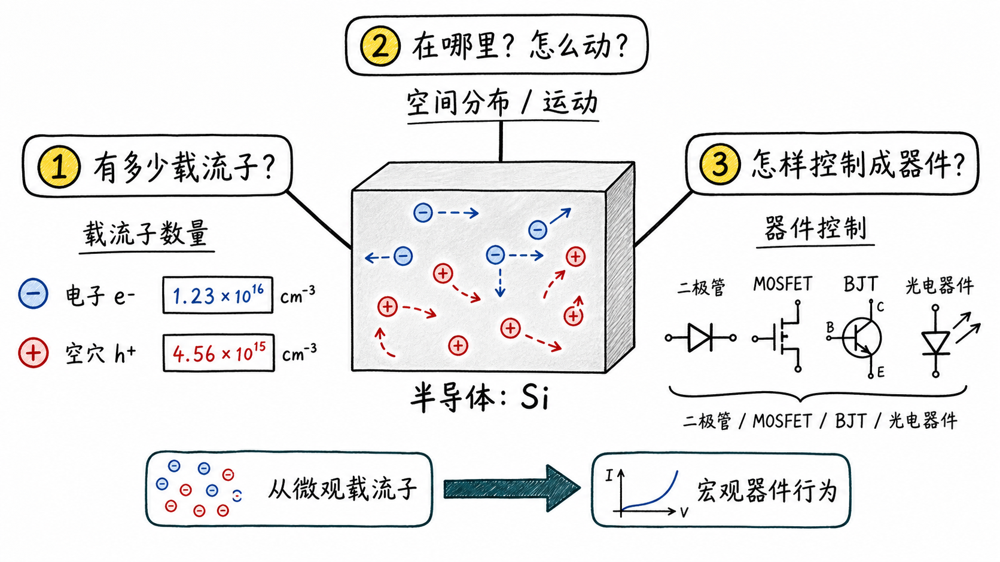
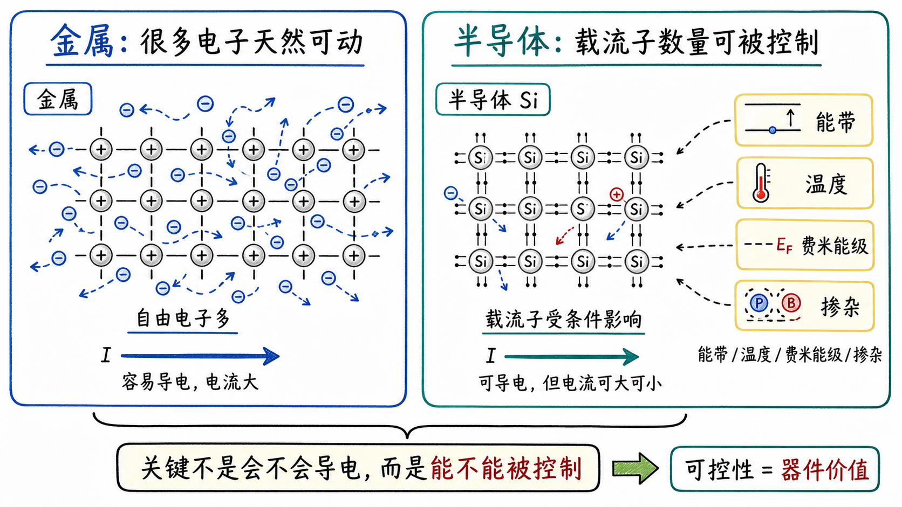
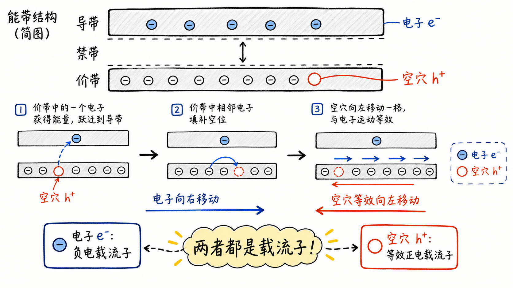
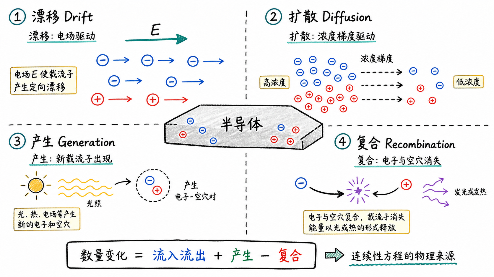
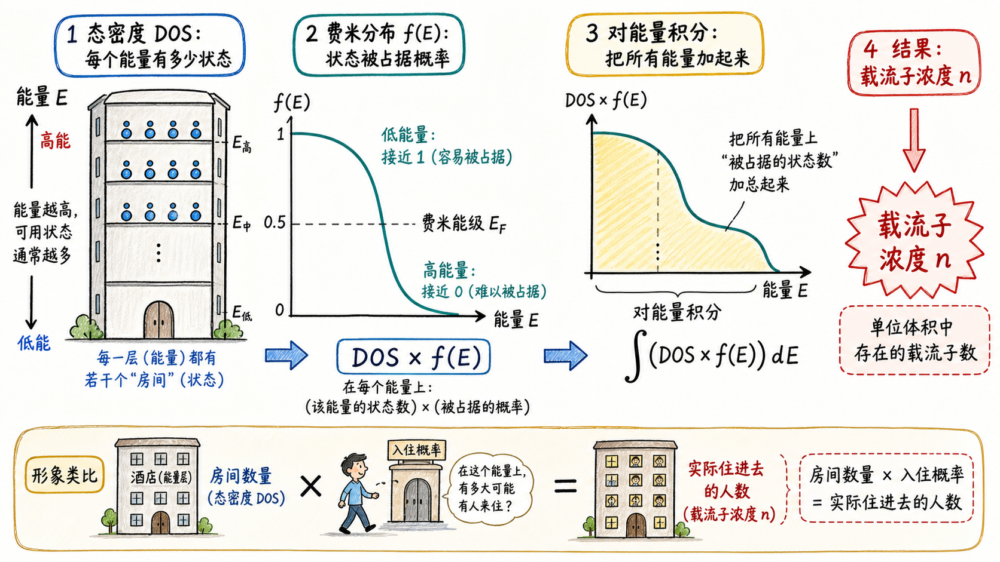
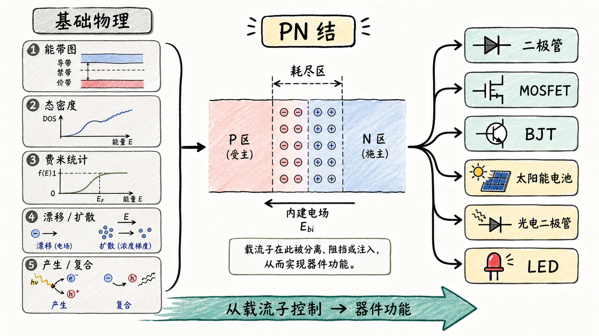

# 半导体物理到底在学什么？

如果你刚开始学半导体物理，最容易被一堆新词砸晕：量子力学、态密度、能带图、费米统计、漂移扩散、连续性方程、PN 结、MOSFET、BJT。它们看起来像一串互不相干的术语，其实背后只有一个很工程的问题：一块硅为什么能被我们调成器件？

金属导电比较直接，里面有大量电子可以动。但半导体不是这样。它的价值恰恰在于“不那么天然导电”，所以我们才有机会用掺杂、电场、结结构和光照去控制它。半导体物理要回答的，不是抽象地背材料性质，而是回答：载流子有多少、在哪里、怎么动，以及我们怎样把这些运动变成二极管、晶体管和光电器件。

读完这篇，你会知道

- 半导体物理的三个核心问题是什么。
- 为什么不能把半导体简单理解成“会导电的材料”。
- 能带图、态密度、费米统计分别负责回答什么。
- 漂移、扩散、产生、复合为什么会通向器件分析。
- 这门课为什么最后一定会走向 PN 结、二极管、MOSFET、BJT 和光电器件。

## 第一个问题：有多少载流子？

半导体物理的第一个问题很朴素：这块材料里有多少电荷载流子？

电荷载流子，就是能够携带电荷并参与电流形成的东西。电子是一种载流子。对金属来说，我们常常可以粗略地认为，可参与导电的电子数量和原子数量差不多在同一个量级。也就是说，金属天然有很多电子可以动，所以它导电。

但硅这样的半导体不是这样。

半导体里不是每个原子都天然贡献一个自由电子。它里面到底有多少电子能参与导电，取决于能带结构、温度、费米能级、掺杂，以及电子能否从不能自由运动的状态进入可以导电的状态。

这就是为什么半导体物理一开始必须问“有多少”。如果这个问题回答不清楚，后面所有器件电流、开关、阈值、漏电、光电响应都无从谈起。

## 为什么要说“载流子”，而不只说电子？

这里有一个关键点：半导体里不只有电子。

半导体物理还会引入“空穴”。空穴不是一个真的小球，也不是材料里挖出来的洞。更准确地说，它是价带里少了一个电子之后，整体表现出来的等效正电荷运动。

从工程分析上看，空穴很有用。它表现得像一个带正电、会移动的粒子。于是我们在半导体里要同时追踪两类载流子：电子和空穴。

这就是“载流子”这个词的意义。它不是故意把简单问题说复杂，而是在提醒我们：半导体导电不是只有电子一个角色。很多器件，尤其是 PN 结、BJT、光电二极管和太阳能电池，都必须同时理解电子和空穴。

## 第二个问题：载流子在哪里，怎么动？

知道“有多少”还不够。器件不是一个均匀的硅块，载流子也不是平均撒在里面就结束了。

我们还要问：这些载流子在哪里？空间分布怎样？如果外面加一个电场，它们会怎么响应？如果某个区域载流子浓度高、另一个区域浓度低，它们会不会自己扩散过去？如果光照进来产生新的电子和空穴，它们会存在多久？又会在哪里复合消失？

这些问题对应半导体输运里的几件大事：

- 漂移：载流子在电场作用下运动。
- 扩散：载流子从高浓度区域向低浓度区域运动。
- 产生：新的电子和空穴被激发出来。
- 复合：电子和空穴重新消失，能量以热或光的形式释放。

如果你把半导体器件想成一个水管系统，载流子数量像水量，电场和浓度梯度像推动水流的压力差，产生和复合像水源和排水口。器件是否工作，本质上取决于这些“水”在空间和时间里怎样流动。

## 第三个问题：怎样控制它，并做成器件？

前两个问题分别是“有多少”和“怎么动”。工程师真正关心的是第三个问题：我怎样改变这些东西，让它们变成有用功能？

半导体器件的核心能力，就是控制载流子。

二极管通过 PN 结控制电流方向。MOSFET 用栅极电场控制沟道里是否形成足够载流子。BJT 用一个区域的少量注入去控制另一个区域的大电流。太阳能电池、光电二极管和 LED 则把光与载流子的产生、分离、复合联系起来。

所以半导体物理不是为了“理解硅”而理解硅。它的终点是器件：我们怎样从材料里的电子和空穴出发，解释电路里看到的电流、电压、开关和光电转换。

## 这门课为什么从量子力学开始？

路线图的第一站通常是量子力学。这不是因为课程喜欢从难的地方开始，而是因为半导体里“有多少载流子”这个问题，离不开电子能占据哪些能量状态。

在经典图像里，你可能会把电子想成小球，在材料里到处跑。但在晶体里，电子能处在哪些状态、哪些能量范围允许存在、哪些能量范围不允许存在，都由量子力学决定。

这会带出几个关键工具。

第一个是态密度。态密度回答的是：在某个能量附近，有多少可供电子占据的状态。你可以把它想成一栋楼里每一层有多少房间。电子要住进去，首先得有房间。

第二个是能带图，也就是 $E-k$ 关系。能带图告诉我们电子在晶体里的能量结构。半导体里为什么有导带、价带和禁带，为什么电子要跨过能隙才能参与某些导电过程，都要靠能带图来表达。

第三个是有效质量。自由空间里的电子质量是一个确定常数，但在晶体里，电子运动会受到周期性晶格势场影响。为了让问题仍然像“粒子在力的作用下运动”那样可计算，我们引入有效质量。它不是说电子真的变重或变轻，而是说在半导体内部，电子对外力的响应可以用一个等效质量来描述。

## 费米统计把“房间”和“入住概率”连起来

光知道有多少状态还不够。还要知道这些状态有没有被电子占据。

态密度回答“有多少房间”。费米统计回答“每个房间被住进去的概率是多少”。把两者乘起来，再沿能量积分，就能得到电子数量。

也就是说，半导体里载流子浓度的计算，本质上是这个逻辑：

某个能量上的可用状态数量 × 这些状态被占据的概率，然后把所有相关能量加总。

用数学语言说，就是对“态密度 × 费米分布”做能量积分。课程一开始铺量子力学、态密度、能带图和费米统计，最终就是为了把“有多少载流子”这个问题算出来。

## 输运问题把半导体物理接到电路理论

当我们转向“载流子怎么动”，就会进入漂移和扩散。

漂移来自电场。电场对带电粒子施加力，载流子因此产生定向运动。理解漂移后，就可以看到欧姆定律的微观来源。电路里我们写 $I=V/R$，看起来像一个经验规律；但在材料内部，它对应的是载流子在电场下的定向运动，以及材料中载流子浓度和迁移率共同决定的电导率。

扩散来自浓度梯度。如果某个地方电子或空穴很多，另一个地方很少，载流子就会从高浓度区域向低浓度区域扩散。这件事在 PN 结里非常关键，因为 P 区和 N 区接触后，电子和空穴的浓度分布天然不均匀。

产生和复合则负责时间变化。载流子可能因为热激发、光照或外部注入被产生，也可能因为电子和空穴相遇而复合。只要器件涉及瞬态、光响应、少子寿命或存储电荷，这些过程就绕不开。

## 连续性方程是把所有机制合在一起的账本

漂移、扩散、产生、复合如果分开看，只是几个物理机制。真正做器件分析时，我们需要把它们放进同一个方程里。

这个方程就是连续性方程。它的思想很简单：某个位置的载流子数量为什么会变？无非是三类原因。

- 流进来的和流出去的不一样。
- 这里新产生了载流子。
- 这里有载流子复合消失了。

把这些因素写成微分方程，就得到连续性方程。再进一步，在电子和空穴互相耦合的情况下，还会得到双极输运方程。

这些方程看上去会比较重，但它们是分析半导体器件的主工具。没有它们，PN 结、二极管电流、晶体管注入、光生载流子的收集，都只能停留在口头图像。

## 为什么最后一定会走向 PN 结和晶体管？

半导体物理的终点不是把公式推完，而是解释器件。

PN 结是一个关键入口。理解 PN 结，就能理解二极管为什么单向导通，为什么有耗尽区，为什么有内建电场，为什么正偏和反偏下电流表现完全不同。

从 PN 结继续往前，就会进入晶体管。MOSFET 的核心是用栅极电场控制半导体表面的载流子分布，从而打开或关闭沟道。BJT 的核心是用少数载流子的注入、扩散和收集来实现电流放大。

再往外扩展，就是光电器件。太阳能电池要把光生电子空穴对分离并收集起来；光电二极管要把光信号变成电流；LED 则要让电子和空穴复合并发光。

这些器件看起来不同，但底层问题没有变：载流子有多少，在哪里，怎样运动，怎样被我们控制。

## 这张路线图真正要告诉你什么

如果这节导论里很多词还没听懂，不需要焦虑。导论的价值不是让你立刻掌握每个概念，而是先建立一张地图。

这张地图可以压缩成一条链：

量子力学和统计力学告诉我们电子能处在哪些状态，以及这些状态有多大概率被占据；能带图、态密度和费米统计帮助我们算出载流子浓度；漂移、扩散、产生、复合帮助我们描述载流子怎样运动和变化；连续性方程把这些机制合成一个可计算框架；最后，这个框架被用来分析 PN 结、二极管、MOSFET、BJT 和光电器件。

换句话说，半导体物理不是一堆概念的集合，而是一套从微观电子状态走向宏观器件行为的桥梁。

学这门课时，最重要的不是先记住每个名词，而是始终抓住三个问题：

载流子有多少？

载流子在哪里、怎么动？

我们怎样控制它们，并做成有用器件？

只要这三个问题不丢，后面的量子力学、能带、费米统计、漂移扩散和 PN 结，就不会散成一堆孤立知识点。
