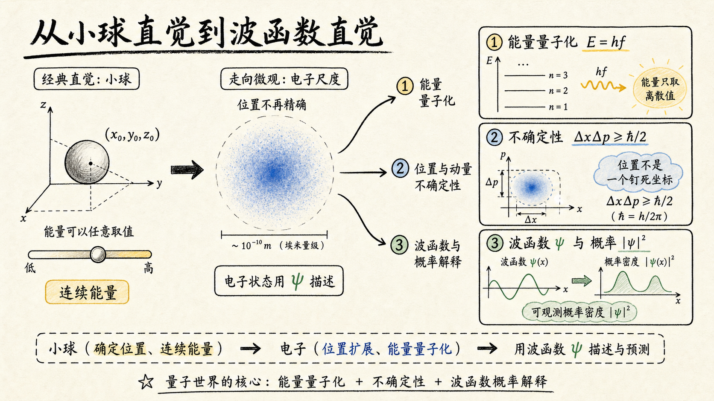
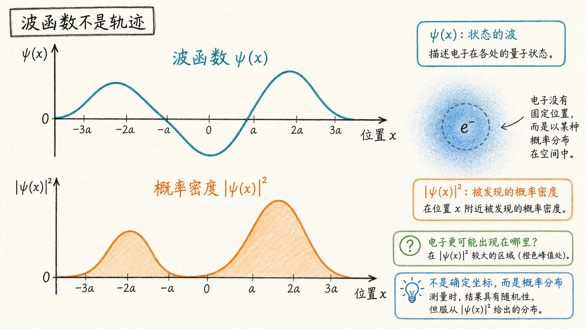
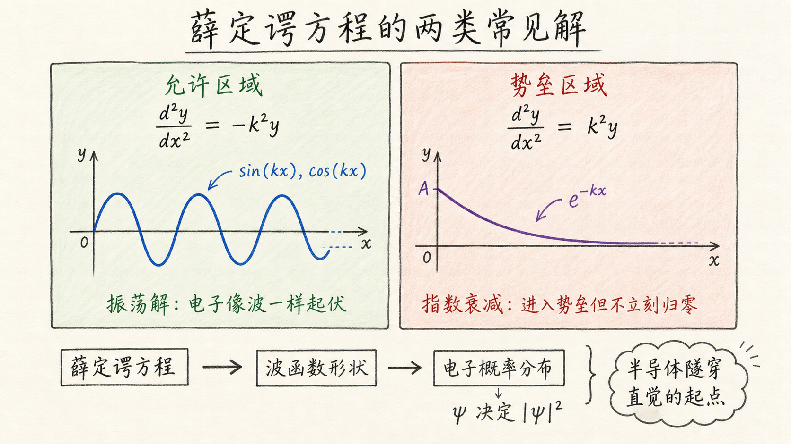

# 量子力学基础：为什么半导体里的电子不能再当作小球

如果只看日常世界，电子这个词很容易被我们想成“小球”：它有位置、有速度，沿着某条轨道跑。这个想象在宏观力学里很自然。一个球从桌上滚过去，你可以问它此刻在哪里，也可以问它速度是多少，再用 $\frac{1}{2} m v^2$ 算能量。

但一旦进入半导体，尤其是要解释能带、势垒、量子阱、隧穿这些现象时，这套“小球语言”就不够用了。不是因为它不优雅，而是因为它会给出错误直觉：电子在原子尺度上不再像一颗有确定轨迹的小球，而更像一个会展开、会干涉、只能用概率描述的波。

读完这篇，你会知道

- 为什么微观粒子的能量不能随便取任意值，而是会被量子化
- 为什么电子的位置不能被说成一个确定坐标
- 为什么电子必须用波函数 $\psi$ 描述，真正可观测的是 $\left|\psi\right|^2$
- 为什么薛定谔方程在半导体问题里经常变成正弦、余弦或指数函数
- 这些量子力学假设为什么会直接影响半导体器件建模

## 第一件事：能量不是连续倒水，而是一包一包交换

在经典力学里，能量像一条连续的滑杆。一个球的动能是 $\frac{1}{2} m v^2$，速度 $v$ 可以连续变化，所以能量也可以连续变化。你可以让速度是 $9.04\ \text{m/s}$，也可以是 $9.0008\ \text{m/s}$，数学上没有哪一个中间值被禁止。

量子力学把这个直觉打断了。当对象小到原子尺度，能量交换不再像连续倒水，而更像一枚一枚硬币交易。每一枚“能量硬币”就是一个光子，它的能量满足：

$$
E = h f
$$

这里 $h$ 是普朗克常数，$f$ 是频率。这个式子的关键不只是“光子能量等于频率乘常数”，而是告诉我们：在微观世界，能量交换有最小单位，系统不一定能拿到任意能量。

对半导体来说，这个观念很要命。因为电子能不能跨过某个能量差、能不能吸收某个光子、能不能从价带跳到导带，不再只是“差一点也可以”的连续问题，而是要看能量包和允许能级是否匹配。

## 第二件事：电子没有一个可以随便钉死的位置

经典力学喜欢确定性。一个球在某一时刻可以有坐标 $(x_0, y_0, z_0)$，也可以有动量。只要测量仪器足够好，我们直觉上认为位置和动量都能越测越准。

量子力学说：这不是仪器不够好，而是世界本身不允许你同时把某些量钉死。位置不确定度和动量不确定度之间有关系，常见写法是：

$$
\Delta x\,\Delta p \ge \frac{\hbar}{2}
$$

其中 $\hbar = \frac{h}{2\pi}$。源视频里强调的是位置和动量之间的牵制关系：如果你把动量测得更确定，位置就不能同时任意确定；如果你把位置压得很窄，动量就会变得更不确定。

这句话不要理解成“电子很小，所以我们看不清”。更准确的说法是：电子不是预先藏在某个确定位置，等着我们去发现。它在被测量之前，只能用一种空间分布来描述。

对器件工程的影响是：当沟道、势垒、氧化层、量子阱这些结构尺寸接近电子波动特征时，电子不再只是沿电场漂移扩散。它会受到边界条件、势能形状和波函数分布的影响。很多短沟道、隧穿和量子限制现象，都从这里开始变得不可忽略。

## 第三件事：电子像波，所以要用波函数

如果粒子不是小球，那它是什么？量子力学给的回答不是“它其实就是水波”，而是：它的状态要像波一样描述。

德布罗意关系把粒子动量和波长连起来：

$$
\lambda = \frac{h}{p}
$$

动量 $p$ 越大，波长越短；动量越小，波长越长。这让粒子和波之间有了一条硬连接。电子可以表现出干涉、衍射这类波动行为，因此不能只靠经典轨迹来描述。

于是我们引入波函数 $\psi$。波函数本身不是“电子的真实形状照片”，它更像一张包含概率信息的地图。真正能和测量结果联系起来的是波函数的模平方：

$$
\left|\psi(x)\right|^2
$$

它表示电子在位置 $x$ 附近被发现的概率密度。换句话说，我们通常不是问“电子到底在哪一个点”，而是问“如果测量，电子更可能在哪些区域出现”。

这也是后面学习半导体量子模型时最重要的转换：求电子状态，不是先画一条电子轨迹，而是先解出 $\psi$，再通过 $\left|\psi\right|^2$ 看概率分布。

## 怎么真正算？入口是薛定谔方程

前面三件事听起来像哲学：能量量子化、位置不确定、粒子有波动性。但工程问题不能停在哲学层。我们最终要算：电子在这个势阱里有什么能级？在势垒里会不会衰减？在某个区域出现概率多大？

这时薛定谔方程就变成入口。源视频为了后续半导体模型先做了一个很实用的简化：在接下来的问题里，薛定谔方程常常会落成两类二阶微分方程。

第一类是：

$$
\frac{d^2 y}{dx^2} = -k^2 y
$$

这个方程的解是正弦和余弦，或者它们的线性组合：

$$
y = A_1 \sin(kx) + A_2 \cos(kx)
$$

这种形式通常意味着波函数在空间中振荡。你可以把它理解成“电子在这个区域像波一样来回起伏”。

第二类是：

$$
\frac{d^2 y}{dx^2} = k^2 y
$$

这个方程的解是指数函数，或者它们的线性组合：

$$
y = A_1 e^{-kx} + A_2 e^{kx}
$$

这种形式常对应衰减或增长。在半导体里，最有工程意义的是衰减项 $e^{-kx}$：它会告诉你，电子波函数进入某个经典上不允许的区域后，不是立刻归零，而是按指数衰减。这正是隧穿直觉的起点。

## 为什么这对半导体不是“物理课背景知识”

如果我们只做宏观电路，也许可以把电子想成一群带电小球，靠电场推动、靠浓度梯度扩散。但半导体器件越做越小，很多关键现象就越来越依赖量子力学。

能量量子化告诉你：电子不是想占哪个能量就占哪个能量，材料和边界会规定允许状态。不确定性原理告诉你：尺寸压缩本身会改变动量和能量分布。波函数告诉你：电子的空间分布不是轨迹，而是概率。薛定谔方程告诉你：这些概率分布不是口头描述，而是可以通过微分方程算出来。

所以，量子力学对半导体的意义不是多背几个公式，而是换一套提问方式：

电子不是“此刻在哪儿”，而是“在哪些位置出现的概率大”。

电子不是“有没有足够能量就过去”，而是“在这个势能边界下，波函数如何连接、振荡或衰减”。

电子不是“像小球一样走过器件”，而是“在材料势能、边界条件和允许能级共同限制下形成状态”。

## 最后收束：从小球直觉换成波函数直觉

这节内容的核心可以浓缩成一句话：进入原子尺度后，电子不能再用确定轨迹描述，而要用波函数描述；我们真正能预测的是由 $\left|\psi\right|^2$ 给出的概率分布。

后面建半导体模型时，薛定谔方程会把这句话变成可计算的东西：有些区域给出正弦、余弦式的振荡解，有些区域给出指数式的衰减解。理解这两类解，就是理解电子为什么能形成能级、为什么会被势垒限制，以及为什么在某些条件下还能穿过势垒。
