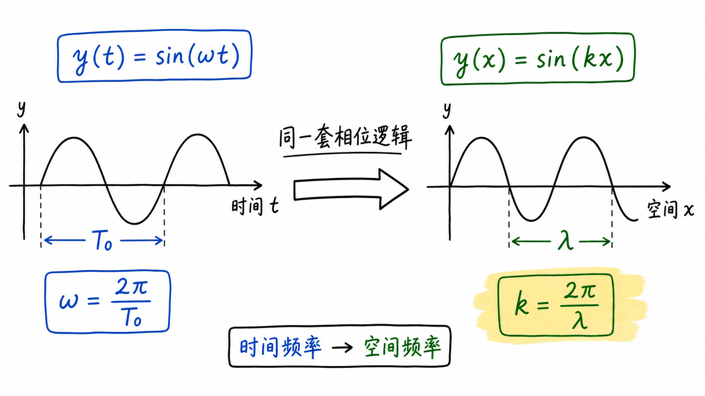
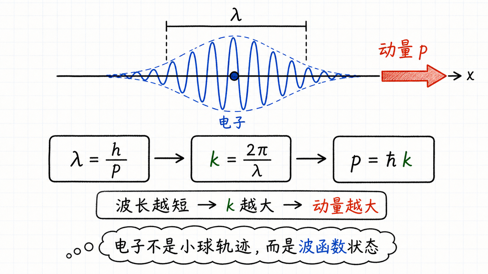
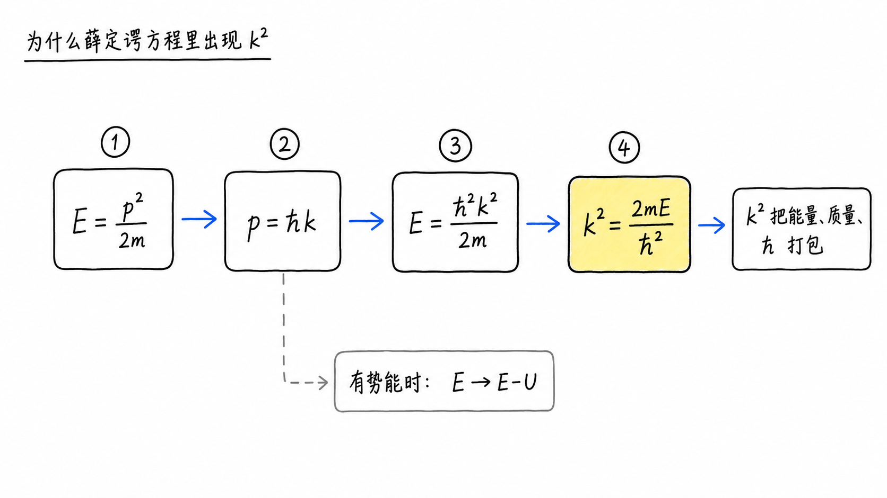
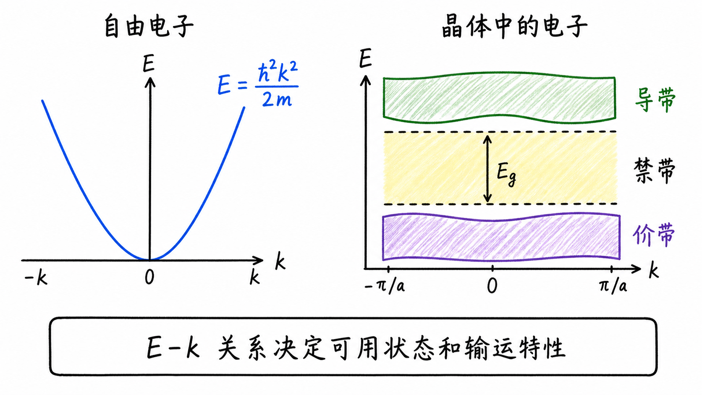

# 为什么电子要用波数 k 来描述

第一次看到薛定谔方程时，最容易被吓到的地方往往不是物理，而是符号。比如上一讲里突然出现了一个 $k$，方程被写成 $\frac{d^2\psi}{dx^2}=-k^2\psi$。它看起来像是为了让数学好看而凭空塞进去的常数。

但 $k$ 不是装饰。它是把“电子像波一样在空间里怎么变化”这件事压缩成一个数字。对半导体来说，这个数字很关键，因为后面的能带图、$E-k$ 关系、有效质量，都会从这里长出来。

读完这篇，你会知道

- 为什么正弦波里总会出现 $2\pi$，它和波数有什么关系
- $k$ 为什么可以理解为“空间频率”
- 德布罗意关系怎样把 $k$ 和电子动量连起来
- 为什么 $k^2=\frac{2mE}{\hbar^2}$ 会出现在薛定谔方程里
- 为什么半导体里特别关心 $E$ 和 $k$ 的关系

## 先从一个更熟悉的波开始：时间里的正弦波

如果一个量随时间振动，我们会写成 $y(t)$。假设它的周期是 $T_0$，也就是每隔 $T_0$ 秒重复一次。那么它的普通频率就是 $f_0=\frac{1}{T_0}$。

但正弦函数吃进去的不是“经过了多少个周期”，而是“相位走了多少弧度”。一个完整周期对应一整圈，也就是 $2\pi$ 弧度。所以时间波通常写成：

$y(t)=\sin(2\pi f_0t)$

因为 $2\pi f_0$ 老是一起出现，我们把它叫作角频率 $\omega_0$：

$y(t)=\sin(\omega_0t)$

这一步没有增加新物理，只是把“每秒走过多少弧度”打包成一个更方便的符号。

## 把同一件事搬到空间里

现在把时间换成空间。想象一条正弦波不是在动，而是沿着 $x$ 轴摆在那里。它不需要随时间变化，也可以在空间中有高低起伏。

这个空间波也有周期。通常我们把空间周期叫作波长 $\lambda$。如果沿着空间前进一个 $\lambda$，波形就重复一次。

所以空间波可以写成：

$y(x)=\sin\left(2\pi \frac{1}{\lambda}x\right)$

这里的 $\frac{1}{\lambda}$ 是“单位长度里有多少个周期”。它和时间里的频率很像，只不过它不是每秒多少次，而是每米多少次。

同样，为了不反复写 $2\pi\frac{1}{\lambda}$，我们把它打包成波数：

$k=\frac{2\pi}{\lambda}$

于是空间波就变成：

$y(x)=\sin(kx)$

这就是 $k$ 最直观的意思：它表示空间里的相位走得有多快。$k$ 大，说明波长短，波在空间里起伏得密；$k$ 小，说明波长长，波在空间里起伏得慢。

## 电子为什么也能谈波数

如果这里只是普通水波或声波，事情还不算奇怪。真正让人不适应的是：电子也要用类似的波来描述。

量子力学里，电子不只是一个小球。它的状态可以用波函数 $\psi(x)$ 描述。波函数怎样随空间变化，会影响我们能观测到的动量、能量和允许存在的状态。

德布罗意给出了连接粒子和波的关键关系：

$\lambda=\frac{h}{p}$

其中 $\lambda$ 是粒子的波长，$h$ 是普朗克常数，$p$ 是动量。把它和 $k=\frac{2\pi}{\lambda}$ 合在一起，就得到：

$p=\hbar k$

这里 $\hbar=\frac{h}{2\pi}$。

这句话非常重要：$k$ 不只是一个数学符号，它和电子动量直接相连。换句话说，看到 $k$，你其实就在看电子“带着多少动量”。

## 从动量走到能量：$k^2$ 为什么冒出来

接下来要解释为什么薛定谔方程里会出现 $k^2=\frac{2mE}{\hbar^2}$。

先看非相对论粒子的动能关系：

$E=\frac{p^2}{2m}$

再用 $p=\hbar k$ 代进去：

$E=\frac{(\hbar k)^2}{2m}=\frac{\hbar^2k^2}{2m}$

把它整理一下：

$k^2=\frac{2mE}{\hbar^2}$

这就是源文里那个看起来很复杂的 $\frac{2mE}{\hbar^2}$。它不是任意凑出来的，而是“电子的能量”和“电子波在空间里振荡得多快”之间的换算关系。

如果系统里还有势能 $U$，电子可用于运动的部分就不是总能量 $E$，而是 $E-U$。所以更完整的写法会变成：

$k^2=\frac{2m(E-U)}{\hbar^2}$

于是定态薛定谔方程可以写成：

$\frac{d^2\psi}{dx^2}=-k^2\psi$

这就是为什么我们愿意引入 $k$：它把质量 $m$、能量 $E$、势能 $U$、普朗克常数 $\hbar$ 这些量压成一个更好处理的空间振荡参数。

## 对半导体来说，重点不是符号漂亮，而是 $E-k$ 关系

如果只是为了少写几个常数，$k$ 当然也有用。但在半导体里，它的重要性不止于此。

薛定谔方程真正告诉我们的，是能量 $E$ 和波数 $k$ 之间的关系。也就是：当电子在某个结构或材料里运动时，它可以有哪些能量？这些能量对应怎样的空间变化模式？

这就是 $E-k$ 图的起点。

在自由空间里，$E$ 和 $k$ 的关系可以写成：

$E=\frac{\hbar^2k^2}{2m}$

这是一个抛物线关系。但在晶体里，周期性势场会改变这个关系，能带、禁带、有效质量等概念就会出现。后面做器件分析时，我们关心电子能不能传输、在哪些能量下能传输、迁移率和有效质量为什么变化，本质上都绕不开 $E-k$ 关系。

## 最后收束：$k$ 是电子波在空间里的节拍

可以把 $k$ 记成一句话：$k$ 是电子波在空间里的节拍。

它来自空间正弦波的周期，等于 $2\pi/\lambda$；它通过 $p=\hbar k$ 和动量相连；它又通过 $E=\frac{\hbar^2k^2}{2m}$ 和能量相连。

所以当薛定谔方程把一堆常数写成 $k^2$ 时，它不是在隐藏物理，而是在把物理压缩成一个更有用的变量。对半导体器件来说，真正要追踪的不是孤立的 $E$，也不是孤立的 $k$，而是材料里 $E$ 怎样随着 $k$ 变化。
