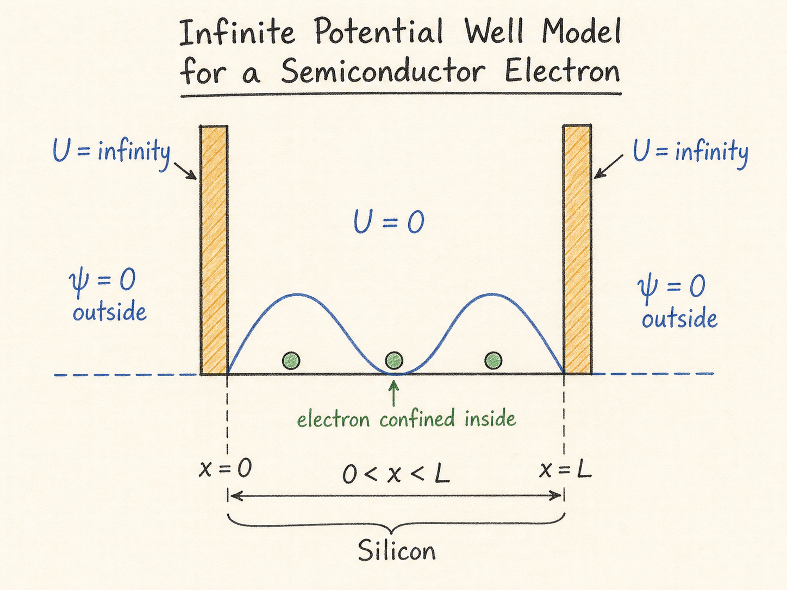
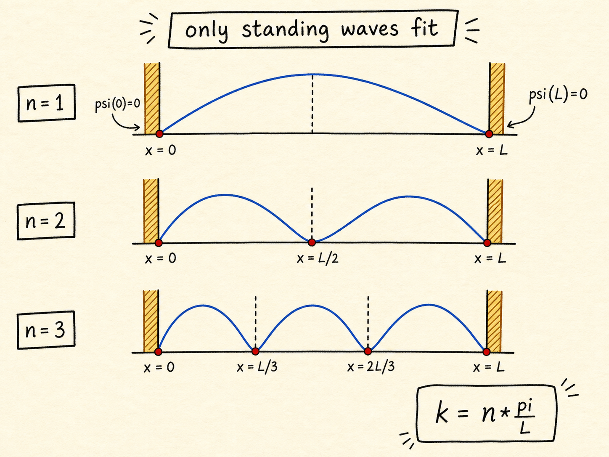
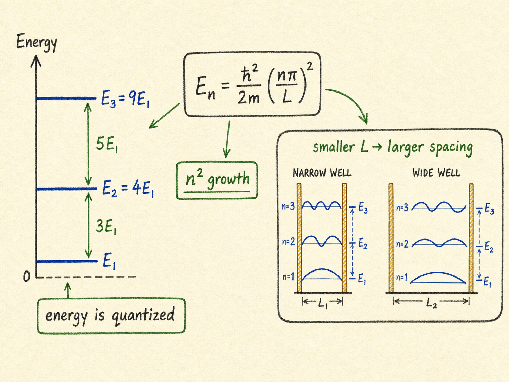

# 无限深势阱：为什么半导体里的电子能量会被卡成一格一格

如果把一块硅想成一个很小的盒子，盒子里有电子在动。第一个直觉问题是：电子会不会像气体分子一样，撞一撞就跑出盒子？

在普通能量范围内，不会。电子要逃离硅晶格，需要跨过很高的能量门槛，大约是 $5\ \text{eV}$。对硅里大多数电子来说，这个门槛高到可以近似当作“无限高的墙”。于是，一个非常有用的半导体量子模型就出现了：电子被关在一段长度为 $L$ 的区域里，区域外面是无限高势垒。这个模型叫无限深势阱。

读完这篇，你会知道

- 为什么硅里的电子可以被近似看成“关在盒子里”
- 无限高势垒为什么会使盒子外的波函数等于 $0$
- 为什么边界条件会把电子波数 $k$ 限制成 $k=\frac{n\pi}{L}$
- 能量为什么因此变成离散值 $E_n=\frac{\hbar^2}{2m}\left(\frac{n\pi}{L}\right)^2$
- 这个结论为什么会通向后面的半导体态密度

## 先把硅简化成一个电子盒子

真实的硅晶体很复杂。它有三维晶格、周期势场、很多电子，也有杂质、温度和散射。但如果一开始就把这些全放进来，问题会直接失控。

所以先做一个工程上常见的简化：拿一块硅，只看一个方向，把它当成长度为 $L$ 的一维盒子。盒子内部有电子可以运动，盒子外部电子不能去。

“不能去”这句话，用量子力学语言说，就是势能墙非常高。电子要逃出硅晶格，大概要获得 $5\ \text{eV}$ 的能量。这个数值对普通热运动电子来说很大，所以在第一版模型里直接把边界外势能写成无穷大。

这不是说真实世界里真有数学上的无穷大，而是说：在我们关心的能量范围内，电子逃不出去。这个近似的好处是边界条件会变得非常干净。

## 势阱外面发生了什么：波函数被压成零

定态薛定谔方程可以写成：

$$\frac{d^2\psi}{dx^2}=-k^2\psi$$

其中：

$$k^2=\frac{2m(E-U)}{\hbar^2}$$

这里 $U$ 是势能，$E$ 是电子总能量，$m$ 是电子质量，$\hbar$ 是约化普朗克常数。$k$ 可以理解成波函数在空间里的振荡节拍：$k$ 越大，波在空间里起伏越密。

现在把区域分成两块看。

在盒子里面，也就是 $0<x<L$，先令势能 $U=0$。这时电子可以存在，波函数需要认真求解。

在盒子外面，势能 $U$ 被近似成无穷大。代入 $k^2=\frac{2m(E-U)}{\hbar^2}$ 会出现一个极端情况：如果波函数还在外面有非零值，就等于允许电子跑到一个需要无限能量才能进入的区域，这和模型假设冲突。

所以最直接的结论是：

$$\psi(x)=0,\quad x<0\ \text{or}\ x>L$$

这里很关键，必须把边界定义清楚：电子在盒子外的出现概率为零。

## 盒子里面的解：只能是正弦波

在盒子内部，$U=0$，所以薛定谔方程变成：

$$\frac{d^2\psi}{dx^2}=-\frac{2mE}{\hbar^2}\psi=-k^2\psi$$

这个二阶微分方程的通解是：

$$\psi(x)=A_1\sin(kx)+A_2\cos(kx)$$

这一步的物理图像很简单：电子在盒子里不是一颗小球来回撞墙，而是一个空间波。这个空间波可以由正弦项和余弦项组合出来。

但不是所有正弦余弦组合都允许。因为盒子外面 $\psi=0$，而波函数不能在边界处突然跳变，所以边界上也必须满足：

$$\psi(0)=0,\quad \psi(L)=0$$

先看左边界 $x=0$：

$$A_1\sin(0)+A_2\cos(0)=0$$

由于 $\sin(0)=0$，$\cos(0)=1$，只能得到：

$$A_2=0$$

也就是说，由边界条件可得，余弦项系数必须为零。盒子里的波函数只剩：

$$\psi(x)=A_1\sin(kx)$$

这个边界条件进一步限定了波函数：电子波必须在左边界处刚好为零。

## 右边界再卡一次：$k$ 只能取离散值

再看右边界 $x=L$。同样要求：

$$\psi(L)=A_1\sin(kL)=0$$

如果 $A_1=0$，整个波函数到处都是零，相当于盒子里根本没有这个电子。这不是我们要的物理解。

所以只能让：

$$\sin(kL)=0$$

正弦函数什么时候等于零？当它的自变量是 $\pi$ 的整数倍：

$$kL=n\pi$$

于是：

$$k=\frac{n\pi}{L}$$

这就是无限深势阱最重要的跳跃点。$k$ 本来像是一个可以连续变化的空间频率，但盒子两端都要求波函数为零以后，它就不能随便取值了。只有那些刚好能在盒子里“站住”的波形才允许存在。

你可以把它想成一根两端固定的弦。弦不能随便以任何波长振动，它只能形成某些驻波模式。电子波函数也类似：边界固定以后，只剩下一组允许模式。

## 能量也跟着被量子化

上一节已经知道，在势阱内部：

$$k^2=\frac{2mE}{\hbar^2}$$

而边界条件给出：

$$k^2=\frac{n^2\pi^2}{L^2}$$

把两者相等：

$$\frac{2mE}{\hbar^2}=\frac{n^2\pi^2}{L^2}$$

整理得到允许能量：

$$E_n=\frac{\hbar^2}{2m}\left(\frac{n\pi}{L}\right)^2$$

这个式子告诉我们三件事。

第一，能量不是连续的，而是一格一格的。电子不能说“我想要任意一个能量”，它只能处在满足边界条件的能级上。

第二，能量按 $n^2$ 增长。$n=2$ 的能量不是 $n=1$ 的两倍，而是四倍；$n=3$ 则是九倍。

第三，盒子越小，能级间隔越大。因为 $E_n$ 里面有 $\frac{1}{L^2}$。这对半导体器件非常重要：当结构尺寸缩小到足够小，量子限制会把能级间距明显拉开，电子状态不再像大块材料里那样近似连续。

这就是为什么量子阱、纳米线、薄体沟道、量子点这些结构不能只靠经典漂移扩散直觉解释。边界本身会改变电子能量。

## 还差一个系数：概率总和必须等于一

现在波函数形式已经知道：

$$\psi(x)=A_1\sin(kx)$$

但 $A_1$ 还没定。这个系数不能随便选，因为 $|\psi(x)|^2$ 是概率密度。电子既然存在，就必须在某个地方被找到，所以全空间概率积分要等于 $1$：

$$\int_{-\infty}^{\infty}|\psi(x)|^2dx=1$$

由于盒子外 $\psi=0$，真正需要积分的只有 $0$ 到 $L$：

$$\int_0^L A_1^2\sin^2(kx)dx=1$$

计算后得到：

$$A_1=\sqrt{\frac{2}{L}}$$

于是归一化后的波函数是：

$$\psi(x)=\sqrt{\frac{2}{L}}\sin(kx)$$

归一化的意义不是数学洁癖，而是把“波函数”重新拉回可测量世界：$|\psi(x)|^2$ 必须能解释成概率密度，所有位置的概率加起来必须是 $100\%$。

## 为什么这个小模型会通向态密度

无限深势阱看起来像一个玩具模型，但它抓住了半导体量子建模里最重要的一条线：

边界条件 $\rightarrow$ 允许的 $k$ 值 $\rightarrow$ 允许的能量 $E$ $\rightarrow$ 可用电子状态数。

后面推导态密度时，真正关心的不是某一个电子的波函数长什么样，而是“在某个能量范围内，一共有多少个允许状态”。要数状态，第一步就要知道状态不是连续乱来的，而是被 $k=\frac{n\pi}{L}$ 这样的条件排列出来的。

一维盒子只是开始。真实半导体要扩展到三维，$k$ 会变成 $k_x$、$k_y$、$k_z$，能量也会和三维模式数联系起来。但核心逻辑没有变：材料尺寸和边界条件决定允许状态，允许状态再决定电子能以哪些方式参与导电。

## 最后收束：墙不是背景，墙决定了电子能站在哪

这节最值得记住的一句话是：在量子模型里，边界不是背景条件，边界会直接决定电子允许存在的状态。

把电子关进长度为 $L$ 的无限深势阱后，波函数必须在两端为零，于是 $k$ 只能取 $\frac{n\pi}{L}$，能量也只能取 $E_n=\frac{\hbar^2}{2m}\left(\frac{n\pi}{L}\right)^2$。

这就是半导体量子建模从“电子在材料里运动”走向“电子只能占据某些状态”的第一步。下一步，就是把这些允许状态数出来，得到态密度，再进一步回答：在某个能量下，到底有多少电子可以参与导电。
