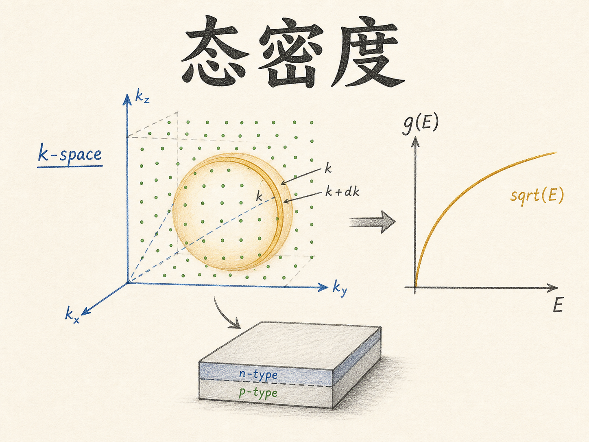
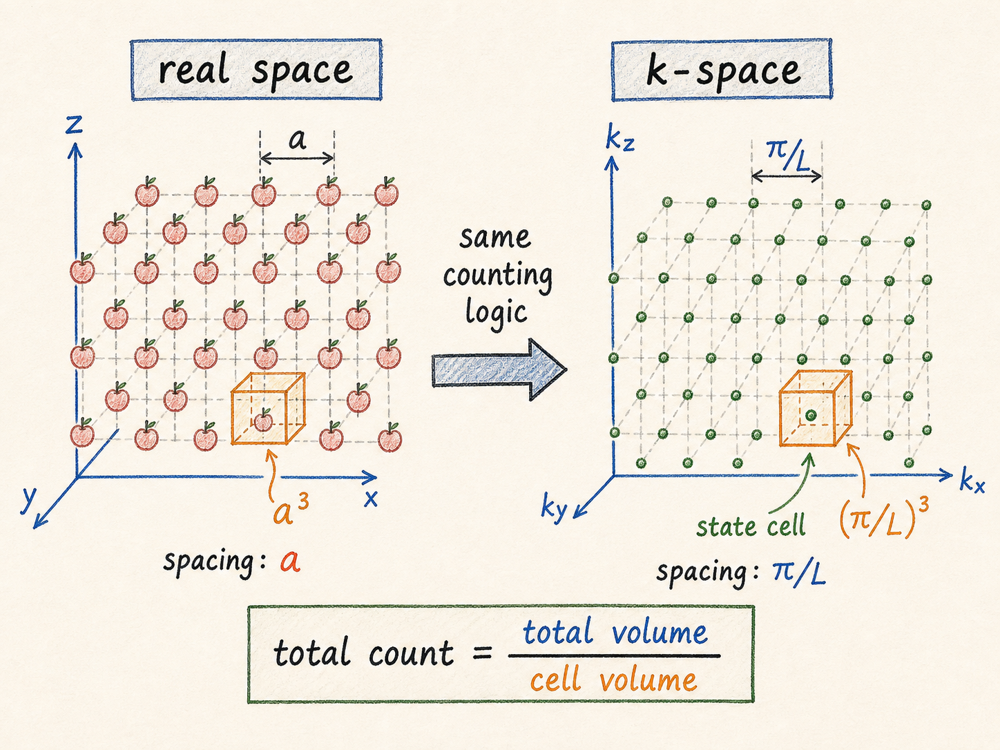
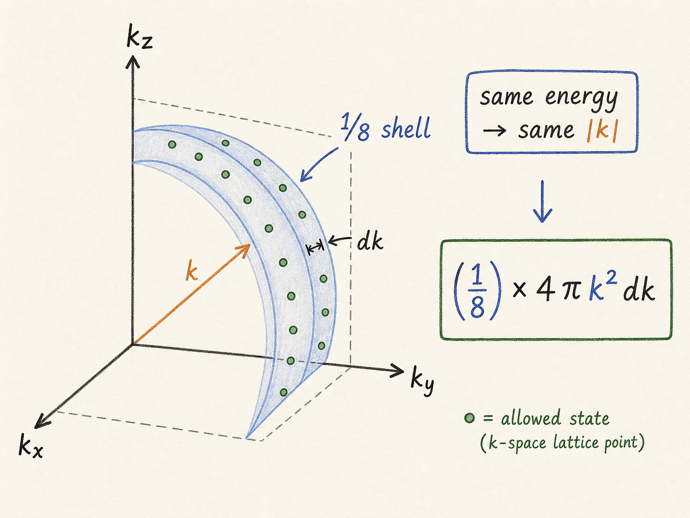
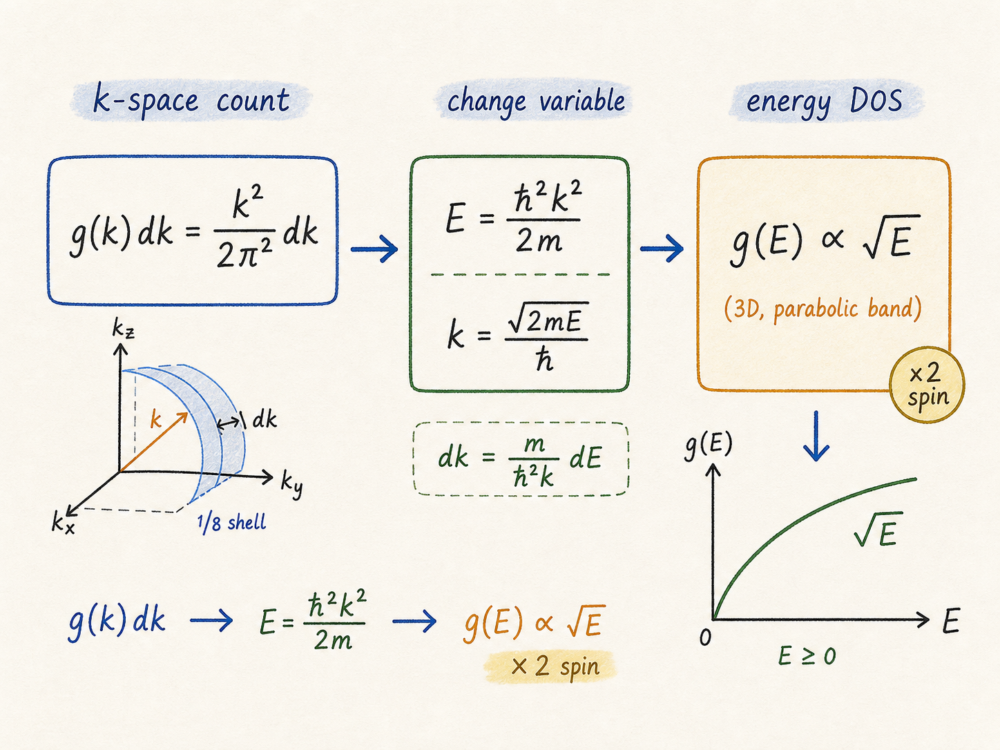

# 态密度：为什么半导体里的电子要先数 k 空间的格子

半导体里到底有多少电子能参与导电？这个问题不能靠“硅里有多少原子”直接回答。真正有用的问题是：在某个能量附近，有多少个量子状态可以让电子待进去？这些状态里，又有多少真的被电子占据？

这就是态密度要解决的问题。它不是在数电子本身，而是在数“座位”：每一小段能量范围里，有多少个可用座位。后面再用费米-狄拉克分布去问“这些座位有多少坐了人”，两者相乘并积分，才会得到载流子浓度。

读完这篇，你会知道

- 为什么算载流子浓度前，必须先知道态密度 $g(E)$
- 为什么推导态密度要绕到 k 空间里数格子
- 为什么三维状态数会自然出现球壳体积 $4\pi k^2dk$
- 为什么最后的三维态密度正比于 $\sqrt{E}$
- 为什么每个量子态还要乘上 2，也就是自旋简并

## 最终目标不是数电子，而是数可用状态

半导体统计里最终想算的是电子总数，或者更准确地说，是某个能带里的载流子浓度。这个计算长得像一个积分：

$$n=\int g(E)f(E)\,dE$$

这里有两个因子。

$g(E)$ 是态密度。它回答：能量在 $E$ 附近，每单位体积、每单位能量范围里有多少个可用量子态。

$f(E)$ 是占据概率。它回答：这些状态有多大概率真的被电子占据。

所以 $g(E)f(E)dE$ 的含义就是：能量从 $E$ 到 $E+dE$ 这一薄层里，大约有多少电子。把所有能量薄层加起来，就得到总电子数。

这篇先只解决前一半：怎么得到 $g(E)$。

## 先用苹果理解“体积除以单元格体积”

直接数电子状态很抽象，先数一个更朴素的东西：苹果。

如果桌上只有一排四个苹果，直接数就行。但如果苹果排成三维晶格，每个方向间距都是 $a$，数量很多，再一个个数就很笨。更直接的办法是看每个苹果“占了多大空间”。

每个苹果可以看作占据一个边长为 $a$ 的小立方体，所以一个苹果对应的体积是 $a^3$。如果某个区域总体积是 $V$，里面大约有多少苹果？

$$N=\frac{V}{a^3}$$

这句话很重要：要数一堆规则排布的对象，不一定逐个数。只要知道总空间有多大、每个对象占多少空间，就能用“总空间除以单元格空间”来数。

如果我们关心的区域不是立方体，而是一个半径为 $R$、厚度为 $\Delta R$ 的薄球壳，球壳体积近似为：

$$4\pi R^2\Delta R$$

那么球壳里的苹果数就是：

$$N=\frac{4\pi R^2\Delta R}{a^3}$$

这个式子看起来像几何题，但它正是后面数电子状态的骨架。

## 把苹果晶格换成 k 空间晶格

上一讲无限深势阱给出一个关键结论：电子的波数 $k$ 不能随便取，而是满足：

$$k=\frac{n\pi}{L}$$

这意味着在一维里，允许状态不是连续线，而是一串离散点。相邻点之间的间距是：

$$\Delta k=\frac{\pi}{L}$$

进入三维半导体后，电子状态由三个方向的波数决定：

$$k_x,\quad k_y,\quad k_z$$

每个方向上，允许状态的间距仍然是 $\pi/L$。于是 k 空间里出现了一个三维格子。每一个允许量子态，占据一个小立方体：

$$\left(\frac{\pi}{L}\right)^3$$

这一步的本质，就是把“数苹果”换成“数 k 空间里的状态格子”：

$$\text{状态数}=\frac{\text{k 空间总体积}}{\text{每个状态占据的 k 空间体积}}$$

为什么要在 k 空间里数？因为无限深势阱的边界条件直接告诉我们 $k$ 的离散间距。k 空间是这些量子态天然排队的地方。

## 为什么要数球壳，而不是数立方体

现在的问题变成：要数 k 空间里某一层有多少状态。

在三维里，一个状态的位置由 $(k_x,k_y,k_z)$ 决定。但电子能量并不关心这三个分量分别是多少，它主要关心它们合成后的大小：

$$k^2=k_x^2+k_y^2+k_z^2$$

也就是说，能量相同的状态，在 k 空间里大致落在同一个球面上。能量从 $E$ 变化到 $E+dE$，对应 k 从 $k$ 变化到 $k+dk$，这就是一个薄球壳。

所以我们不数一个立方体，而数一个球壳。完整球壳体积是：

$$4\pi k^2dk$$

但在无限深势阱的这个模型里，$n_x$、$n_y$、$n_z$ 都取正整数，所以只看第一卦限，也就是完整球壳的 $1/8$。于是，k 空间薄球壳中的状态数为：

$$N(k)=\frac{1}{8}\frac{4\pi k^2dk}{(\pi/L)^3}$$

这个式子有三个来源：

- $\frac{1}{8}$：只取正的 $k_x,k_y,k_z$ 区域
- $4\pi k^2dk$：半径为 $k$、厚度为 $dk$ 的薄球壳体积
- $(\pi/L)^3$：每个允许状态在 k 空间里占据的小格子体积

如果状态很少，这种球壳近似会有误差。但真实半导体里的状态数量极大，常常是 $10^{20}$ 量级。状态点非常密，这时用连续球壳近似离散点，不会改变物理结论。

## 从总状态数变成单位体积状态数

态密度不是问整块半导体总共有多少状态，而是问单位体积里有多少状态。半导体体积是：

$$V=L^3$$

把上面的状态数除以 $L^3$，可以把样品尺寸消掉：

$$g(k)dk=\frac{1}{L^3}N(k)=\frac{1}{8}\frac{4k^2}{\pi^2}dk$$

整理一下：

$$g(k)dk=\frac{k^2}{2\pi^2}dk$$

注意，这里还只是关于 $k$ 的态密度。它说明：k 空间里半径越大，球壳面积越大，同样厚度 $dk$ 里能装下的状态越多。所以三维态密度会随着 $k^2$ 增长。

但半导体统计积分通常按能量做：

$$n=\int g(E)f(E)dE$$

所以必须把 $g(k)dk$ 换成 $g(E)dE$。

## 把 k 换成能量 E

自由电子的能量和波数关系是：

$$E=\frac{\hbar^2k^2}{2m}$$

所以：

$$k=\frac{\sqrt{2mE}}{\hbar}$$

进一步有：

$$dk=\frac{1}{2}\sqrt{\frac{2m}{\hbar^2}}\frac{1}{\sqrt{E}}dE$$

把 $k^2=\frac{2mE}{\hbar^2}$ 和上面的 $dk$ 代回 $g(k)dk$，会得到一个很有意思的结果：$k^2$ 提供一个 $E$，而 $dk$ 提供一个 $\frac{1}{\sqrt{E}}dE$。两者相乘后，剩下：

$$\sqrt{E}dE$$

所以三维自由电子态密度不是常数，也不是线性正比于 $E$，而是正比于：

$$g(E)\propto \sqrt{E}$$

这就是三维态密度曲线最直观的形状：能量越高，k 空间球壳越大，可用状态越多；但从 $k$ 转到 $E$ 时，增长速度被平方根关系“压慢”了。

## 最后还要补上自旋的 2 倍

到这里还差一个看起来小、但物理上不能漏的因子。

同一个空间量子态，不只能放一个电子。由于电子有自旋，一个空间状态可以容纳两个电子：一个自旋向上，一个自旋向下。

所以前面按 k 空间格子数出来的是空间状态数。真正可容纳电子的状态数，还要乘以 2：

$$g(E)dE=\frac{4\pi(2m)^{3/2}}{h^3}\sqrt{E}\,dE$$

这就是三维自由电子模型下的态密度表达式。

写成口语，就是：

> 能量 $E$ 附近的一小段 $dE$ 里，每单位体积能放多少电子，取决于 k 空间那一层球壳能装多少格子，还要乘上自旋给出的两个座位。

在真实半导体能带里，常把 $m$ 换成有效质量，把 $E$ 理解为相对能带边缘的能量。例如导带附近常写成和 $\sqrt{E-E_C}$ 相关的形式。这个细节属于更真实的半导体能带模型，但今天这条推导链的骨架不变：先数状态，再乘概率。

## 这条推导为什么重要

态密度本身还不是载流子浓度。它只回答“座位有多少”。真正的电子数还要乘上费米-狄拉克分布，也就是每个座位被电子坐上的概率：

$$n=\int g(E)f(E)dE$$

这就是后面费米-狄拉克积分的入口。

对半导体器件来说，这件事不是数学装饰。MOS、PN 结、双极器件、温度依赖、掺杂统计，最后都会回到同一个问题：某个能量范围里有多少可用状态，费米能级又让这些状态被占据了多少。

态密度的核心记法可以压缩成一句话：

先在 k 空间里数格子，用球壳把同能量状态收集起来，再把 $k$ 换成 $E$。三维自由电子的结果，就是 $g(E)\propto \sqrt{E}$。
