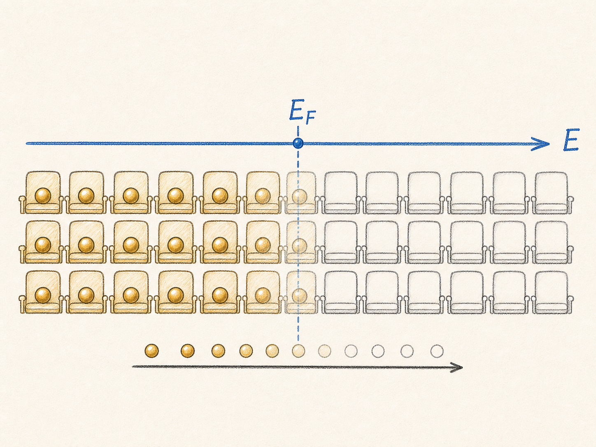
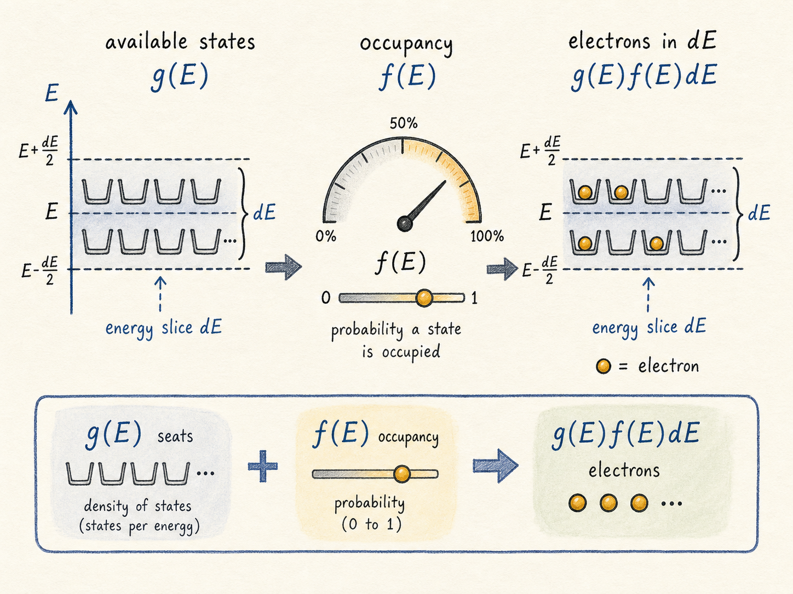
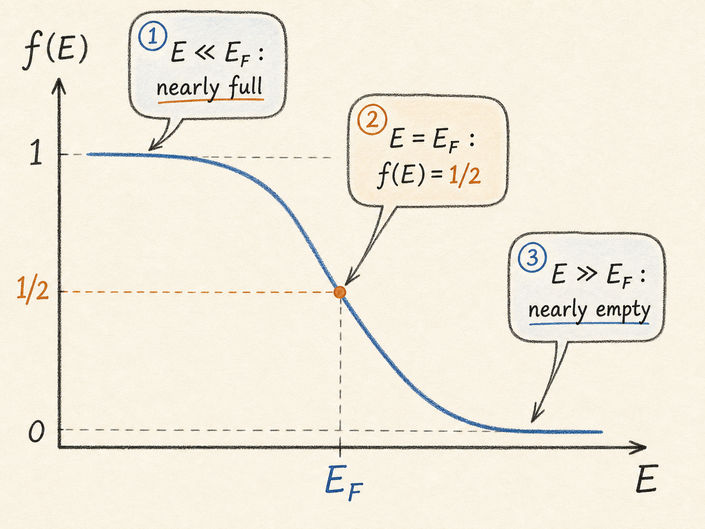
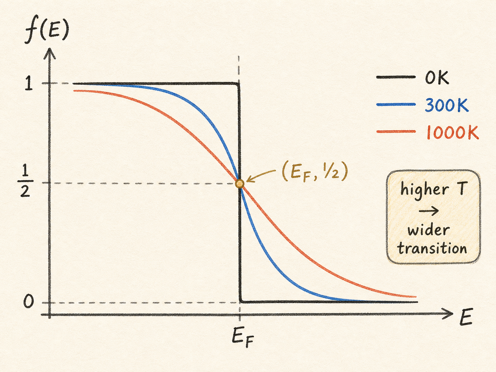

# 费米函数：半导体里的座位为什么不是人人都坐满

前面讲态密度时，我们已经学会了一件事：半导体里不能只问“有多少电子”，还要先问“有多少个量子状态可以让电子待进去”。态密度 $g(E)$ 数的是座位，告诉我们某个能量附近有多少可用状态。

但只知道座位数还不够。一个电影院有 100 个座位，不代表一定坐了 100 个人。半导体也一样：某个能量附近有很多量子态，不代表这些态全都被电子占据。费米函数 $f(E)$ 解决的就是第二个问题：这些座位到底坐了多少人。

读完这篇，你会知道

- 为什么计算电子数时要把态密度 $g(E)$ 和费米函数 $f(E)$ 乘起来
- 费米函数为什么可以理解成“某个能量处的占据概率”
- 为什么 $E=E_F$ 时，占据概率一定是 $1/2$
- 为什么 0K 时费米函数像一个硬台阶，而温度升高后会被抹平
- 这个函数对半导体载流子浓度有什么直接影响

## 真正要算的是“座位数乘以上座率”

半导体物理想回答的一个核心问题是：有多少电子可以参与导电？

如果只凭直觉，最直接的办法像是在清点人数：一个个数电子。但量子力学里更自然的对象不是“电子本人”，而是“电子可以占据的状态”。这是因为薛定谔方程给出的首先是允许状态，而不是一张电子名单。

所以计算电子数时，思路会变成两步：

第一步，数某个能量附近有多少可用状态，也就是态密度 $g(E)$。

第二步，问这些状态里有多大比例真的被电子占据，也就是费米函数 $f(E)$。

于是某个能量小区间 $dE$ 里的电子数，直觉上就是：

$$g(E)f(E)dE$$

把所有能量范围加起来，就得到总电子数：

$$n=\int g(E)f(E)\,dE$$

这就是为什么态密度和费米函数总是连在一起出现。$g(E)$ 只告诉你“有多少座位”，$f(E)$ 告诉你“上座率是多少”。两者相乘，才接近真实电子数。

## 费米函数就是某个能量处的占据概率

费米函数的定义很朴素：

给定一个能量 $E$，$f(E)$ 表示这个能量处的量子态被电子占据的概率。

如果某个能量 $E_0$ 处有 5 个状态，而 $f(E_0)=0.2$，意思不是说存在 0.2 个电子，而是说平均来看，这一组状态有 20% 被占据。5 个座位乘以 20%，就是 1 个电子。

如果另一个能量 $E_1$ 处有 10 个状态：

- $f(E_1)=0.1$，平均就是 1 个状态被占据
- $f(E_1)=0.2$，平均就是 2 个状态被占据
- $f(E_1)=0.3$，平均就是 3 个状态被占据

这就是费米函数最应该被记住的物理意义。它不是一个凭空冒出来的数学曲线，而是“电子愿不愿意坐到这个能量座位上”的概率规则。

## 费米函数长什么样

费米函数写作：

$$f(E)=\frac{1}{1+e^{(E-E_F)/kT}}$$

这里有四个符号。

$E$ 是我们正在观察的能量位置，也是这个函数的自变量。

$E_F$ 是费米能级。它不是普通意义上的“最高电子能量”这么简单，但在这篇里可以先把它理解成占据概率从高变低的分界中心。

$k$ 是玻尔兹曼常数，$T$ 是绝对温度。$kT$ 合在一起是一个能量尺度，表示热运动可以把电子分布“搅动”到什么程度。

如果温度固定，比如室温 $T\approx 300K$，那么 $kT$ 大约是 $26meV$。这时表达式里真正横向扫动的变量就是 $E$。

看这个函数，不要先死记图形。只要看三种能量位置。

## 远低于费米能级：几乎坐满

当 $E$ 远小于 $E_F$ 时，$(E-E_F)$ 是一个很大的负数。除以 $kT$ 后仍然是负数，指数项 $e^{(E-E_F)/kT}$ 会非常接近 0。

于是：

$$f(E)\approx\frac{1}{1+0}=1$$

这说明远低于费米能级的状态，几乎全部被电子占据。

用座位类比就是：这些是很“低”的座位，对电子来说很容易坐进去，所以基本坐满。

## 正好在费米能级：一定是一半

当 $E=E_F$ 时，费米函数里最关键的指数项会变成：

$$e^{(E_F-E_F)/kT}=e^0=1$$

所以：

$$f(E_F)=\frac{1}{1+1}=\frac{1}{2}$$

这个结论很干净：只要温度不是 0K 极限下那个突变点，费米函数在 $E=E_F$ 的地方就是 1/2。

所以费米能级有一个非常实用的理解：它是占据概率等于 50% 的能量位置。

这句话对器件工程很重要。掺杂、偏压、温度变化，本质上都会改变能带和费米能级的位置关系。位置一变，某些能量状态的占据概率就变了，载流子浓度也跟着变。

## 远高于费米能级：几乎没人坐

当 $E$ 远大于 $E_F$ 时，$(E-E_F)/kT$ 是一个很大的正数。指数项会变得极大，分母被指数项主导：

$$f(E)\approx\frac{1}{\text{一个非常大的数}}\approx 0$$

这说明远高于费米能级的状态几乎不被占据。

不是因为这些状态不存在。态密度可能告诉你那里有很多座位。但费米函数告诉你：电子几乎不会坐到那么高的能量上去。

这正是半导体统计里最容易混淆的一点：可用状态多，不等于电子多。状态数要乘上占据概率。

## 0K 时，它是一个硬台阶

现在把温度降到接近 0K，会发生什么？

公式里有 $kT$，所以严格说不能粗暴把 $T=0$ 直接代进去，而要看极限。

当 $T\to 0$ 且 $E<E_F$ 时，$(E-E_F)/kT$ 会趋向负无穷，指数项趋向 0，因此：

$$f(E)=1$$

当 $T\to 0$ 且 $E>E_F$ 时，$(E-E_F)/kT$ 会趋向正无穷，指数项趋向无穷大，因此：

$$f(E)=0$$

所以 0K 下的费米函数像一个非常硬的台阶：

- $E<E_F$：状态全被占据
- $E>E_F$：状态全是空的

这就是很多教材里画的阶跃函数。它表达的是一个低温极限：电子从低能量开始把座位坐满，一直坐到费米能级附近，再往上就空着。

## 温度升高后，台阶会被热运动抹平

真实器件通常不在 0K 工作。室温下 $kT\approx 26meV$，热运动会让一部分电子有机会跑到稍高的能量状态，也会让费米能级以下靠近边缘的一些状态出现空位。

所以原来那个硬台阶会变成一条平滑曲线：低能量处接近 1，高能量处接近 0，中间有一段过渡区。

温度越高，$kT$ 越大，这个过渡区越宽。换句话说，温度不是把 $E_F$ 处的 1/2 改掉，而是把 1 到 0 的下降过程拉得更宽。

这个细节对半导体器件很关键。温度升高后，即使能带结构本身没有大改，电子的占据概率也会改变。载流子浓度、漏电、阈值附近的亚阈值行为、双极器件中的热激发效应，背后都离不开这个“台阶被抹平”的机制。

## 最后把它接回载流子浓度

现在可以把费米函数放回最开始的问题。

态密度 $g(E)$ 告诉我们某个能量附近有多少状态。费米函数 $f(E)$ 告诉我们这些状态有多少被电子占据。真正的电子数来自两者相乘再积分：

$$n=\int g(E)f(E)\,dE$$

这句话是后面半导体统计的入口。

如果研究导带电子，导带边缘以上的态密度给出可用座位，费米函数决定这些座位有多少被电子占据。

如果研究价带空穴，也会用类似逻辑，只不过关注的是电子没有占据的位置，也就是空态概率。

所以费米函数的核心记法可以压缩成一句话：

它不是在数状态，而是在给每个能量状态一个“被电子坐上去的概率”；半导体里的电子数，必须由“座位数”乘以“上座率”得到。
