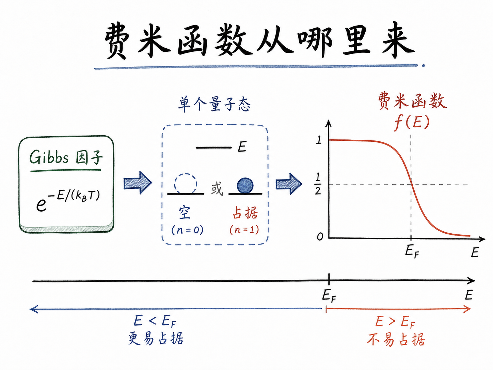
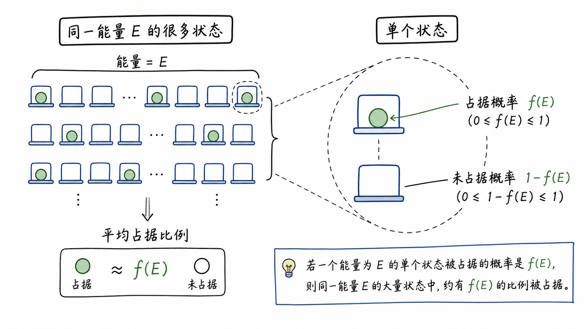
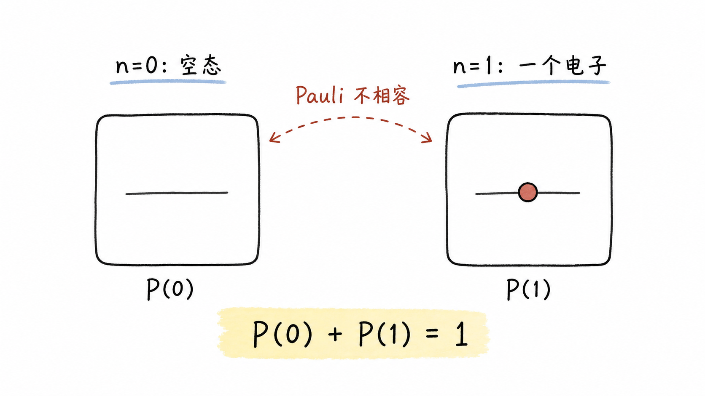
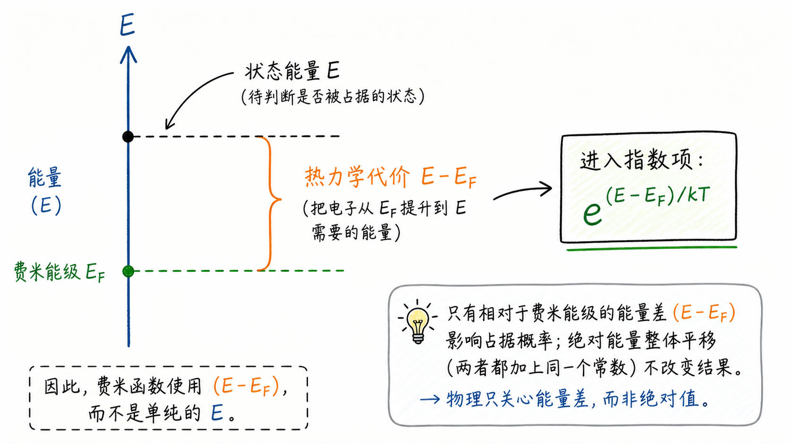

# 费米函数从哪里来：从 Gibbs 因子推到占据概率

上一讲我们已经知道，费米函数 $f(E)=1/(1+e^{(E-E_F)/kT})$ 描述的是“某个能量位置的量子态，有多大概率被电子占据”。这个公式看起来很像一个人为规定的 S 形曲线：低能量几乎坐满，高能量几乎没人坐，中间在 $E_F$ 附近过渡。

但真正重要的问题不是“公式长什么样”，而是“为什么自然界必须长成这个样”。如果费米函数只是背出来的公式，它很容易变成考试记忆点；如果能把它从热力学一路推出来，它就变成了一个非常清楚的判断：电子占不占一个状态，本质上是在做能量代价和热涨落之间的权衡。

读完这篇，你会知道

- 为什么费米函数可以从 Gibbs 因子推出
- 为什么单个量子态只需要讨论 $P(0)$ 和 $P(1)$ 两种概率
- 归一化常数 $Z$ 在推导里到底做了什么
- 为什么指数里最后会出现 $E-E_F$
- 为什么这个推导对半导体载流子浓度计算有直接影响

## 第一步：先别看一堆态，只看一个态

半导体里真实存在的是大量量子态。某个能量附近有多少个态，由态密度 $g(E)$ 决定；这些态有多少比例被电子占据，由费米函数 $f(E)$ 决定。

如果从整片能带开始看，问题会显得很乱：这里有很多能量，每个能量又有很多状态，每个状态还可能被占据或不被占据。最直接的办法是先把问题缩小，只问一个状态：

这个状态被电子占据的概率是多少？

一旦这个问题解决，同一能量附近大量状态的占据比例也就解决了。原因很简单：如果某个能量处每个状态被占据的概率都是 20%，那么当状态数足够多时，平均就会有约 20% 的状态被占据。概率变成比例，靠的不是魔法，而是大量样本下的统计平均。

这就是费米函数的物理入口：它不是先从曲线形状出发，而是从“单个状态的占据概率”出发。

## 第二步：Gibbs 因子告诉我们概率偏向低能状态

热力学里有一个核心规则：一个状态出现的概率，和它的能量有关。能量越高，出现概率越低；温度越高，高能状态越容易被热涨落拉起来。

这个规则写成 Gibbs 因子，就是 $P(n)\propto e^{-E_n/kT}$。

这里的 $P(n)$ 表示这个量子态被 $n$ 个电子占据的概率，$E_n$ 表示这个状态在有 $n$ 个电子时对应的能量，$kT$ 是热能尺度。

这句话背后的直觉很朴素：如果一个选择要付出更高能量，它就没那么容易发生；如果温度更高，热运动更强，这种高能选择就不再那么罕见。

对半导体而言，这个规则的影响很大。它说明电子不是“机械地填满低能态后停止”，而是在温度参与下形成一个统计分布。也正因为如此，室温下导带底附近会有少量电子，价带顶附近会留下空穴，材料才有有限的导电能力。

## 第三步：Pauli 不相容原理把选择压成两种

现在回到单个量子态。这个态里能有几个电子？

在这套简化推导里，只看一个可占据状态。受 Pauli 不相容原理限制，它只有两种情况：

- 没有电子，占据数 $n=0$
- 有一个电子，占据数 $n=1$

也就是说，我们不需要讨论 $n=2$、$n=3$ 这些情况。单个状态不是电影院一整排座位，它更像一个只能坐一个人的位置。

因此概率也只有两个：$P(0)$ 和 $P(1)$。既然这两种情况穷尽了所有可能，它们必须满足 $P(0)+P(1)=1$。

这一步非常关键。Gibbs 因子一开始只告诉我们“概率正比于什么”，但正比关系还不是完整概率。完整概率必须加起来等于 1。这个约束会把比例尺定下来。

## 第四步：$Z$ 不是神秘常数，只是把概率加到 1

为了把正比号变成等号，引入一个归一化常数 $Z$：

$P(n)=\frac{1}{Z}e^{-E_n/kT}$。

这个 $Z$ 在统计力学里叫配分函数。名字听起来很大，但在这里它做的事情很具体：负责把所有可能情况的概率加起来归一化到 1。

因为这里只有两种情况，所以：

$P(0)+P(1)=\frac{1}{Z}e^{-E_0/kT}+\frac{1}{Z}e^{-E_1/kT}=1$。

于是：

$Z=e^{-E_0/kT}+e^{-E_1/kT}$。

现在我们要的不是 $P(0)$，而是 $P(1)$。因为费米函数问的就是“这个状态被电子占据的概率”。所以：

$f(E)=P(1)=\frac{e^{-E_1/kT}}{e^{-E_0/kT}+e^{-E_1/kT}}$。

把分子分母同时乘以 $e^{E_1/kT}$，这个式子就变成：

$f(E)=\frac{1}{1+e^{(E_1-E_0)/kT}}$。

到这里，费米函数的外形已经出来了：分母是 $1+$ 一个指数项。剩下的关键只剩一个：$E_1-E_0$ 到底等于什么？

## 第五步：为什么最后出现的是 $E-E_F$

如果状态里没有电子，$n=0$，这个态对电子系统的能量贡献就是 0。也就是 $E_0=0$。

如果状态里有一个电子，$n=1$，直觉上它带来的能量似乎就是该状态的能量 $E$。但热力学里真正比较的不是“多放一个电子的绝对能量”，而是“多放一个电子相对于电子库的代价”。

这个电子库的能量基准，就是化学势。在半导体讨论里，它通常写成费米能级 $E_F$。

所以，往一个能量为 $E$ 的状态里放入一个电子，热力学代价不是单纯的 $E$，而是 $E-E_F$。如果 $E$ 比 $E_F$ 低，代价为负，占据很容易；如果 $E$ 比 $E_F$ 高，代价为正，占据就需要热涨落支持。

因此，有一个电子时对应的有效能量可以写成 $E_1=E-E_F$，而没有电子时 $E_0=0$。代回上一节的结果：

$f(E)=\frac{1}{1+e^{(E-E_F)/kT}}$。

这就是费米函数。

## 这个推导真正告诉我们的是什么

这个公式最容易被误解成一个“数学形状”：低能量接近 1，高能量接近 0，$E=E_F$ 时等于 1/2。

但推导给出的信息更深：

第一，$f(E)$ 是概率，不是态的数量。态的数量由 $g(E)$ 给出，占据比例由 $f(E)$ 给出。算电子数时要把二者相乘。

第二，$E_F$ 是占据倾向的能量基准。它不是随便画出来的分界线，而是由系统中“增加一个电子的能量代价”决定的热力学标尺。

第三，$kT$ 决定过渡区有多宽。温度越低，指数项变化越陡，费米函数越像一个硬台阶；温度越高，热涨落越强，台阶就被抹平。

对器件工程来说，这不是纯理论细节。载流子浓度、结区耗尽、接触注入、能带弯曲之后的电子占据，本质上都绕不开同一个问题：某个能量位置有多少状态，以及这些状态有多大概率被电子占据。

一句话收束：费米函数不是凭空规定的曲线，而是 Gibbs 因子、Pauli 不相容原理和化学势共同决定的占据概率。
