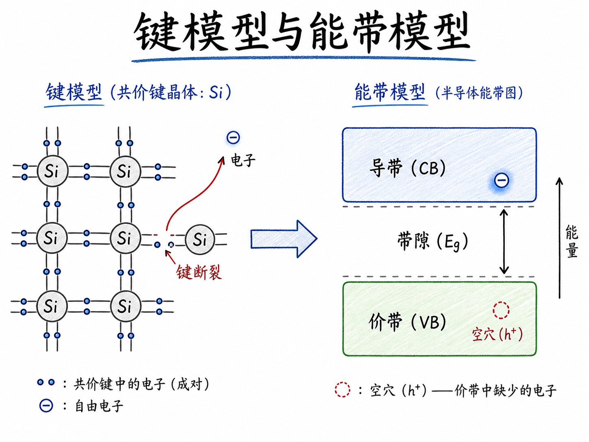
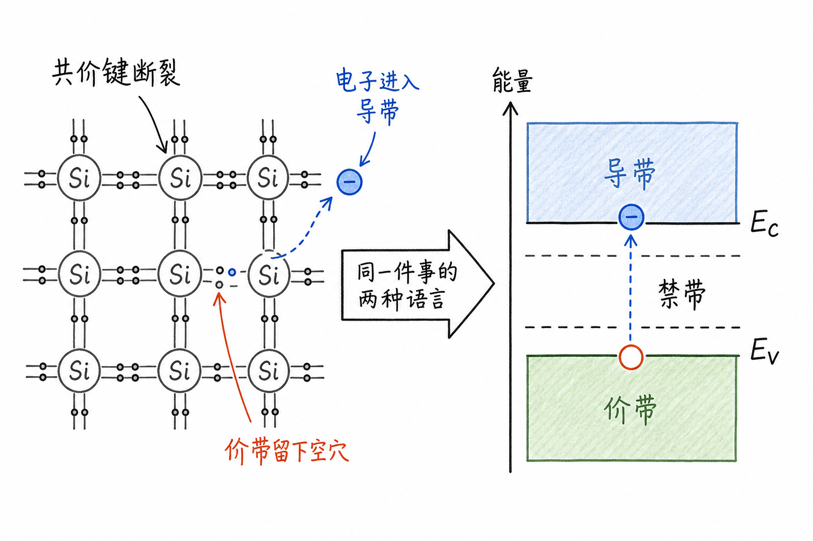
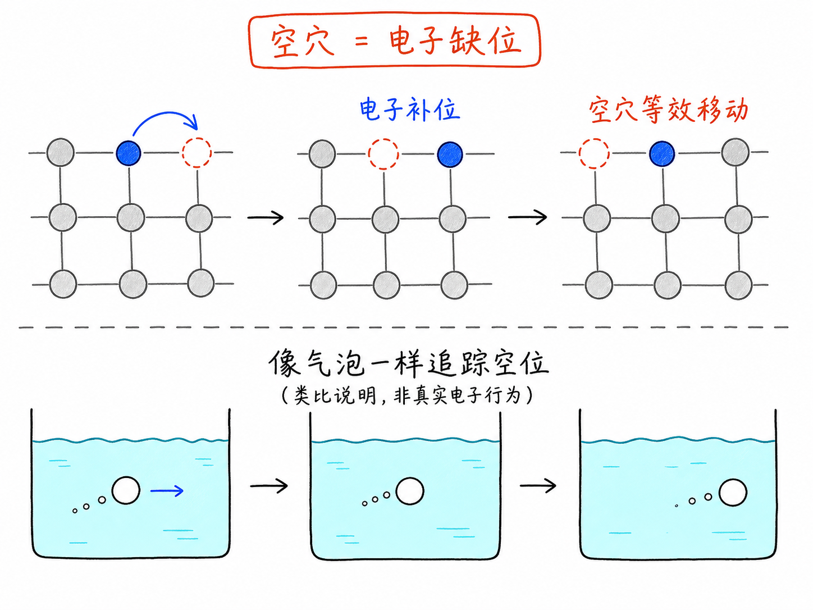
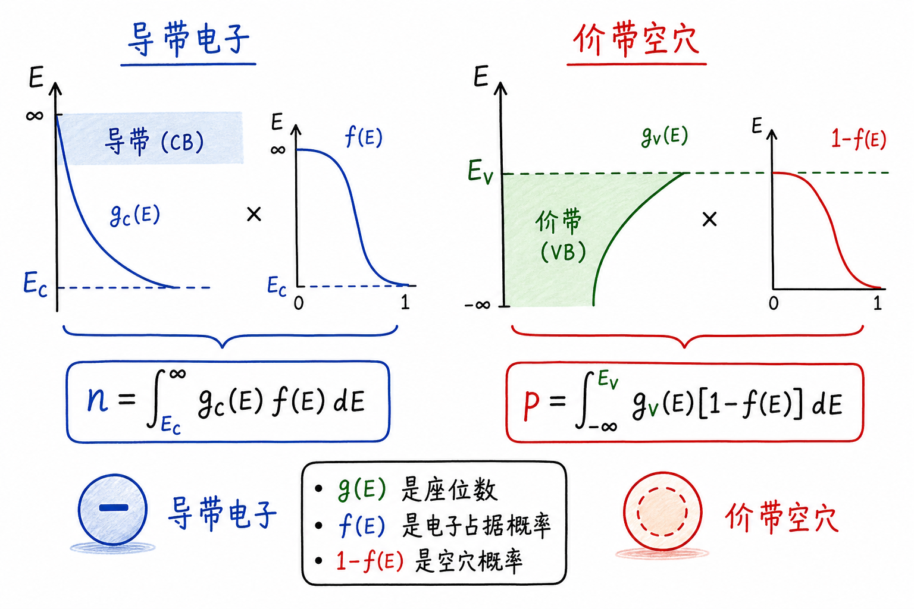

# 键模型与能带模型：为什么半导体里不只看电子，还要看空穴

前面讲态密度和费米函数时，我们已经快走到一个真正有用的问题：半导体里到底有多少电子能参与导电？态密度 $g(E)$ 告诉我们能量附近有多少“座位”，费米函数 $f(E)$ 告诉我们这些座位有多少被电子占据。但还有一个问题没有解决：哪些能量范围才算“可以让电子导电”的范围？

这就需要能带模型。能带模型不是把高中化学推翻，而是把“硅原子之间的键”翻译成更适合计算和器件分析的语言。你先看到的是一条共价键断了，一个电子跑出来；换成能带语言，就是电子从价带被激发到导带，同时在价带留下一个空穴。

读完这篇，你会知道

- 为什么理解半导体导电，要先从硅原子的共价键讲起
- 价带和导带分别对应键模型里的什么物理状态
- 为什么导带中的电子能导电，而价带中大多数电子不能导电
- 空穴为什么不是“真电子”，却可以像带正电的粒子一样处理
- 为什么半导体里的载流子总是成对说成“电子和空穴”

## 从键模型开始：硅原子为什么先要“抱团”

硅原子最重要的特征之一，是外层有四个价电子。单个硅原子孤零零存在时，这四个电子还没有和邻居共享。但在晶体里，每个硅原子周围都有其他硅原子，大家会通过共享价电子形成共价键。

这幅图在化学里很熟：一个硅原子和周围硅原子成键，每条键里可以理解为有电子被两个原子共享。为了看清结构，图上通常不再一个个画电子，而是画原子和连接它们的键。

在 $T=0K$ 的理想极限下，这个键模型很干净：每个该成的键都成好了，电子都被束缚在键里。它们不是完全静止的“小球”，但从器件角度看，这些电子没有变成可以自由漂移的电荷。

这件事对理解半导体很关键。固体里有大量电子，并不等于这些电子都能导电。真正能导电的，不是“存在的电子”，而是“能在晶格里自由响应电场的电子”。

## 温度一上来，键就不再永远完美

真实材料不会一直停在 $0K$。温度升高后，硅原子开始振动。原子一振动，共价键就会被拉伸、压缩和扭曲。大多数时候，这些扰动只是暂时的；但如果某条键获得了足够能量，它就可能断裂。

一条键断裂后，原来参与成键的一个电子被释放出来。它不再只属于某两个硅原子之间的那条键，而是可以在硅晶格中移动。

这一步就是从“化学图像”走向“器件图像”的关键转折。

在键模型里，我们说：一条共价键断了，一个电子自由了。

在能带模型里，我们说：一个电子从价带被激发到了导带。

两句话说的是同一件事，只是语言不同。键模型更直观，适合想象电子从束缚态逃出来；能带模型更适合计算载流子浓度、电流、温度效应和掺杂效应。

## 价带：电子还被键束缚着

价带里的“价”，来自价电子。硅的价电子参与成键，决定材料的化学性质。把这些仍然被共价键束缚的电子放到能量图上，它们所在的能量范围就叫价带。

价带不是说里面没有电子。恰恰相反，在低温或未激发时，很多电子都在价带里。问题是：它们大多被键束缚着，不能像自由粒子一样在晶格中长距离移动。

如果对这些束缚电子施加电场，它们不会像金属里的自由电子那样整体漂移。局部的键可能发生一点形变，电子云可能被拉偏一点，但它们仍然被绑定在键结构中。

所以价带中的已占据电子，通常不直接贡献导电。它们存在，但不是自由载流子。

这个区分对器件工程很重要。我们关心的不是“材料里总电子数有多大”，而是“有多少电子处在可以移动、可以响应电场的状态”。后者才进入电导、漏电、电流和器件开关行为。

## 导带：电子已经脱离键，可以响应电场

当一个电子获得足够能量，脱离共价键束缚，它就进入导带。导带的名字很直接：在这个能量范围里的电子可以导电。

如果施加一个向左的电场，电子因为带负电，会向右漂移。如果电场向右，电子会向左漂移。方向先不用纠结，关键是它能自由响应电场，这就和价带中被束缚的电子不同。

因此，导带电子是半导体里的第一类载流子。

这也解释了为什么前面计算电子数时，不能只把所有能量都一股脑积分。真正要算导电电子时，我们关心的是导带边缘 $E_C$ 以上的状态有多少、这些状态被电子占据的概率是多少。

用前面的语言讲：

$$n=\int_{E_C}^{\infty} g_C(E)f(E)\,dE$$

这里 $E_C$ 就是导带底。它给了积分的能量起点。态密度告诉你导带里有多少座位，费米函数告诉你这些座位有多少被电子坐上。

## 电子走了，留下的不是“什么都没有”

现在只讲导带电子还不够，因为电子从共价键里跑出去时，原来的键位置会留下一个空位。

在键模型里，这个空位很容易想象：本来某条共价键有电子参与共享，现在少了一个电子。这个缺电子的位置带出一种等效的正电性，因为那里本来应该有负电荷，现在没有了。

这个空位叫空穴。

空穴不是另一个真正的基本电子，也不是某个藏在硅晶格里的小球。它本质上是“一个本该被电子占据、现在却空出来的状态”。但这并不妨碍我们把它当成粒子来处理。

原因很实际：这样建模最简单。

## 为什么空穴可以移动

想象一条键断了，留下一个空穴。旁边另一条共价键里的电子可以跳过来填补这个空穴。它一填过来，原来的空穴消失了，但它自己原来所在的位置又空出来了。

从电子视角看，是很多束缚电子在一个接一个地补位。

从空穴视角看，就像一个正电空位从一个位置移动到了旁边位置。

这两种说法描述的是同一个物理过程，但第二种更适合计算。因为如果不用空穴，我们就要追踪价带里大量电子如何重排；如果使用空穴，我们只需要追踪一个等效粒子的运动。

这就像水里的气泡。气泡本质上是水中的空空间，不是水分子之外又多出来的一种“实体”。但描述气泡运动时，我们不会每次都去追踪周围所有水分子怎么填补空位，而是直接说气泡在移动。这样更直观，也更方便建模。

空穴也是类似的对象：物理本质是空态，数学处理上像粒子。

## 空穴为什么带正电

电子带负电。某个位置本来应该有一个电子，现在少了一个电子，于是这个“缺电子的位置”相对于周围表现为正电。

所以空穴可以被当成带正电的载流子。

如果施加电场，空穴的漂移方向和电子相反。电子因为带负电，运动方向与电场方向相反；空穴等效带正电，运动方向与电场方向相同。

这不是说空穴真的长成一个正电小球，而是说在电流、漂移、扩散和连续性方程里，把它当成正电粒子会得到正确、简洁的描述。

对半导体器件来说，这个抽象非常有价值。PN 结、双极晶体管、MOS 器件里的反型层、复合与产生、电荷存储，全都离不开空穴这个语言。没有空穴，很多现象不是不能描述，而是描述会变得非常笨重。

## 电子和空穴是一对生成的载流子

当热能打断一条共价键时，事情不是只发生一半。

一个电子进入导带，变成可以移动的负载流子。

同时，它在价带留下一个空穴，变成可以移动的正载流子。

所以在本征半导体里，热激发通常会产生电子-空穴对。电子在导带移动，空穴在价带移动。两者都能响应电场，都能贡献电流，只是电荷符号和运动方向不同。

这就是为什么半导体里说“载流子”时，不能只想到电子。金属里常常主要看电子；但半导体里，空穴不是可有可无的修辞，而是和电子并列的核心对象。

## 能带模型真正解决了什么

回到开头的问题：为什么我们需要能带模型？

因为键模型告诉我们“电子为什么会被束缚、为什么会被释放”，但它不方便直接计算。你可以用键模型理解一条键断了，却很难用它系统计算载流子浓度、温度依赖、掺杂后费米能级移动、或者器件在偏压下的电流。

能带模型把这些问题转成能量问题：

- 价带顶在哪里
- 导带底 $E_C$ 在哪里
- 禁带宽度有多大
- 费米能级相对能带的位置在哪里
- 哪些状态被占据，哪些状态为空

一旦问题变成能量图，前面学过的态密度和费米函数就能接上。

导带电子数来自导带态密度乘以电子占据概率：

$$n=\int_{E_C}^{\infty} g_C(E)f(E)\,dE$$

价带空穴数则来自价带态密度乘以“没有被电子占据”的概率：

$$p=\int_{-\infty}^{E_V} g_V(E)[1-f(E)]\,dE$$

这里 $E_V$ 是价带顶。$1-f(E)$ 表示这个价带状态没有电子，也就是有空穴。

这就是能带模型的力量：它把“断键、自由电子、空穴移动”这些直观图像，变成了可以积分、可以计算、可以放进器件方程的能量语言。

## 最后收束：键模型负责直觉，能带模型负责计算

可以把这篇的核心压缩成一句话：

键模型告诉你，硅里的电子原本被共价键束缚；热激发会打断一部分键，让电子进入导带，并在价带留下空穴。

能带模型告诉你，导带电子和价带空穴分别位于什么能量范围，如何被态密度和费米函数统计，最终如何变成半导体里的载流子浓度。

所以，半导体导电不是“有电子就能导电”。更准确的说法是：导带里有能自由移动的电子，价带里有能等效移动的空穴；这两类对象，才是半导体器件真正要管理的载流子。
