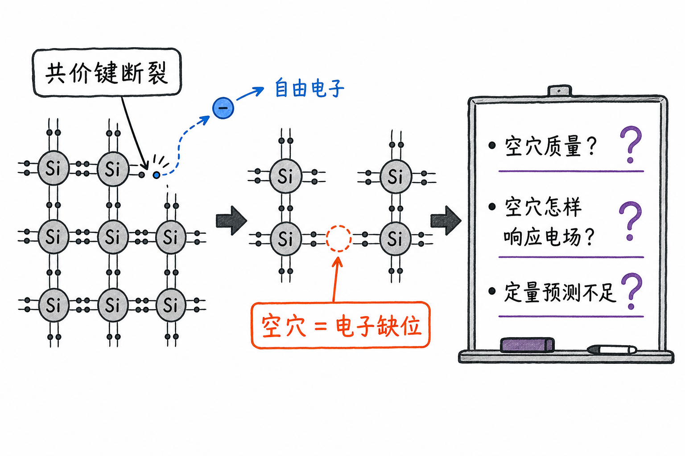
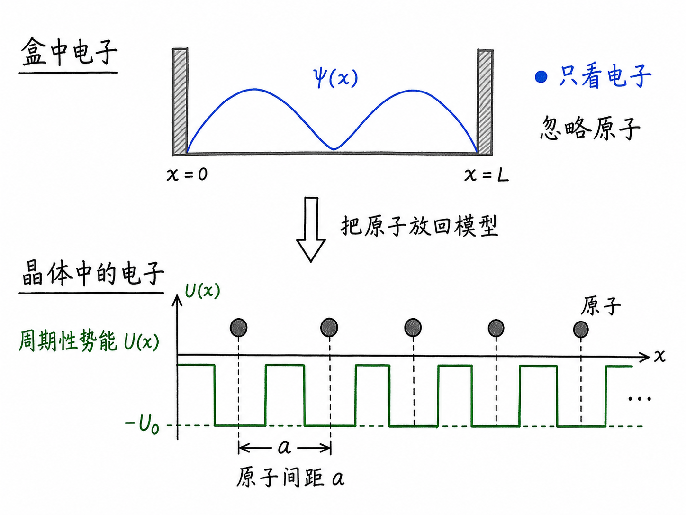
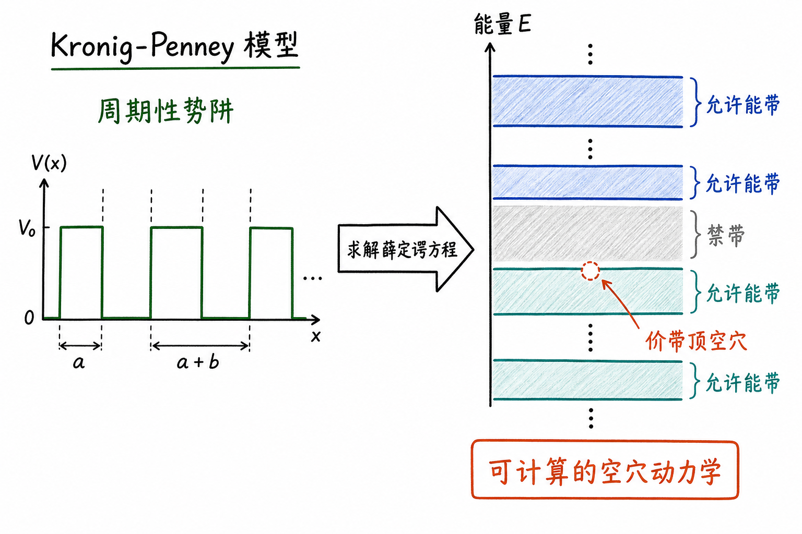

# 键模型的问题：为什么只画断键，算不出真正的空穴

键模型很好用，因为它够直观：硅原子之间有共价键，电子被束缚在键里；温度一高，某条键断了，一个电子跑出来，留下一个空穴。这个画面能让人很快接受“半导体里既有电子，也有空穴”。

但器件工程不能停在这个画面。你要算迁移率、有效质量、态密度、载流子浓度，或者解释为什么空穴能像正电粒子一样运动时，单纯画一条断掉的键就不够了。问题不是键模型错了，而是它还没有给出可以计算的规则。

读完这篇，你会知道

- 为什么键模型能解释空穴的直观来源，却不能定量描述空穴
- 为什么“盒中电子”模型也救不了这个问题
- 前面模型到底漏掉了什么关键物理对象
- 为什么必须把硅原子的周期性势能放回模型
- Kronig-Penney 模型为什么是从直观键模型走向能带理论的下一步

## 键模型解决了入门问题，但没有解决计算问题

先回到最熟悉的图像：硅原子排成晶格，相邻原子共享价电子，形成共价键。当一个电子获得足够能量，它可以脱离原来的共价键，变成能在固体里移动的电子。原来的键位置少了一个电子，就留下一个空穴。

这个说法很有用。它把一个抽象概念讲成了一个可见的事件：

- 电子离开键，变成自由电子
- 键里留下电子缺位
- 这个电子缺位表现得像正电荷载流子

为了让空穴更容易理解，我们还可以用气泡类比。气泡本质上不是一种新物质，只是水里的一块空位；但我们不会每次都描述水分子怎样填补空位，而是直接说“气泡在移动”。空穴也类似。空穴不是一个真实的正电子，而是价带里电子缺位的等效运动。

到这里，键模型已经完成了第一件事：它让我们相信空穴不是玄学，而是电子离开后留下的可追踪空态。

但问题也从这里开始。相信空穴存在，和会计算空穴行为，是两件完全不同的事。

## 真正的问题：空穴到底该按什么规则运动

对导带电子，我们比较容易先做一个粗糙假设：电子带负电，施加电场后，它会受到力，朝电场相反方向加速。这个说法虽然还不完整，但至少像一个粒子动力学问题。

空穴就麻烦了。

如果只看键模型，我们可以随口规定：空穴带正电，所以沿电场方向运动；空穴质量就先假设和电子一样。这样当然能写出一个模型，但这个模型没有根基。它给出的预测不会完全正确，也很难支撑半导体器件里真正需要的定量分析。

对用户的影响很直接：如果模型只停留在“空穴像正电粒子”这句话，你可以讲概念，但很难继续往下算。比如空穴迁移率为什么和电子不同？有效质量从哪里来？价带顶附近为什么能产生像粒子一样的空穴？这些问题，键模型都答不上来。

所以我们需要更深一层的模型。这个模型不能只是画键，而要能从量子力学出发，给出电子在晶体中运动的允许状态。

## “盒中电子”也不够，因为它把晶体当成了空盒子

前面推导态密度时，我们用过一个经典简化：盒中电子。

它假设电子被关在一个盒子里，可以在盒子内部运动，但不能逃出去。这个模型很强，至少给了我们几个重要结果：

- 能量是量子化的
- 波数是量子化的
- 可以通过计数得到态密度 $g(E)$

这已经比键模型更接近“可计算”。于是一个自然想法是：能不能用盒中电子来处理半导体里的电子和空穴？

答案是：不行。

原因很简单：盒中电子模型只看见电子，没看见空穴。更准确地说，它只描述“一个电子在空盒子里能有哪些能量状态”，却没有描述价带为什么存在、导带为什么存在、禁带为什么出现，更没有告诉我们空穴为什么能有自己的动力学。

盒中电子模型的问题，不在于它没有量子力学，而在于它少了晶体本身。

它把电子放进一个盒子，却把硅原子全拿掉了。真实半导体不是一个空盒子，而是一排排、一层层周期性排列的原子。电子在里面运动时，不是在真空里乱跑，而是在不断感受到这些原子核和价电子形成的周期性势场。

如果你把这个势场删掉，就等于删掉了能带结构的来源。

## 被忽略的关键对象：周期排列的原子势能

真实的硅晶体里，原子不是背景装饰。每个硅原子都有正电荷核心，原子按固定间距排列成晶格。电子靠近原子时，会受到吸引；离原子远一些时，吸引变弱。

在量子力学里，这种吸引不应该只用“力”来描述，更自然的语言是势能 $U(x)$。

电子的总能量是 $E$。如果空间里存在势能 $U(x)$，电子真正用于运动的那部分能量就和 $E-U(x)$ 有关。也就是说，电子的波函数、波数和允许能量，都会被这个势能函数改写。

这一步非常关键。

前面的盒中电子模型相当于说：盒子内部势能基本平坦，电子只受边界限制。

晶体模型则要说：盒子内部并不平坦，里面有一串周期性起伏的势能。电子每经过一个原子附近，就会“看到”一个势阱。

这些势阱不是随便摆的，而是按晶格周期重复出现。这个周期性，正是能带理论的根。

## 为什么要把真实势能简化成方形势阱

真实原子周围的势能来自库仑相互作用。电场强度大致随距离按 $1/r^2$ 衰减，势能大致随 $1/r$ 变化。电子越靠近原子，势能越低。

如果完全按真实库仑势去解，会非常复杂。为了抓住主要物理，又让数学可处理，我们先做一个简化：把每个原子附近的吸引势能近似成一个方形势阱。

也就是这样理解：

- 原子之间有固定间距 $a$
- 每个原子附近有一个负势能区域
- 这个负势能可以近似成深度为 $U_0$ 的方形势阱
- 一维方向上，这些势阱周期性重复

这个简化不会保留每一个细节，但它保留了最关键的结构：周期性原子势。

对工程理解来说，这就是好模型的价值。它不是把现实画得一模一样，而是保留会决定结果的那一部分结构，同时让问题可以算。

## Kronig-Penney 模型：把原子放回薛定谔方程

当我们把周期性势阱 $U(x)$ 放进薛定谔方程，问题就变成：电子在一个周期性势场中有哪些允许的量子态？

这就是 Kronig-Penney 模型要做的事。

它先在一维里近似晶体：一排原子周期性排列，电子在其中运动。电子不再是空盒子里的自由粒子，而是在一个又一个势阱之间传播、反射、干涉。求解这个问题之后，会出现一个非常重要的结果：不是所有能量都允许电子存在，而是会形成允许能带和禁带。

这就把前面的直观能带图接上了数学来源。

在键模型里，我们先说“电子从价带跳到导带”。但如果只停在这句话，价带和导带像是被人为画出来的两条线。

在 Kronig-Penney 这类模型里，价带、导带和禁带不再只是图上的名字，而是周期性晶格势能与电子波函数共同决定的量子结果。

## 这一步为什么能救回空穴

空穴的问题，本质上不是“少一个电子”这么简单。真正要问的是：当一个能带几乎被电子填满，只剩下少数未占据状态时，这些未占据状态在电场中如何表现？

键模型只能说：那里少了一个电子。

周期性势场下的能带模型可以进一步说：价带顶附近的电子状态有怎样的能量-波矢关系；当某个状态空出来时，这个空态的运动可以用怎样的有效质量和电荷符号来描述。

这就是为什么空穴最终能被当作一种准粒子处理。它不是凭空假设出来的正电小球，而是“几乎填满的能带里，一个缺失电子状态”的等效动力学。

对半导体器件而言，这一步非常重要。只有这样，空穴迁移率、有效质量、价带导电、电子-空穴对、PN 结中的扩散和漂移，才有统一的计算基础。

## 最后收束：键模型是入口，不是终点

键模型的价值，是把半导体导电讲成一个容易看见的事件：键断了，电子出来了，空穴留下了。

但它的问题也正出在这里：它太像一幅静态示意图，只告诉你“发生了什么”，没有告诉你“这个东西按什么规律运动”。

要真正描述半导体，就必须把硅原子的周期排列放回模型，把周期性势能 $U(x)$ 放进薛定谔方程。Kronig-Penney 模型就是这条路上的第一个清晰台阶：它把直观的断键图像，推进到可以解释能带和空穴动力学的量子模型。

一句话记住：键模型让你看见空穴，周期性势场模型才让你算出空穴。
