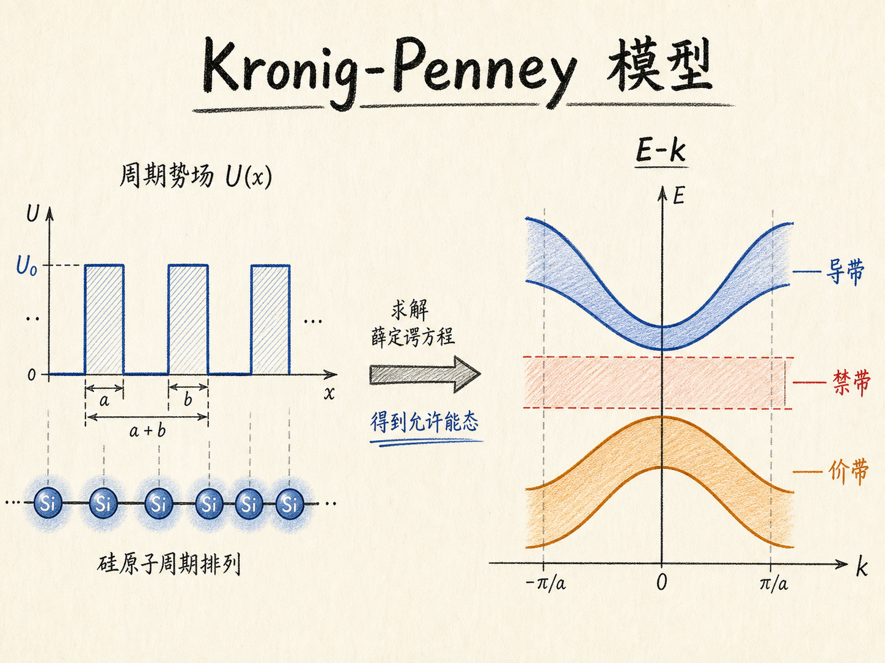
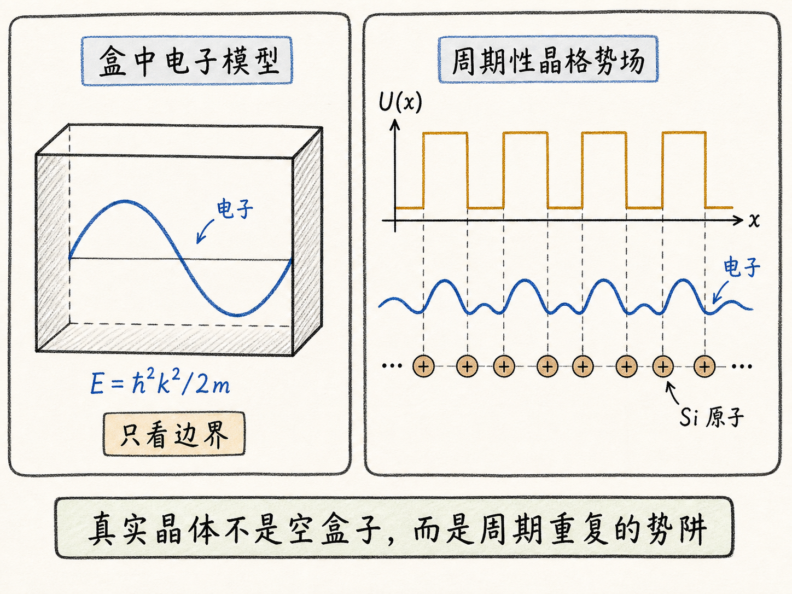
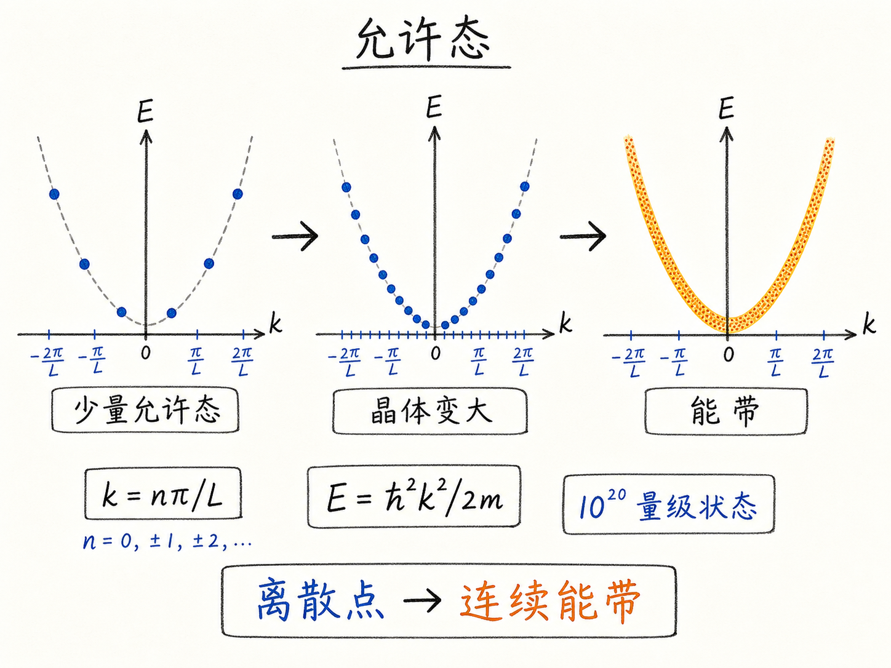
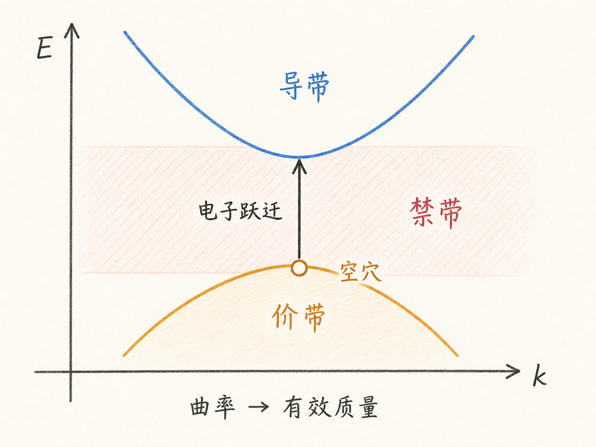

# Kronig-Penney 模型：为什么半导体能带要从 E-k 图里长出来

如果只把硅看成一个盒子，电子在盒子里自由跑，那么半导体物理会显得很简单：能量就是 $E=\hbar^2 k^2/2m$，$E-k$ 图是一条抛物线。问题是，真实硅晶体不是空盒子。里面有一排排原子核和束缚电荷，电子每走一步都在感受到周期性晶格势场。

Kronig-Penney 模型解决的就是这个问题：在保留“晶格周期性”这个关键事实的同时，把势能函数简化到还能求解。它不是为了画一张更漂亮的曲线，而是为了回答一个器件工程里绕不开的问题：为什么固体里有些能量电子可以待，有些能量电子不能待，而这些允许和不允许的能量最后会变成导带、价带和禁带。

读完这篇，你会知道

- 为什么“盒中电子”模型还不能解释真实半导体能带
- Kronig-Penney 模型为什么要把晶格势场简化成周期性方波势阱
- $E-k$ 图上的曲线到底表示什么，不是普通轨迹，而是允许量子态
- 为什么允许态会组成导带和价带，中间又会出现禁带
- 为什么理解 $E-k$ 曲线，后面才能谈有效质量、空穴质量和器件定量计算

## 先从最简单的盒子模型说起

最初的模型很直接：硅是一块盒子，电子被关在盒子里。电子可以在盒子内部运动，但不能逃出去。

这个模型有一个好处：数学干净。对无限深势阱求解薛定谔方程后，电子的波数 $k$ 只能取某些离散值，比如

$$k=\frac{n\pi}{L}$$

对应能量为

$$E=\frac{\hbar^2 k^2}{2m}$$

这意味着能量和波数的关系近似是一条抛物线。因为 $k$ 只能取离散值，所以严格说图上不是连续曲线，而是一串落在抛物线上的点。只是当盒子很大、允许态非常多时，这些点会密到看起来像一条连续曲线。

这个模型能教会我们一个基本事实：电子在晶体中不是随便取任何能量，只有满足边界条件和薛定谔方程的状态才是允许态。

但它也漏掉了最关键的东西：硅不是一个空盒子。

## 真实晶体里，电子看到的是周期性势场

硅晶体里有原子核和束缚电荷。对电子来说，这些正电中心会产生吸引作用。电子靠近正电荷时，势能降低；要逃离这种吸引，就必须克服一段能量。

如果把这种吸引画成势能图，你会得到一个周期性起伏的势场。每个原子附近像一个势阱，原子和原子之间又有势垒。真实势能当然不会是规整的方波，但它有一个非常重要的特征：周期性。

这就是 Kronig-Penney 模型抓住的本质。它把真实复杂的晶格势场简化成一串周期性方波势阱。方波不够真实，但足够表达“晶格是周期重复的”这件事。

为什么不直接用更真实的势能，比如类似 $1/r$ 的库仑势？

因为那样数学会立刻失控。Kronig-Penney 模型已经是高度简化版本，求解起来仍然很复杂。对于学习半导体器件的人，重点不是把推导背下来，而是看懂它给出的物理结果：周期势场会把自由电子的简单抛物线，改造成分段的允许能带。

这对读者的影响是：不要把模型简化误解成随便画图。好的简化不是为了偷懒，而是为了保留决定结果的主因。在这里，主因就是周期性势场。

## E-k 图不是电子在空间里的运动轨迹

Kronig-Penney 模型求解后，最重要的输出是一张 $E-k$ 图。横轴是波数 $k$，纵轴是能量 $E$。

这张图容易被误解成“电子沿着某条曲线运动”。不是这样。

$E-k$ 图表示的是：哪些能量 $E$ 和波数 $k$ 的组合能满足薛定谔方程。能满足的组合，就是允许态；不能满足的组合，就是不允许态。

在盒中电子模型里，允许态近似落在一条抛物线上。到了 Kronig-Penney 模型，因为电子还感受到周期性势场，曲线会变形。能带底附近仍然像抛物线，因为在很小的 $k$ 范围内，电子行为接近自由电子；但离开能带底以后，曲线不再保持简单抛物线。

这个变化很重要。后面我们谈电子有效质量时，用的不是电子的真空质量，而是 $E-k$ 曲线的曲率。曲线越弯，电子响应外力的方式就越不同。换句话说，$E-k$ 图不是装饰图，它会直接进入迁移率、电导和器件速度这些实际问题。

## 允许态多到看起来连续，于是形成能带

单个有限盒子里，允许态是一个个离散点。但真实晶体中原子数极大，量子态数量也极大，可以达到 $10^{20}$ 量级。点和点之间的间隔非常小，画出来就像连续曲线。

这一片密集的允许态，就叫能带。

所以能带不是凭空规定出来的能量区间，而是大量允许量子态在能量轴上密集排列后的结果。这个理解很关键，因为它把“能带”从教材名词变成了一个可计算对象：

- 薛定谔方程决定哪些 $E,k$ 组合被允许
- 周期性晶格势场改变这些允许组合的分布
- 大量允许态密集排列后形成能带
- 不允许态之间留下能量空白，也就是禁带

这也是为什么简单盒子模型不够。盒子模型只能给出一组近似抛物线式的允许态，却不能自然推出导带、价带和禁带之间的结构。

## 导带和价带，是 E-k 图上的两组允许态

Kronig-Penney 模型最有意思的结果，是 $E-k$ 图上不只出现一条允许曲线，而会出现多组允许曲线。

下方一组允许态，对应价带。电子原本主要占据这些状态。它们和化学键图像中的“被共价键束缚的价电子”是一件事的量子力学版本。

上方一组允许态，对应导带。电子如果获得足够能量，就可以从价带跃迁到导带。进入导带后，它更容易在晶格中响应外加电场，成为可以参与导电的电子。

价带和导带之间没有允许态的能量范围，就是禁带。电子不能稳定地停在这段能量里。它要么还在价带里，要么获得足够能量跳到导带里。

这就把前面更直观的键模型翻译成了更能计算的能带语言：

- 键模型说：共价键里的电子被束缚
- 能带模型说：这些电子占据价带态
- 键模型说：电子获得能量后脱离束缚
- 能带模型说：电子从价带跃迁到导带
- 键模型说：电子离开后留下一个缺电子的位置
- 能带模型说：价带中留下一个空穴

同一件事，用键模型看更直观，用 $E-k$ 图和能带模型看更适合计算。

## 为什么 E-k 图会决定半导体的定量能力

半导体器件工程最后不能只停在“电子跳上去了”“留下空穴了”这种图像。我们还要计算电子浓度、空穴浓度、迁移率、电导、复合、漂移扩散，甚至不同材料之间的能带差异。

这些计算的底层，都离不开 $E-k$ 关系。

原因是 $E-k$ 图同时告诉我们两件事。

第一，它告诉我们允许态在哪里。只有允许态才可能被电子占据，所以态密度、载流子浓度这些量，都要建立在允许能带之上。

第二，它告诉我们电子在能带里的动力学特征。能带底附近的曲线如果近似抛物线，就可以把电子看成“带有效质量的准自由粒子”。这个有效质量来自曲率，而不是拍脑袋指定：

$$\frac{1}{m^*}\propto \frac{d^2E}{dk^2}$$

这就是后面可以从 $E-k$ 图计算电子有效质量、空穴有效质量的原因。曲线不是只告诉你能量大小，它还告诉你电子在晶体中像“重”还是像“轻”。

对器件的影响很直接。有效质量会影响迁移率、态密度、载流子输运和材料选择。为什么有些材料电子迁移率高，为什么空穴通常更“重”，为什么不同晶向和不同能谷会带来不同输运行为，这些问题最后都会回到 $E-k$ 曲线的形状。

## 数值能带计算，是 Kronig-Penney 思路的升级版

Kronig-Penney 模型的价值，不在于它是最真实的硅模型。它当然不是。它把三维晶体、真实原子势、电子-电子相互作用等复杂因素都大幅简化了。

它真正的价值是建立了一条路线：

先写出电子在周期势场中的势能函数，再把这个势能放进薛定谔方程，最后求出允许的 $E-k$ 关系。

今天要做更精确的材料计算，可以用数值方法处理更真实的势能和相互作用。结果仍然会以能带结构的形式呈现出来。也就是说，现代计算可以更复杂，但问题的骨架没有变：我们还是在问，某个晶体中电子允许有哪些能量和动量关系。

这也是为什么学习 Kronig-Penney 模型值得。它不是最终答案，而是把你从“电子在盒子里”带到“电子在周期晶格里”的第一座桥。

## 最后收束：能带不是画出来的，是解出来的

可以把这篇的核心压缩成一句话：

Kronig-Penney 模型告诉我们，一旦电子处在周期性晶格势场中，允许量子态就不再只是简单自由电子抛物线，而会组织成导带、价带和禁带；$E-k$ 图正是这些允许态的地图。

所以，导带和价带不是为了方便画器件能带图而人为起的名字。它们来自薛定谔方程在周期势场中的解。理解这一点，后面的有效质量、空穴质量、态密度和器件输运才有共同根基。
