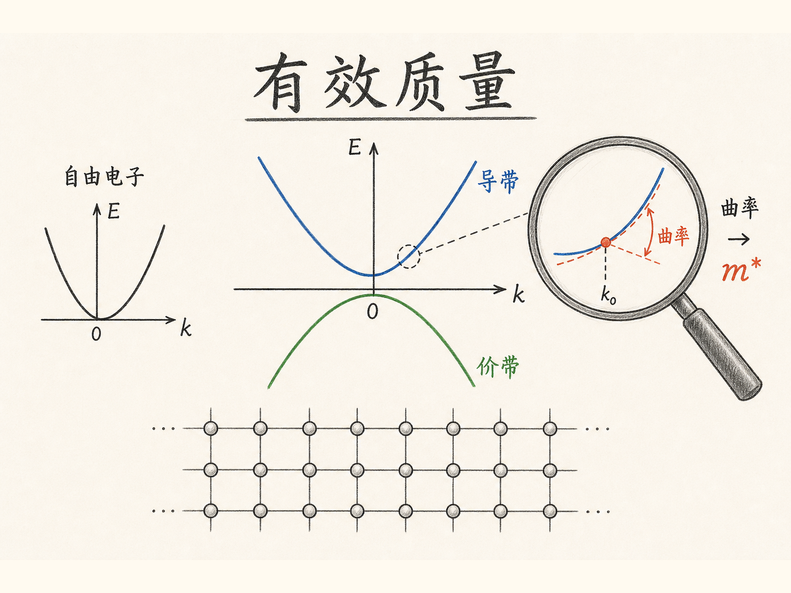
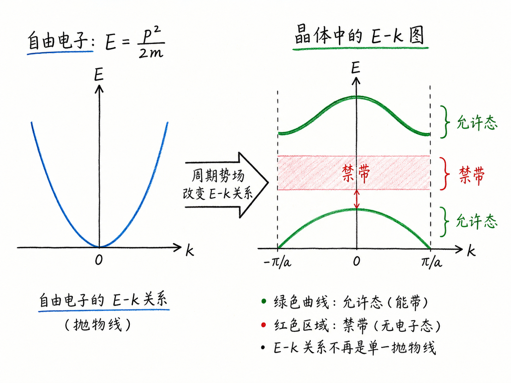
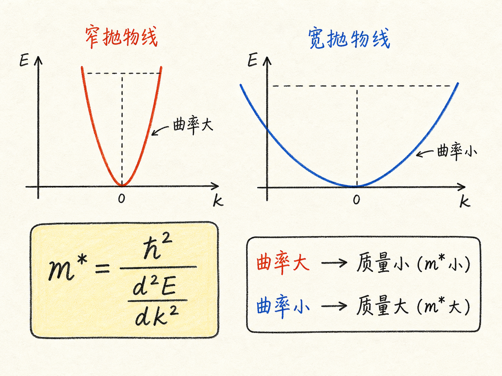
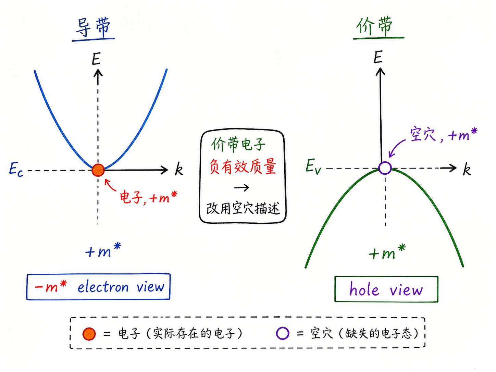
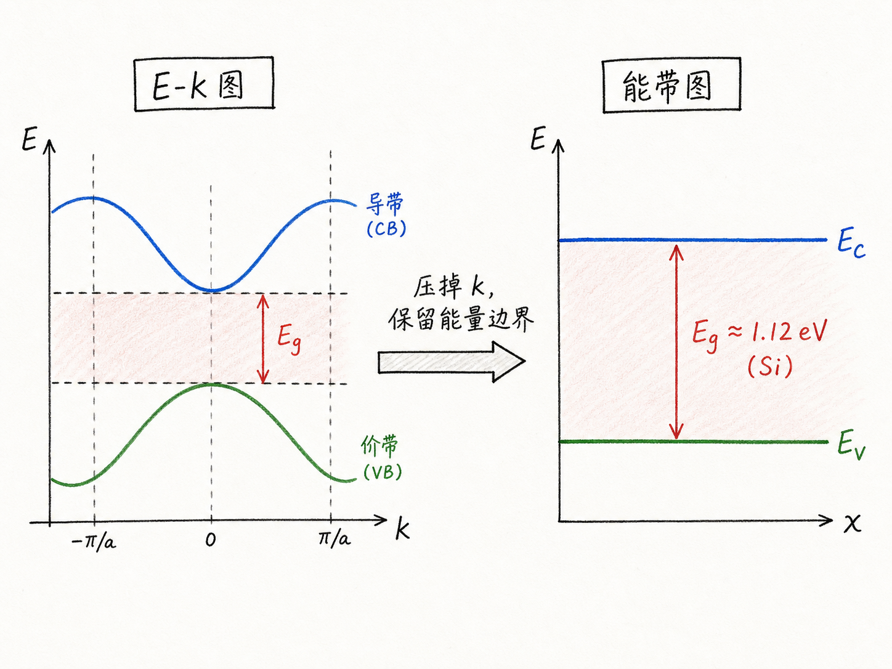

# 为什么电子在晶体里会变重或变轻？

如果电子就是电子，为什么到了硅里面，我们还要说它有一个“有效质量”？更奇怪的是，价带里的电子甚至可以表现得像“负质量”。这听起来像是为了写公式硬造出来的概念，但它其实是在回答一个很现实的问题：晶体里的电子不再是自由空间里的电子，它的运动方式被整个晶格改写了。

Kronig-Penney 模型最重要的输出，不是某个漂亮公式，而是一张 $E-k$ 图。它告诉我们：在周期性晶体势场里，电子只能处在某些能量和波矢组合上。有效质量，就是我们把这张图局部看成一条抛物线以后，从抛物线弯曲程度里读出来的“运动惯性”。

读完这篇，你会知道

- 为什么经典公式 $E=p^2/(2m)$ 到晶体里不够用了
- 有效质量为什么不是电子真实质量，而是 $E-k$ 曲线的局部近似
- 为什么导带电子是正有效质量，价带电子却可以等效成正质量空穴
- 公式 $m^*=\hbar^2/(d^2E/dk^2)$ 到底在说什么
- 为什么后面算态密度、载流子浓度和迁移率时，必须关心有效质量

## 从一条抛物线到一张能带地图

在自由空间里，电子的能量和动量关系很简单：

$E=\frac{p^2}{2m}$。

这是一条抛物线。动量越大，能量越高；质量 $m$ 是一个固定常数。只要知道动量，就能算出能量。反过来，只要知道能量和动量，也能推出质量。

但晶体不是自由空间。晶体里有周期排列的原子核和电子云，电子看到的是一个周期性势场。Kronig-Penney 模型做的事，就是把这个周期性势场简化成一道道周期性势垒，然后去解薛定谔方程。解完以后，结果不是“所有能量都可以”，而是出现一张 $E-k$ 图：横轴是波矢 $k$，纵轴是能量 $E$。

这张图的含义很直接：只有落在曲线上的 $E$ 和 $k$ 组合，才是电子允许存在的状态。电子可以有某个波矢，但它对应的能量必须落在能带曲线上，不能随便填一个值。

所以，$E-k$ 图不是装饰图，而是晶体里电子运动规则的地图。

## 有效质量不是“电子真的变了”

如果我们还想使用类似经典力学的语言，就会自然问一个问题：在这张 $E-k$ 图上，电子的“质量”是多少？

把自由电子公式改写一下：

$m=\frac{p^2}{2E}$。

又因为晶体里常用 $p=\hbar k$，所以可以写成：

$m=\frac{\hbar^2 k^2}{2E}$。

问题来了：在真实的 $E-k$ 曲线上，不同位置的 $k$ 和 $E$ 比例不一样。你在一个点算出来一个质量，换到另一个点，质量可能就变了。这不是说电子的静止质量真的被晶体改造了，而是说：电子在晶体里的加速响应，已经不只由它自己决定，还由周围周期势场一起决定。

这就是“有效质量”的本质：它不是粒子的身份证信息，而是粒子在某个能带、某个局部区域里的运动响应参数。

对器件工程师来说，这个区别很重要。我们在漂移、扩散、态密度、迁移率模型里，经常希望把电子当成一个“近似自由粒子”来处理。有效质量就是让这个近似成立的桥：它把复杂的量子能带结构压缩成一个可以放进工程公式里的参数。

## 为什么看曲率就能得到质量

自由电子的 $E-k$ 关系可以写成：

$E=\frac{\hbar^2 k^2}{2m}$。

这是一条抛物线。抛物线越窄，弯得越厉害；抛物线越宽，弯得越平。质量就在这个弯曲程度里。

对上式对 $k$ 求二阶导数：

$\frac{d^2E}{dk^2}=\frac{\hbar^2}{m}$。

反过来就是：

$m^*=\frac{\hbar^2}{d^2E/dk^2}$。

这条公式的物理意思比它的形式更重要：有效质量由 $E-k$ 曲线的局部曲率决定。

曲率大，说明能量随 $k$ 变化得很快，粒子更容易响应外力，等效质量小。曲率小，说明能量随 $k$ 变化得慢，粒子更“钝”，等效质量大。这里的“重”和“轻”，说的是运动响应，不是电子本身称出来的重量。

这也是为什么有效质量只在局部有意义。真实能带不一定处处像抛物线。只有在导带底、价带顶附近，曲线可以近似看成抛物线时，我们才可以说这附近的电子或空穴有一个近似恒定的 $m^*$。

## 导带电子为什么是正质量

导带底附近的 $E-k$ 曲线通常向上开口，像一个碗。这个局部区域可以近似为向上的抛物线，因此二阶导数 $d^2E/dk^2$ 是正的。

代入公式：

$m^*=\frac{\hbar^2}{d^2E/dk^2}$。

分母为正，所以导带电子的有效质量为正。

这和我们的直觉一致：给电子一个外力，它朝着符合牛顿式直觉的方向加速。虽然底层机制来自量子力学，但在导带底附近，我们可以把它近似看成一个带负电、正有效质量的粒子。这就是后续电子输运模型可以继续使用很多经典形式的原因。

## 价带电子为什么会变成空穴

价带顶附近的曲线方向相反。它不是向上开口，而是向下开口。向下开口意味着二阶导数是负的。按同一个公式算，电子有效质量就变成负值。

负质量听起来很别扭。它的意思不是电子真的拥有科幻意义上的负重量，而是：在几乎填满的价带里，用“少数没有被电子占据的位置”来描述运动，会比追踪一大堆价带电子更自然。

于是我们引入空穴。空穴可以看成价带中缺失的电子态。它带正电，并且拥有正有效质量。用空穴描述价带输运，不只是为了语言好听，而是因为它让公式、方向和工程直觉都变得更清楚。

所以，“价带电子负有效质量”和“空穴正有效质量”是同一件事的两种表述。器件分析里选择空穴，是因为它更方便、更稳定，也更贴近我们实际关心的载流子行为。

## 有效质量把量子结果接回工程公式

前面推导态密度时，我们需要质量。后面计算电子浓度、空穴浓度、费米能级、迁移率和电流时，也会不断碰到质量。

如果仍然把晶体里的电子当成自由电子，用真空电子质量直接代进去，很多结果会偏离真实材料。原因很简单：半导体器件里的电子不是在真空里跑，而是在硅、锗、砷化镓这些具体晶体的能带结构里跑。

有效质量的价值就在这里。它允许我们把复杂的 $E-k$ 图浓缩成一个可用参数：

- 导带底附近，用电子有效质量描述电子
- 价带顶附近，用空穴有效质量描述空穴
- 能量范围不太大时，把局部能带近似成抛物线
- 在需要质量的半导体公式里，代入对应的 $m^*$

这不是精确还原整个量子系统，而是一个工程上非常有用的近似。它保留了能带结构对运动的主要影响，同时让我们还能继续写出可计算、可解释、可用于器件设计的模型。

## 为什么最后还要把 $E-k$ 图压成能带图

$E-k$ 图很底层，因为它同时保留能量和波矢信息。但在很多器件问题里，我们不总是需要动量坐标。比如分析 PN 结、MOS 电容、能带弯曲、载流子浓度时，我们更关心空间位置上的能量变化。

于是常见能带图会把 $k$ 这个坐标“压掉”，只留下能量轴和空间轴。导带边 $E_C$、价带边 $E_V$、带隙 $E_g$ 就变成最常用的语言。

这并不代表 $E-k$ 图不重要。恰恰相反，能带图里很多参数都来自 $E-k$ 图。带隙来自导带和价带之间的能量差；有效质量来自导带底和价带顶的曲率；电子和空穴能否导电，也来自允许态如何分布。

以硅为例，带隙大约是 1.12 eV，具体会随温度变化。电子获得足够能量从价带跃迁到导带后，导带里多出一个可导电电子，价带里留下一个可导电空穴。这套语言看似来自简化能带图，根基却在更完整的 $E-k$ 关系里。

## 最后收束：质量是曲线给电子的运动规则

有效质量这件事，最好不要理解成“电子真的变重了”或“电子真的变轻了”。更准确的说法是：晶体里的周期势场改变了电子的 $E-k$ 关系，而这条关系的局部曲率决定了电子对外力的响应。

导带底像向上的碗，所以电子有正有效质量。价带顶像倒扣的碗，所以电子描述会给出负有效质量；换成空穴描述，就得到正电、正质量的载流子。

一句话记住：有效质量不是电子本身的质量，而是能带曲率翻译成工程语言后的运动惯性。
