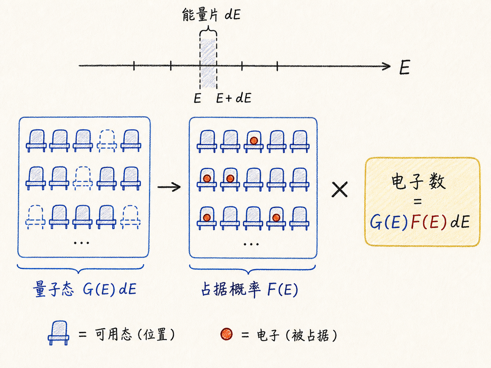
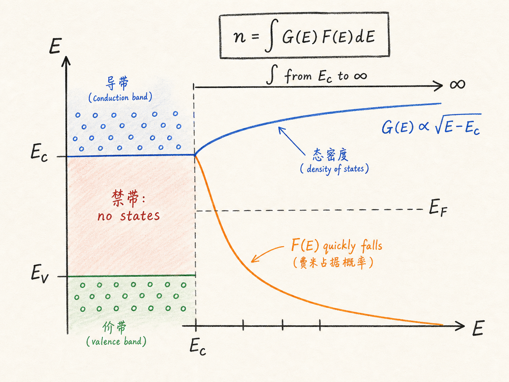
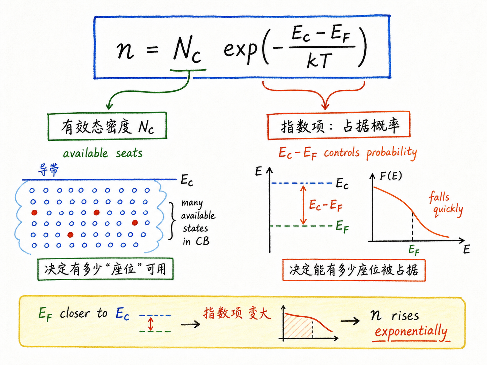

# 半导体里到底有多少电子？

做半导体器件，很多问题最后都会回到一个最朴素的问题：这块材料里到底有多少能导电的电子？如果这个数不知道，后面谈电流、迁移率、扩散、漂移、电场控制，都会像是在空中搭楼。

前面学量子态、态密度、费米能级，看起来绕了一大圈。真正的用途就在这里：电子浓度不是靠数格子数出来的，而是把“有多少位置可以坐”和“每个位置有多大概率被电子坐上”乘起来，再把所有能量位置加总。

读完这篇，你会知道

- 为什么电子浓度必须用态密度和费米函数一起算
- 为什么积分要从导带底 $E_C$ 开始，而不是从任意能量零点开始
- 为什么完整的费米-狄拉克积分不好算，工程上常用什么近似
- $N_C$ 这个“有效态密度”到底是在偷懒，还是在压缩物理信息
- 为什么 $E_C-E_F$ 会指数级控制半导体里的电子数量

## 要数电子，先分清“座位”和“入座概率”

导带里的电子是我们关心的自由电子，价带里的空位是我们关心的空穴。图上画几个电子只是示意，真实半导体里的数量可以轻松到 $10^{11}$ 甚至更高的量级。问题是：这些电子不是均匀撒在一条线上，它们分布在不同能量的量子态里。

所以计算电子浓度要拆成两件事。

第一件事：某个能量附近有多少可用量子态。这由态密度函数 $G(E)$ 描述。可以把它理解成“每一小段能量区间里有多少座位”。如果取一个很薄的能量片 $dE$，这片能量里可用态的数量就是 $G(E)dE$。

第二件事：这些态有多大概率真的被电子占据。这由费米函数 $F(E)$ 描述。可以把它理解成“这些座位有多大概率坐着电子”。低能态更容易被占据，高能态更不容易被占据；到了费米能级 $E_F$，占据概率正好是 $1/2$。

费米函数写成

$F(E)=\frac{1}{1+\exp((E-E_F)/kT)}$。

因此，在某个能量片里，电子数量不是单看 $G(E)$，也不是单看 $F(E)$，而是

$G(E)F(E)dE$。

把每一片能量里的电子数加起来，就是总电子浓度。

## 为什么积分从导带底开始

对电子来说，真正能贡献导电电子的是导带里的状态。因此电子浓度的积分下限不是随便选的零能量，而是导带底 $E_C$：

$n=\int_{E_C}^{E_{C,\max}}G(E)F(E)dE$。

这里有一个半导体特有的细节：禁带里没有允许态。也就是说，在价带顶 $E_V$ 和导带底 $E_C$ 之间，态密度为零。只有能量进入导带以后，态密度才开始随 $E-E_C$ 的平方根增长。

这会影响态密度的写法。导带电子的态密度不是简单看 $\sqrt{E}$，而是看 $\sqrt{E-E_C}$。这不是数学洁癖，而是在告诉你：导带底才是电子可用状态真正开始出现的位置。

至于积分上限 $E_{C,\max}$，实际计算时通常可以取无穷大：

$n=\int_{E_C}^{\infty}G(E)F(E)dE$。

原因是费米函数在高能量处下降得非常快。能量越往上，虽然态的数量还在增加，但被电子占据的概率迅速变小，对总数的贡献很快可以忽略。把上限推到无穷大，计算会干净很多，对结果影响很小。

## 完整公式很正确，但不好用

如果直接把态密度函数和完整费米函数相乘，然后从 $E_C$ 积到无穷大，就得到最根本、最严谨的电子浓度表达式。

问题是，这个积分没有简单闭式解。它属于费米-狄拉克积分，通常要靠数值积分或查表。

这对理解物理没有问题，但对手算、建模和器件直觉不够友好。工程上更常见的问题不是“我能不能把这个积分写得最严谨”，而是“我能不能得到一个足够准、同时能看出物理依赖关系的表达式”。

关键近似就出现在这里。

当导带底 $E_C$ 比费米能级 $E_F$ 高出好几个 $kT$ 时，费米函数可以近似成玻尔兹曼形式：

$F(E)\approx \exp\left(-\frac{E-E_F}{kT}\right)$。

这个条件通常对应非简并半导体。直观地说，费米能级离导带底足够远，导带态被占据的概率很低，电子不像金属里那样把能态大量填满。此时完整费米函数的分母里，指数项远大于 $1$，所以可以把

$\frac{1}{1+\exp((E-E_F)/kT)}$

近似成

$\exp(-(E-E_F)/kT)$。

代价是引入一点误差；好处是积分能算出漂亮的闭式结果。对很多常规半导体器件问题，这个交换是值得的，因为它保留了最重要的物理依赖：温度、有效质量、导带底和费米能级的距离。

## 最终答案：电子浓度由 $N_C$ 和指数项决定

把导带态密度和玻尔兹曼近似代入积分，最后得到

$n=2\left(\frac{2\pi m_n^*kT}{h^2}\right)^{3/2}\exp\left(-\frac{E_C-E_F}{kT}\right)$。

这个式子第一次看会觉得很丑。它有有效质量 $m_n^*$，有温度 $T$，有玻尔兹曼常数 $k$，有普朗克常数 $h$，还有一个指数项。

但它其实可以拆成两块。

第一块是导带有效态密度：

$N_C=2\left(\frac{2\pi m_n^*kT}{h^2}\right)^{3/2}$。

它表示在给定温度和有效质量下，导带大概提供了多少“有效可用的状态容量”。它不是简单的总状态数，而是把态密度积分中那一大串常数和温度依赖压缩成一个参数。

第二块是指数项：

$\exp\left(-\frac{E_C-E_F}{kT}\right)$。

它表示这些导带状态真正被电子占据的难易程度。$E_C$ 离 $E_F$ 越远，电子爬到导带的概率越低，电子浓度就指数级下降；$E_F$ 越靠近导带底，电子浓度就指数级上升。

于是最常用的形式就是

$n=N_C\exp\left(-\frac{E_C-E_F}{kT}\right)$。

这行公式非常重要，因为它把电子浓度的物理图像压得很清楚：$N_C$ 决定“导带有多少有效座位”，指数项决定“这些座位有多少能坐上电子”。

## 对器件工程最有用的直觉

这个公式最值得记住的不是前面那串常数，而是指数项。

在半导体里，载流子浓度对能级位置极其敏感。只要 $E_C-E_F$ 改变几个 $kT$，电子浓度就会出现数量级变化。这就是为什么掺杂、温度、偏压、能带弯曲会强烈改变器件电流。

对 BCD 或更广义的半导体器件来说，这个直觉很直接：你不是只在移动一条抽象的能带线，而是在指数级改变可用电子数。可用电子数一变，电导、结区电场、漏电、开启行为和温度特性都会跟着变。

所以，电子浓度公式不是一个孤立的课堂推导。它是后面理解 PN 结、MOS 电容、漂移扩散、电流方程和器件温度行为的入口。

最后可以用一句话收束：

半导体里的电子数，等于“导带能提供多少有效状态”乘以“费米能级允许这些状态被占据的概率”；而真正让器件行为敏感起来的，是 $E_C-E_F$ 藏在指数项里。
