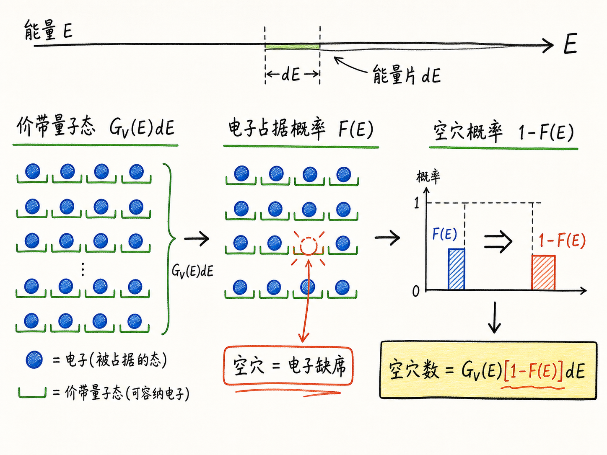
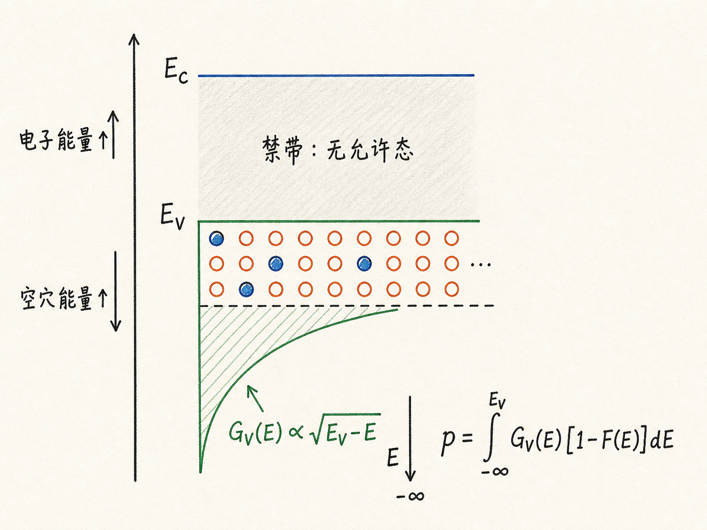
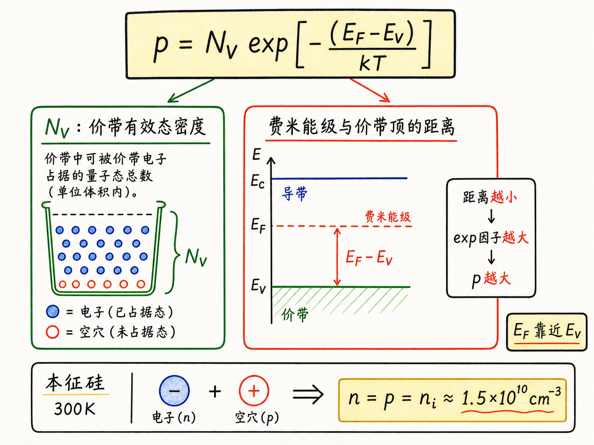

# 半导体里的空穴到底有多少？

电子浓度算完以后，空穴浓度看起来应该只是“照着来一遍”。但真正容易卡住的地方就在这里：空穴不是一种凭空多出来的粒子，它是价带里少了一个电子后的空位。你要数空穴，就不能再问“这个能级有没有电子”，而要反过来问“这个能级有没有空出来”。

这一个反过来，会带出三个连锁变化：概率从 $F(E)$ 变成 $1-F(E)$，态密度从看 $\sqrt{E-E_C}$ 变成看 $\sqrt{E_V-E}$，能量方向也要按空穴的视角翻过去。空穴浓度公式难的不是积分本身，而是别在这几个“翻转”里迷路。

读完这篇，你会知道

- 为什么空穴浓度用 $p$ 表示，而且单位仍然是每单位体积
- 为什么空穴概率不是费米函数 $F(E)$，而是 $1-F(E)$
- 为什么价带态密度要写成 $\sqrt{E_V-E}$，不是 $\sqrt{E-E_V}$
- $p=N_V\exp(-(E_F-E_V)/kT)$ 这个式子到底在说什么
- 为什么本征硅在 $300K$ 时有 $n=p=n_i\approx1.5\times10^{10}\ \text{cm}^{-3}$

## 先别急着积分：空穴浓度到底在数什么

半导体里常写 $n$ 和 $p$，分别表示电子浓度和空穴浓度。这里的“浓度”不是整块材料里一共有多少个电子或空穴，而是单位体积里有多少个，常用单位是 $\text{cm}^{-3}$。

这个区别对器件很关键。一个二极管、一个 MOS 管、一个漂移区，几何尺寸都可以不同；但迁移率、电导率、扩散、电流密度这些物理量，首先关心的是单位体积里有多少可动载流子。总数会随着器件体积变，浓度才是能拿来比较材料和器件区域的量。

所以空穴浓度的问题可以翻译成一句话：

在价带所有能量位置上，每一小段能量里有多少“可空出来的位置”，这些位置又有多大概率真的空出来？

这和电子浓度的逻辑是同一个骨架：态密度乘以概率，再对能量积分。只是电子数的是“座位被电子坐上”，空穴数的是“座位没有被电子坐上”。

## 空穴概率为什么是 $1-F(E)$

费米函数 $F(E)$ 表示某个能级被电子占据的概率：

$F(E)=\frac{1}{1+\exp((E-E_F)/kT)}$。

如果我们要数电子，用 $F(E)$ 很自然。某个能量片里有 $G(E)dE$ 个状态，每个状态被电子占据的概率是 $F(E)$，于是这一片贡献的电子数就是 $G(E)F(E)dE$。

但空穴不是“电子的另一种占据”，空穴是“电子不在这里”。因此某个价带能级出现空穴的概率，就是这个能级没有电子的概率：

$F_p(E)=1-F(E)$。

把费米函数代进去，可以整理成

$F_p(E)=\frac{1}{1+\exp((E_F-E)/kT)}$。

这行式子很有用。它告诉你：如果一个价带能级远低于费米能级，它几乎总是被电子填满，空穴概率很低；如果费米能级靠近价带顶，价带顶附近更容易出现空位，空穴浓度就会上升。

这里的物理直觉比符号更重要。算空穴时不要再盯着“电子有多容易出现”，而要盯着“电子有多容易缺席”。

## 价带里的能量方向要翻过来

导带电子的态密度从导带底 $E_C$ 开始增长，常见形式里有

$\sqrt{E-E_C}$。

意思是：电子能量高于导带底越多，可用态越多。能带图上往上走，电子能量增加，这一点很符合直觉。

价带空穴要换一个参照。价带顶是 $E_V$，空穴越靠近价带顶，按空穴自己的能量视角看，动能越小；越往价带深处走，空穴能量越高。换句话说，能带图还是按电子能量画的，但空穴能量的增加方向是向下。

所以价带态密度不能写成 $\sqrt{E-E_V}$，而要写成

$G_V(E)=4\pi\left(\frac{2m_p^*}{h^2}\right)^{3/2}\sqrt{E_V-E}$。

这里 $m_p^*$ 是空穴有效质量，$h$ 是普朗克常数。也顺便解释了为什么空穴常用 $p$ 表示，而不是 $h$：$h$ 已经被普朗克常数占用了。

这个翻转是很多初学者最容易混的地方。能带图上“往上”表示电子能量增加；但讨论空穴时，价带里“往下”才表示空穴能量增加。图没变，视角变了。

## 空穴浓度的积分长什么样

有了态密度和空穴概率，空穴浓度就是把价带里所有能量位置的贡献加起来：

$p=\int_{-\infty}^{E_V}G_V(E)\left[1-F(E)\right]dE$。

积分上限是价带顶 $E_V$，因为空穴来自价带里的空状态；再往上进入禁带，没有允许态，也就没有可数的价带状态。积分下限形式上写到 $-\infty$，实际贡献主要来自价带顶附近，因为离价带顶太深的能级几乎都被电子填满，空穴概率很小。

把完整的 $G_V(E)$ 和 $1-F(E)$ 放进去，得到的是和电子浓度非常类似的费米-狄拉克积分。它很正确，但不适合手算，也不利于建立器件直觉。

工程上常用的做法仍然是玻尔兹曼近似。只要半导体处在非简并条件下，指数项足够大，就可以把空穴概率近似成更容易积分的形式：

$F_p(E)\approx\exp\left(-\frac{E_F-E}{kT}\right)$。

这个近似的代价是放弃完整费米-狄拉克分布的一点精确性；好处是得到一个能直接看懂物理含义的闭式公式。对多数常规半导体器件分析，这个交换是值得的。

## 最终答案：空穴浓度由 $N_V$ 和 $E_F-E_V$ 决定

完成积分后，空穴浓度可以写成

$p=2\left(\frac{2\pi m_p^*kT}{h^2}\right)^{3/2}\exp\left(-\frac{E_F-E_V}{kT}\right)$。

这行式子看起来仍然很重，但它可以拆成两部分。

第一部分是价带有效态密度：

$N_V=2\left(\frac{2\pi m_p^*kT}{h^2}\right)^{3/2}$。

它把有效质量、温度、普朗克常数这些与价带状态容量有关的量压缩到一个参数里。你可以把 $N_V$ 理解成“价带能提供多少有效的空穴状态容量”。

第二部分是指数项：

$\exp\left(-\frac{E_F-E_V}{kT}\right)$。

它决定这些价带状态里真正出现空穴的难易程度。$E_F$ 离 $E_V$ 越远，价带越容易被电子填满，空穴越少；$E_F$ 越靠近 $E_V$，价带顶附近越容易空出来，空穴越多。

于是最常用的写法就是

$p=N_V\exp\left(-\frac{E_F-E_V}{kT}\right)$。

这和电子浓度公式形成镜像：

$n=N_C\exp\left(-\frac{E_C-E_F}{kT}\right)$。

电子看的是费米能级离导带底 $E_C$ 有多远；空穴看的是费米能级离价带顶 $E_V$ 有多远。一个控制导带里有多少电子，一个控制价带里有多少空位。

## 本征半导体里，电子和空穴必须成对出现

在 $300K$ 的本征硅中，一个很常用的数是

$n_i\approx1.5\times10^{10}\ \text{cm}^{-3}$。

本征半导体没有故意加入施主或受主杂质，载流子主要来自热激发。一个电子从价带跃迁到导带时，导带多了一个电子，价带同时留下一个空穴。所以在热平衡下，本征半导体有

$n=p=n_i$。

这不是巧合，而是产生机制决定的。没有额外掺杂时，你不能只凭空多出一堆电子，也不能只凭空多出一堆空穴。每一次本征激发，都是一个电子-空穴对。

这也解释了为什么 $n_i$ 值得记住。它不是一个孤立常数，而是后面讨论掺杂、PN 结、耗尽区、反偏漏电、温度特性的基准线。很多器件行为，本质上都是在问：现在的 $n$ 和 $p$ 相比 $n_i$ 被推高或压低了多少？

## 对器件工程最有用的直觉

空穴浓度公式真正值得记住的，不是前面那串常数，而是指数项。

当 $E_F$ 靠近 $E_V$，空穴浓度会指数级上升；当 $E_F$ 远离 $E_V$，空穴浓度会指数级下降。这就是为什么掺杂能强烈改变半导体的导电类型和电流能力。受主掺杂把费米能级往价带方向拉，空穴就变多；施主掺杂把费米能级往导带方向推，空穴就被压低。

对 BCD 器件来说，这个直觉会一路用到阱区浓度、体区电阻、PN 结漏电、寄生晶体管、漂移区耗尽和温度行为。你调的不是一个抽象的能级位置，而是在指数级改变空穴数量；空穴数量一变，电导、复合、注入和结电容都会跟着变。

最后可以用一句话收束：

半导体里的空穴数，等于“价带能提供多少有效空穴状态”乘以“电子缺席的概率”；而真正让器件行为敏感起来的，是 $E_F-E_V$ 藏在指数项里。
