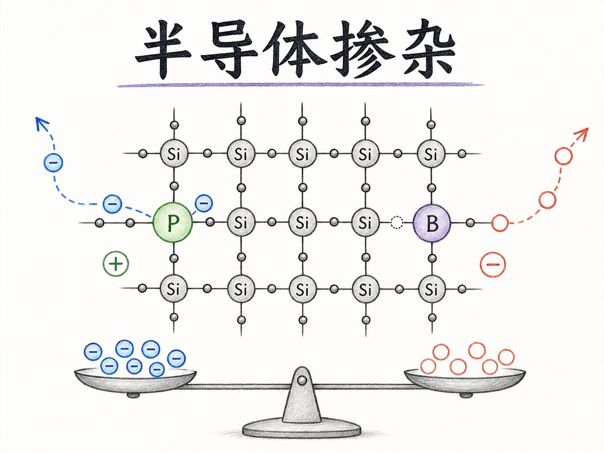
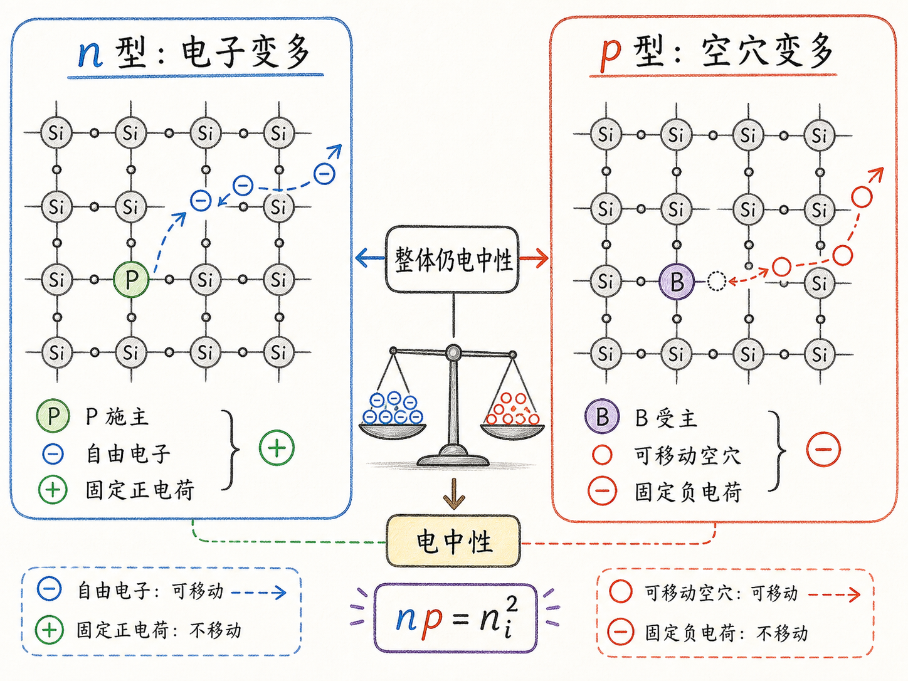
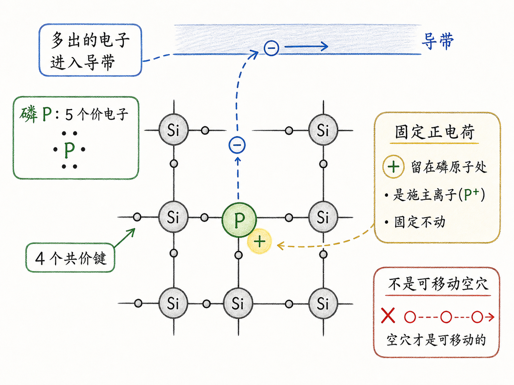
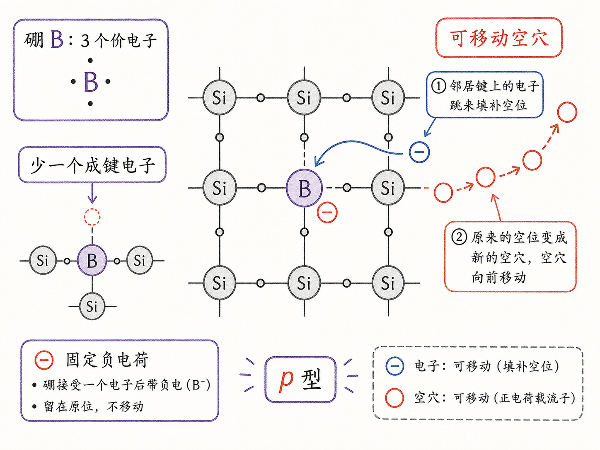
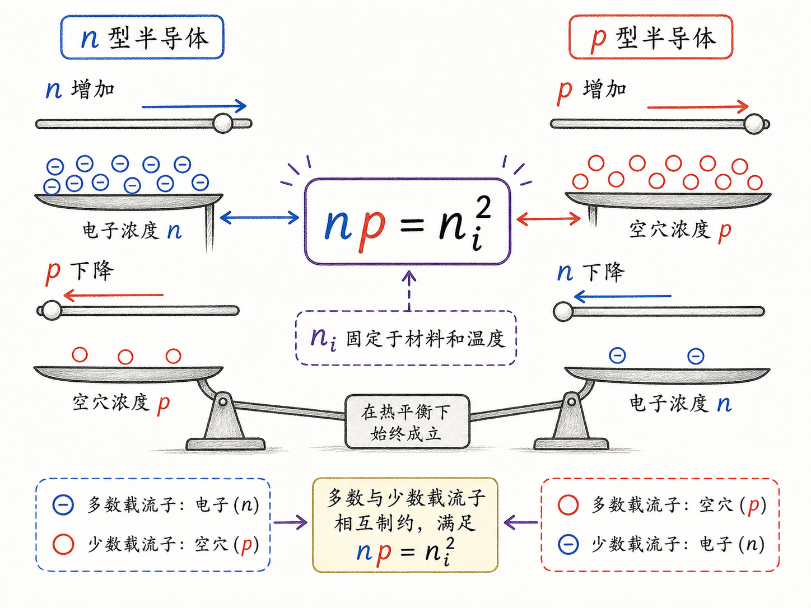

# 掺杂到底怎样改变半导体里的电子和空穴？

前面算完电子浓度和空穴浓度以后，一个很自然的问题会冒出来：如果本征硅在 $300K$ 时只有 $n=p=n_i\approx1.5\times10^{10}\ \text{cm}^{-3}$，那工程师到底怎么“设计”一个半导体器件？总不能每块硅都只能听温度安排。

答案就是掺杂。掺杂真正厉害的地方，不是“往硅里塞一点杂质”这么简单，而是它能在整体仍然电中性的前提下，把电子或空穴浓度推高很多个数量级。也正是因为这件事，半导体才从一种材料，变成了可以被设计的器件平台。

读完这篇，你会知道

- 为什么不能靠“直接往硅里扔电子”来稳定增加电子浓度
- 五价磷为什么会给硅多贡献一个自由电子，却不会留下一个可移动空穴
- 三价硼为什么会引入空穴，而且让半导体变成 p 型
- 为什么掺杂提高一种载流子时，另一种载流子会被压低
- $np=n_i^2$ 这个关系为什么是理解掺杂的核心约束

## 真正要解决的问题：多出载流子，但不能把整块硅充电

如果只看本征半导体，电子和空穴看起来是成对出现的。热激发把一个电子从价带推到导带，导带多一个电子，价带留下一个空穴。所以在热平衡下，本征材料有

$n=p=n_i$。

这个图像很干净，但对器件工程不够用。做二极管、MOS、双极型器件、漂移区和阱区时，我们不只是想知道“自然状态下有多少载流子”，而是要能主动规定某个区域主要靠电子导电，另一个区域主要靠空穴导电。

一个天真的做法是：既然想要更多电子，那就把电子轰进硅里。问题是，这样做只是把一块材料临时充电。额外电子没有被晶格结构稳定地“安排”进去，一旦接触外部中性物体，它们很快会流走。最后得到的不是稳定的 n 型区域，而是一块短暂带负电的硅。

所以掺杂要满足两个条件。

第一，要稳定改变可动载流子数量。第二，不能让材料整体变成一个净带电物体。真正的掺杂，就是用外来原子替换硅晶格中的一部分硅原子，让“多出来的电子”或“缺出来的空穴”成为晶体结构的一部分。

## 磷掺杂：多一个电子，但不是多一个空穴

硅是四价元素。放在硅晶格里，一个硅原子通常用 4 个价电子和邻近硅原子形成共价键。磷是五价元素，最外层有 5 个价电子。如果用一个磷原子替换硅晶格里的一个硅原子，前 4 个电子可以参与正常成键，刚好和周围硅原子把晶格关系维持住。

关键是第 5 个电子。

这个电子没有合适的共价键位置可去。硅晶格周围的键已经满足，磷原子也不需要再额外形成一个稳定键。于是这个多出来的电子很容易离开磷原子，进入导带，成为可以在晶体里移动的自由电子。

这就是为什么磷这类五价杂质叫施主杂质。它给半导体“捐”出一个电子。

但这里有一个特别容易误会的点：磷失去这个电子以后，是不是也留下了一个空穴？

不是。

空穴是价带共价键网络里一个可移动的空位。它能迁移，是因为邻近电子可以不断跳进这个空位，于是空位看起来在晶格里移动。磷施主失去电子以后，留下的是固定在磷原子位置附近的正电荷，也就是离化施主。它会吸引电子，但它不是价带里的可移动空穴。

换句话说，磷掺杂的效果是：

自由电子增加，固定正电荷留在施主原子上，整体电荷仍然平衡。

这才是掺杂比“直接扔电子”高明的地方。电子是可动的，补偿电荷是固定的；材料不需要整体带负电，也能拥有更多可动电子。

## 为什么多了电子，空穴反而会变少

刚加入施主时，可以先用一个粗略图像理解：电子数增加了，空穴数好像没有被直接增加或减少。但热平衡不会停在这个粗略图像上。

半导体里同时存在电子和空穴。电子遇到空穴时，会发生复合：电子填入那个空位，两者一起消失。电子越多，遇到空穴的机会越大，复合就越容易发生。最后系统会重新达到热平衡。

在非简并、热平衡条件下，电子浓度和空穴浓度满足质量作用定律：

$np=n_i^2$。

这条式子是理解掺杂最重要的约束。它说的不是“电子和空穴永远一样多”，恰恰相反，它说的是：在给定温度和材料下，$n$ 和 $p$ 的乘积被固定住了。

所以如果施主掺杂把 $n$ 推高，$p$ 就必须下降。假设本来有 $10$ 个电子和 $10$ 个空穴，乘积是 $100$。如果电子增加到 $20$ 个，为了让乘积仍然是 $100$，空穴就要降到 $5$ 个。

真实半导体里数字当然不是这么小，但逻辑一样。n 型硅不是只有电子、没有空穴；而是电子成为多数载流子，空穴被压低成少数载流子。

这个“多数/少数”的概念非常重要。很多器件行为，例如 PN 结注入、反偏漏电、双极型晶体管增益、体二极管恢复，都不是只看多数载流子，还要看少数载流子怎样被注入、复合和抽走。

## 硼掺杂：少一个电子，就多一个可移动空穴

如果想让空穴变多，就要反过来做：用价电子更少的原子替换硅。典型例子是硼。

硼是三价元素，只有 3 个价电子。把硼放进硅晶格时，它也会尝试和周围硅原子形成共价键。但问题是，硅晶格期待的是四价成键环境，而硼只拿得出 3 个电子。于是某个键位置缺了一个电子。

这个“缺电子的位置”不是简单的局域正电荷，而是一个可以被附近价带电子填入的空态。邻近电子跳进来以后，空位又出现在邻近位置；从整体上看，就是一个空穴在移动。

因此，硼这类三价杂质叫受主杂质。它可以接收一个电子，从而在价带里留下一个可移动空穴。

硼掺杂后的效果可以概括为：

空穴增加，固定负电荷留在受主原子上，整体电荷仍然平衡。

这和磷掺杂是镜像关系。磷给出自由电子，留下固定正电荷；硼制造可移动空穴，留下固定负电荷。两者都没有让整块半导体净带电，但都改变了可移动载流子的类型和数量。

同样地，硼掺杂后仍然满足

$np=n_i^2$。

如果空穴浓度 $p$ 被推高，电子浓度 $n$ 就会被压低。于是这种材料叫 p 型半导体，空穴是多数载流子，电子是少数载流子。

## n 型和 p 型，不是带负电和带正电

初学掺杂时，最危险的误解之一是把 n 型理解成“整块材料带负电”，把 p 型理解成“整块材料带正电”。

这不对。

n 型的意思是电子浓度高，电子是多数载流子；p 型的意思是空穴浓度高，空穴是多数载流子。材料整体在宏观上仍然近似电中性。

以 n 型为例，自由电子带负电，但离化施主带固定正电。两者数量在电荷上互相补偿。以 p 型为例，可移动空穴带正电，但离化受主带固定负电，也互相补偿。

这个区分对器件非常关键。电流主要由可动载流子贡献，电场和空间电荷则常常和固定离化杂质有关。比如 PN 结耗尽区里，电子和空穴被扫走以后，留下的就是这些固定离化施主和受主，它们形成空间电荷区和内建电场。

所以掺杂带来的不是“整块材料带电”，而是“可动载流子浓度”和“固定离化杂质背景”的重新配置。

## 对器件工程最有用的直觉

掺杂把半导体从“温度决定载流子”的材料，变成了“工程师可以设计载流子”的材料。

在 n 型区，施主浓度足够高时，电子浓度通常近似由施主浓度决定，空穴浓度通过 $p=n_i^2/n$ 被压低。在 p 型区，受主浓度足够高时，空穴浓度通常近似由受主浓度决定，电子浓度通过 $n=n_i^2/p$ 被压低。

这就是为什么掺杂浓度会直接影响电阻率、PN 结内建电势、耗尽层宽度、击穿电压、结电容、漏电和少数载流子寿命。对 BCD 工艺来说，阱区、体区、漂移区、源漏区、埋层和隔离结构，本质上都是在用不同掺杂分布安排“哪里容易导电、哪里容易耗尽、哪里承受电场、哪里控制注入”。

最后可以用一句话收束：

掺杂不是把半导体简单充电，而是在电中性约束下重新分配可动载流子；五价杂质让电子成为多数载流子，三价杂质让空穴成为多数载流子，而另一类载流子会被 $np=n_i^2$ 自动压低。
