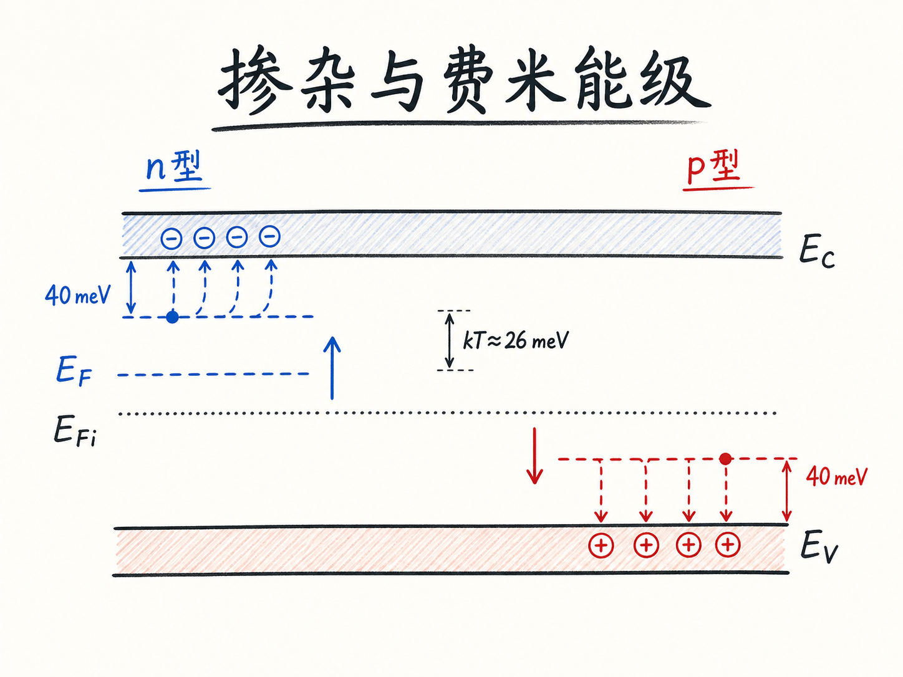
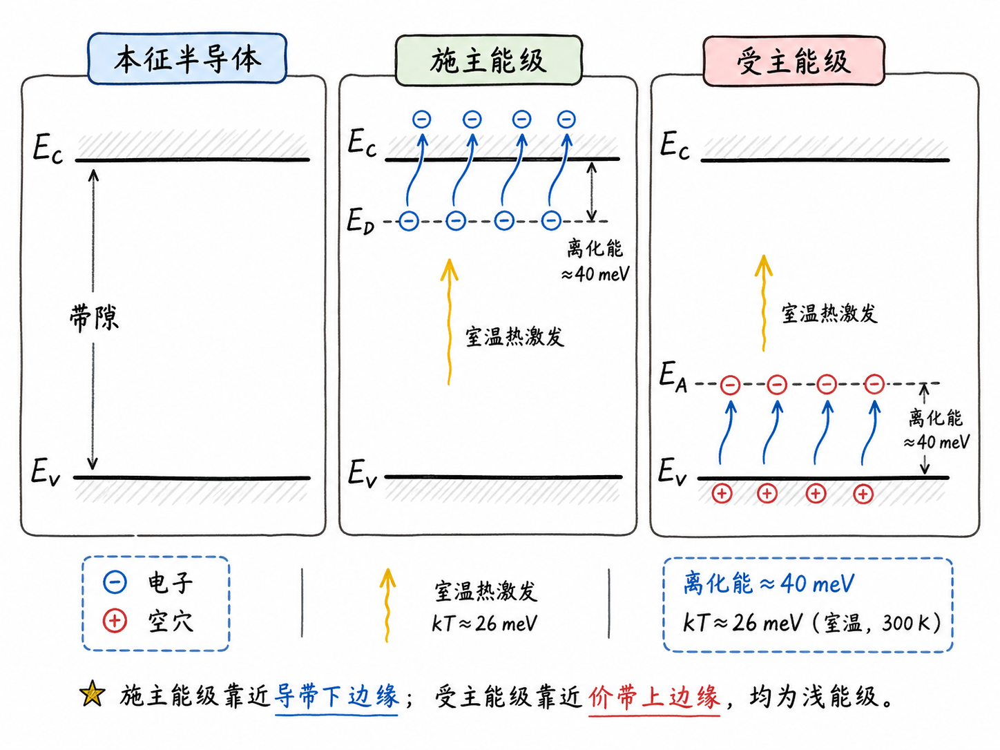
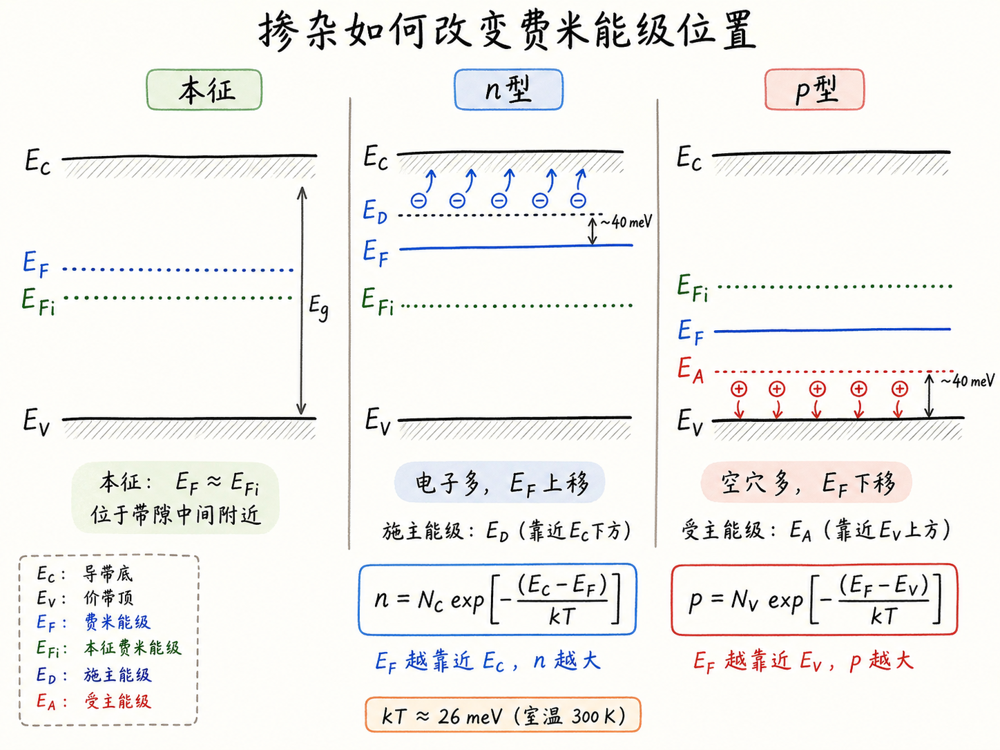

# 掺杂为什么会把费米能级往上拉或往下拉？

上一节用化学键解释了掺杂：五价原子多一个电子，三价原子少一个电子。这个解释很直观，但它还不够工程化。因为真正做器件时，我们不是只想知道“多了一个电子”或“多了一个空穴”，而是要能在能带图上判断：这个区域是 n 型还是 p 型？载流子从哪里来？费米能级应该画在哪里？

能带图把掺杂从“原子价电子故事”推进到“器件分析语言”。一旦能用能带图看懂掺杂，后面的 PN 结、MOS 电容、MOSFET 沟道、漂移区耗尽和结电容，都会变成同一套语言里的问题。

读完这篇，你会知道

- 掺杂为什么等价于在带隙里引入靠近导带或价带的新能级
- 为什么施主电子在 $0K$ 不导电，但在室温下大多可以进入导带
- 受主态为什么不是简单“多了一个固定空位”，而是会让价带出现可移动空穴
- 费米能级为什么会随 n 型掺杂上移、随 p 型掺杂下移
- 本征费米能级 $E_{Fi}$ 为什么是判断 n 型和 p 型的参考线

## 先换一种语言：掺杂不是只在晶格里加原子，也是在能带里加状态

如果只从化学键看掺杂，五价磷替代四价硅，多出来一个电子；三价硼替代四价硅，缺一个电子，于是出现空穴。这个图像对理解 n 型和 p 型很有用，但它回答不了一个关键问题：

这些多出来的电子或空穴，在能量上到底处在什么位置？

能带图的回答是：掺杂会在带隙里引入额外能级。

本征半导体的导带和价带之间是带隙。理想情况下，带隙里没有允许电子待着的状态。也就是说，电子要么在价带，要么进入导带，中间这一段不能随便停。

掺入杂质以后，这个“中间没有状态”的图像被改变了。施主或受主会在带隙里引入离散的杂质能级。关键是，这些能级不是随便放在带隙中间，而是很靠近导带或价带。

五价施主，例如磷、砷，通常在导带下方很近的位置引入施主能级。这个能级一开始带着一个电子。三价受主，例如硼，则在价带上方很近的位置引入受主能级。这个能级可以接收价带电子，于是在价带中留下空穴。

所以从能带图看，掺杂的本质不是一句“多一个电子”就结束了，而是：

施主在导带附近放了一个容易被热激发的电子来源；受主在价带附近放了一个容易制造空穴的电子接收位置。

## 为什么室温下杂质能级很容易被激活

接下来要看一个数字：典型杂质离化能大约是 $40meV$。

离化能可以理解为，把施主电子从施主能级推到导带，或者让受主从价带接收电子所需要跨过的小能量差。它不是硅的整个带隙。硅带隙在室温下大约 $1.12eV$，而 $40meV$ 只有 $0.04eV$，小了一个数量级以上。

室温下的热能 $kT$ 大约是 $26meV$。这不是说每一个电子都刚好有 $26meV$ 能量，而是说热涨落已经足够频繁地把许多电子推过这种很浅的能级差。

这就解释了一个很重要的现象：

在 $T=0K$ 时，施主电子虽然在导带附近，但没有热能跳进导带，所以不能作为自由电子导电。温度升高后，一部分电子被热激发到导带。到 $300K$ 附近，大多数浅施主已经离化，电子进入导带，成为可移动载流子。

受主也类似。在 $T=0K$ 时，受主态还不能有效制造可动空穴。温度升高后，价带电子可以被受主接收，价带里留下空穴。到室温时，浅受主通常也能高度离化，空穴成为价带里的可动载流子。

这里有一个细节不要过度简化：离化比例不只由“$40meV$ 和 $26meV$ 谁大谁小”决定。严格计算要用费米-狄拉克分布和杂质能级占据概率。但对入门能带图来说，先记住这个工程直觉就够了：

浅施主和浅受主离带边很近，所以室温热能足以让它们大量离化。

## 施主态：导带附近的一排“待释放电子”

把 n 型掺杂画到能带图上，可以这样画：

导带边是 $E_C$，价带边是 $E_V$。在 $E_C$ 下方不远处，画一排施主能级 $E_D$。每个施主能级原本带着一个电子。

这些电子在 $0K$ 时还被束缚在施主能级附近，不能在晶体里长距离移动。它们不是导带电子，所以不能真正贡献导电。

温度升高后，电子从 $E_D$ 跳到 $E_C$ 以上，也就是进入导带。进入导带以后，它就不再只是某个磷原子附近的局域电子，而是可以在晶体中运动的自由电子。施主原子失去电子后，留下一个固定的正电离化中心。

这个固定正电中心很重要。它解释了为什么 n 型半导体不是整块材料带负电。自由电子带负电，离化施主带正电，两者在宏观上互相补偿。真正变化的是可动载流子浓度，而不是整块材料的净电荷。

还有一个容易忽略的问题：如果施主电子已经离开，留下的施主能级是空的，价带电子能不能跳进这个空态？

可以。

带隙里的杂质态也是允许态。电子当然可以占据它，然后再继续跳到导带。只是对室温浅施主来说，最重要的效果仍然是它向导带提供电子，所以我们把它叫施主态。

## 受主态：价带附近的一排“电子接收位置”

p 型掺杂的图像和 n 型相反。

三价受主在价带上方很近的位置引入受主能级 $E_A$。这些受主态不是向导带捐电子，而是接收价带里的电子。价带电子被受主接收后，价带中就留下一个空穴。

空穴不是“一个固定在硼原子上的洞”。如果只是固定缺陷，它不会像载流子那样贡献电流。真正的空穴是在价带共价键网络里可以移动的空位：旁边电子跳过来填它，空位就等效移动到旁边。

所以受主离化后的电荷图像是：

受主原子接收电子后变成固定负电中心，价带里留下可移动空穴。

这和施主正好镜像。n 型是“可动电子 + 固定正电施主”；p 型是“可动空穴 + 固定负电受主”。两者都保持宏观电中性，但它们安排了不同类型的多数载流子。

这个区分对器件很关键。电流主要由可动电子或空穴贡献；耗尽区空间电荷、电场和内建电势，则常常来自固定离化施主和受主。PN 结能形成内建电场，靠的正是这些可动载流子被扫走以后留下来的固定离化杂质。

## 费米能级为什么能判断 n 型和 p 型

前面推电子浓度时，我们用过一个非常关键的关系：

$n=N_C e^{-(E_C-E_F)/kT}$。

这个式子先不用背，抓住它的含义就行：导带电子浓度 $n$ 和费米能级 $E_F$ 的位置有关。

如果 $E_F$ 离导带 $E_C$ 很远，那么 $E_C-E_F$ 很大，指数项很小，导带里的电子浓度就低。

如果 $E_F$ 往上靠近 $E_C$，那么 $E_C-E_F$ 变小，指数项变大，导带电子浓度就升高。

掺入施主以后，导带电子浓度增加。公式右边的 $N_C$ 主要由温度和材料有效态密度决定，不是由施主浓度直接决定的。温度不变时，要让 $n$ 增大，就只能让 $E_F$ 往上移动，靠近导带。

所以 n 型掺杂在能带图上的表现就是：费米能级上移。

对 p 型也有类似关系。空穴浓度可写成

$p=N_V e^{-(E_F-E_V)/kT}$。

如果 $E_F$ 离价带 $E_V$ 很远，$E_F-E_V$ 大，空穴浓度低。如果 $E_F$ 往下靠近价带，$E_F-E_V$ 变小，空穴浓度升高。

所以 p 型掺杂在能带图上的表现就是：费米能级下移。

这就是那句常用直觉的来源：

n 型半导体的费米能级靠近导带；p 型半导体的费米能级靠近价带。

严格说，不是电子像小磁铁一样真的把一条线“拉”上去，空穴也不是物理地把线“拉”下去。费米能级是由载流子浓度、温度和能态占据统计共同决定的化学势。但作为画图直觉，“电子多了，$E_F$ 向导带靠；空穴多了，$E_F$ 向价带靠”非常好用。

## 本征费米能级：判断掺杂类型的基准线

如果半导体没有掺杂，就是本征半导体。此时电子和空穴都来自热激发，浓度相等：

$n=p=n_i$。

在能带图上，本征半导体也有一个费米能级，通常记为 $E_{Fi}$。它大致位于带隙中间。严格来说，$E_{Fi}$ 不一定精确等于带隙正中点，因为导带和价带的有效态密度可能不同，但多数入门图里可以先把它看作接近中间。

以后画半导体能带图时，常会把 $E_{Fi}$ 画成一条虚线。它的作用很简单：给你一个参考。

如果实际费米能级 $E_F$ 高于 $E_{Fi}$，说明电子浓度高于本征水平，材料偏 n 型。

如果实际费米能级 $E_F$ 低于 $E_{Fi}$，说明空穴浓度高于本征水平，材料偏 p 型。

这个参考线在器件分析里非常有用。因为很多时候我们不是直接写一堆载流子浓度公式，而是看能带图上的相对位置：$E_F$ 离 $E_C$ 近，还是离 $E_V$ 近？$E_{Fi}$ 在空间上怎么弯曲？不同区域的费米能级在平衡时是否对齐？

这些判断会直接进入 PN 结和 MOS 结构。

## 为什么这套图对器件工程重要

到这里，掺杂的能带图语言可以总结成三句话。

第一，施主在导带附近引入浅能级，室温下容易离化，向导带提供自由电子。

第二，受主在价带附近引入浅能级，室温下容易离化，接收价带电子，从而在价带留下可移动空穴。

第三，费米能级的位置反映载流子浓度：n 型时 $E_F$ 上移靠近 $E_C$，p 型时 $E_F$ 下移靠近 $E_V$。

为什么这对器件工程重要？因为后面的器件不是靠口头判断“这里电子多、那里空穴多”来分析的，而是靠能带图判断电势、载流子分布和电场。

PN 结里，p 区和 n 区接触后，载流子扩散、复合，留下固定离化杂质，形成耗尽区和内建电场。这个过程最终要画成能带弯曲。

MOSFET 里，栅压改变硅表面电势，让表面的 $E_C$、$E_V$ 和 $E_{Fi}$ 相对费米能级移动。判断积累、耗尽、反型，本质上也是看费米能级和本征能级、带边之间的关系。

对 BCD 工艺来说，阱区、体区、漂移区、源漏、埋层和隔离区的掺杂，不只是“浓度表里的数字”。它们最终都会体现在能带、耗尽层、电场分布和载流子浓度上。能带图就是把这些工艺参数翻译成器件行为的中间语言。

最后用一句话收束：

掺杂改变半导体，不只是因为它多给了一个电子或空穴，而是因为它在带隙中引入靠近带边的浅能级；室温热能让这些能级离化，载流子浓度随之改变，费米能级也就向导带或价带移动。
