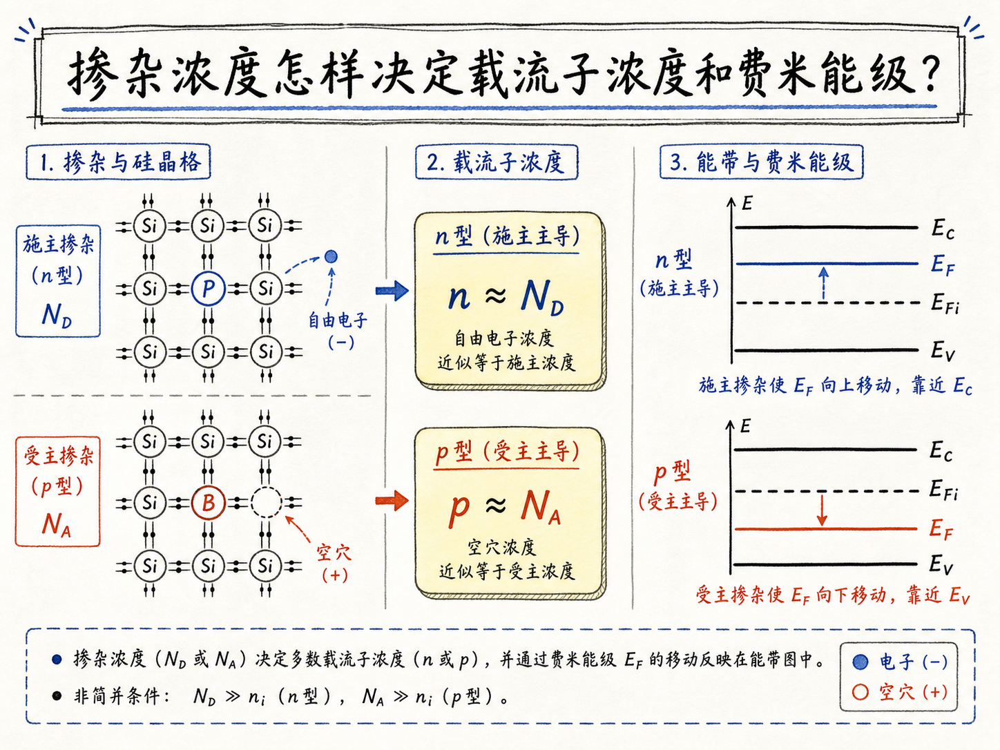
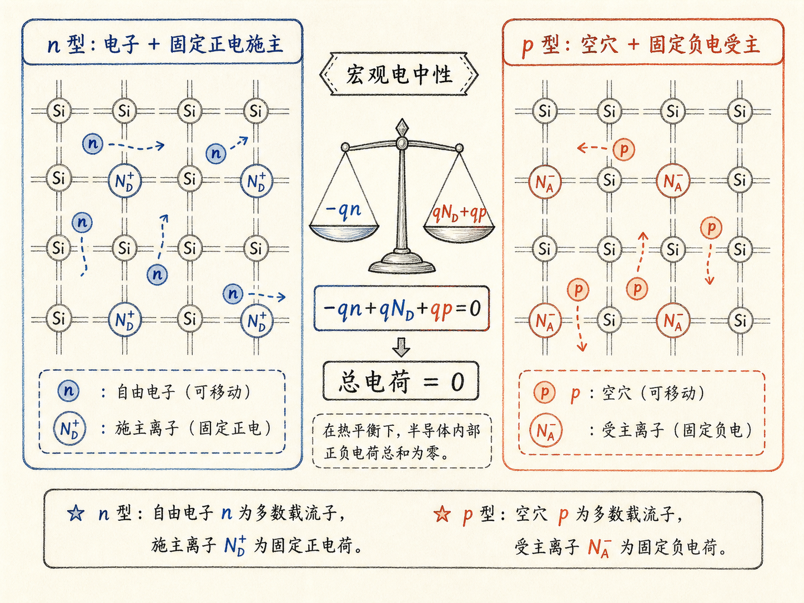
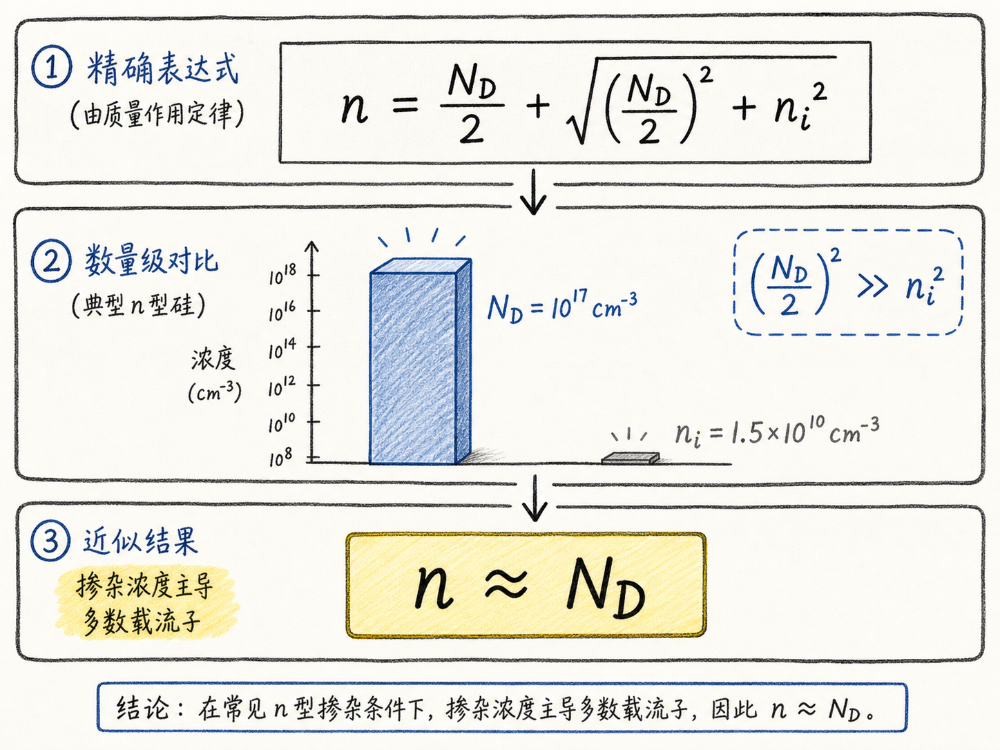
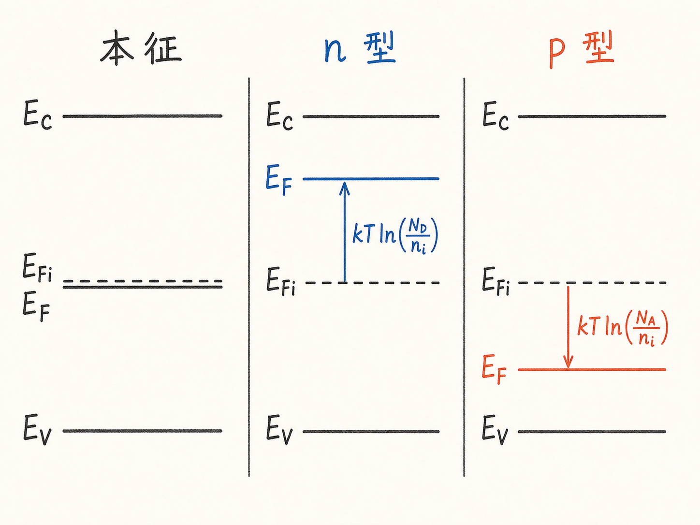

# 掺杂浓度怎样决定载流子浓度和费米能级？

前面已经知道，掺磷会让硅更像 n 型，掺硼会让硅更像 p 型。但做器件时，光说“更像”没有用。工程上真正要问的是：如果施主浓度是 $N_D$，电子浓度 $n$ 到底是多少？如果受主浓度是 $N_A$，空穴浓度 $p$ 到底是多少？费米能级又应该在能带图上移动多少？

这一节把“掺杂带来电子或空穴”的直觉，推进到两个可以直接算的结论：多数载流子浓度近似等于掺杂浓度；费米能级相对本征费米能级的移动，等于 $kT$ 乘以一个对数项。后面分析 PN 结、MOS 表面势、阱区和漂移区时，这两个结论会反复出现。

读完这篇，你会知道

- 为什么掺杂后半导体整体仍然保持电中性
- 如何从电荷中性和 $np=n_i^2$ 推出 $n\approx N_D$、$p\approx N_A$
- 为什么 $n_i$ 很小，所以室温硅中多数载流子主要由掺杂浓度决定
- 费米能级相对本征费米能级的偏移为什么是 $kT\ln(N_D/n_i)$ 或 $kT\ln(N_A/n_i)$
- 为什么画能带图时常把 $E_{Fi}$ 近似放在带隙中点

## 先抓住一个约束：掺杂改变载流子，不改变整块材料的净电荷

很多人第一次学掺杂时，容易形成一个误解：n 型半导体是不是整块带负电？p 型半导体是不是整块带正电？

不是。

掺杂改变的是可动载流子的类型和浓度，不是让整块半导体带上宏观净电荷。原因很简单：一个施主原子捐出电子以后，电子变成可动负电荷，施主原子自己变成固定正电离化中心。负电电子和正电施主同时存在，总电荷仍然平衡。

对受主也一样。受主接收价带电子后，价带留下可动空穴；受主本身变成固定负电离化中心。可动正电空穴和固定负电受主也互相补偿。

所以分析掺杂半导体时，第一条约束就是电荷中性：

所有正电荷和负电荷加起来必须为零。

这条约束非常关键，因为它把“掺杂浓度”和“电子、空穴浓度”连在了一起。

## n 型半导体：用电荷中性推电子浓度

先看最简单的 n 型情况：只有施主，没有受主，并假设施主已经离化。

这时系统里主要有三类电荷：

- 电子，浓度为 $n$，带负电；
- 离化施主，浓度为 $N_D$，带正电；
- 空穴，浓度为 $p$，带正电。

把它们写成电荷中性方程：

$-qn+qN_D+qp=0$。

把公共因子 $q$ 消掉：

$-n+N_D+p=0$。

换一个更方便求 $n$ 的写法：

$n-N_D-p=0$。

现在问题变成：方程里还有 $p$，但我们想求的是电子浓度 $n$。这时用前面学过的质量作用定律：

$np=n_i^2$。

也就是：

$p=\frac{n_i^2}{n}$。

代回电荷中性方程：

$n-N_D-\frac{n_i^2}{n}=0$。

两边乘以 $n$：

$n^2-nN_D-n_i^2=0$。

这是一个普通二次方程。解出来：

$n=\frac{N_D}{2}+\sqrt{\left(\frac{N_D}{2}\right)^2+n_i^2}$。

这里取正号，因为载流子浓度不能是负数。

这个式子看起来有点长，但它的物理意思很清楚：n 型半导体里的电子浓度，主要由施主浓度 $N_D$ 决定，同时还叠加了本征热激发带来的那一点电子。

## 为什么工程上常直接写 $n\approx N_D$

如果严格计算，电子浓度是：

$n=\frac{N_D}{2}+\sqrt{\left(\frac{N_D}{2}\right)^2+n_i^2}$。

但工程分析里经常直接写：

$n\approx N_D$。

这不是偷懒，而是量级决定的。

以室温硅为例，本征载流子浓度 $n_i$ 大约是 $1.5\times10^{10}cm^{-3}$。而一个常见的掺杂浓度可以是 $10^{17}cm^{-3}$，甚至更高。两者差了七个数量级。

放到上面的根号里看，$\left(\frac{N_D}{2}\right)^2$ 远大于 $n_i^2$。于是：

$\sqrt{\left(\frac{N_D}{2}\right)^2+n_i^2}\approx \frac{N_D}{2}$。

所以：

$n\approx \frac{N_D}{2}+\frac{N_D}{2}=N_D$。

这就是“多数载流子浓度约等于掺杂浓度”的来源。

它对器件工程的影响很直接：只要处在非简并、完全离化、掺杂远高于本征浓度的常规区间，就可以把 $N_D$ 当成 n 区电子浓度的第一近似。这样后面算电阻率、耗尽层宽度、内建电势、结电容时，模型会变得非常简洁。

但这句话也有边界。低温下杂质可能没有完全离化；极高掺杂下会进入简并半导体或出现带隙变窄；强非平衡条件下也不能随便套平衡关系。入门能带图里先抓住常规近似即可，但真实工艺仿真不能忘记这些边界。

## p 型半导体也是同一件事：$p\approx N_A$

如果换成 p 型半导体，只考虑受主，不考虑施主，推导过程完全镜像。

受主离化后带负电，空穴带正电，电子带负电。电荷中性会把 $p$、$N_A$、$n$ 连起来，再配合：

$np=n_i^2$。

在受主浓度远大于本征载流子浓度、受主充分离化的条件下，可以得到：

$p\approx N_A$。

这说明掺杂真正给我们的控制旋钮是什么：

加施主，主要控制电子浓度；加受主，主要控制空穴浓度。

这句话看似简单，但它是半导体工艺能工作的基础。离子注入、扩散、外延掺杂、阱区调节，本质上都是在用空间分布不同的 $N_D$ 和 $N_A$，设计不同区域的多数载流子浓度。

对 BCD 器件尤其如此。漂移区要低掺杂来承受高压；源漏区要高掺杂来降低接触和串联电阻；阱区和体区要通过掺杂设定阈值、电场和隔离能力。所有这些设计，第一层都离不开 $n\approx N_D$、$p\approx N_A$ 这个近似。

## 载流子浓度变了，费米能级也必须跟着变

到这里，我们已经知道掺杂浓度怎样决定电子或空穴浓度。下一步要问：这件事在能带图上怎么体现？

答案是：费米能级移动。

对导带电子，前面已经有一个常用表达式：

$n=N_C e^{-(E_C-E_F)/kT}$。

这个式子说的是：电子浓度 $n$ 取决于导带底 $E_C$ 和费米能级 $E_F$ 之间的距离。

如果 $E_F$ 离 $E_C$ 很远，$E_C-E_F$ 很大，指数项很小，导带里电子很少。

如果 $E_F$ 向上靠近 $E_C$，$E_C-E_F$ 变小，指数项变大，导带里的电子就变多。

所以 n 型掺杂增加电子浓度以后，能带图上必然表现为：

$E_F$ 向导带 $E_C$ 靠近。

这就是为什么 n 型半导体的费米能级画在本征费米能级上方。

对 p 型也一样，只是方向相反。空穴浓度可以写成：

$p=N_V e^{-(E_F-E_V)/kT}$。

如果 $E_F$ 向下靠近价带 $E_V$，$E_F-E_V$ 变小，空穴浓度就变大。

所以 p 型掺杂增加空穴浓度以后，能带图上表现为：

$E_F$ 向价带 $E_V$ 靠近。

这里不要把费米能级理解成一条被电子或空穴“机械拉动”的线。更准确地说，费米能级是载流子统计分布中的化学势。载流子浓度改变，满足热平衡统计的化学势位置也就改变。画图时说“上移、下移”，是把这个统计结果可视化。

## 最好用的形式：把一切都相对 $E_{Fi}$ 来看

如果每次都从 $E_C$、$E_V$、$N_C$、$N_V$ 开始算，符号会很多，也很容易在正负号上出错。

更好用的方式，是把费米能级都相对本征费米能级 $E_{Fi}$ 来看。

对电子浓度，可以整理出：

$n=n_i e^{(E_F-E_{Fi})/kT}$。

这个式子比 $n=N_C e^{-(E_C-E_F)/kT}$ 更适合画图理解。它说：

电子浓度比本征载流子浓度大多少，只取决于 $E_F$ 比 $E_{Fi}$ 高多少。

两边取自然对数：

$E_F-E_{Fi}=kT\ln\left(\frac{n}{n_i}\right)$。

对 n 型半导体，常规近似下 $n\approx N_D$，所以：

$E_F-E_{Fi}=kT\ln\left(\frac{N_D}{n_i}\right)$。

这就是 n 型半导体费米能级相对本征费米能级的偏移。

对 p 型半导体，也可以得到：

$E_{Fi}-E_F=kT\ln\left(\frac{N_A}{n_i}\right)$。

注意这两个式子的结构完全对称：

- n 型：$E_F$ 在 $E_{Fi}$ 上方，距离是 $kT\ln(N_D/n_i)$；
- p 型：$E_F$ 在 $E_{Fi}$ 下方，距离是 $kT\ln(N_A/n_i)$。

这组式子是画掺杂半导体能带图时最值得记住的形式。因为它把问题简化成一句话：

掺杂越高，$N_D/n_i$ 或 $N_A/n_i$ 越大，费米能级离本征费米能级越远。

## 本征费米能级为什么通常画在带隙中间

现在还剩一个问题：$E_{Fi}$ 到底在哪里？

本征费米能级是未掺杂半导体的费米能级。入门画图时，通常把它画在导带底 $E_C$ 和价带顶 $E_V$ 的中间，也就是：

$E_{midgap}=\frac{E_C+E_V}{2}$。

严格说，$E_{Fi}$ 不一定精确等于带隙中点。因为导带和价带的有效态密度不一定一样，而有效态密度又和电子、空穴有效质量有关。更精确的表达式是：

$E_{Fi}=E_{midgap}+\frac{3}{4}kT\ln\left(\frac{m_p^\*}{m_n^\*}\right)$。

这里 $m_p^\*$ 是空穴有效质量，$m_n^\*$ 是电子有效质量。

这个修正项的来源并不神秘。本征半导体里必须满足：

$n=p=n_i$。

而电子和空穴浓度分别由 $N_C$、$N_V$ 以及费米能级相对带边的位置决定。因为 $N_C$ 和 $N_V$ 与有效质量有关，当电子和空穴有效质量不一样时，$E_{Fi}$ 会从精确中点略微偏移。

但对普通能带图来说，这个偏移通常只有几十毫电子伏，比如约 $20meV$ 量级。硅的带隙约 $1.12eV$，远大于这个偏移。因此定性画图时，把 $E_{Fi}$ 放在带隙中间非常够用。

如果你要做精确定量计算，再使用有效质量修正；如果只是判断 n 型、p 型、能带弯曲和费米能级相对位置，中点近似更清晰。

## 这套推导对器件分析的真正价值

这一节最重要的不是二次方程本身，而是把三个层次连起来。

第一层是电荷中性。掺杂不会让整块半导体带净电，而是在可动载流子和固定离化杂质之间重新分配电荷。

第二层是载流子浓度。常规完全离化条件下，n 型有 $n\approx N_D$，p 型有 $p\approx N_A$。这让掺杂浓度变成可动载流子浓度的直接控制量。

第三层是费米能级。载流子浓度增加后，费米能级相对 $E_{Fi}$ 移动：

$E_F-E_{Fi}=kT\ln\left(\frac{N_D}{n_i}\right)$，

$E_{Fi}-E_F=kT\ln\left(\frac{N_A}{n_i}\right)$。

这三层合在一起，就是从工艺掺杂到器件能带图的桥。

在 PN 结里，$N_D$ 和 $N_A$ 决定两侧多数载流子浓度，也决定内建电势和耗尽层分配。在 MOS 结构里，衬底掺杂决定表面势、耗尽电荷和阈值电压。在 BCD 工艺里，阱区、体区、漂移区、源漏区的掺杂分布，最终都会通过载流子浓度和费米能级位置，反映到导通电阻、击穿电压、结电容和隔离能力上。

最后用一句话收束：

掺杂浓度不是一个孤立的工艺数字；在平衡半导体里，它先通过电荷中性变成多数载流子浓度，再通过统计分布变成费米能级相对 $E_{Fi}$ 的移动，最后进入器件的电场、电势和电流行为。
