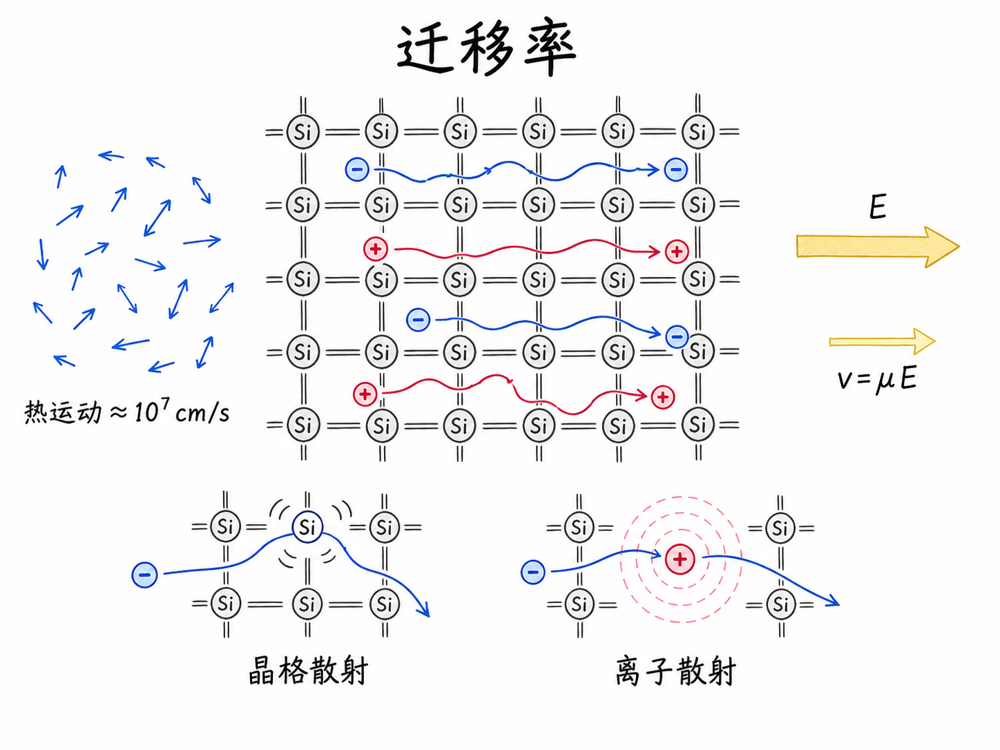
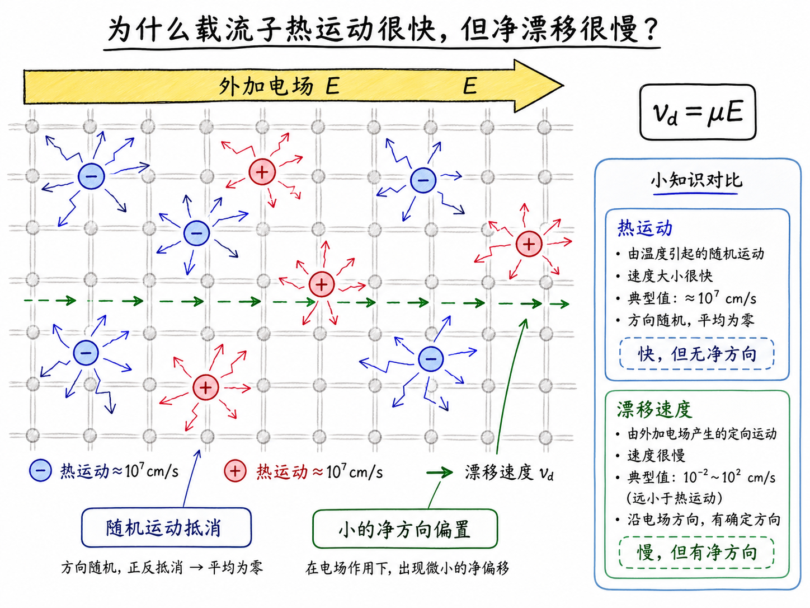
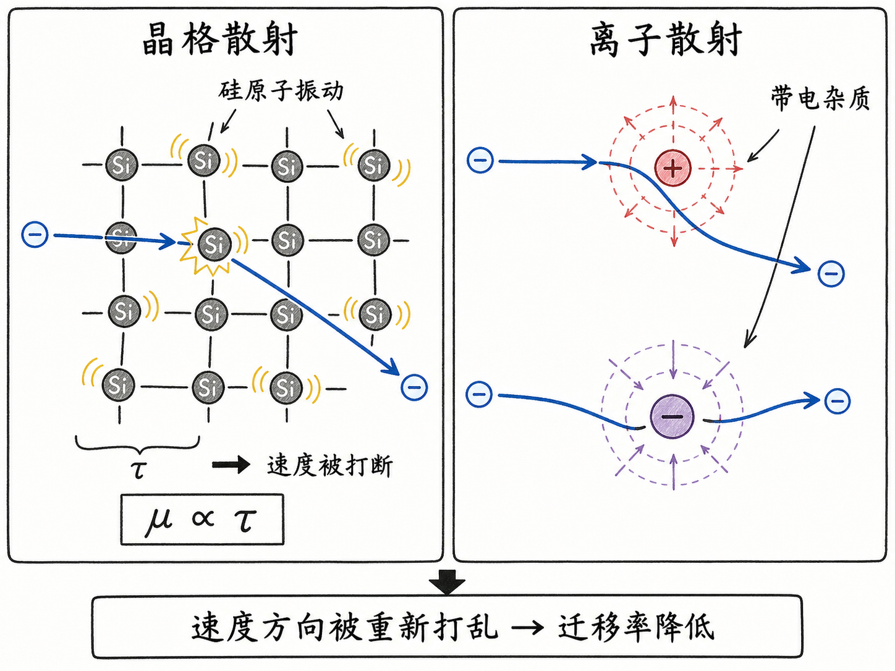
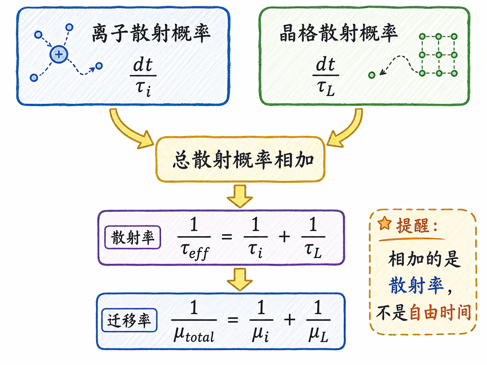

# 迁移率：电场为什么只能让载流子慢慢漂移

如果你第一次听“漂移电流”，很容易以为电子在电场里会像小球一样一路加速：电场越强，速度越快，一直冲下去。这个想法只对了一半。电场确实会推着载流子走，但在硅晶体里，电子和空穴不是在真空中飞行，它们每走一小段就会被晶格振动、离化杂质打断。

所以真正的问题不是“电场能不能让载流子加速”，而是“在不断被打断的情况下，载流子还能留下多少平均速度”。这个平均速度，就是漂移速度；决定它大小的比例系数，就是迁移率。

读完这篇，你会知道

- 为什么室温下载流子明明运动很快，却不会形成同样快的电流
- 晶格散射和离子散射分别在打断什么
- 为什么牛顿定律最后会变成 $v=\mu E$
- 多种散射机制为什么用倒数形式合并：$\frac{1}{\mu_{total}}=\frac{1}{\mu_i}+\frac{1}{\mu_L}$
- 为什么高电场下这个简单关系会失效，并引出速度饱和

## 先分清两种速度：热运动很快，漂移很慢

在室温 $T=300K$ 下，硅里的电子并不是静止等着电场来推。它本来就在晶格里高速乱跑，热运动速度量级大约是 $10^7 cm/s$，也就是 $10^5 m/s$。

这个数字很大，但它不等于电流很大。原因是热运动没有统一方向。一个电子这一瞬间往左，下一瞬间往右，整体平均下来接近抵消。没有外加电场时，载流子像一群无序走动的人，走得很快，但队伍没有整体搬家。

电场的作用，是在这团无序运动上叠加一个很小的方向偏置。载流子仍然在高速乱跑，但平均起来，会多出一点沿电场相关方向的净速度。这个净速度才是漂移速度。

## 载流子为什么不能一路自由加速

如果空穴在真空中，只受电场力，那么从牛顿定律出发非常直接：

$qE=m_p^*a$

所以

$a=\frac{qE}{m_p^*}$

再对时间积分，速度就是

$v(t)=\frac{qE}{m_p^*}t$

这意味着只要时间够长，速度就会一直变大。但半导体不是自由空间。硅晶格里至少有两类东西会不断打断载流子的运动。

第一类是晶格散射。室温下，硅原子并不是固定不动的，它们会因为热振动而来回摆动。电子或空穴撞上这些振动的晶格，运动方向就会被改写。

第二类是离子散射。掺杂后的半导体里有离化杂质。例如 n 型硅中的磷或砷施主离化后带正电；p 型硅中的硼受主离化后带负电。载流子靠近这些带电中心时，会受到库仑力扰动，轨迹被拉弯，离开时速度方向和大小都已经变了。

所以散射的本质很简单：载流子带着一个速度进来，带着另一个速度出去。微观上它可能是波的散射，但在理解漂移电流时，可以先把它当作“运动不断被重新洗牌”。

## 迁移率从哪里来：两次碰撞之间的加速

现在把自由加速和散射放在一起看。

假设一个空穴刚经历一次散射，速度方向被打乱。接下来，在下一次散射发生之前，电场会给它一个加速度。两次离子散射之间的平均时间记作 $\tau_i$。这段时间内，它能积累的速度量级是

$v_{max}=\frac{qE\tau_i}{m_p^*}$

如果用最粗糙的匀加速图像，平均速度似乎应该是最大速度的一半。但真实散射不是固定周期发生的，而是统计过程：有些载流子刚加速就被打断，有些能跑久一点。完整统计处理后，常见推导会把这个简单的 $1/2$ 因子吸收到平均结果里，最终得到

$v_{avg}=\frac{qE\tau_i}{m_p^*}$

这一步是理解迁移率的核心。原来电场不是直接决定“瞬时加速度”就结束了；在晶体中，电场能留下的平均效果还取决于载流子多久被打断一次。

把上式重写一下：

$v_{avg}=\frac{q\tau_i}{m_p^*}E$

电场 $E$ 前面的比例系数，就是迁移率：

$\mu_i=\frac{q\tau_i}{m_p^*}$

于是漂移速度写成

$v=\mu E$

这就是一个很浓缩的物理判断：迁移率越高，同样电场下，载流子越容易形成净漂移；迁移率越低，同样电场下，载流子越容易被散射打断。

## 为什么散射越多，迁移率越低

迁移率里最直观的量是 $\tau$，也就是平均散射时间。$\tau$ 越大，说明载流子两次碰撞之间能自由加速更久；漂移速度更大，迁移率更高。$\tau$ 越小，说明载流子刚被电场推起来就被打断；漂移速度更小，迁移率更低。

这对工艺和器件有直接影响。

掺杂浓度升高，会引入更多离化杂质中心，离子散射增强，迁移率下降。温度升高时，晶格振动更强，晶格散射增强，迁移率也会下降。也就是说，迁移率不是一个纯数学常数，而是把材料、温度、掺杂和散射机制压缩成一个工程上可用的参数。

这也是为什么做器件时不能只说“提高掺杂可以提高载流子浓度”。掺杂确实会提高多数载流子浓度，但也可能降低迁移率。最后电流能力取决于两件事的乘积：有多少载流子，以及这些载流子动得顺不顺。

## 多种散射为什么用倒数相加

到目前为止，我们只用 $\tau_i$ 讨论了离子散射。但真实硅里还有晶格散射。两种散射同时存在时，该怎么合成一个总迁移率？

关键是看“小时间 $dt$ 内发生散射的概率”。

离子散射的概率近似为

$P_i=\frac{dt}{\tau_i}$

晶格散射的概率近似为

$P_L=\frac{dt}{\tau_L}$

在很小的 $dt$ 内，两种散射同时发生的概率非常小，可以忽略。所以总散射概率近似是两者相加：

$P_{total}\approx\frac{dt}{\tau_i}+\frac{dt}{\tau_L}$

如果把总效果写成一个等效散射时间 $\tau_{eff}$：

$\frac{dt}{\tau_{eff}}=\frac{dt}{\tau_i}+\frac{dt}{\tau_L}$

于是

$\frac{1}{\tau_{eff}}=\frac{1}{\tau_i}+\frac{1}{\tau_L}$

因为迁移率与散射时间成正比，所以迁移率也以倒数形式合并：

$\frac{1}{\mu_{total}}=\frac{1}{\mu_i}+\frac{1}{\mu_L}$

这个形式背后的直觉是：不是“哪个机制给你更多自由时间”，而是“哪个机制增加了被打断的机会”。多个散射机制叠加时，叠加的是散射发生率，也就是 $\frac{1}{\tau}$，不是 $\tau$ 本身。

## 一个参数封装了很多复杂性

最后得到的式子非常简单：

$v_p=\mu_pE$

对空穴来说，漂移速度等于空穴迁移率 $\mu_p$ 乘以电场。对电子也类似，只是符号方向需要按电荷处理。

这个式子简单到像经验公式，但它背后其实封装了很多东西：牛顿定律、有效质量、晶格散射、离子散射、温度、掺杂浓度，以及载流子在晶体里的统计运动。

对器件工程来说，它的价值就在这里。你不可能在每一次电路计算里都重新模拟每个载流子如何撞晶格、如何被杂质离子偏转。你需要一个可测、可查、可用于设计的参数。迁移率就是这个参数。

## 什么时候 $v=\mu E$ 不够用了

$v=\mu E$ 有一个重要前提：漂移速度要远小于热运动速度。也就是说，电场只是给热运动叠加了一个小偏置。

当电场很高时，这个前提会被破坏。载流子不能无限按 $\mu E$ 增速，速度会逐渐接近饱和。这就是速度饱和。对短沟道 MOS、功率器件高场区、漂移区设计来说，这个效应会直接影响电流能力、导通电阻和击穿附近的行为。

所以迁移率不是“载流子本身跑多快”的同义词。它更像是一个材料和工艺共同决定的响应能力：在给定电场下，载流子能从混乱热运动中留下多少有方向的净速度。

一句话收束：电场负责推，散射负责打断，迁移率记录的是两者拉扯后的平均结果。
