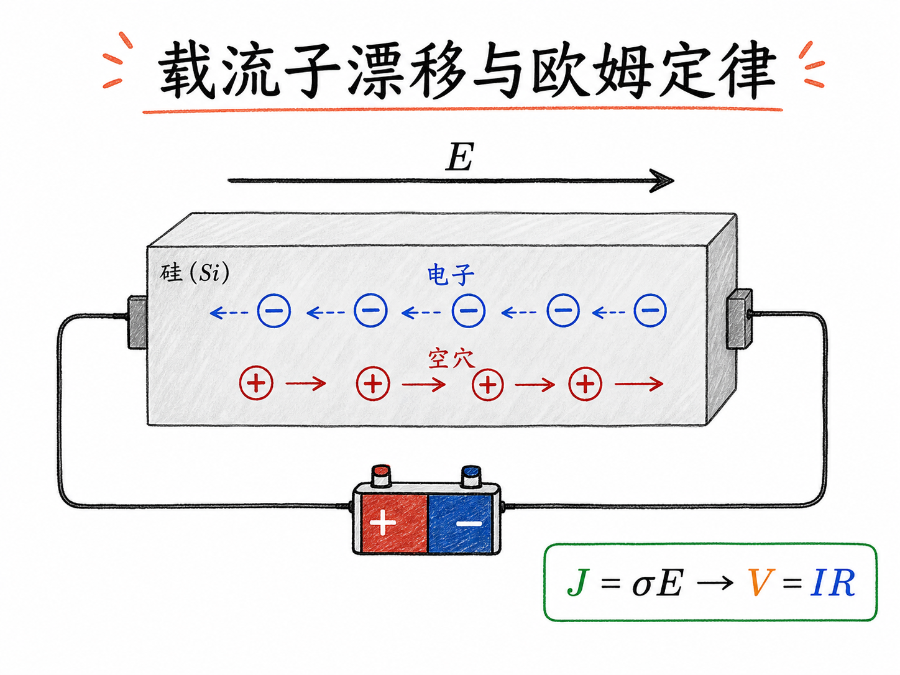
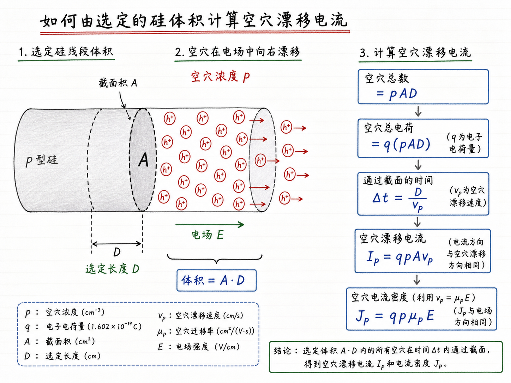
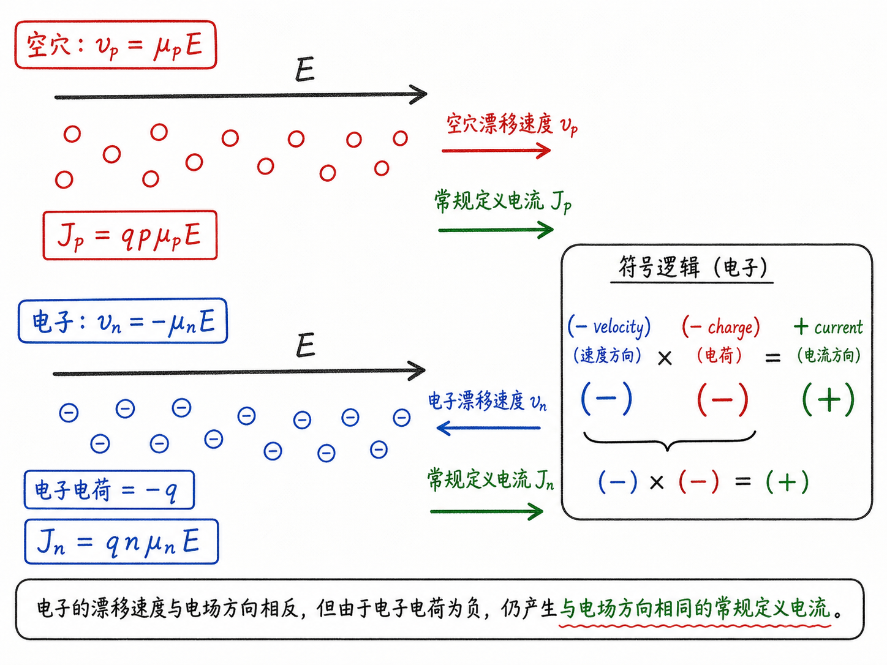
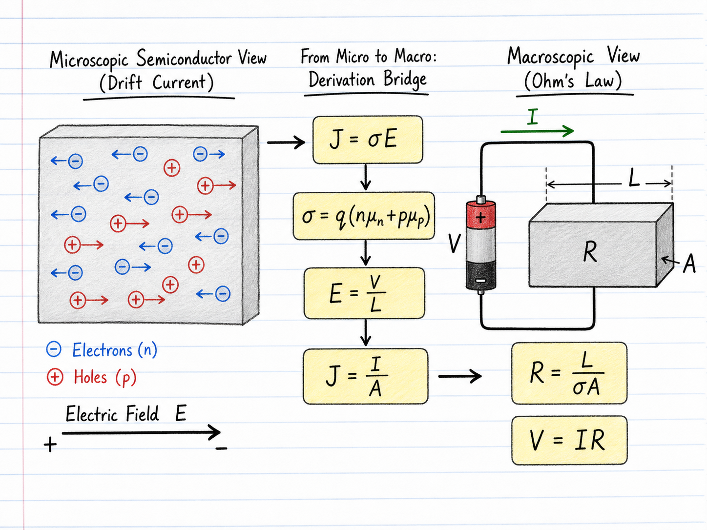

# 载流子漂移：欧姆定律在半导体里到底从哪来

欧姆定律 $V=IR$ 太熟了，熟到很容易被当成一个“电路公式”背下来。但如果你做半导体器件，只背这个公式是不够的。因为器件里的电阻不是一个抽象符号，它来自硅里面的电子和空穴：有多少载流子、它们迁移率多高、横截面积多大、路径多长，最后都会压缩进一个看似简单的 $R$。

所以这篇要回答的问题不是“欧姆定律怎么用”，而是“为什么载流子漂移这件微观运动，最后会长成欧姆定律”。一旦这条链路打通，$J=\sigma E$、$\sigma=q(n\mu_n+p\mu_p)$、$R=L/(\sigma A)$ 就不再是三条分散公式，而是一条从材料到器件的因果链。

读完这篇，你会知道

- 为什么空穴电流密度可以写成 $J_p=qp\mu_pE$
- 为什么电子逆着电场漂移，却仍然贡献正方向的常规电流
- 半导体总电导率为什么是 $\sigma=q(n\mu_n+p\mu_p)$
- n 型和 p 型材料里，什么时候可以只看多数载流子
- 微观欧姆定律 $J=\sigma E$ 如何推出宏观欧姆定律 $V=IR$

## 先把漂移速度放到桌面上

上一节已经得到载流子漂移速度和电场之间的关系。对空穴来说：

$v_p=\mu_pE$

空穴带正电，所以它的漂移方向和电场方向一致。对电子来说：

$v_n=-\mu_nE$

这个负号不是装饰，它表示电子带负电，受力方向和电场方向相反。也就是说，同一个外加电场里，空穴往电场方向漂移，电子往反方向漂移。

这两个速度公式就是后面推电流的起点。真正要小心的是：速度方向不等于常规电流方向，尤其是电子这一项，后面会出现两个负号抵消。

## 从一段硅导线开始算空穴电流

先看空穴，因为它最直观。

想象一根硅导线，横截面积是 $A$。在某一小段长度 $D$ 里面，空穴浓度是 $p$。那么这一小段体积里的空穴总数就是：

$pAD$

每个空穴带一个正电荷 $q$，所以这段体积里的总电荷量是：

$qpAD$

电流的定义是单位时间穿过某个截面的电荷量。如果这段空穴整体以速度 $v_p$ 穿过某个截面，它们走完距离 $D$ 需要的时间就是：

$\Delta t=\frac{D}{v_p}$

把总电荷量除以时间：

$I_p=\frac{qpAD}{D/v_p}=qpAv_p$

这里的 $D$ 被消掉了。这很合理，因为 $D$ 只是我们人为选取的观察长度，不应该影响最终的电流表达式。

再代入空穴漂移速度 $v_p=\mu_pE$：

$I_p=qpA\mu_pE$

如果只看总电流，横截面积 $A$ 会留在式子里。但材料物理里经常更关心单位面积能流过多少电流，也就是电流密度：

$J_p=\frac{I_p}{A}=qp\mu_pE$

这个式子很值得停一下。它没有神秘之处：电荷量 $q$ 决定单个载流子带多少电，浓度 $p$ 决定有多少载流子，迁移率 $\mu_p$ 决定它们在同样电场下漂移得多顺，电场 $E$ 是推动它们的外因。

## 空穴电导率：把复杂材料行为压成一个比例系数

上面的式子可以写成：

$J_p=(qp\mu_p)E$

电场前面的比例系数 $qp\mu_p$，就是空穴贡献的电导率：

$\sigma_p=qp\mu_p$

于是：

$J_p=\sigma_pE$

这就是微观形式的欧姆定律。宏观电路里我们说电压和电流成正比；在材料里更底层的说法是：电流密度 $J$ 和电场 $E$ 成正比，比例系数叫电导率 $\sigma$。

对器件工程来说，这个表达比 $V=IR$ 更靠近物理。因为 $\sigma$ 不是凭空来的，它里面装着载流子浓度和迁移率。工艺上改掺杂、改温度、改材料缺陷，最后都会反映到 $\sigma$ 上。

## 电子电流最容易错在两个负号

现在看电子。电子速度是：

$v_n=-\mu_nE$

如果只盯着这个负号，很容易以为电子电流密度应该是负的。但别忘了，电子本身带的是负电荷。

电流的方向按“正电荷流动方向”定义。电子往左动，等效的常规电流方向是往右。换句话说，电子速度方向带来一个负号，电子电荷本身又带来一个负号，两个负号相乘，最后变成正号。

所以电子电流密度是：

$J_n=q n\mu_nE$

这就是最容易绊人的地方：同一个电场下，空穴沿电场漂移，电子逆电场漂移，但它们对常规电流的贡献方向是相同的。

如果你在器件分析里把这个符号想错，后果不是少一个正负号那么简单。你会误判电子和空穴电流是互相抵消，还是共同贡献。对二极管、BJT、MOSFET 这些同时涉及两类载流子的器件来说，这是物理方向判断的根。

## 总电导率：电子和空穴一起贡献

半导体里可能同时有电子和空穴。总电流密度就是两者相加：

$J=J_n+J_p$

代入刚才的表达式：

$J=qn\mu_nE+qp\mu_pE$

整理成：

$J=q(n\mu_n+p\mu_p)E$

因此总电导率是：

$\sigma=q(n\mu_n+p\mu_p)$

于是总电流密度仍然可以写成最简洁的形式：

$J=\sigma E$

这个式子把半导体和普通金属的差异说清楚了。金属里通常只需要关心电子；半导体里，电子和空穴都可能参与导电。到底谁重要，取决于浓度和迁移率的乘积，而不只是“有没有”。

## 多数载流子什么时候可以主导一切

如果是一块 n 型半导体，施主掺杂让电子浓度 $n$ 远大于空穴浓度 $p$。这时：

$n\gg p$

总电导率

$\sigma=q(n\mu_n+p\mu_p)$

通常可以近似为：

$\sigma\approx qn\mu_n$

也就是说，n 型材料里的导电能力主要由电子浓度和电子迁移率决定。

同理，如果是一块 p 型半导体，受主掺杂让空穴浓度 $p$ 远大于电子浓度 $n$，就可以近似为：

$\sigma\approx qp\mu_p$

这个近似非常有工程意义。它让我们在很多一阶计算里不用同时追踪两类载流子，只要抓住多数载流子就能估算电导率、电阻率和导通能力。

但这个近似也有边界。比如强注入、光生载流子、PN 结附近、少子扩散显著的区域，少数载流子不能随便丢掉。费曼式理解的价值就在这里：你不是背“n 型看电子、p 型看空穴”，而是知道背后真正比较的是 $n\mu_n$ 和 $p\mu_p$ 谁更大。

## 从 $J=\sigma E$ 走到 $V=IR$

现在把微观材料公式变成宏观电路公式。

设一块均匀掺杂的硅，长度是 $L$，横截面积是 $A$，两端加上电压 $V$。如果材料均匀、电场近似均匀，那么电场大小是：

$E=\frac{V}{L}$

微观欧姆定律是：

$J=\sigma E$

代入电场：

$J=\sigma\frac{V}{L}$

而电流密度就是总电流除以面积：

$J=\frac{I}{A}$

所以：

$\frac{I}{A}=\sigma\frac{V}{L}$

整理：

$V=I\frac{L}{\sigma A}$

括号里的量就是电阻：

$R=\frac{L}{\sigma A}$

于是：

$V=IR$

这就是欧姆定律从半导体漂移电流里长出来的全过程。

## 电阻不是黑箱，它来自几何和材料

$R=\frac{L}{\sigma A}$ 这条式子非常朴素，但它把器件设计里最常见的取舍都说出来了。

长度 $L$ 越长，载流子通过路径越长，电阻越大。横截面积 $A$ 越大，相当于通道越宽，电阻越小。电导率 $\sigma$ 越高，材料越容易让电流通过，电阻越小。

而 $\sigma$ 又由载流子浓度和迁移率决定：

$\sigma=q(n\mu_n+p\mu_p)$

所以导通电阻不是一个孤立参数。你想降低电阻，可以缩短路径、增大面积、提高载流子浓度、提高迁移率。但这些手段在真实器件里会互相牵制。比如提高掺杂可以提高多数载流子浓度，却也可能因为离化杂质散射增强而降低迁移率。

这就是为什么半导体工程不能只停在电路公式。电路公式告诉你结果，材料公式告诉你结果从哪里来，也告诉你改工艺时会动到哪些底层旋钮。

## 最后收束：欧姆定律是漂移运动的宏观影子

现在再看 $V=IR$，它就不再只是一个中学电路公式。

从微观看，电场推动电子和空穴形成漂移速度；载流子浓度决定有多少电荷可以参与流动；迁移率决定这些载流子在晶体里能不能顺利漂移；这些因素合成电导率 $\sigma$；再加上器件几何尺寸 $L$ 和 $A$，就得到宏观电阻 $R$。

一句话收束：欧姆定律不是半导体物理之外的经验公式，而是载流子漂移、电荷符号、电导率和器件几何共同投下的宏观影子。
