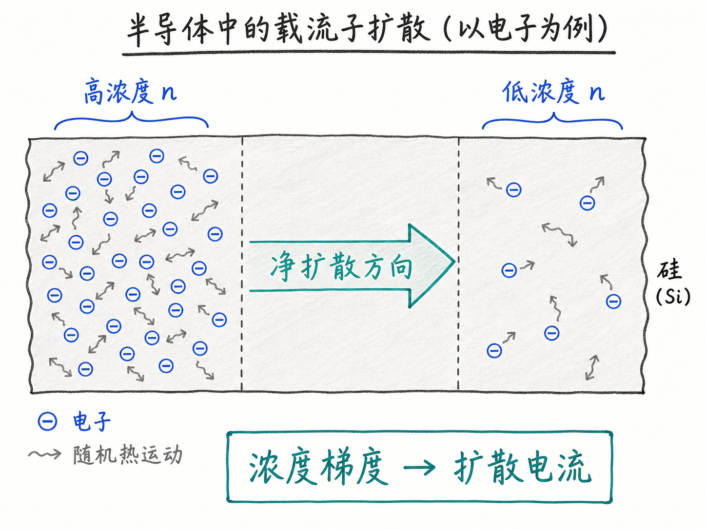
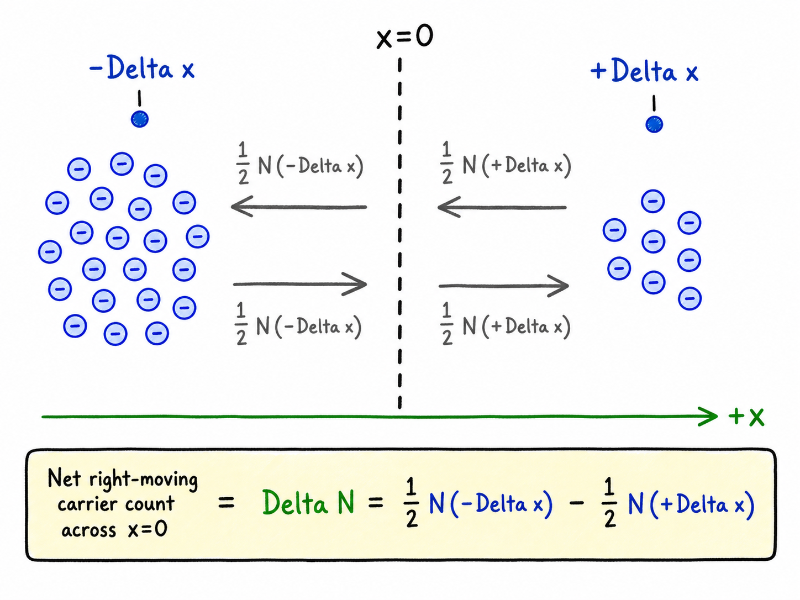
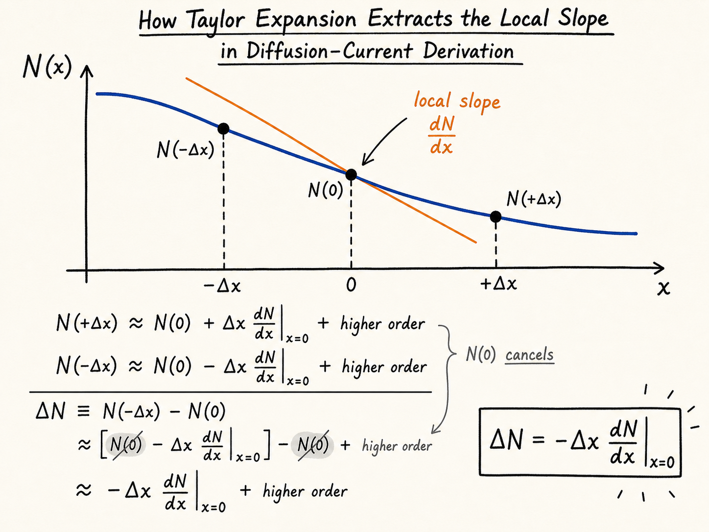
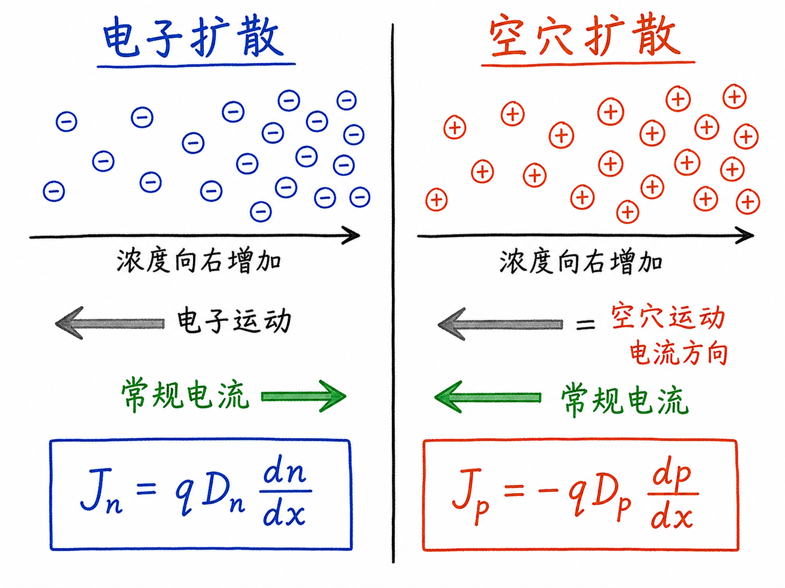

# 没有电场，为什么半导体里也会有电流？

我们很容易把“电流”想成电场推着载流子走：加一个电压，电子被拉过去，于是有电流。这就是上一讲的漂移电流。但半导体里还有另一种更安静、也更容易被忽略的电流：没有电场，只要电子或空穴分布不均匀，它们也会自己“摊开”，并在这个过程中形成电流。

这个机制叫扩散。它看起来像生活常识：一滴墨水滴进清水里，会慢慢散开；一边人很挤、一边很空，随机走动的人群也会逐渐变均匀。半导体里的电子和空穴也一样。区别只是，我们不只是说“它会散开”，而是要把“散开”变成一个能算电流的公式。

读完这篇，你会知道

- 为什么载流子浓度不均匀，本身就能产生电流
- Fick 定律在半导体里到底描述了什么
- 电子扩散电流为什么写成 $J_n=qD_n\frac{dn}{dx}$
- 空穴扩散电流为什么多一个负号，写成 $J_p=-qD_p\frac{dp}{dx}$
- 为什么漂移电流和扩散电流合起来，才是后续器件分析的底座

## 扩散不是“被电场推走”，而是“随机运动后的净结果”

先想一块硅。左边电子很多，右边电子较少。单个电子一直在做热运动，瞬间朝哪个方向跑是随机的。我们不能预测某个具体电子下一刻向左还是向右，但从统计上看，很多电子混在一起时，系统会朝“更均匀”的状态演化。

这就是扩散的本质：不是每个电子都知道右边更空，也不是电子被某个外力指定方向；而是高浓度一侧“可随机跑出来的电子”更多，所以穿过某个截面的净电子数会偏向低浓度一侧。

这个差别很关键。漂移电流的原因是电场，扩散电流的原因是浓度梯度。一个由力驱动，一个由分布不均匀驱动。真实器件里这两件事经常同时存在。

## 为什么要推导扩散电流

在理想图里，我们常把半导体画成均匀材料，好像电子浓度 $n$ 和空穴浓度 $p$ 到处一样。但真实器件不是这样。

PN 结附近有浓度梯度，掺杂分布可能不是阶跃，外加偏压会改变载流子分布，光照或注入也会让局部载流子浓度抬高。于是 $n$ 和 $p$ 往往是位置的函数，比如 $n(x)$、$p(x)$。它们可能是弯曲曲线，也可能接近指数衰减。

所以我们需要一个工具：只要知道浓度随位置怎么变，就能算出扩散带来的电流。这就是 Fick 定律在半导体里的价值。

## 先数电子：穿过中间平面的净流量

取一个位置 $x=0$，把它想成一张看不见的截面。左边一点是 $x=-\Delta x$，右边一点是 $x=+\Delta x$。我们只问一件事：单位时间内，有多少电子净向右穿过 $x=0$？

在一维简化下，某个位置的电子平均一半向左、一半向右。于是：

- 从左边 $x=-\Delta x$ 出发的电子，有一半会向右穿过 $x=0$
- 从右边 $x=+\Delta x$ 出发的电子，有一半会向左穿过 $x=0$

如果向右记为正方向，那么净向右通过的电子数就是：

$\Delta N=\frac{1}{2}N(-\Delta x)-\frac{1}{2}N(+\Delta x)$

这不是抽象数学，而是在数“左边向右过来的电子”减去“右边向左过来的电子”。如果左边电子更多，净流动就会向右；如果右边电子更多，净流动就会向左。

## Taylor 展开只是把“局部斜率”拿出来

现在要把上面的表达式变成一个可计算的公式。我们关心的是 $x=0$ 附近的局部变化，所以可以用 Taylor 展开：

$N(-\Delta x)\approx N(0)-\Delta x\frac{dN}{dx}$

$N(+\Delta x)\approx N(0)+\Delta x\frac{dN}{dx}$

代入净电子数表达式：

$\Delta N=\frac{1}{2}\left[N(0)-\Delta x\frac{dN}{dx}\right]-\frac{1}{2}\left[N(0)+\Delta x\frac{dN}{dx}\right]$

中间的 $N(0)$ 会抵消，剩下：

$\Delta N=-\Delta x\frac{dN}{dx}$

这一步的物理意思很干净：真正决定净扩散的，不是某一点的绝对电子数，而是它附近的斜率。浓度完全平坦时，左右随机穿过的电子数一样多，净扩散为零；浓度斜率越大，净扩散越强。

## 从“电子数流量”到“电流密度”

单位时间内净向右通过的电子数为：

$\frac{\Delta N}{\Delta t}=-\frac{\Delta x}{\Delta t}\frac{dN}{dx}$

扩散来自热运动，所以可以把 $\Delta t$ 理解为电子以热速度 $v_{th}$ 穿过这段距离所需的时间：

$\Delta t=\frac{\Delta x}{v_{th}}$

于是：

$\frac{\Delta N}{\Delta t}=-v_{th}\frac{dN}{dx}$

但器件分析里，我们通常不关心某一小块里总共有多少电子，而关心单位体积里的电子浓度 $n$。如果截面积为 $A$，小段长度为 $\Delta x$，体积就是 $A\Delta x$，总电子数可写为：

$N=nA\Delta x$

把它代入后，电子流量会与浓度梯度 $\frac{dn}{dx}$ 成正比。最后再乘上电子电荷。注意电子带负电，所以电子电流有一个 $-q$：

$I_n=-q\frac{\Delta N}{\Delta t}$

经过整理，写成电流密度 $J_n=I_n/A$ 后，得到：

$J_n=qD_n\frac{dn}{dx}$

这里的 $D_n$ 是电子扩散系数。它把热速度、平均自由程一类与扩散强弱相关的物理量合并起来，让公式更适合工程使用。

## 电子扩散电流的正号，不代表电子向正方向漂移

这个公式最容易让人困惑的是符号。电子扩散电流写成：

$J_n=qD_n\frac{dn}{dx}$

如果 $\frac{dn}{dx}>0$，意思是电子浓度沿着 $+x$ 方向增加，也就是右边电子更多。电子会从右往左扩散，电子本身的运动方向偏向 $-x$。但电子带负电，常规定义的电流方向与电子运动方向相反，所以电流密度 $J_n$ 反而是正的。

所以不要只盯着“电子往哪走”，要同时看“电流方向按正电荷方向定义”。电子扩散方向和电子电流方向经常是反着的。

## 空穴为什么是负号

空穴的推导过程完全类似，只是空穴带正电。空穴从高浓度往低浓度扩散时，空穴运动方向就是常规电流方向，因为空穴等效带正电。

最终空穴扩散电流密度写成：

$J_p=-qD_p\frac{dp}{dx}$

负号的来源可以这样理解：如果 $\frac{dp}{dx}>0$，说明右边空穴更多。空穴会从右往左扩散，也就是沿 $-x$ 方向运动。空穴带正电，所以电流也沿 $-x$，因此 $J_p$ 为负。

这里的 $D_p$ 是空穴扩散系数。它通常不等于 $D_n$，因为电子和空穴的输运性质不同。后面还会通过 Einstein 关系把扩散系数和迁移率联系起来。

## 漂移加扩散，才是器件里的真实电流

到这里，半导体里最基本的两种电流机制就齐了。

漂移电流来自电场：

- 电子被电场作用，形成 $J_{n,drift}$
- 空穴被电场作用，形成 $J_{p,drift}$

扩散电流来自浓度梯度：

- 电子扩散电流：$J_n=qD_n\frac{dn}{dx}$
- 空穴扩散电流：$J_p=-qD_p\frac{dp}{dx}$

这不是多背两个公式而已。它的真实作用，是让我们能分析 PN 结、二极管、BJT、MOS 器件里的载流子分布和电流来源。很多器件现象，本质上都是“电场想把载流子拉走”和“浓度梯度想让载流子摊开”之间的平衡。

## 最后收束：浓度梯度本身就是一种驱动力

扩散电流要解决的问题很直接：当半导体里的载流子不是均匀分布时，这种不均匀会自动带来多少电流？

电子的答案是：

$J_n=qD_n\frac{dn}{dx}$

空穴的答案是：

$J_p=-qD_p\frac{dp}{dx}$

记住这两个式子时，不要把它们当成孤立公式。它们背后的图像是：随机热运动一直存在；只要一边载流子更多，跨过任意截面的净流量就不会抵消。浓度梯度本身，就是半导体输运里的另一种驱动力。
