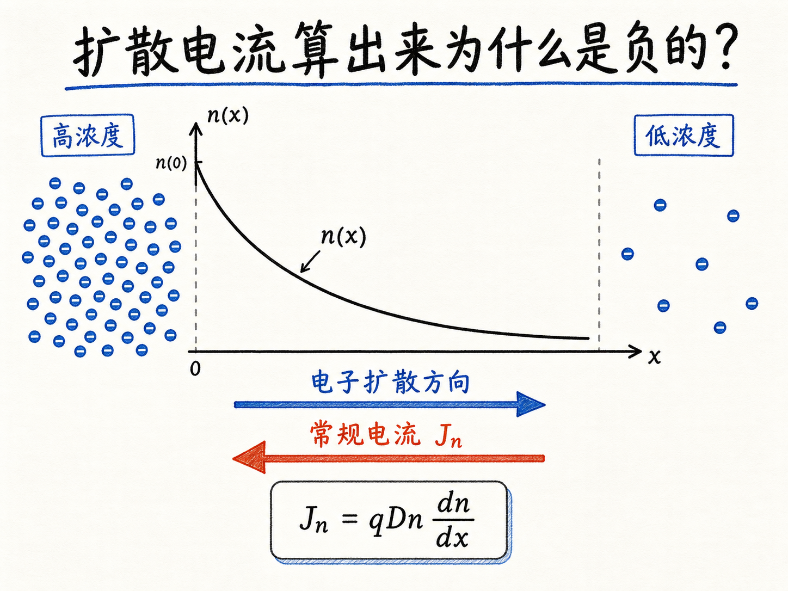
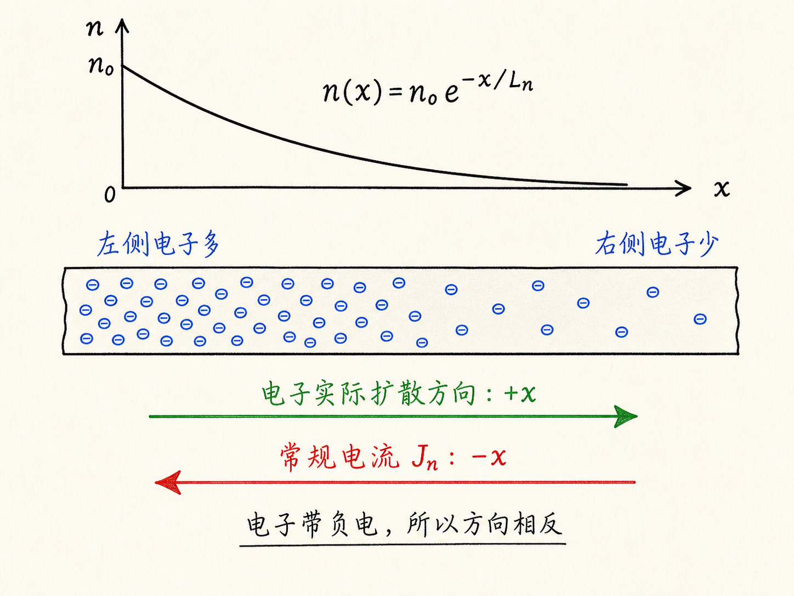
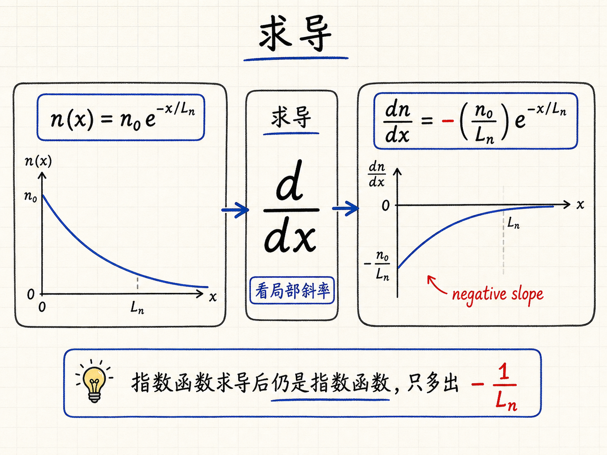
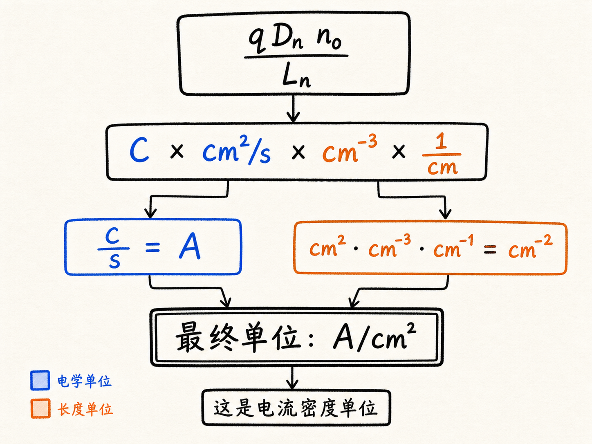
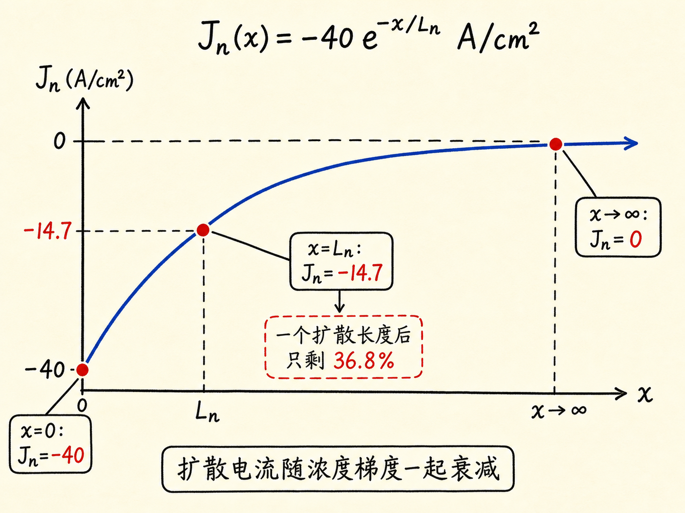

# 扩散电流算出来为什么是负的？

上一讲我们刚建立了电子扩散电流公式：$J_n=qD_n\frac{dn}{dx}$。公式看起来很短，但真正做题时，最容易出错的地方不是求导，而是符号、单位和物理图像三件事：为什么有时算出来是负电流？为什么单位会变成 $\text{A}/\text{cm}^2$？为什么电流也会指数衰减？

这篇就用一个具体例题把这三件事串起来。题目给出一个指数衰减的电子浓度分布，让我们算不同位置的电子扩散电流密度。它不是一个复杂题，但很适合检验你是不是真的理解了扩散电流，而不是只记住了公式。

读完这篇，你会知道

- 给定 $n(x)$ 后，怎样一步步算出电子扩散电流密度 $J_n$
- 为什么指数衰减的电子浓度会得到指数衰减的扩散电流
- 负号到底表示什么，不表示什么
- $\text{C}$、$\text{cm}^2/\text{s}$、$\text{cm}^{-3}$ 和 $\text{cm}$ 怎样合成 $\text{A}/\text{cm}^2$
- 为什么扩散电流变小后，器件里常常需要漂移电流来补上

## 题目真正给了什么

题目给出的电子浓度是：

$n(x)=10^{15}\ \text{cm}^{-3}\cdot e^{-x/L_n}$

这里 $n(x)$ 是电子浓度，单位是每立方厘米。它随 $x$ 增大而指数衰减，意思是越往右走，电子越少。

题目还给了两个参数：

$L_n=10^{-4}\ \text{cm}$

$D_n=25\ \text{cm}^2/\text{s}$

$L_n$ 是电子扩散长度，可以把它理解成这个指数衰减曲线的长度尺度。$D_n$ 是电子扩散系数，描述电子因为热运动和散射而扩散的强弱。

要求是求电子扩散电流密度 $J_n$，并分别算三个位置：

- $x=0$
- $x=10^{-4}\ \text{cm}$
- $x\to\infty$

## 先不要急着代数值，先把函数写干净

电子扩散电流公式是：

$J_n=qD_n\frac{dn}{dx}$

题目里的浓度函数可以先写成更简洁的形式：

$n(x)=n_0e^{-x/L_n}$

其中：

$n_0=10^{15}\ \text{cm}^{-3}$

这样写的好处是，前面那堆数值先不碰，先看结构。这个结构很简单：一个常数 $n_0$ 乘以一个指数函数 $e^{-x/L_n}$。

对它求导：

$\frac{dn}{dx}=-\frac{n_0}{L_n}e^{-x/L_n}$

这个负号非常重要。它来自浓度曲线的斜率：随着 $x$ 增大，$n(x)$ 下降，所以 $\frac{dn}{dx}$ 是负的。

## 代回公式，负号就出现了

把导数代入电子扩散电流公式：

$J_n=qD_n\left(-\frac{n_0}{L_n}e^{-x/L_n}\right)$

整理一下：

$J_n=-\frac{qD_nn_0}{L_n}e^{-x/L_n}$

这就是这个题的核心结果。它告诉我们两件事：

第一，电流密度前面有一个负号。

第二，电流密度也按 $e^{-x/L_n}$ 衰减。

这里的负号不应该被理解成“电子扩散错了方向”。电子浓度左高右低，电子本身会从左往右扩散。但电子带负电，常规定义的电流方向与电子运动方向相反，所以电子向右扩散，对应的电子电流密度是负方向。

也就是说，负号描述的是“常规电流方向”，不是电子粒子的实际运动方向。

## 把单位算清楚，比把数字算出来更重要

现在代入数值。电荷量为：

$q=1.6\times10^{-19}\ \text{C}$

所以常数项是：

$\frac{qD_nn_0}{L_n}=\frac{(1.6\times10^{-19})(25)(10^{15})}{10^{-4}}$

先看单位：

- $q$ 的单位是 $\text{C}$
- $D_n$ 的单位是 $\text{cm}^2/\text{s}$
- $n_0$ 的单位是 $\text{cm}^{-3}$
- $L_n$ 的单位是 $\text{cm}$

组合起来：

$\text{C}\cdot\frac{\text{cm}^2}{\text{s}}\cdot\text{cm}^{-3}\cdot\frac{1}{\text{cm}}$

$\text{cm}^2\cdot\text{cm}^{-3}\cdot\text{cm}^{-1}=\text{cm}^{-2}$

而 $\text{C}/\text{s}=\text{A}$，所以最终单位是：

$\text{A}/\text{cm}^2$

这正是电流密度的单位。这个检查很有价值，因为它能帮你发现很多公式写错或长度单位漏掉的问题。

数值上：

$\frac{(1.6\times10^{-19})(25)(10^{15})}{10^{-4}}=40$

因此：

$J_n=-40e^{-x/L_n}\ \text{A}/\text{cm}^2$

## 三个位置分别是多少

第一个位置是 $x=0$。这时指数项为：

$e^{-0/L_n}=1$

所以：

$J_n(0)=-40\ \text{A}/\text{cm}^2$

这表示在 $x=0$ 处，电子扩散导致的常规电流密度指向 $-x$ 方向，大小是 $40\ \text{A}/\text{cm}^2$。

第二个位置是 $x=10^{-4}\ \text{cm}$。因为题目给了 $L_n=10^{-4}\ \text{cm}$，所以这个位置刚好是 $x=L_n$。

代入：

$J_n(L_n)=-40e^{-1}\ \text{A}/\text{cm}^2$

由于 $e^{-1}\approx0.368$：

$J_n(L_n)\approx-14.7\ \text{A}/\text{cm}^2$

这说明走过一个扩散长度以后，扩散电流密度已经从 $40$ 降到了大约 $14.7$，只剩原来的 $36.8\%$。

第三个位置是 $x\to\infty$。这时：

$e^{-x/L_n}\to0$

所以：

$J_n(\infty)=0$

也就是说，离高浓度区域足够远以后，浓度梯度趋近于零，扩散电流也趋近于零。

## 为什么这里浓度和电流长得一样

这个例题有一个容易被忽略的点：电子浓度是指数函数，扩散电流也是指数函数。

原因不是“电流总是和浓度同形”，而是因为扩散电流看的是浓度的导数：

$J_n=qD_n\frac{dn}{dx}$

一般情况下，函数求导后形状可能会变。例如线性函数求导变成常数，二次函数求导变成一次函数。但指数函数很特殊，它求导以后仍然是指数函数，只是前面多出一个常数因子和负号。

所以在这个题里，$n(x)$ 和 $J_n(x)$ 都按 $e^{-x/L_n}$ 衰减。它们不是同一个量，但共享同一个空间衰减尺度 $L_n$。

## 这个例题在器件里意味着什么

如果只看这个浓度分布，扩散电流会随着距离越来越小。靠近 $x=0$ 的地方，浓度梯度大，扩散电流强；往右走，浓度越来越低，曲线越来越平，扩散电流也越来越弱。

但真实器件里，经常还要求总电流保持连续。比如一个稳态器件中，某一截面不能凭空积累无限多电荷，总电流通常不能随便断掉。那如果扩散电流一路变小，剩下的电流从哪里来？

答案通常是漂移电流补上。漂移电流来自电场，扩散电流来自浓度梯度。在很多半导体器件里，我们真正要理解的是两者如何分工：哪里是浓度梯度主导，哪里是电场主导，哪里两者互相抵消或共同贡献。

所以这个例题不是只在练一个数字。它在训练一个更重要的判断：看到一个载流子分布 $n(x)$，你能不能立刻把曲线斜率、电流方向、单位和器件物理联系起来。

## 最后收束：先看斜率，再看电荷符号

这道题可以压缩成一句话：

给定 $n(x)=n_0e^{-x/L_n}$，电子扩散电流为：

$J_n=-\frac{qD_nn_0}{L_n}e^{-x/L_n}=-40e^{-x/L_n}\ \text{A}/\text{cm}^2$

于是：

- $J_n(0)=-40\ \text{A}/\text{cm}^2$
- $J_n(L_n)=-14.7\ \text{A}/\text{cm}^2$
- $J_n(\infty)=0$

记这个题时，别只记结果。先看浓度曲线的斜率：它向右下降，所以导数为负。再看电子带负电：电子运动方向和常规电流方向相反。最后检查单位：扩散系数、浓度和长度尺度合起来，必须给出 $\text{A}/\text{cm}^2$。

能把这三件事同时讲清楚，才算真的会算扩散电流。
