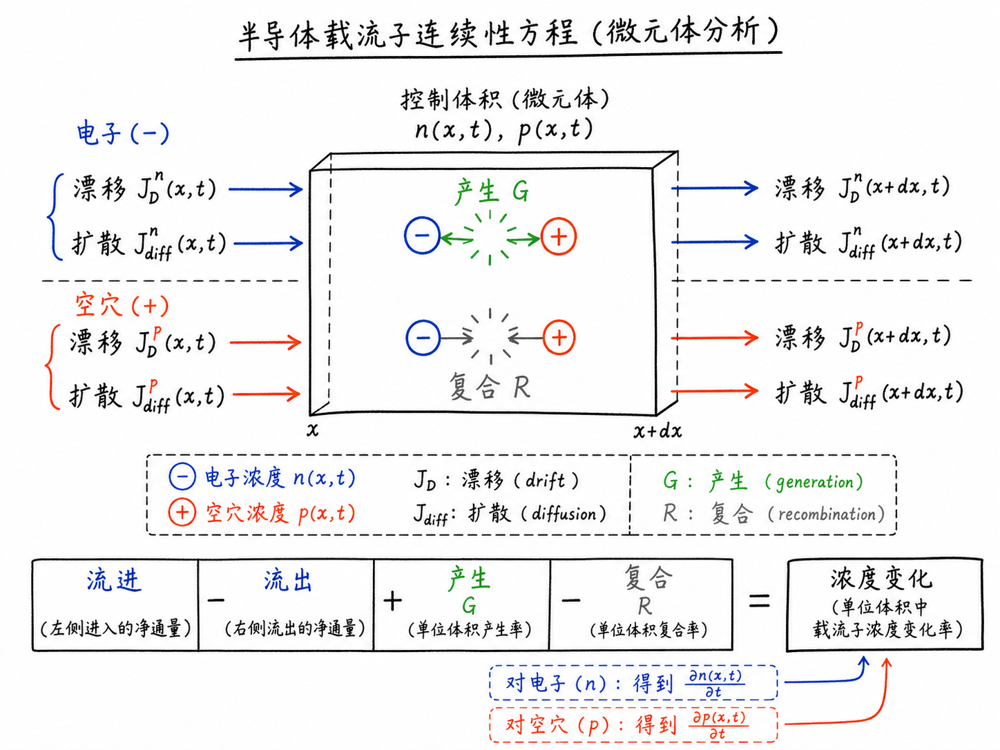
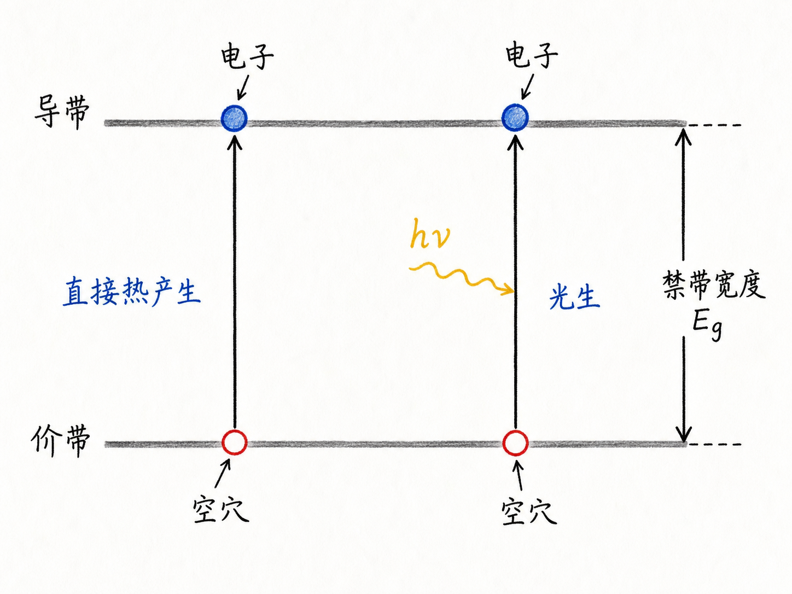
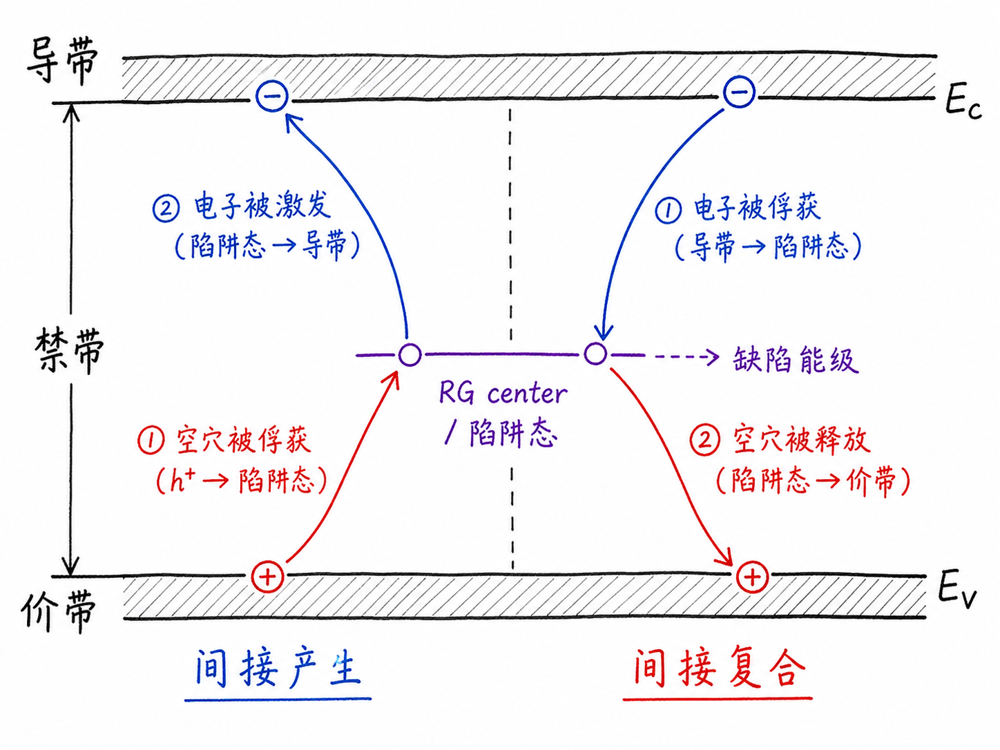
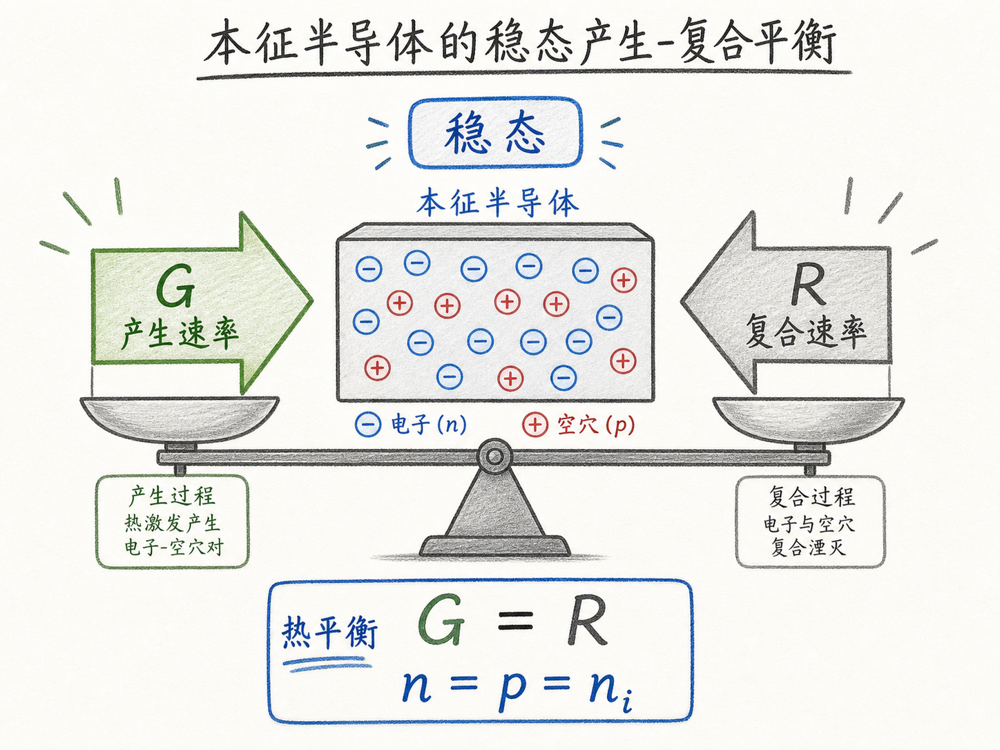

# 复合与产生：连续性方程缺的最后两块拼图

前面讲漂移电流和扩散电流时，我们一直在追问同一个问题：半导体里的电子和空穴，为什么会从一个地方跑到另一个地方？但只盯着“跑动”还不够。真实器件里还有另一个更根本的问题：电子和空穴的总数本身也会变化。

这就是连续性方程真正要处理的事。它不是只问载流子怎么流，而是问某个位置、某个时刻的载流子浓度为什么会增加或减少。漂移和扩散解释“流进流出”，复合与产生解释“凭空多出来”和“凭空少掉”。少了这两块，连续性方程就只能描述搬运，不能描述生命循环。

读完这篇，你会知道

- 为什么硅在室温下会自然产生电子-空穴对
- 产生为什么不只来自温度，也可以来自光
- 复合为什么必须存在，否则硅晶格会走向荒谬结果
- RG center、陷阱态和禁带缺陷在产生/复合中扮演什么角色
- 为什么这些机制最终要被写进连续性方程

## 先把问题摆正：浓度变化不只来自电流

如果我们想描述电子浓度 $n(x,t)$ 和空穴浓度 $p(x,t)$，就不能只看电流。电流只能告诉我们载流子从哪里来、往哪里去。例如漂移电流 $J_D$ 来自电场，扩散电流 $J_{diff}$ 来自浓度梯度。

但还有一种变化不是“从旁边搬过来”的，而是在本地发生的：一个电子-空穴对被创造出来，或者一个电子和一个空穴一起消失。

这两类过程分别叫产生和复合。它们是连续性方程里的源项和损耗项。没有它们，方程就像一张只记录物流运输的账，却没有记录仓库里的生产和报废。

## 产生：打破一个键，就多出一对载流子

先看最干净的起点：$T=0K$ 的硅。

在这个理想状态下，硅原子之间形成共价键，电子都被束缚在晶格里。没有电子跑到导带里自由运动，也没有空穴留下来。换句话说，没有可导电的自由电子，也没有可导电的空穴。

温度升高以后，晶格和电子系统获得热能。有些电子拿到足够能量，就能从原来的共价键中挣脱出来，进入导带。它离开的地方留下一个空位，这个空位表现得像带正电的粒子，也就是空穴。

于是一次事件同时制造出两个东西：一个自由电子，一个空穴。这就是电子-空穴对的产生。

最重要的是，产生不是“电子从外面被塞进来”，而是半导体内部的键被能量打断后，导电载流子成对出现。对本征硅来说，这个图像尤其关键，因为它解释了为什么即使没有掺杂，室温下仍然会有本征载流子浓度 $n_i$。

## 直接热产生：电子一跳就到导带

第一种产生机制是直接热产生。

可以把价带和导带想成两层楼。价带里的电子原本待在低能层；只要热能足够，它就可以直接跨过禁带，从价带跳到导带。它到了导带以后可以导电，价带里留下的空穴也可以参与导电。

这个过程可以简单理解为：

价带电子获得能量，直接跃迁到导带，留下空穴。

如果用能带语言说，就是一个电子从价带直接激发到导带。这里没有中转站，只有一次跨越。

## 间接热产生：缺陷能级像中途驿站

真实硅晶格不可能完美。缺陷、杂质、晶格不完整都会在禁带中引入少量本来不该有的能级。这些能级常被称为陷阱态，也和复合-产生中心有关，英文里常写作 RG center。

有了这些中间能级，电子不一定非要一次跨过整个禁带。它可以先从价带跳到禁带中的某个陷阱态，再从这个中间态跳到导带。

这就是间接热产生。

这个机制的关键不是“缺陷很多”，而是“少量缺陷也能显著改变路径”。对器件工程来说，这一点非常现实。晶体质量、缺陷密度、界面态、深能级陷阱，都会影响载流子的产生与复合，从而影响漏电、寿命、光响应和可靠性。

## 光生：光子也能打断键

产生的第三条重要路径是光生。

如果入射光子的能量足够高，它就能把价带电子激发到导带。这个条件本质上与禁带宽度有关：光子能量要足以完成跃迁。电子被激发后进入导带，价带留下空穴，于是又得到一对电子-空穴对。

这就是光电探测器、太阳能电池和很多光敏半导体器件的底层起点。光不是只“照亮”材料，而是在半导体内部创造可分离、可收集、可形成电流的载流子。

## 如果只有产生，硅会走向荒谬

现在做一个反推：如果产生一直发生，而没有任何机制消灭电子和空穴，会发生什么？

越来越多的共价键被打断，越来越多的电子跑到导带，越来越多的空穴留在价带。照这个趋势推下去，最后硅晶格中的键会被不断破坏，载流子数量不断累积，材料似乎会失去稳定结构。

但现实中，一块硅放在室温房间里不会这样。它不会自发把所有键都打断，也不会因为热产生而无限积累电子和空穴。

这说明系统里一定存在一个反向过程：把自由电子和空穴重新消掉。

这个过程就是复合。

## 复合：电子和空穴相遇后一起退出导电

想象一个很大的硅块，里面只有少量自由电子和少量空穴。它们相隔很远，彼此遇见的概率很低。随着电子和空穴越来越多，相遇概率就会上升。

当一个自由电子遇到一个空穴，电子可以回到价带，填补那个空位。结果是电子不再是导带里的自由电子，空穴也不再存在。两者一起退出导电过程。

能量不会凭空消失。复合释放出的能量可以以光子的形式出现，常写成 $hf$ 或 $h\nu$。在直接带-带复合中，这个光子的能量大约等于禁带宽度。

所以复合不是“电子被删除”，而是电子回到低能状态，空穴被填补，导电载流子对消失。

## 稳态：产生和复合互相抵住

在热平衡的本征半导体中，产生和复合会达到稳态。

稳态不是没有事情发生，而是两件事以相同速率同时发生：电子-空穴对不断产生，电子和空穴也不断复合。宏观看起来浓度不变，微观上一直有交换。

因此本征半导体在热平衡下满足：

电子浓度约为 $n_i$，空穴浓度也约为 $n_i$。

这里的 $n_i$ 不是凭空来的数字，而是热产生与复合平衡后的结果。温度、材料禁带宽度和有效态密度都会影响它。对于器件工程，这个平衡决定了许多“底噪”：漏电从哪里来，暗电流为什么存在，少子寿命为什么重要。

## 直接复合：从导带直接回到价带

复合机制与产生机制是一一对应的。

直接热复合，也叫带-带复合，是最直观的一种。导带中的自由电子失去能量，直接回到价带，填补一个空穴。电子不再导电，空穴也消失。

这个过程释放的能量大约等于禁带宽度。若能量以光子形式释放，就会对应辐射复合。发光二极管正是利用类似思想：让电子和空穴复合，把电能转成光。

当然，不同材料中直接复合的效率差别很大。硅是间接带隙材料，直接发光效率并不好；这也是为什么硅适合做电子器件，却不是最自然的高效发光材料。

## 间接复合：陷阱态帮助电子和空穴相遇

间接复合依赖禁带中的陷阱态。

电子可以先从导带掉到一个陷阱态，再从陷阱态回到价带并填补空穴。这个中间态就像一个“接力点”，让原本不容易直接相遇的电子和空穴通过两步过程完成复合。

每一步都会释放一定能量，能量大小由相关能级差决定。最终结果仍然一样：导带电子消失，价带空穴被填补，载流子数量减少。

这类复合在真实器件里特别重要。因为陷阱态往往来自缺陷、杂质、界面质量或工艺损伤。一个看似微小的缺陷分布，可能会明显改变少子寿命、反向漏电、光生载流子收集效率，以及高温下的稳定性。

## 为什么它们必须进入连续性方程

现在可以回到连续性方程。

如果只考虑漂移和扩散，我们只能描述载流子如何因为电场和浓度梯度移动。但只要有温度、光照、缺陷或非平衡注入，载流子就会在本地被产生，也会在本地复合。

所以连续性方程必须同时回答三件事：

- 有多少载流子流进或流出这个位置
- 有多少载流子在这个位置被产生
- 有多少载流子在这个位置被复合掉

这就是为什么漂移电流、扩散电流、产生和复合要放在同一个框架里。它们合在一起，才能描述 $n(x,t)$ 和 $p(x,t)$ 如何变化。

一旦能描述这些浓度如何随位置和时间变化，我们就能进一步计算电流、电压、瞬态响应、光响应和器件的非平衡行为。对 BCD、功率器件、光电器件或任何有 PN 结的结构来说，这不是抽象数学，而是预测器件行为的入口。

## 最后收束：连续性方程是在给载流子记账

复合与产生最容易被当成两个新名词，但它们真正回答的是一个记账问题：载流子从哪里来，又到哪里去？

产生让电子和空穴成对出现，复合让它们成对退出导电。漂移和扩散负责搬运，产生和复合负责增减。连续性方程把这些过程写成一张统一的账。

下一步，就是把这张账写成微分方程。到那时，我们就不只是能说“电子会移动、空穴会复合”，而是能计算某个位置、某个时刻到底有多少载流子，以及它们如何决定真实半导体器件的电流和电压。
