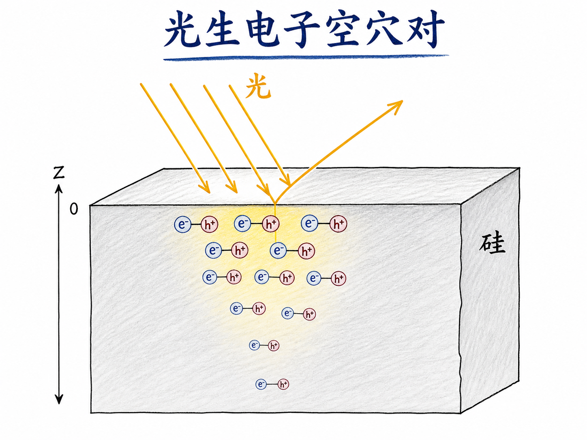
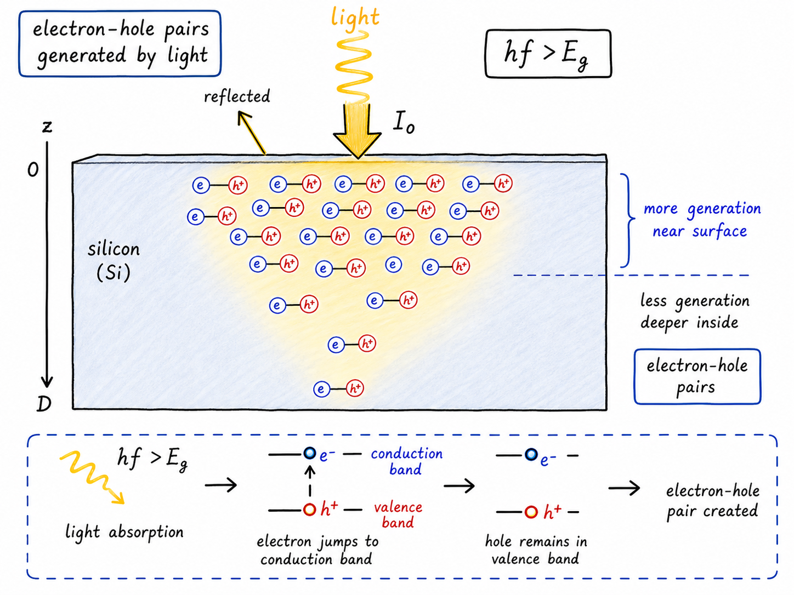
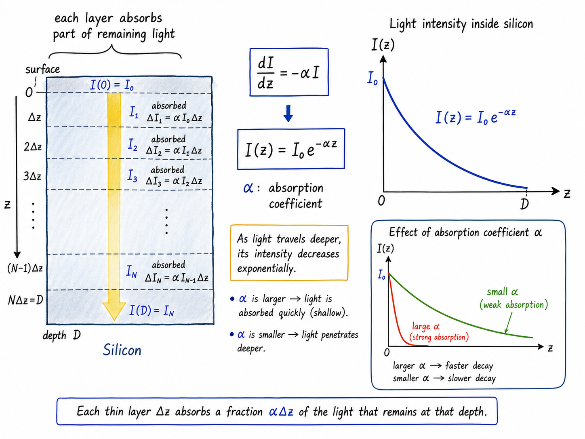
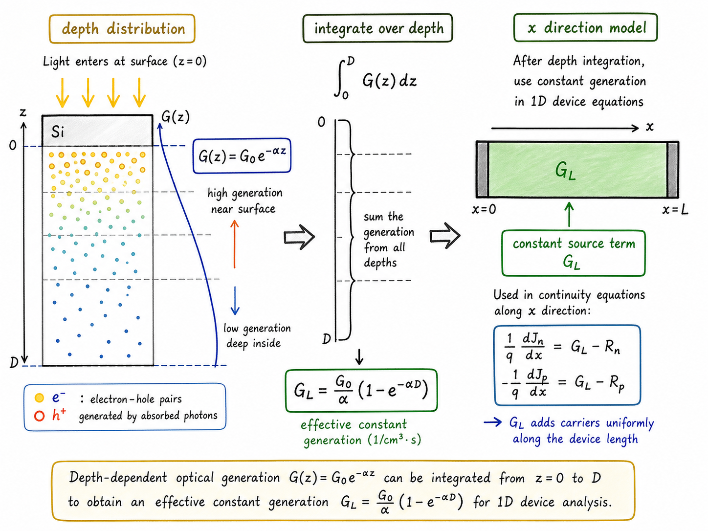

# 光照进硅片后，电子和空穴是怎样被“造”出来的？

一束光照到硅片表面，肉眼看起来只是“亮了一下”。但在半导体里，这束光可能正在做一件非常关键的事：把价带里的电子抬到导带里，同时留下一个空穴。也就是说，光不仅带来能量，还能直接改变材料里的载流子数量。

这件事是光电二极管、太阳能电池、CMOS 图像传感器和很多光敏器件的底层机制。工程上真正要问的不是“光会不会产生电子-空穴对”，而是：产生在哪里？产生多少？能不能写成一个可以放进器件方程里的 $G$？

读完这篇，你会知道

- 为什么光进入硅后，光强会随深度指数衰减
- 吸收系数 $\alpha$ 到底在描述什么
- 为什么光子能量必须满足 $hf>E_g$ 才能有效产生电子-空穴对
- 局部产生率 $G(z)=G_0 e^{-\alpha z}$ 是怎么来的
- 为什么很多器件题目可以把光生产生率简化成常数 $G_L$

## 光不是均匀地“洒”在整块硅里

先想一块硅片，光从上表面照进去。光到达硅表面时，并不是全部进入材料内部。一部分会被反射，一部分才会透射进硅。把真正进入硅的那部分初始光强记为 $I_0$。

这里最重要的方向不是横向的 $x$，而是从表面往下的深度方向 $z$。因为光是从上方打进去的，它在材料里走得越深，被前面的硅吸收得越多，剩下的光就越少。

所以，硅内部的光强不是一个常数，而是随深度衰减：

$I(z)=I_0 e^{-\alpha z}$

这个式子看起来像一个数学结论，但它背后的物理图像很简单：每往下走一小层，硅都会从当前剩余的光里吃掉一部分。

## 指数衰减来自“当前有多少，就吸收多少的一部分”

把硅想象成很多薄层。第一层看到的光强最大，所以吸收得多；第二层接收到的是被第一层削弱后的光，所以吸收得少一点；越往下，光越弱，每一层能吸收的绝对量也越少。

这个过程可以写成一个微分方程：

$\frac{dI}{dz}=-\alpha I$

左边表示光强沿深度的变化率。右边的负号表示光强在减少；$\alpha$ 是吸收系数，表示材料对这个频率的光有多“能吃”。$\alpha$ 越大，光在很浅的位置就被吸收掉；$\alpha$ 越小，光能走得更深。

这个方程的解就是：

$I(z)=I_0 e^{-\alpha z}$

所以指数衰减不是凭空来的。它来自一个很朴素的规则：某一层吸收多少，取决于走到这一层时还剩多少光。

## 不是所有光子都能产生电子-空穴对

光进入硅以后，并不意味着每个光子都一定能制造载流子。要产生一个电子-空穴对，光子必须有足够能量，把一个电子从价带激发到导带。

这个条件写成：

$hf>E_g$

这里 $h$ 是普朗克常数，$f$ 是光的频率，$E_g$ 是硅的禁带宽度。意思是：一个光子的能量 $hf$ 必须大于材料的能隙 $E_g$。如果能量不够，电子跨不过价带到导带之间的能量台阶，也就不能形成自由电子和空穴。

一旦能量足够，一个被吸收的光子就有机会把一个电子抬上导带。电子上去了，价带里缺出来的位置就是空穴。于是，光吸收和载流子产生就被联系起来了。

## 从光强到产生率：$G(z)$ 也会随深度衰减

既然电子-空穴对来自被吸收的光子，而光强又随深度衰减，那么光生产生率也应该随深度衰减。

可以先写成：

$G(z)=K I_0 e^{-\alpha z}$

这里 $K$ 把“光强”转换成“电子-空穴对产生率”。它包含了光子数、吸收和量子效率一类因素。为了让式子更简洁，通常把 $K I_0$ 合并为 $G_0$：

$G(z)=G_0 e^{-\alpha z}$

这就是光生产生的局部分布。它告诉我们：靠近表面的地方光强大，产生率高；越往深处，光被吸收得越多，新的电子-空穴对产生得越少。

这个式子对光敏器件非常重要。因为它不是只告诉你“总共产生了多少载流子”，而是告诉你“载流子主要在哪里被产生”。位置不同，后续能不能被电场收集、会不会先复合掉，结果都可能不同。

## 为什么有时可以把光生产生率看成常数

很多一维器件题目关心的是 $x$ 方向，比如从左到右的载流子分布、电流和边界条件。但这次光是从上表面照进去的，主要变化方向是 $z$。如果我们不想解析深度方向，只想得到对 $x$ 方向有效的产生项，就可以把 $z$ 方向的产生率积分掉。

假设硅片深度为 $D$，则深度方向的等效光生产生率可以写成：

$G_L=\int_0^D G_0 e^{-\alpha z}\,dz$

积分结果是：

$G_L=\frac{G_0}{\alpha}\left(1-e^{-\alpha D}\right)$

这个 $G_L$ 不再随 $x$ 变化。它是一个等效常数，表示在深度方向吸收和产生之后，对横向器件方程而言可以使用的光生产生项。

这一步的意义很实际：如果光照方向和你正在求解的器件方向不同，就不一定要把完整的三维分布都带进方程。把深度方向合并掉，问题会简单很多。

## 什么时候不能简化成常数

如果光不是从上方照入，而是从侧面照入，情况就变了。此时光沿 $x$ 方向进入材料，光强和产生率也会沿 $x$ 方向衰减。

这时就不能把产生率简单当成常数，而要保留：

$G(x)=G_0 e^{-\alpha x}$

然后把这个位置相关的 $G(x)$ 放进载流子连续性方程或相关微分方程中。

这就是为什么题目里“光从哪里照进来”不是画图细节，而是决定方程形式的关键条件。上表面照入，常常可以得到等效常数 $G_L$；侧面照入，就可能必须保留空间分布 $G(x)$。

## 对器件分析的影响：光生成项会进入后面的连续性方程

到这里，我们已经把“光照产生电子-空穴对”变成了可以计算的形式：

$G(z)=G_0 e^{-\alpha z}$

或者在深度方向积分后，使用常数：

$G_L=\frac{G_0}{\alpha}\left(1-e^{-\alpha D}\right)$

这两个式子解决的是同一个问题的两个层次。$G(z)$ 保留了深度分布，适合分析光在哪里被吸收；$G_L$ 把深度效应合并成一个总的产生项，适合放进简化的一维器件模型。

后面真正要建立的是更完整的半导体方程：电流、复合和产生同时存在。光生载流子只是其中的一个输入项，但它会改变电子浓度和空穴浓度，进而改变电流、复合以及器件响应。

## 最后收束：光照不是背景条件，而是载流子来源

光照进硅片后，首先发生的是光强衰减；只要光子能量满足 $hf>E_g$，被吸收的光就能产生电子-空穴对。因此，光生产生率自然继承了光强的指数分布。

要记住的核心不是某一个孤立公式，而是这条因果链：

光进入材料 $\rightarrow$ 光强按 $e^{-\alpha z}$ 衰减 $\rightarrow$ 足够能量的光子激发电子跨越禁带 $\rightarrow$ 形成电子-空穴对 $\rightarrow$ 产生率写成 $G(z)$ 或等效的 $G_L$。

这就是把“光照”从一个外部现象，变成半导体器件方程里一个可计算产生项的过程。

