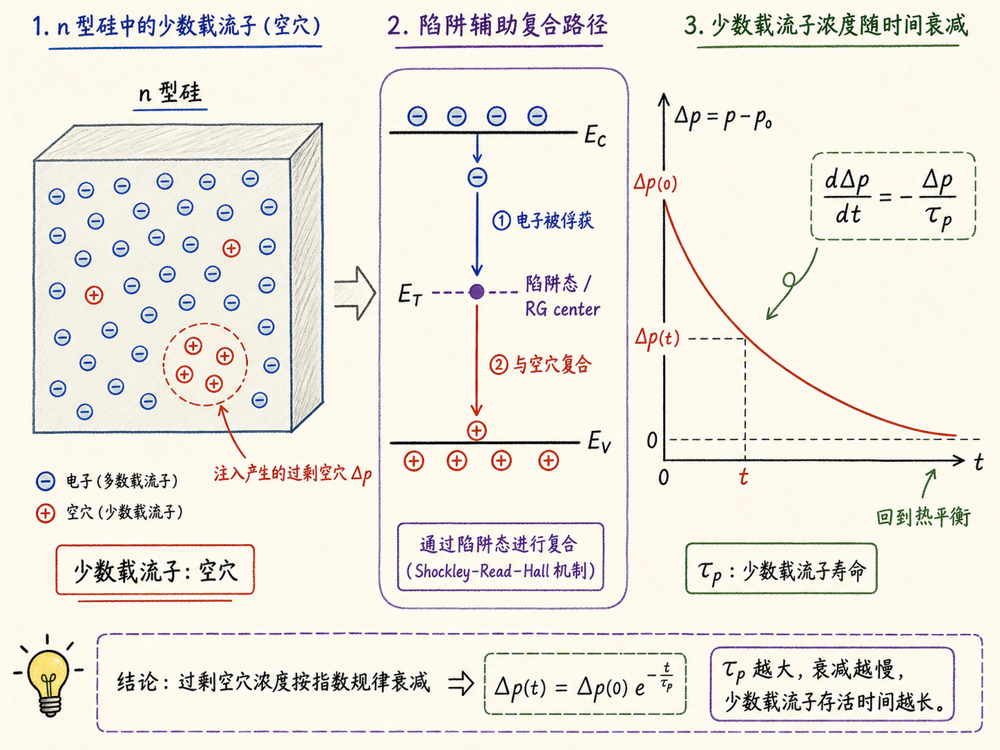
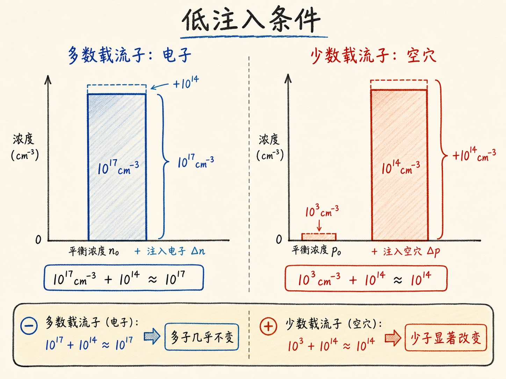
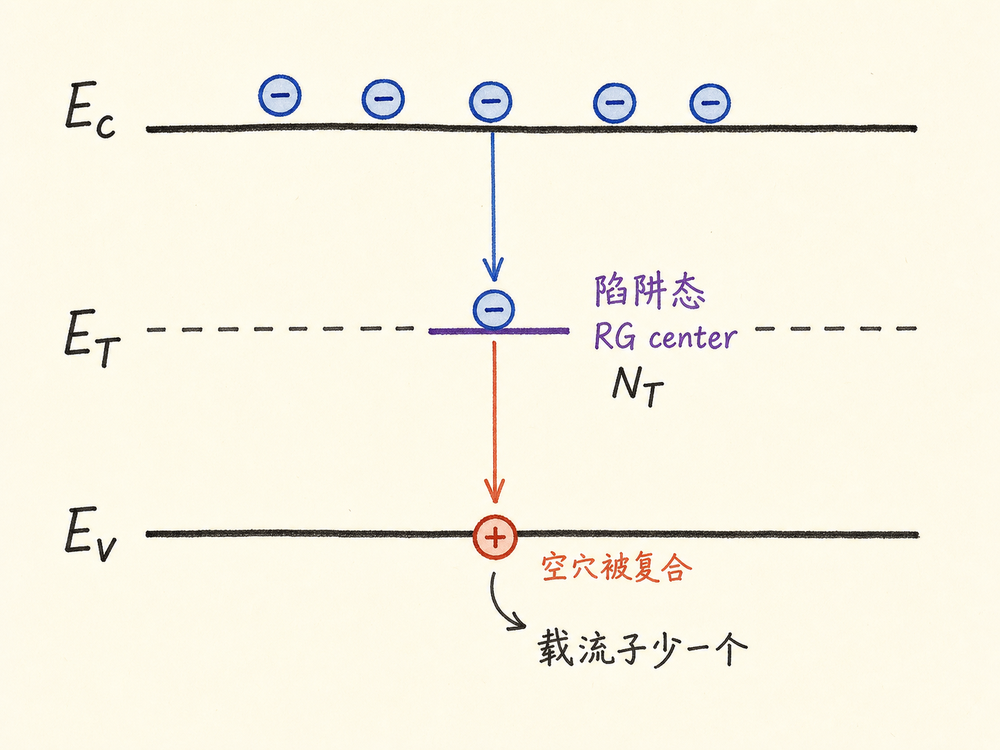
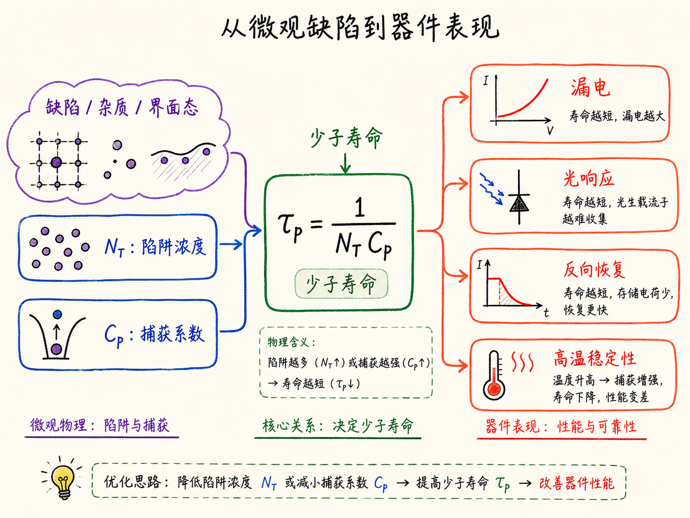

# 热复合与产生：少子寿命为什么会变成一个微分方程

如果往一块 n 型硅里突然打入一批空穴，过一会儿它们会怎么样？直觉上可以说：它们会复合掉。但器件工程不能只停在这句话。我们真正需要的是一个能算的答案：这些多出来的空穴会以多快的速度消失？多久以后回到平衡？这个速度由什么决定？

这就是热复合与产生要解决的问题。它把“缺陷导致复合”这件事，从能带图上的一条箭头，变成一个可以放进连续性方程里的时间项。最后得到的形式非常简单：少数载流子的偏离量会按自己的寿命衰减。

读完这篇，你会知道

- 为什么这节课专门分析间接热复合，而不是一开始就写最一般的模型
- n 型半导体里为什么要盯着空穴，而不是盯着数量最多的电子
- 陷阱态、RG center 和缺陷为什么会决定复合速率
- 低注入条件到底简化了什么
- 少子寿命 $\tau_p$ 和 $\tau_n$ 为什么能把复杂微观过程压缩成可测参数

## 为什么先看间接热复合

上一节已经讲过光照可以产生电子-空穴对。现在换一个来源：热过程。即使没有光，只要温度不是绝对零度，半导体内部也会有热激发、复合和产生。

这节重点不是直接带-带过程，而是通过禁带中缺陷能级发生的间接过程。这个缺陷能级常被叫作陷阱态，也常与复合-产生中心有关，英文里写作 RG center。

为什么先讲它？因为在很多真实半导体器件里，间接复合/产生往往比理想的直接过程更关键。硅晶格不可能完美，金属杂质、晶格缺陷、界面态、工艺损伤，都可能在禁带里引入本来不该有的能级。只要禁带中多了这些中间站，电子和空穴就不一定非要一次跨完整个禁带，它们可以通过陷阱态完成两步式复合或产生。

对器件工程来说，这不是抽象小修正。陷阱态会影响少子寿命、反向漏电、暗电流、光响应和高温稳定性。很多时候，器件表现出来的“慢”“漏”“漂”，背后都和这些缺陷相关。

## 为什么从 n 型半导体开始

如果目标是建立方程，第一步不是把所有情况都塞进去，而是选一个能解开的入口。

n 型半导体就是这样的入口。它的费米能级靠近导带，导带里有大量电子。粗略看，电子浓度 $n_0$ 近似等于施主浓度 $N_D$。空穴则很少，因为热平衡下有

$$n_0 p_0 = n_i^2$$

所以

$$p_0 = \frac{n_i^2}{N_D}$$

掺杂越强，电子越多，空穴的平衡浓度就越低。

这时如果我们直接研究电子，会遇到一个麻烦：电子太多，很多扰动对它的相对变化并不明显。相反，空穴虽然少，但一旦被注入或产生，变化会非常显著。于是 n 型半导体里更值得盯住的是空穴，也就是少数载流子。

这个选择的本质是可处理性。少子方程在低注入条件下可以变成线性微分方程。线性意味着能解，能解才有工程价值。

## 平衡时：产生和复合必须刚好抵消

先从热平衡开始。

在热平衡下，空穴浓度就是 $p_0$。如果系统真的处于平衡，那么空穴数量不应该随时间变化：

$$\frac{dp}{dt}=0$$

但这不表示内部什么都没发生。更准确地说，是产生和复合同时发生，并且速率刚好相等。产生在制造空穴，复合在消灭空穴，两者抵住以后，宏观浓度才保持不变。

用微分方程的语言说：

$$\left.\frac{dp}{dt}\right|_R = -\left.\frac{dp}{dt}\right|_G$$

其中 $R$ 是 recombination，$G$ 是 generation。

这句话很重要。热平衡不是静止，而是动态平衡。

## 陷阱态怎么吃掉空穴

在 n 型半导体里，费米能级靠近导带。禁带中较低位置的陷阱态如果存在，通常很容易被电子占据。也就是说，很多陷阱里面已经“坐着”一个电子。

当一个空穴靠近这样的陷阱态时，可以用两种等价图像理解复合：

- 空穴和陷阱里那个电子复合
- 陷阱里的电子跳回价带，填补空穴

两种说法看起来不同，结果一样：一个空穴消失，一个能导电的载流子少了。

那么复合速率应该和什么有关？

第一，它应该和陷阱浓度 $N_T$ 成正比。陷阱越多，空穴遇到复合机会的概率越大。

第二，它应该和空穴浓度 $p$ 成正比。空穴越多，发生复合的机会越多。

第三，还有很多微观细节，比如捕获截面、热速度、能级位置、统计占据概率。我们不打算每次都展开量子力学和统计力学，于是把这些细节压进一个比例常数 $C_p$。

因此在热平衡下，复合项可以写成

$$\left.\frac{dp}{dt}\right|_R = -N_T p_0 C_p$$

负号表示空穴被消灭。

既然平衡时总变化为零，产生项就必须是它的相反数：

$$\left.\frac{dp}{dt}\right|_G = N_T p_0 C_p$$

这一步看似简单，其实是在给后面的非平衡方程定基准：平衡产生率由平衡复合率反推出来。

## 非平衡时：只有复合项跟着空穴浓度变

现在让系统离开平衡。

假设我们往 n 型半导体里额外加入一些电子和空穴。现实里可能是光照、热扰动、PN 结注入，或者其他外部激发。为了有数量感，可以想象额外加入 $10^{14}\ \text{cm}^{-3}$ 的电子和空穴。

如果原来电子浓度是 $10^{17}\ \text{cm}^{-3}$，加上 $10^{14}$ 以后，电子总数几乎还是 $10^{17}$ 这个量级，变化很小。可是如果原来空穴只有 $10^2$ 或 $10^3\ \text{cm}^{-3}$，加上 $10^{14}$ 以后，空穴浓度就被彻底改变了。

这就是低注入条件：

多数载流子浓度几乎不变，少数载流子浓度显著改变。

低注入的价值在于，它让产生项和复合项的处理变得很干净。

产生项仍然近似保持平衡时的值：

$$\left.\frac{dp}{dt}\right|_G = N_T p_0 C_p$$

原因是自发热产生不取决于当前已经有多少空穴。热过程会按照材料、温度、缺陷状态给出自己的产生速率。

复合项不同。复合需要空穴遇到被电子占据的陷阱态。空穴越多，复合机会越多。因此非平衡时复合项要用当前空穴浓度 $p$：

$$\left.\frac{dp}{dt}\right|_R = -N_T p C_p$$

把两者相加：

$$\frac{dp}{dt} = -N_T p C_p + N_T p_0 C_p$$

整理：

$$\frac{dp}{dt} = -N_T C_p (p-p_0)$$

这里自然出现了一个新量：

$$\Delta p = p - p_0$$

它表示空穴浓度相对于热平衡值多出来的部分，也就是超额少数载流子浓度。

于是方程变成：

$$\frac{d\Delta p}{dt} = -N_T C_p \Delta p$$

它说的不是“空穴越多，越快消失”这么粗糙，而是更精确地说：真正会衰减的是偏离平衡的那部分空穴。

## 少子寿命：把复杂微观过程压成一个时间常数

$N_T C_p$ 的单位是 $1/\text{s}$。它表示一个速率。工程上更常用它的倒数：

$$\tau_p = \frac{1}{N_T C_p}$$

于是 n 型半导体中的少子空穴方程写成最熟悉的形式：

$$\frac{d\Delta p}{dt} = -\frac{\Delta p}{\tau_p}$$

这就是少子寿命进入方程的方式。

$\tau_p$ 不是凭空定义的符号。它把陷阱浓度、捕获概率和微观复合机制折算成一个可测的时间尺度。$\tau_p$ 越短，多出来的空穴越快被复合掉；$\tau_p$ 越长，少子能存在更久，扩散得更远，也更可能被电场收集。

这对器件影响很直接：

- 在光电探测器里，寿命影响光生载流子能否被收集
- 在功率器件里，寿命影响导通压降、反向恢复和开关损耗
- 在漏电机制里，陷阱辅助产生会抬高暗电流和反向电流
- 在高温工作中，产生/复合平衡会改变本底载流子和可靠性窗口

少子寿命看起来只是一个参数，实际上是缺陷工程、工艺质量和器件动态行为之间的桥。

## p 型材料只是把角色换过来

如果材料换成 p 型，逻辑完全一样，只是少数载流子从空穴换成电子。

p 型半导体里，空穴是多数载流子，电子是少数载流子。我们关心的是电子浓度偏离平衡的部分：

$$\Delta n = n - n_0$$

对应方程是

$$\frac{d\Delta n}{dt} = -\frac{\Delta n}{\tau_n}$$

这里 $\tau_n$ 是电子少子寿命。

所以要记住一个容易反直觉的点：分析 n 型材料时，常常看空穴；分析 p 型材料时，常常看电子。因为真正决定非平衡恢复过程的，往往是少数载流子，而不是数量最多的载流子。

## 最后收束：少子方程是在描述“回到平衡”的速度

热复合与产生这节课真正建立的不是一张更复杂的能带图，而是一个恢复平衡的模型。

热平衡时，产生和复合互相抵消。离开平衡后，产生项近似保持基准，复合项跟着少子浓度变化，于是多出来的少子会按寿命衰减：

$$\frac{d\Delta p}{dt} = -\frac{\Delta p}{\tau_p}$$

或

$$\frac{d\Delta n}{dt} = -\frac{\Delta n}{\tau_n}$$

这两个式子是后面处理扩散长度、瞬态响应、光生载流子收集、PN 结恢复过程的入口。器件里很多看似复杂的动态现象，第一步都是先问：少数载流子偏离平衡多少？它们会以多快的速度回去？

能回答这两个问题，复合与产生就不再只是概念，而变成了可以计算器件行为的工程语言。
