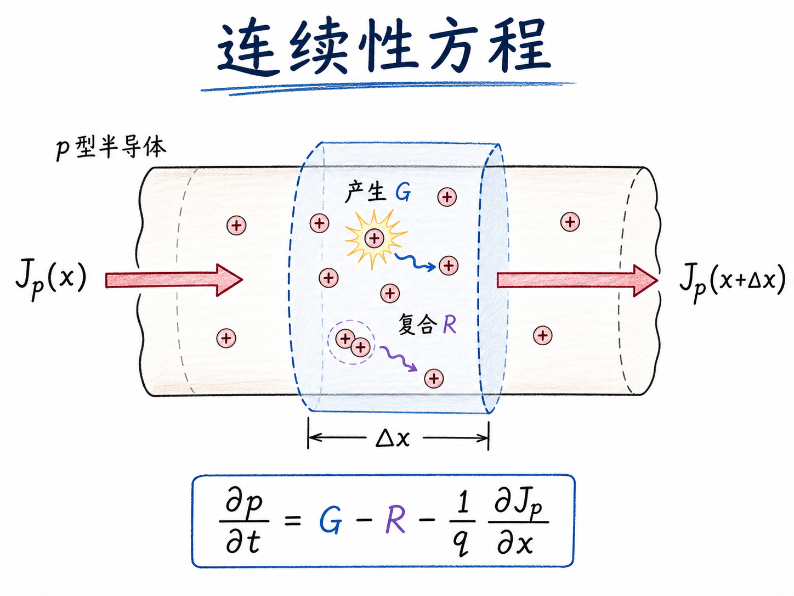
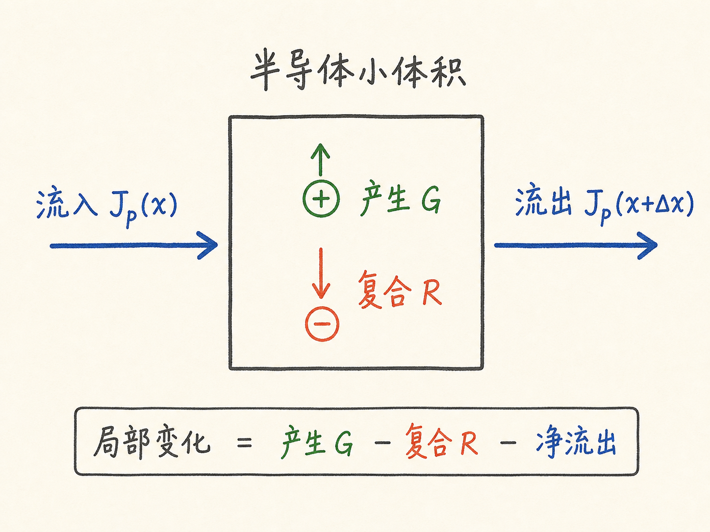
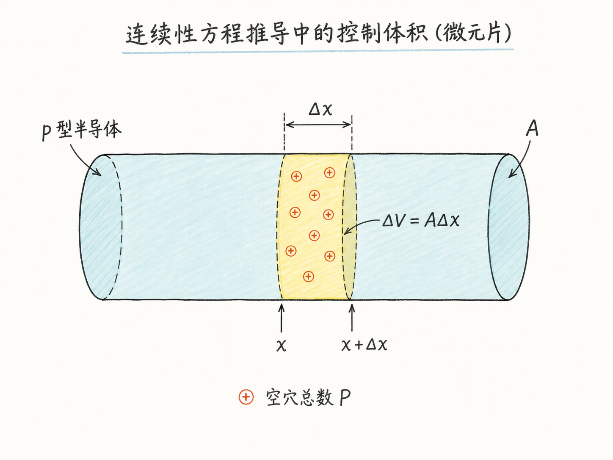
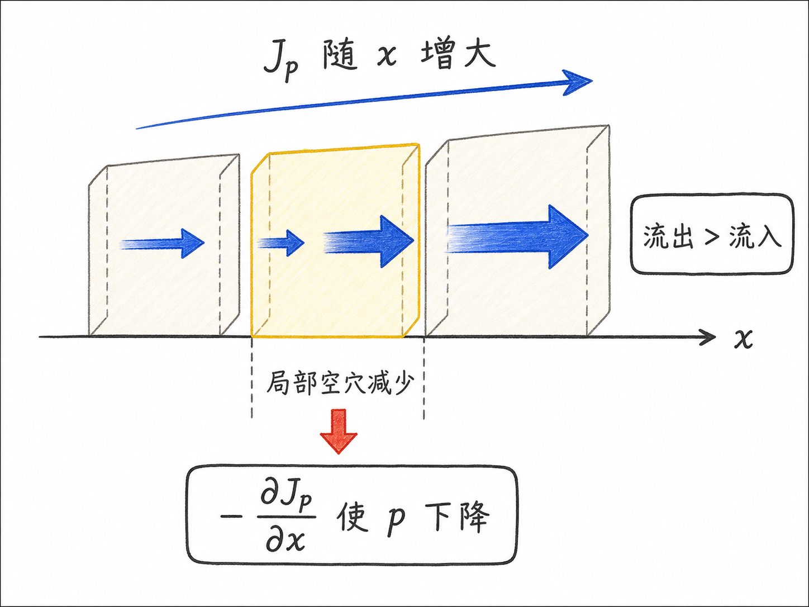

# 连续性方程到底在守住什么？

如果一块半导体里的空穴浓度突然在某个位置“跳变”，这个画面其实很可疑。载流子不是魔法粒子，不能在材料内部凭空消失，也不能从另一个地方瞬移过来。某个小区域里的空穴变多或变少，背后一定有账可查：要么有空穴流进来，要么有空穴流出去，要么电子空穴对被产生，要么它们发生复合。

连续性方程做的事情，就是把这本账写成一个局部守恒方程。它不先问“这是漂移还是扩散”，也不先问“是不是光照产生”。它先问一个更本质的问题：在一个很小的体积里，载流子数量随时间变化，究竟由哪几类入口和出口决定？

读完这篇，你会知道

- 为什么连续性方程不是新物理，而是一张载流子收支表
- 为什么推导时先看一个厚度为 $\Delta x$ 的小薄片
- 产生、复合和电流流入流出分别怎样进入方程
- 为什么电流项最后会变成 $-\frac{1}{q}\frac{\partial J_p}{\partial x}$
- 为什么后续还要把方程改写成关于 $\Delta p$ 的形式

## 先别急着背方程：先问空穴为什么会变

我们先看 p 型半导体里的空穴，这样可以少处理电子负电荷带来的符号麻烦。想象一根半导体圆柱，横截面积是 $A$。从里面切出一个很薄的小片，厚度是 $\Delta x$，所以这个小片的体积是

$$
\Delta V=A\Delta x
$$

这个小片里有多少空穴？先不要急着用浓度，而是先用大写 $P$ 表示空穴总数。这样做的好处是直观：我们先数“这个小盒子里一共有多少个空穴”，再把它除以体积变成浓度。

于是核心问题变成：

$$
\frac{dP}{dt}=\text{什么？}
$$

也就是，这个小片里的空穴总数为什么会随时间改变？

答案只有两大类。

第一类是在体积内部发生的事：产生和复合。产生率 $G$ 会让空穴变多，复合率 $R$ 会让空穴变少。因为 $G$ 和 $R$ 通常是单位体积内的速率，所以对这个小片来说，它们贡献的是

$$
G\Delta V-R\Delta V
$$

第二类是在边界上发生的事：电流把空穴带进来，或者带出去。

## 小片左边进、右边出：电流项就是边界账

设小片左边界在位置 $x$，右边界在 $x+\Delta x$。空穴电流密度记作 $J_p$。

左边界的 $J_p(x)$ 如果指向小片内部，就会把空穴带进来。电流密度乘以面积 $A$，得到通过整个截面的电流；再除以单个空穴电荷量 $q$，就把“电荷流”换成了“空穴个数的流”。所以左边界贡献是

$$
\frac{J_p(x)A}{q}
$$

右边界的 $J_p(x+\Delta x)$ 是从小片流出去的空穴流，它会减少小片里的空穴数，所以是

$$
-\frac{J_p(x+\Delta x)A}{q}
$$

把体积内部的产生复合项和边界上的流入流出项合在一起，就得到空穴总数的收支表：

$$
\frac{dP}{dt}
=G\Delta V-R\Delta V
+\frac{J_p(x)A}{q}
-\frac{J_p(x+\Delta x)A}{q}
$$

这一步已经是推导的关键。后面的数学整理只是把这张收支表写成更通用的局部形式。

## 从“总数”变成“浓度”：把任意小片消掉

工程上更常用的是浓度 $p$，不是总数 $P$。总数依赖你选了多大的小片；浓度才是局部物理量。

所以我们把上式两边都除以小片体积 $\Delta V=A\Delta x$。产生和复合项很直接：

$$
\frac{G\Delta V}{\Delta V}-\frac{R\Delta V}{\Delta V}=G-R
$$

电流项也除以 $A\Delta x$，面积 $A$ 会被约掉，剩下的是

$$
\frac{1}{q}\frac{J_p(x)-J_p(x+\Delta x)}{\Delta x}
$$

因此得到

$$
\frac{\partial p}{\partial t}
=G-R+\frac{1}{q}\frac{J_p(x)-J_p(x+\Delta x)}{\Delta x}
$$

这里写成偏导数，是因为浓度 $p$ 本来就是时间和位置的函数。

## 电流项为什么带负号：看的是右边比左边多多少

现在让 $\Delta x$ 趋近于 0。最后那一项看起来像导数，但方向要看清楚：

$$
\frac{J_p(x)-J_p(x+\Delta x)}{\Delta x}
=-\frac{J_p(x+\Delta x)-J_p(x)}{\Delta x}
$$

当 $\Delta x\to 0$，它变成

$$
-\frac{\partial J_p}{\partial x}
$$

于是空穴连续性方程就是

$$
\frac{\partial p}{\partial t}
=G-R-\frac{1}{q}\frac{\partial J_p}{\partial x}
$$

这个负号很重要。它说的是：如果沿着 $x$ 方向，空穴电流密度越来越大，也就是右边流出去的比左边流进来的更多，那么这个小片会失去空穴，局部空穴浓度就下降。反过来，如果电流在空间上越来越小，说明流出少于流入，空穴会在这个区域堆积。

这就是连续性方程最直观的读法：

$$
\text{局部浓度变化}
=\text{产生}-\text{复合}-\text{净流出}
$$

它不是一个孤立公式，而是载流子守恒的账本。

## 为什么下一步要写成 $\Delta p$

上面的方程还不是最常用的最终形态。后面通常还要做两件事。

第一，把 $J_p$ 展开。空穴电流不是一个黑箱，它来自漂移和扩散。漂移来自电场，扩散来自浓度梯度。把 $J_p$ 展开后，连续性方程才会真正连接到器件里的电场、浓度分布和材料参数。

第二，把 $p$ 改写成相对于平衡态的变化量 $\Delta p$。原因很简单：平衡态本身通常没什么动态信息。在平衡态，没有净运动，方程最后只是告诉你 $0=0$。真正有用的是偏离平衡之后，多出来或少掉的那部分载流子怎样扩散、漂移、复合。

所以后续会把问题写成

$$
p=p_0+\Delta p
$$

其中 $p_0$ 是平衡空穴浓度，$\Delta p$ 是额外扰动。这样做的意义是，当 $\Delta p$ 远小于或远大于平衡浓度时，很多项可以近似，方程就可能变成可求解的形式。

## 最后收束：连续性方程守的是“载流子不能凭空变账”

连续性方程的核心不是背下

$$
\frac{\partial p}{\partial t}
=G-R-\frac{1}{q}\frac{\partial J_p}{\partial x}
$$

而是记住它背后的收支逻辑：一个小区域里的空穴数量发生变化，一定来自体积内部的产生复合，或者来自边界上的净流入净流出。

对半导体器件来说，这个视角很关键。二极管、光电器件、BJT、MOS 器件里的很多动态行为，本质上都可以回到同一个问题：载流子在哪里被产生，在哪里被复合，又沿着什么路径被电场和浓度梯度带走。连续性方程就是把这些过程放进同一本账里。

