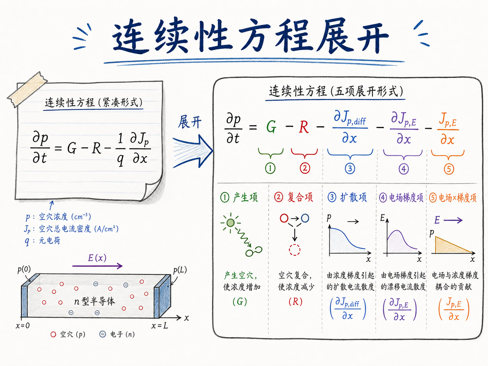
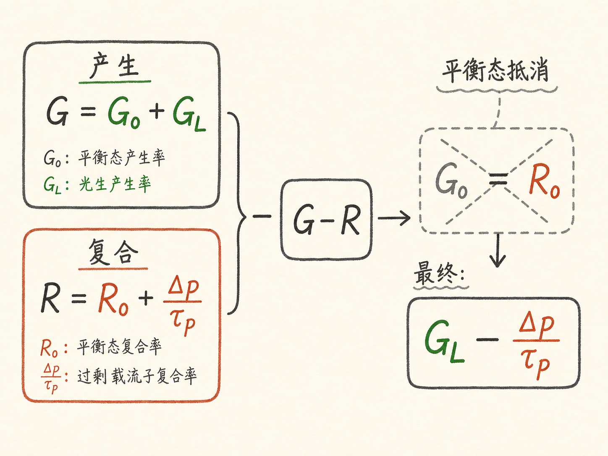
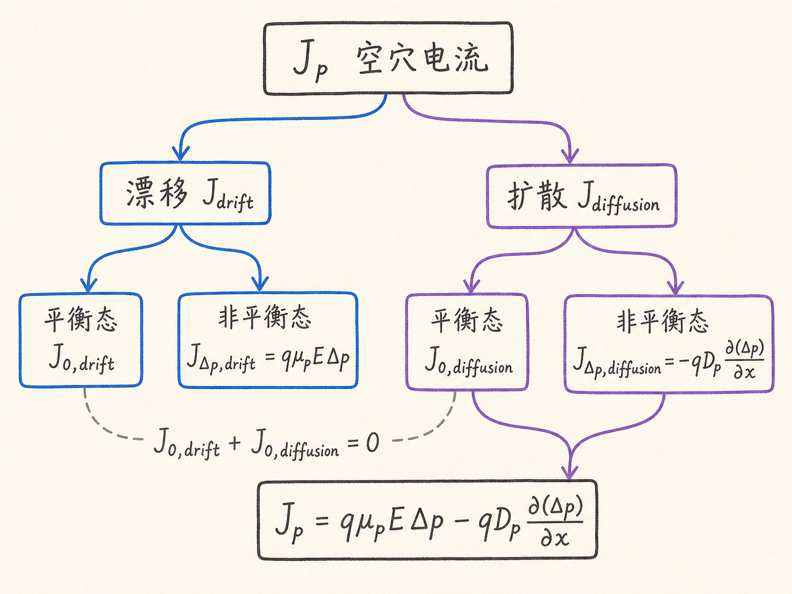
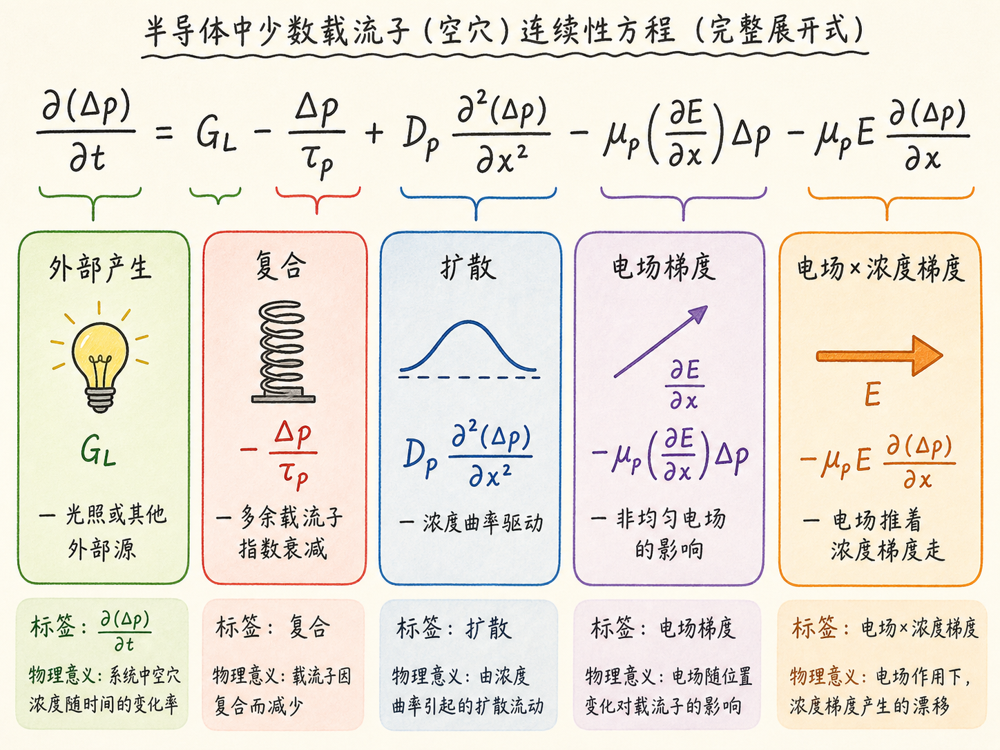

# 连续性方程展开以后，每一项在说什么？

上一讲我们拿到了连续性方程的骨架：

$$
\frac{\partial p}{\partial t}=G-R-\frac{1}{q}\frac{\partial J_p}{\partial x}
$$

它是一张载流子收支表：局部空穴浓度随时间的变化，等于产生减去复合，再减去净流出。这个骨架是对的，但它还不能直接用——$G$、$R$、$J_p$ 都还是黑箱。要让这个方程真正能算器件，必须把每个黑箱拆开，露出里面的材料参数、电场和浓度。

这篇就是做这件事：把骨架展开成一个每一项都能读出物理意义的完整方程。

读完这篇，你会知道

- 为什么 $G-R$ 展开后，平衡态部分会自动抵消
- 空穴电流为什么能拆成漂移和扩散，又为什么要进一步拆成平衡态和非平衡态
- 为什么最终方程要用 $\Delta p$ 而不是 $p$ 来写
- 空穴连续性方程展开后的五个项分别代表什么
- 电子连续性方程和空穴的唯一区别在哪里

## 产生减复合：平衡态自己会抵消

先处理 $G-R$。产生率 $G$ 可以拆成两部分：

$$
G=G_0+G_L
$$

$G_0$ 是平衡态下的热产生率，$G_L$ 是外部光源引起的额外产生。复合率 $R$ 也类似：

$$
R=R_0+\frac{\Delta p}{\tau_p}
$$

$R_0$ 是平衡态复合率，$\Delta p/\tau_p$ 是多出来的载流子带来的额外复合。$\tau_p$ 是空穴的平均寿命，$\Delta p$ 越大，复合越快——这就是前面视频里说的"弹簧"模型。

把两个展开式代入 $G-R$：

$$
G-R=(G_0-R_0)+G_L-\frac{\Delta p}{\tau_p}
$$

关键来了：$G_0$ 和 $R_0$ 在平衡态下必须相等。原因不是什么数学巧合，而是平衡态的定义——如果没有外部扰动，载流子浓度不随时间变化，所以净产生必须为零。于是 $G_0-R_0=0$，剩下：

$$
G-R=G_L-\frac{\Delta p}{\tau_p}
$$

这个结果说明一件事：在连续性方程里，平衡态的产生和复合是"看不见"的。它们一直在发生，但互相抵消，只有偏离平衡态的那部分才会影响方程。这也是为什么后面要用 $\Delta p$ 而不是 $p$ 的一个伏笔。

## 空穴电流：先拆成漂移和扩散

接下来看 $J_p$。空穴电流来自两个物理机制：

$$
J_p=J_{p,\text{drift}}+J_{p,\text{diffusion}}
$$

漂移电流是空穴在电场作用下的定向运动。电场越强、空穴越多、迁移率越高，漂移电流就越大。扩散电流是空穴因为浓度不均匀而自发扩散。浓度梯度越陡，扩散越强。

这两个机制的公式我们都已经知道：

$$
J_{p,\text{drift}}=q\mu_p E p
$$

$$
J_{p,\text{diffusion}}=-qD_p\frac{dp}{dx}
$$

但这里有一个问题：公式里的浓度是总浓度 $p$，而我们想用 $\Delta p$。怎么办？

## 再拆一层：平衡态电流和非平衡态电流

把漂移和扩散各自再拆成平衡态和非平衡态两部分：

$$
J_{p,\text{drift}}=J_{p0,\text{drift}}+J_{\Delta p,\text{drift}}
$$

$$
J_{p,\text{diffusion}}=J_{p0,\text{diffusion}}+J_{\Delta p,\text{diffusion}}
$$

看起来拆得很碎，但有一个关键约束：在平衡态下，半导体内部没有净电流。这不是说漂移和扩散各自为零——它们各自可以不为零——但它们加起来必须为零。否则平衡态下就有电荷在净流动，那就不是平衡了。

所以：

$$
J_{p0,\text{drift}}+J_{p0,\text{diffusion}}=0
$$

这意味着总电流里，平衡态部分互相抵消，只剩下非平衡态部分：

$$
J_p=J_{\Delta p,\text{drift}}+J_{\Delta p,\text{diffusion}}
$$

把非平衡漂移和扩散的公式写出来：

$$
J_{\Delta p,\text{drift}}=q\mu_p E\Delta p
$$

$$
J_{\Delta p,\text{diffusion}}=-qD_p\frac{\partial(\Delta p)}{\partial x}
$$

注意这里浓度已经变成了 $\Delta p$，不是 $p$。电场 $E$ 仍然是总电场，扩散系数 $D_p$ 也不变。变化的只是浓度这个变量。

合并：

$$
J_p=q\mu_p E\Delta p-qD_p\frac{\partial(\Delta p)}{\partial x}
$$

这个表达式比原始的 $J_p$ 干净很多。它说的是：在非平衡态下，空穴电流只取决于多出来的那部分空穴 $\Delta p$ 怎么漂移、怎么扩散。

## 把方程左边也换成 $\Delta p$

展开完 $G-R$ 和 $J_p$，还要处理方程左边。原来写的是 $\partial p/\partial t$，现在把 $p=p_0+\Delta p$ 代入：

$$
\frac{\partial p}{\partial t}=\frac{\partial p_0}{\partial t}+\frac{\partial(\Delta p)}{\partial t}
$$

平衡态浓度 $p_0$ 不随时间变化，所以 $\partial p_0/\partial t=0$，左边就变成 $\partial(\Delta p)/\partial t$。

## 展开电流项的导数：乘积法则登场

现在把展开后的 $J_p$ 代回连续性方程的电流项：

$$
-\frac{1}{q}\frac{\partial J_p}{\partial x}=-\frac{1}{q}\frac{\partial}{\partial x}\left(q\mu_p E\Delta p-qD_p\frac{\partial(\Delta p)}{\partial x}\right)
$$

$q$ 约掉。扩散项的导数很直接：

$$
D_p\frac{\partial}{\partial x}\frac{\partial(\Delta p)}{\partial x}=D_p\frac{\partial^2(\Delta p)}{\partial x^2}
$$

这是 $\Delta p$ 对 $x$ 的二阶导数，描述扩散的"曲率"。

漂移项麻烦一点。$E$ 和 $\Delta p$ 都可能是 $x$ 的函数，所以必须用乘积法则：

$$
-\mu_p\frac{\partial}{\partial x}(E\Delta p)=-\mu_p\frac{\partial E}{\partial x}\Delta p-\mu_p E\frac{\partial(\Delta p)}{\partial x}
$$

## 完整的空穴连续性方程

把所有项合在一起：

$$
\frac{\partial(\Delta p)}{\partial t}
=G_L-\frac{\Delta p}{\tau_p}
+D_p\frac{\partial^2(\Delta p)}{\partial x^2}
-\mu_p\frac{\partial E}{\partial x}\Delta p
-\mu_p E\frac{\partial(\Delta p)}{\partial x}
$$

这个方程有五项，每一项都有明确的物理角色：

- $G_L$：外部产生，比如光照。没有光照时这一项为零。
- $-\Delta p/\tau_p$：复合。多出来的载流子按指数衰减回平衡态。
- $D_p\,\partial^2(\Delta p)/\partial x^2$：扩散。浓度分布的弯曲程度决定扩散是"填坑"还是"削峰"。
- $-\mu_p(\partial E/\partial x)\Delta p$：电场梯度项。如果电场在空间上不均匀，它会影响载流子的漂移。
- $-\mu_p E\,\partial(\Delta p)/\partial x$：电场中的浓度梯度项。电场把有浓度梯度的载流子"推着走"。

实际器件里，这五项很少全部同时出现。没有光照就没有 $G_L$，均匀电场就没有 $\partial E/\partial x$，均匀掺杂且无电场时漂移项全为零。所以这个方程虽然看起来吓人，但在具体问题中通常会大幅简化。

## 电子的连续性方程：符号反过来

电子的连续性方程形式和空穴完全对应，唯一的区别是漂移项的符号：

$$
\frac{\partial(\Delta n)}{\partial t}
=G_L-\frac{\Delta n}{\tau_n}
+D_n\frac{\partial^2(\Delta n)}{\partial x^2}
+\mu_n\frac{\partial E}{\partial x}\Delta n
+\mu_n E\frac{\partial(\Delta n)}{\partial x}
$$

为什么符号相反？因为电子带负电。在同样的电场方向下，电子的漂移方向和空穴相反。扩散项的符号不变，因为扩散只看浓度梯度的方向，和电荷正负无关。

## 最后收束：从收支表到可解方程

回头看整个推导过程。Part 1 建了一张收支表：产生、复合、电流流入流出。Part 2 把这张表的每一项都拆开，换成 $\Delta p$、电场 $E$ 和材料参数 $\mu_p$、$D_p$、$\tau_p$ 的组合。

为什么要费这么大劲？因为原始方程里的 $p$ 包含平衡态浓度 $p_0$，而 $p_0$ 不参与任何动态过程。它就像一个水池的底水位——你关心的是水位变化了多少，而不是底水位本身。换成 $\Delta p$ 以后，方程里每一项都直接对应偏离平衡态的物理过程，没有多余的常数项拖着。

这就是连续性方程的最终形态。有了它，再配合能带图，我们已经有足够的工具去分析真实的半导体器件——从下一个视频的 PN 结开始。
