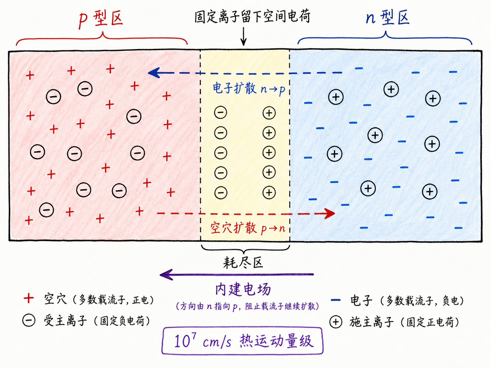
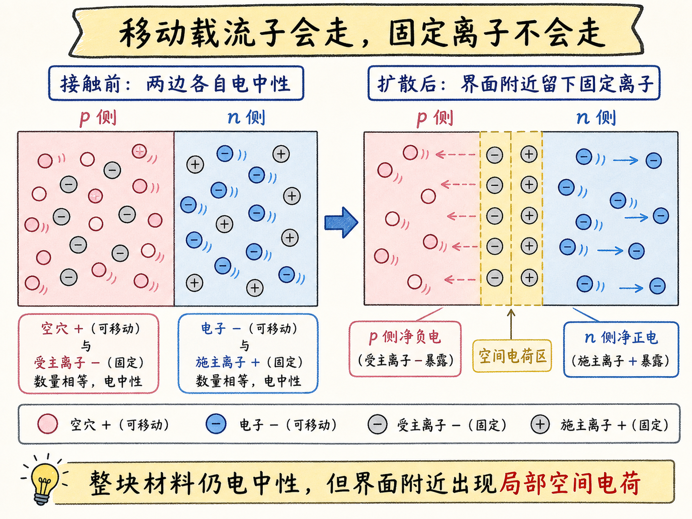
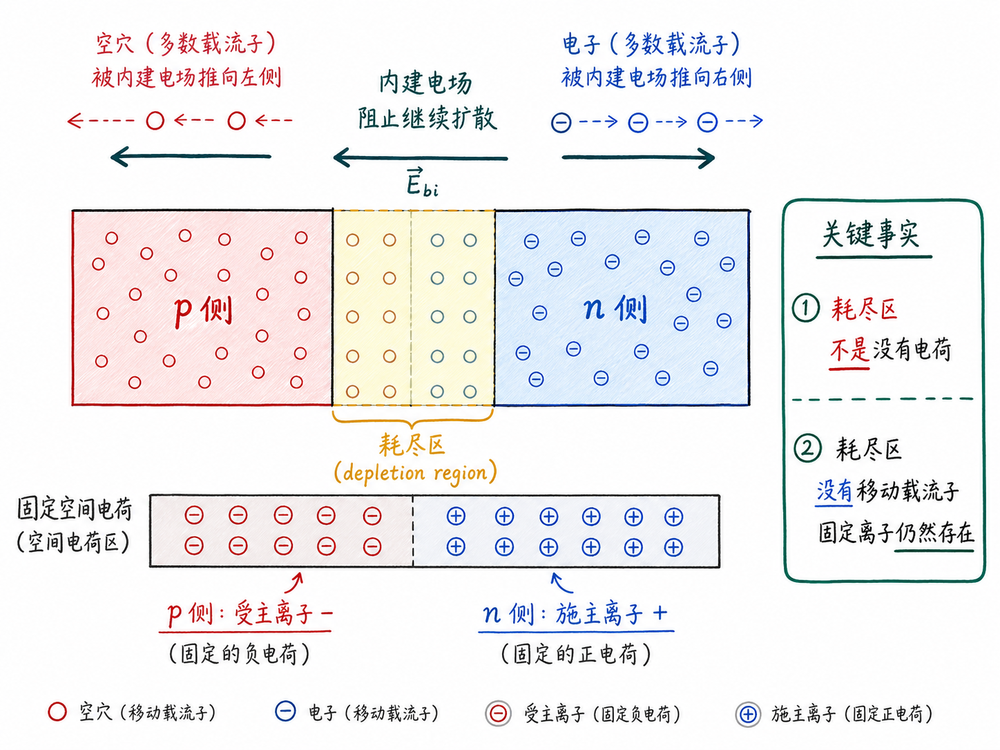

# PN 结为什么会自己长出一个电场？

如果只把一块 p 型硅和一块 n 型硅分开看，它们其实没有那么神奇。p 型硅有空穴，n 型硅有电子，外加电压以后都能导电。但这件事金属也能做。半导体真正开始变成“器件”，不是因为它会导电，而是因为不同区域放在一起以后，会自己形成新的内部结构。

PN 结就是这个转折点。把 p 型半导体和 n 型半导体接在一起，最开始只是两个材料贴到一起；过一会儿，它们中间却会形成电场，还会出现一个几乎没有移动载流子的耗尽区。这个自发形成的内部电场，正是二极管、BJT、MOS 结构里很多现象的起点。

读完这篇，你会知道

- 为什么单独的 p 型或 n 型半导体还不算真正有趣的器件
- PN 结刚接触时，电子和空穴为什么会先扩散
- 固定离子为什么会留下空间电荷，并建立内建电场
- 耗尽区为什么几乎没有移动载流子
- 为什么 PN 结看起来像一层内部绝缘区，却又是半导体器件的基础

## PN 结解决的不是“导电”，而是“可控导电”

前面已经学过 n 型半导体和 p 型半导体。n 型里多数载流子是电子，p 型里多数载流子是空穴。它们都有一定电导率，也都有迁移率。如果我们只是给一块均匀半导体加电压，它会有电流。

但这还不够。单纯“能导电”不是半导体器件的核心价值，因为金属也能导电。半导体真正有用的地方，是我们能通过掺杂、结、偏压和电场去塑造载流子的分布，让电流在某些条件下容易通过，在另一些条件下被阻挡。

PN 结是第一个体现这种能力的结构。它把 p 型区和 n 型区放在同一块材料里，让载流子自己重新分布，并在界面附近生成一个内部电场。这个电场不是外面电源强行加进去的，而是材料接触后自己建立起来的。

## 接触之前：两边各自电中性

先把图像搭起来。左边是一块 p 型半导体，右边是一块 n 型半导体。

p 型区里有两类电荷：

- 可移动的空穴，带正电
- 固定在晶格里的受主离子，带负电

n 型区里也有两类电荷：

- 可移动的电子，带负电
- 固定在晶格里的施主离子，带正电

在接触之前，每一边整体都是电中性的。p 型区中，空穴的正电荷和受主离子的负电荷互相抵消；n 型区中，电子的负电荷和施主离子的正电荷互相抵消。

这个“电中性”很重要。它说明 PN 结形成时，并不是凭空制造了一堆正电或负电，而是可移动载流子重新分布以后，让原本互相抵消的局部平衡被打破了。

## 第一件事：多数载流子会扩散到对面

当 p 型和 n 型接触后，固定离子仍然固定在晶格中，不能跑到另一边。但电子和空穴可以移动，而且一直在做热运动。源文给出的热运动速度量级是 $10^7\ \text{cm/s}$，这意味着载流子并不是静静待在原地，而是在不停乱跑。

于是浓度差开始发挥作用。

n 型一侧电子很多，p 型一侧电子很少，所以电子会从 n 侧向 p 侧扩散。p 型一侧空穴很多，n 型一侧空穴很少，所以空穴会从 p 侧向 n 侧扩散。

这一步和前面学过的扩散电流是一回事：不是每个电子“知道”对面更空，而是随机热运动叠加浓度差以后，宏观上出现了从高浓度到低浓度的净扩散。

## 第二件事：离子不动，于是电荷被留下

扩散一开始看起来只是电子和空穴互相跑到对面，但真正关键的是：只有移动载流子能跑，固定离子不能跑。

在 n 型一侧，电子原本用自己的负电荷抵消施主离子的正电荷。现在靠近界面的电子有一部分扩散到 p 侧，留下来的施主离子不能跟着走。于是 n 侧靠近界面的区域出现净正电。

在 p 型一侧，空穴原本用自己的正电荷抵消受主离子的负电荷。现在靠近界面的空穴有一部分扩散到 n 侧，留下来的受主离子也不能动。于是 p 侧靠近界面的区域出现净负电。

所以 PN 结不是整体带电。整块材料仍然电中性，因为电子和空穴没有被创造或销毁。但界面附近发生了局部电荷分离：p 侧留下负电固定离子，n 侧留下正电固定离子。

这就是空间电荷的来源。

## 第三件事：空间电荷建立内建电场

一边是负电，一边是正电，中间必然产生电场。这个电场的方向，会阻止最初的扩散继续无限进行。

可以这样看：

- 空穴原本想从 p 侧扩散到 n 侧
- 但 n 侧靠近界面留下了正电空间电荷
- 正电区域会排斥空穴，把它们往 p 侧推回去

电子也类似：

- 电子原本想从 n 侧扩散到 p 侧
- 但 p 侧靠近界面留下了负电空间电荷
- 负电区域会排斥电子，把它们往 n 侧推回去

于是系统里出现了两股相反趋势：浓度梯度推动多数载流子向对面扩散，内建电场又把它们推回原来的多数载流子区域。

热平衡时，这两件事互相抵住。载流子仍然在微观上运动，但宏观上没有净电荷持续穿过 PN 结。

## 耗尽区：不是没有电荷，而是没有移动载流子

界面附近最容易被误解的一点，是“耗尽区”这个名字。

耗尽区不是说那里什么电荷都没有。恰恰相反，那里有固定电荷：p 侧有带负电的受主离子，n 侧有带正电的施主离子。它“耗尽”的是移动载流子，也就是电子和空穴。

因为电场把空穴推离界面，也把电子推离界面，所以靠近结的位置几乎没有可自由移动的载流子。剩下的主要是固定在晶格中的离子。这片区域也叫空间电荷区，因为它里面的电荷以固定离子的形式分布在空间中。

这就是 PN 结最核心的图像：

- 扩散让多数载流子先离开原来的区域
- 固定离子留下局部净电荷
- 局部净电荷建立内建电场
- 内建电场把移动载流子赶离界面
- 界面附近形成耗尽区

一旦抓住这条链路，PN 结的形成就不再神秘。

## 为什么它看起来像一层内部绝缘区

在平衡状态下，PN 结两边没有显著的净电荷交换。空穴想从 p 侧越过耗尽区，会被内建电场推回去；电子想从 n 侧越过耗尽区，也会被电场推回去。

所以耗尽区看起来有点像一层薄薄的绝缘区。它不是外面夹进去的氧化层，也不是材料突然变成了绝缘体，而是因为可移动载流子被赶走，只剩固定离子和强电场。

这个特点非常重要。后面分析二极管时，正向偏压会削弱这层势垒，让载流子更容易跨过去；反向偏压会增强这层势垒，让耗尽区变宽，电流更难通过。也就是说，PN 结能整流，不是因为 p 型或 n 型单独有什么神秘能力，而是因为接触后形成了可被偏压调制的内部势垒。

## 下一步为什么要用能带图

到这里，我们已经有了 PN 结形成的物理图像。但如果要定量分析，就需要更强的工具。

我们要知道内建电势有多大，耗尽区有多宽，电场怎么分布，外加偏压后势垒如何变化。这些问题不能只靠“电子往左、空穴往右”的直观图来回答。

所以后面会用能带图、连续性方程和状态方程继续分析。能带图的价值在于，它把“电场、势垒、载流子浓度、电子空穴能量”放到同一张图里。对 PN 结、BJT、MOS 和光电器件来说，这会成为非常有力的语言。

## 最后收束：PN 结是半导体器件的第一个开关雏形

PN 结形成的全过程，可以用一句话复述：

多数载流子先因为浓度差扩散，留下不能移动的离子，固定离子形成空间电荷，空间电荷建立内建电场，内建电场又阻止进一步扩散，最终在界面附近形成耗尽区。

这就是 PN 结为什么会自己长出一个电场。

它不是一块 p 型硅加一块 n 型硅那么简单，而是半导体材料第一次把“导电”和“阻挡”同时放进同一个结构里。理解这一点，后面看二极管、晶体管和各种结型器件时，才不会只是在背公式，而是在看一个内部电场如何控制载流子的通行。

