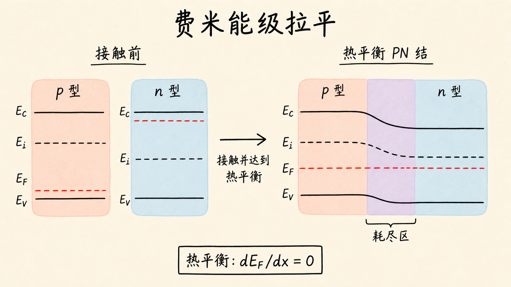
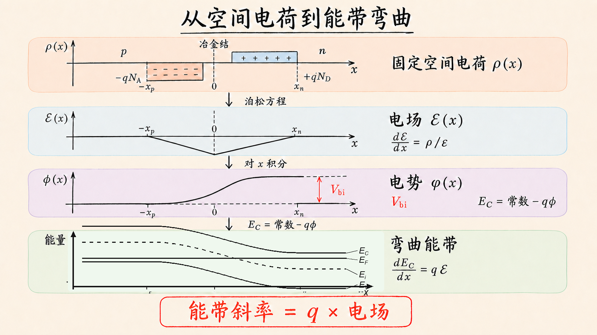
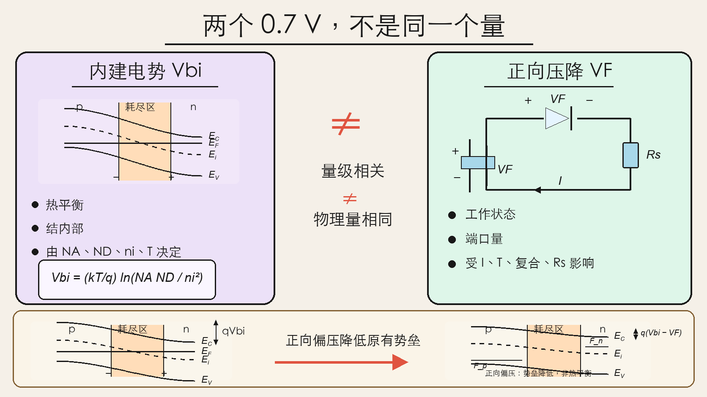

# PN 结能带为什么会弯？0.7 V 势垒从哪里来

把 p 型硅和 n 型硅接在一起，我们已经知道界面会出现耗尽区和内建电场。但只画正负离子和电场箭头，还回答不了工程上真正关心的问题：电子要付出多少能量才能穿过结？耗尽区到底有多宽？外加电压又会怎样改变它？

能带图就是回答这些问题的“地形图”。它把抽象的电势变成电子眼前的山坡。读懂这张图以后，PN 结不再只是“左边 p、右边 n”，而是一道可以计算、也可以被外部偏压调节的能量势垒。

读完这篇，你会知道

- 为什么热平衡时整个 PN 结只能有一条水平的费米能级
- 分开的 p 型、n 型能带应该怎样拼成一张 PN 结能带图
- 能带弯曲与耗尽区电场为什么是同一件事的两种表达
- 内建电势 $V_{bi}$ 怎样由 $N_A$、$N_D$ 和 $n_i$ 决定
- 为什么“内建电势约 0.7 V”不等于“二极管永远压降 0.7 V”

## 拼图之前，先看两块材料各自长什么样

先把 p 型和 n 型半导体分开，各自处于热平衡。

两边都有导带底 $E_C$、价带顶 $E_V$ 和本征费米能级 $E_i$。如果两块材料都是同一种半导体，例如都是硅，那么远离结区时，它们的带隙 $E_g=E_C-E_V$ 相同。掺杂主要改变的不是带隙，而是费米能级在带隙中的位置。

p 型区的多数载流子是空穴，所以 $E_F$ 靠近价带。非简并、完全电离近似下，

$$
E_i-E_F=kT\ln\left(\frac{N_A}{n_i}\right).
$$

n 型区的多数载流子是电子，所以 $E_F$ 靠近导带，对应关系是

$$
E_F-E_i=kT\ln\left(\frac{N_D}{n_i}\right).
$$

这里 $N_A$ 是受主浓度，$N_D$ 是施主浓度，$n_i$ 是本征载流子浓度。掺杂越重，费米能级离本征能级越远。

如果只看这两张孤立能带图，它们各有一条自己的费米能级。但把材料接起来以后，两条费米能级不能继续各走各的。

## 第一条硬约束：热平衡时 $E_F$ 必须处处相同

费米能级可以理解为电子的电化学势。只要某两个位置的电化学势不同，载流子就还有净迁移的驱动力，系统就没有真正达到热平衡。

因此，热平衡 PN 结必须满足

$$
\frac{dE_F}{dx}=0.
$$

画图时，这意味着从 p 区到 n 区，$E_F$ 是一条贯穿整个器件的水平直线。

这条规则不是绘图习惯，而是平衡条件。如果你画出的热平衡 PN 结里 $E_F$ 倾斜、断开或左右高度不同，那张图在物理上就意味着仍有净电流，不是热平衡。

现在拼图的方法就清楚了：先把两块材料上下移动，让它们的 $E_F$ 对齐，再去连接 $E_C$、$E_i$ 和 $E_V$。

## 费米能级拉平以后，为什么能带必须弯

接触前，n 区电子浓度高，p 区空穴浓度高。接触后，电子从 n 侧向 p 侧扩散，空穴从 p 侧向 n 侧扩散。移动载流子离开界面后，p 侧留下带负电的固定受主离子，n 侧留下带正电的固定施主离子。

这片固定空间电荷建立了由 n 侧指向 p 侧的内建电场。电场不是能带图之外的另一件事，它正是能带弯曲的原因。

对电子而言，导带边与静电势 $\phi(x)$ 的关系可写成

$$
E_C(x)=\text{常数}-q\phi(x).
$$

又因为

$$
\mathcal{E}(x)=-\frac{d\phi}{dx},
$$

所以

$$
\frac{dE_C}{dx}=q\mathcal{E}(x).
$$

这条关系很有用：能带的斜率直接告诉你电场。能带越陡，局部电场越强；能带平坦，电场就是零。由于同一种材料的带隙基本不变，$E_i$ 和 $E_V$ 会与 $E_C$ 一起弯曲，三条线保持大致平行。

在突变结的耗尽近似下，耗尽区内电荷密度在 p、n 两侧分别近似为常数。由泊松方程可知，电场随位置线性变化；再对电场积分一次，电势以及能带边就呈分段抛物线。两段曲线在冶金结附近连接，远离耗尽区后重新变平。

所以“能带弯了”不是一笔随手画出的圆弧，而是空间电荷经过泊松方程留下的形状。

## 从电子视角看，内建电场就是一座能量山

想象一个位于 n 区导带底附近的电子，它要从 n 侧走向 p 侧。

在真实空间图里，耗尽区电场会把带负电的电子推回 n 侧。在能带图里，同一个过程表现为：p 侧导带位置更高，电子必须爬过一座能量山。

山的高度为

$$
\Delta E_C=qV_{bi}.
$$

$V_{bi}$ 是内建电势。这里必须分清“能量”和“电压”：电子跨越的能量势垒是 $qV_{bi}$，除以元电荷 $q$ 后才是以伏特表示的内建电势。

导带、价带和本征能级在 p、n 两侧的高度差相同，因为两边的带隙没有改变，整套能带只是被静电势整体抬高或压低。因此，我们可以沿着共同的 $E_F$，把两边 $E_i$ 到 $E_F$ 的距离相加。

## 一行推导出 $V_{bi}$

n 区远离结区的位置满足

$$
E_F-E_{i,n}=kT\ln\left(\frac{N_D}{n_i}\right),
$$

p 区远离结区的位置满足

$$
E_{i,p}-E_F=kT\ln\left(\frac{N_A}{n_i}\right).
$$

两式相加，费米能级在中间抵消：

$$
\begin{aligned}
qV_{bi}
&=E_{i,p}-E_{i,n} \\
&=kT\ln\left(\frac{N_D}{n_i}\right)
+kT\ln\left(\frac{N_A}{n_i}\right) \\
&=kT\ln\left(\frac{N_A N_D}{n_i^2}\right).
\end{aligned}
$$

于是

$$
\boxed{V_{bi}=\frac{kT}{q}\ln\left(\frac{N_A N_D}{n_i^2}\right)}.
$$

这条式子告诉我们三个直接结论。

第一，p 侧或 n 侧掺杂变重，内建势垒都会升高。第二，$n_i$ 对温度非常敏感，因此 $V_{bi}$ 也会随温度变化。第三，$V_{bi}$ 不是“硅材料自带的固定常数”，而是材料、掺杂和温度共同决定的平衡结果。

以 300 K 的硅为例，如果 $N_A=N_D=10^{16}\ \text{cm}^{-3}$，取 $n_i\approx10^{10}\ \text{cm}^{-3}$、$kT/q\approx25.9\ \text{mV}$，那么

$$
V_{bi}\approx25.9\ \text{mV}\times
\ln\left(\frac{10^{16}\times10^{16}}{10^{20}}\right)
\approx0.72\ \text{V}.
$$

这就是“硅 PN 结的势垒大约是 0.7 V”这一说法的来源之一。

## 但端口测到的 0.7 V，不等于平衡内建电势

这里最容易留下一个错误印象：既然算出了约 0.7 V，那么万用表测到的硅二极管正向压降，就是直接测到了 $V_{bi}$。

不是。

$V_{bi}$ 是结内部在热平衡时建立的静电势差。器件两端还有金属—半导体接触形成的接触电势；在零偏压下，这些电势在完整回路中相互补偿，不能直接拿电压表量出一个裸露的 $V_{bi}$。

二极管导通时的端口电压则是工作状态下的量。它取决于电流密度、温度、复合机制、理想因子和串联电阻。工程上把硅二极管记成“0.7 V 导通”，是特定电流范围内方便电路估算的近似，不是材料常数，也不是一道到 0.7 V 才突然打开的门。

两者为什么经常都在 0.7 V 左右？因为外加正向偏压正在降低原有的内建势垒；要得到明显的载流子注入，所需偏压自然与原势垒处在相近量级。但“量级相关”不等于“物理量相同”。

## 一张能带图，接上后面的三个计算

到这里，PN 结能带图已经把三套语言统一起来了：

- 空间电荷语言：耗尽区内留下固定受主和施主离子
- 电场语言：空间电荷建立由 n 侧指向 p 侧的内建电场
- 能量语言：内建电场让能带弯曲，形成高度为 $qV_{bi}$ 的势垒

下一步只要把这张图与泊松方程连接起来，就可以继续求出电场峰值和耗尽区宽度。外加正向偏压会降低势垒、压窄耗尽区；反向偏压会抬高势垒、拓宽耗尽区。二极管的整流行为，就从这张“能量地形图”里长出来。

## 最后收束：先拉平 $E_F$，再让能带说出电场

画热平衡 PN 结能带图，可以压缩成三步：

1. 分别画出 p 型和 n 型材料的 $E_C$、$E_i$、$E_V$ 与 $E_F$。
2. 用热平衡条件把两侧 $E_F$ 拉成同一条水平线。
3. 在耗尽区连接并弯曲其余能带，使其斜率与内建电场一致。

最终，左右能带的高度差给出 $qV_{bi}$，掺杂浓度则通过

$$
V_{bi}=\frac{kT}{q}\ln\left(\frac{N_A N_D}{n_i^2}\right)
$$

决定这座能量山有多高。

费米能级拉平，是热平衡的结果；能带弯曲，是空间电荷和电场的结果；约 0.7 V，则只是某些硅 PN 结在常见条件下的典型量级。把这三句话分清，PN 结能带图就不再是一张需要背下来的曲线，而是一套可以从物理机制重新推出来的图。
