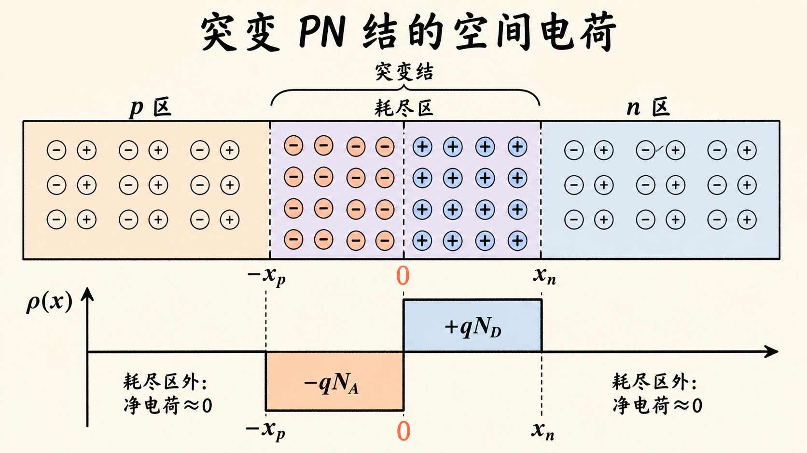
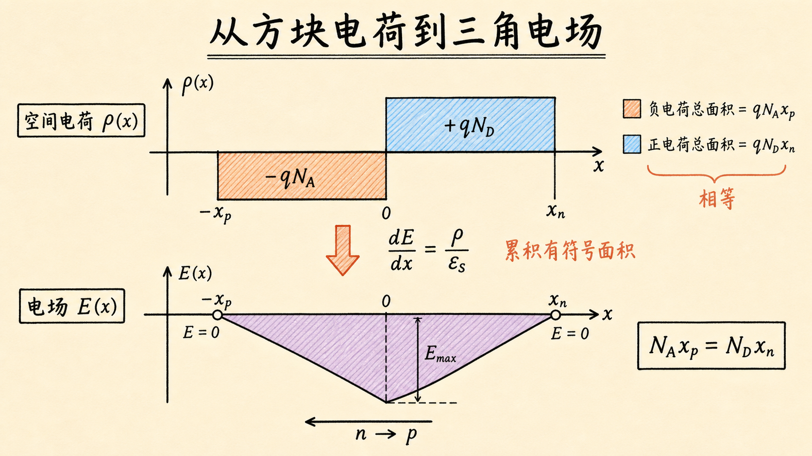
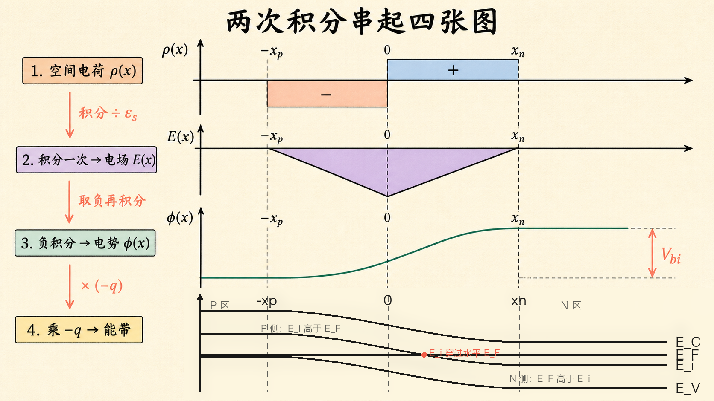

# PN 结的电场长什么样？从方块电荷到三角电场

PN 结能带图里那道弯曲的“山坡”，不是凭感觉画出来的。它有一条可以逐步追溯的来源链：耗尽区里留下什么电荷，决定电场怎样变化；电场怎样变化，决定电势怎样抬升；电势怎样抬升，又决定能带怎样弯曲。

最关键的动作其实只有两个字：积分。对空间电荷积分一次，得到电场；再对电场积分一次，得到电势。只要看懂曲线形状怎样在两次积分中变化，就不必死记 PN 结的四张图。

读完这篇，你会知道

- 为什么突变 PN 结的电荷分布是两个矩形
- 为什么电场分布是一个位于横轴下方的三角形
- 电场为什么必须在耗尽区两端回到零
- 为什么电势是两段相连的抛物线
- 电势曲线与 PN 结能带图为什么上下翻转

## 先把问题钉在一条坐标轴上

取 p 区在左、n 区在右，令冶金结位于 $x=0$。p 侧耗尽区从 $-x_p$ 延伸到 $0$，n 侧耗尽区从 $0$ 延伸到 $x_n$，总耗尽层宽度为

$$
W=x_p+x_n.
$$

为了先看清物理，我们采用两个近似。

第一个是突变结近似：掺杂在 $x=0$ 处从受主浓度 $N_A$ 突然变成施主浓度 $N_D$，没有渐变区。

第二个是耗尽近似：在 $-x_p<x<0$ 内，自由空穴几乎被扫空，只留下带负电的固定受主离子；在 $0<x<x_n$ 内，自由电子几乎被扫空，只留下带正电的固定施主离子。耗尽区外，自由载流子重新补偿离化杂质，净电荷密度近似为零。

这两个近似不是说现实中的边界真的像刀切一样锋利，而是先抓住主导量。它把连续而复杂的载流子分布，压缩成可计算、也容易画图的分段函数。

## 第一张图：空间电荷是“负方块 + 正方块”

按照上面的坐标约定，空间电荷密度可以写成

$$\rho(x)=\begin{matrix}0, & x\lt -x_p\\-qN_A, & -x_p\le x\lt 0\\+qN_D, & 0\lt x\le x_n\\0, & x\gt x_n\end{matrix}$$

p 侧是一块位于横轴下方的负矩形，n 侧是一块位于横轴上方的正矩形。矩形的高度由掺杂浓度决定，宽度分别是 $x_p$ 和 $x_n$。

这里要避免一个常见误解：耗尽区外并不是没有离化杂质，而是没有净空间电荷。中性区内的多数载流子把离化杂质电荷补偿掉了，所以宏观上 $\rho\approx0$。

## 从方块到斜线：高斯定律就是“斜率规则”

一维高斯定律写成

$$
\frac{dE}{dx}=\frac{\rho(x)}{\varepsilon_s},
$$

其中 $\varepsilon_s$ 是半导体介电常数。

这条式子可以直接读成一句话：

> 电荷密度决定电场曲线的斜率。

在 p 侧耗尽区，$\rho=-qN_A$ 是负常数，因此 $dE/dx$ 是负常数，电场随 $x$ 线性下降。在 n 侧耗尽区，$\rho=+qN_D$ 是正常数，因此电场随 $x$ 线性上升。矩形函数积分一次，就变成斜直线。

耗尽区外 $\rho=0$，所以电场斜率为零。但“斜率为零”只说明电场是常数，并不自动说明这个常数等于零。真正把它钉在零上的，是远离结区的准中性边界条件：中性区内部不能一直维持一个非零静电场，否则多数载流子会持续漂移，系统就不是热平衡。

因此，

$$
E(-x_p)=0,\qquad E(x_n)=0.
$$

从左端的零开始，电场在 p 侧线性向下，到 $x=0$ 达到最负值；再在 n 侧线性向上，最终回到零。整条曲线就是一个位于横轴下方的三角形。

负号不是说“电场强度小于零”，而是在表达方向。我们把正 $x$ 定义为从 p 指向 n，实际内建电场却由 n 侧正离子指向 p 侧负离子，因此 $E<0$。

## 为什么三角形右端恰好回到零

从 $-x_p$ 积分到 $x_n$：

$$
E(x_n)-E(-x_p)
=\frac{1}{\varepsilon_s}\int_{-x_p}^{x_n}\rho(x)\,dx.
$$

左右两端电场都为零，所以积分必须为零：

$$
-qN_Ax_p+qN_Dx_n=0.
$$

于是

$$
N_Ax_p=N_Dx_n.
$$

这就是耗尽区电中性条件。它告诉我们，p 侧负电荷总量必须等于 n 侧正电荷总量。

对器件设计的影响很直接：耗尽区不会平均分到两边，而会更多地伸入轻掺杂一侧。如果 $N_A\gg N_D$，为了提供同样大小的总电荷，n 侧就必须用更大的宽度 $x_n$ 来补足面积，因此主要耗尽在 n 区。

## 第二次积分：三角电场变成抛物线电势

电场与静电势 $\phi(x)$ 的关系是

$$
E(x)=-\frac{d\phi}{dx}.
$$

换句话说，

$$
d\phi=-E(x)\,dx.
$$

现在电场在整个耗尽区内都是负的，所以 $-E$ 为正。沿着正 $x$ 方向从 p 侧走向 n 侧，电势会持续升高。

又因为 $E(x)$ 在 p、n 两侧分别是一条斜直线，对它积分后，$\phi(x)$ 就是两段相连的抛物线：p 侧曲率向上，跨过 $x=0$ 后曲率改变，n 侧逐渐压平。离开耗尽区后 $E=0$，电势的斜率也回到零，于是左右两侧分别形成低平台和高平台。

两平台的高度差就是内建电势：

$$
V_{bi}=\phi(x_n)-\phi(-x_p)
=-\int_{-x_p}^{x_n}E(x)\,dx.
$$

图像上，$V_{bi}$ 就是负三角形电场与横轴之间的面积。若用 $E_{\max}$ 表示峰值电场的大小，则

$$
V_{bi}=\frac{1}{2}E_{\max}W.
$$

这条面积关系已经把“势垒有多高”“电场有多强”和“耗尽区有多宽”绑在一起：在相同 $V_{bi}$ 下，更宽的耗尽区对应更低的峰值电场；更窄的耗尽区则需要更高的峰值电场。

## 第三张图：电势翻过来，就是电子看到的能带

电子带负电，它的静电势能满足

$$
U_e(x)=-q\phi(x).
$$

因此，电势从 p 侧向 n 侧升高时，电子势能反而降低。导带底 $E_C$、本征能级 $E_i$ 和价带顶 $E_V$ 都跟随电子势能变化，所以它们的形状与 $\phi(x)$ 上下翻转。

这也可以从斜率关系看出来：

$$
\frac{dE_C}{dx}=qE(x).
$$

电场为负，导带斜率也为负，所以能带从 p 侧向 n 侧下降；电场绝对值最大的地方，能带最陡；耗尽区外电场为零，能带重新变平。

现在，PN 结的四张图已经可以在脑中连成一条链：

$$
\rho(x)
\xrightarrow{\div\varepsilon_s\ \text{并积分}}
E(x)
\xrightarrow{\text{取负并积分}}
\phi(x)
\xrightarrow{\times(-q)}
\text{能带}.
$$

- $\rho(x)$：负矩形接正矩形
- $E(x)$：横轴下方的三角形
- $\phi(x)$：从 p 侧低平台升到 n 侧高平台的分段抛物线
- 能带：从 p 侧高平台降到 n 侧低平台的分段抛物线

只要坐标方向和电荷符号不变，这四张图的方向就不能随意画。

## 与内建电势公式接上

前一篇已经得到

$$
V_{bi}=\frac{kT}{q}\ln\left(\frac{N_A N_D}{n_i^2}\right).
$$

这条公式从载流子统计告诉我们势垒“应该有多高”；本篇的图形积分则告诉我们，空间电荷和电场要怎样分布，才能共同构成这道势垒。

下一步再把

$$
N_Ax_p=N_Dx_n
$$

与

$$
V_{bi}=-\int_{-x_p}^{x_n}E(x)\,dx
$$

联立，就能解出 $x_p$、$x_n$、总耗尽宽度 $W$ 和峰值电场 $E_{\max}$ 的闭式表达式。也就是说，本篇先建立“图为什么长这样”，下一篇才负责把图变成最终公式。

## 最后收束：别背四张图，记住两次积分

突变 PN 结的电场分布并不神秘。

固定离子让电荷密度成为两个方块；高斯定律把方块积分成三角电场；电场再积分成抛物线电势；电子带负电，所以能带是电势曲线的上下翻转。

最值得记住的一句话是：

> 电荷决定电场的斜率，电场决定电势的斜率，电势决定能带的高度。

掌握这条链路以后，即使忘了图的具体方向，也可以从 p 侧负电荷、n 侧正电荷和边界处 $E=0$ 重新推出来，而不必靠记忆猜曲线。
