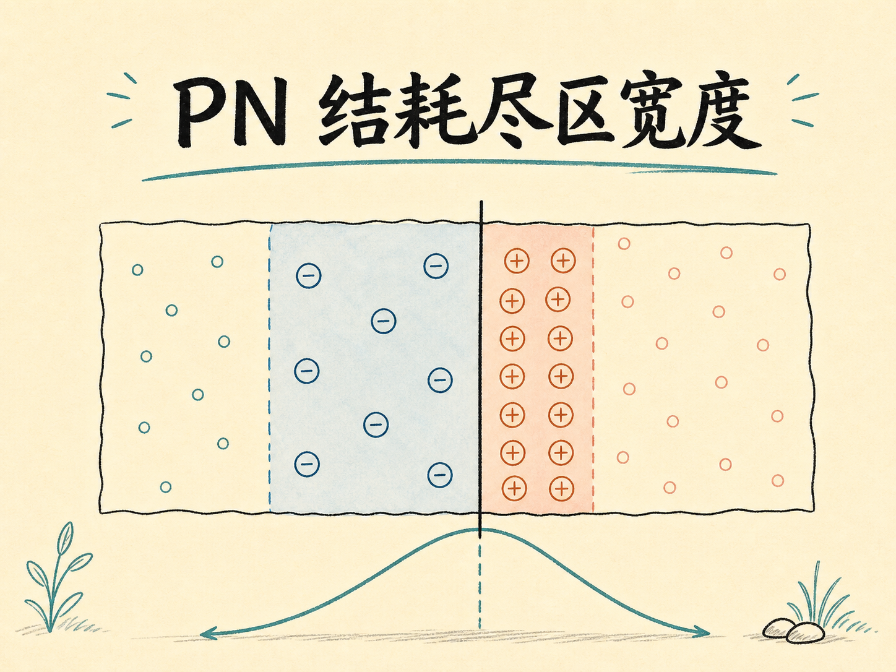
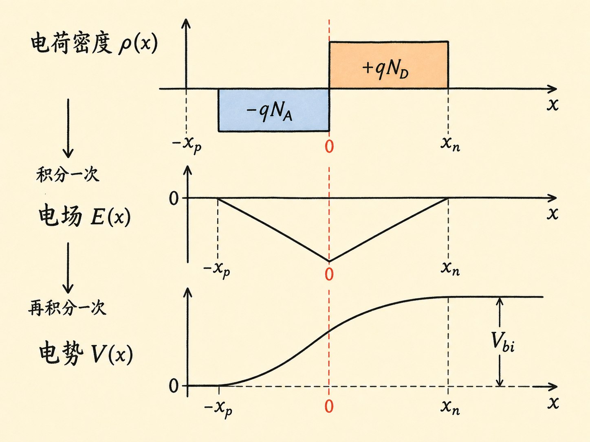
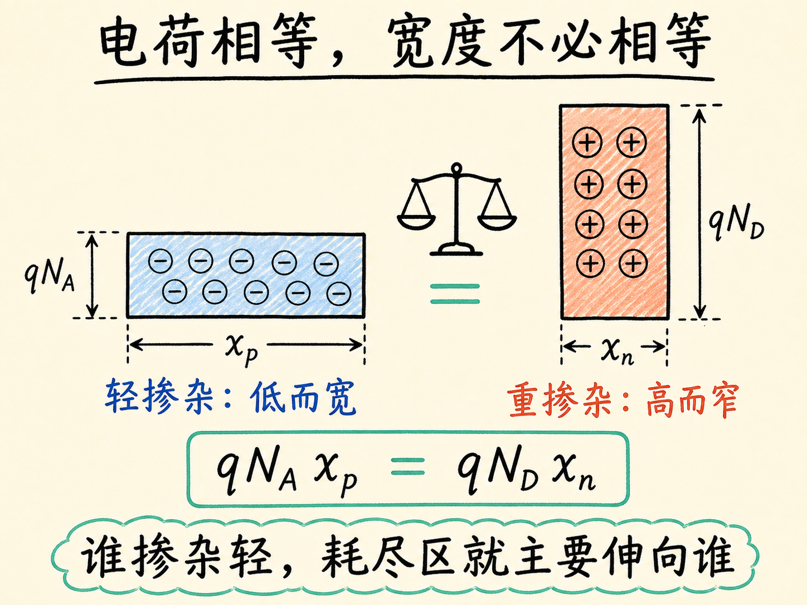
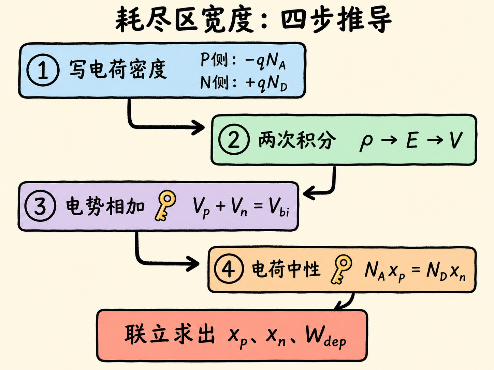
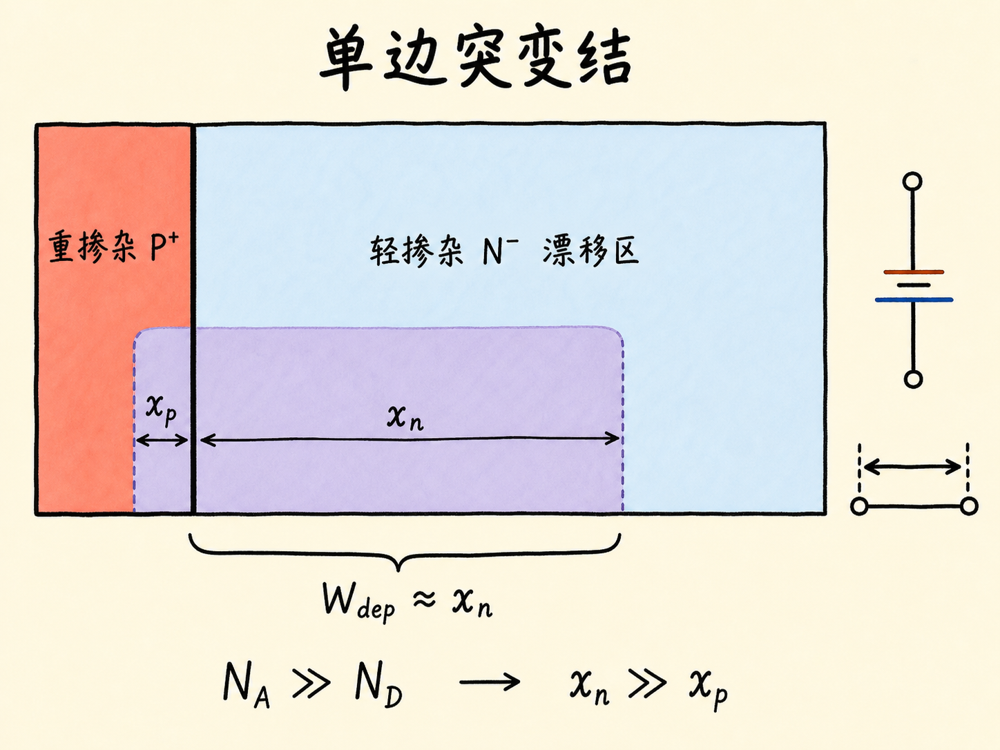

# PN 结耗尽区宽度：掺杂越重，为什么反而越窄？

PN 结形成后，电子和空穴在结附近互相扩散、复合，留下不能移动的离化杂质。于是，原本电中性的半导体里出现了一段几乎没有自由载流子的区域——耗尽区。

问题是：这段区域到底有多宽？更反直觉的是，为什么某一侧掺杂越重，耗尽区伸进这一侧的距离反而越短？

读完这篇，你会知道

- 为什么耗尽区两侧可以近似成一负一正的两个“电荷矩形”
- 如何从电荷密度一步步积分出电场和电势
- 为什么只靠内建电势方程还不够，还必须加入电荷中性条件
- $x_n$、$x_p$ 和总耗尽宽度 $W_{\mathrm{dep}}$ 分别由什么决定
- 为什么耗尽区总是主要伸向掺杂较轻的一侧

先把问题压缩成一句话：**已知两侧掺杂浓度和内建电势，求需要多宽的固定空间电荷，才能建立起这个电势。**

## 先看见耗尽区里的“两个电荷矩形”

考虑一个突变 PN 结。耗尽区在 P 侧延伸 $x_p$，在 N 侧延伸 $x_n$。

P 侧原本掺有浓度为 $N_A$ 的受主。空穴扩散离开后，留下带负电的离化受主，因此 P 侧耗尽区的体电荷密度近似为

$$
\rho_p=-qN_A.
$$

N 侧原本掺有浓度为 $N_D$ 的施主。电子扩散离开后，留下带正电的离化施主，因此 N 侧耗尽区的体电荷密度近似为

$$
\rho_n=+qN_D.
$$

在“均匀掺杂、完全耗尽”的近似下，$N_A$ 和 $N_D$ 都是常数。于是电荷密度图像不是曲线，而是两个矩形：P 侧一个高度为 $-qN_A$ 的负矩形，N 侧一个高度为 $+qN_D$ 的正矩形。

这一步很关键。因为一旦电荷密度是常数，后面的数学形状就已经确定：

- 常数电荷密度积分一次，得到线性变化的电场；
- 线性电场再积分一次，得到抛物线形的电势。

所以，耗尽区里的三张图——电荷密度、电场、电势——不是三件独立的事，而是一条连续的因果链。

## 从 P 侧开始：固定负电荷怎样抬高电势

先单独看 P 侧。为了让计算干净，把局部坐标原点放在 P 侧耗尽区的外边界，让 $x$ 从 $0$ 走到 $x_p$。在耗尽区外，半导体近似电中性，电场取零。

一维泊松方程写成

$$
\frac{\mathrm dE}{\mathrm dx}
=
\frac{\rho}{\varepsilon_{\mathrm{Si}}},
$$

其中 $\varepsilon_{\mathrm{Si}}$ 是硅的介电常数。

代入 $\rho_p=-qN_A$，并使用边界条件 $E(0)=0$：

$$
E_p(x)
=
\int_0^x\frac{-qN_A}{\varepsilon_{\mathrm{Si}}}\,\mathrm dx
=
-\frac{qN_A}{\varepsilon_{\mathrm{Si}}}x.
$$

这说明 P 侧电场是一条从零开始向负方向线性下降的直线。

电势与电场的关系是

$$
E=-\frac{\mathrm dV}{\mathrm dx}.
$$

因此，再积分一次：

$$
V_p(x)
=
-\int_0^x E_p(x)\,\mathrm dx
=
\frac{qN_A}{2\varepsilon_{\mathrm{Si}}}x^2.
$$

走到 P 侧耗尽区尽头 $x=x_p$，这一侧提供的电势降为

$$
V_p
=
\frac{qN_Ax_p^2}{2\varepsilon_{\mathrm{Si}}}.
$$

这个式子可以用一句直觉话来读：**P 侧的固定电荷越密、铺得越宽，它能建立的电势降就越大；而宽度的影响是平方关系。**

## N 侧没有新数学，只是符号和方向换了

N 侧留下的是正电荷，体电荷密度为 $+qN_D$。如果把局部坐标原点放在 N 侧耗尽区外边界，再向结方向走，完全相同的两次积分会给出电势降的幅值

$$
V_n
=
\frac{qN_Dx_n^2}{2\varepsilon_{\mathrm{Si}}}.
$$

不必纠结两边使用了不同的局部坐标。坐标只是计算工具，最终留下的 $V_p$ 和 $V_n$ 都是可直接相加的物理量。

平衡时，两侧电势降共同组成内建电势：

$$
V_p+V_n=V_{\mathrm{bi}}.
$$

于是

$$
\frac{q}{2\varepsilon_{\mathrm{Si}}}
\left(
N_Ax_p^2+N_Dx_n^2
\right)
=
V_{\mathrm{bi}}.
$$

到这里，我们已经把“耗尽区有多宽”变成了一个代数问题。但还不能直接求解，因为一个方程里同时有 $x_p$ 和 $x_n$ 两个未知量。

## 第二把钥匙：两边的总电荷必须刚好抵消

PN 结不会凭空多出净电荷。耗尽区 P 侧留下多少负电荷，N 侧就必须留下等量的正电荷。

对单位结面积来说，矩形电荷分布的总量就是“高度乘宽度”：

$$
qN_Ax_p=qN_Dx_n.
$$

约掉两边共同的 $q$：

$$
N_Ax_p=N_Dx_n.
$$

这个看似简单的关系，其实已经回答了文章开头最重要的问题：

$$
\frac{x_n}{x_p}=\frac{N_A}{N_D}.
$$

耗尽宽度与本侧掺杂浓度成反比。假设 N 侧掺杂是 P 侧的 10 倍，即 $N_D=10N_A$，那么

$$
x_p=10x_n.
$$

也就是说，整个耗尽区会有大约十分之九伸入掺杂较轻的 P 侧，只有十分之一伸入重掺杂的 N 侧。

为什么？因为重掺杂一侧每单位体积里能提供更多离化杂质电荷。它只需很短的一段距离，就能凑够与另一侧相等的总电荷；轻掺杂一侧每单位体积电荷少，只能用更大的宽度补足。

**不是重掺杂让耗尽区“更难形成”，而是它让单位长度能够提供的固定电荷更多。**

## 解出 $x_n$ 和 $x_p$

现在有了两个方程：

$$
\frac{q}{2\varepsilon_{\mathrm{Si}}}
\left(
N_Ax_p^2+N_Dx_n^2
\right)
=V_{\mathrm{bi}},
$$

$$
N_Ax_p=N_Dx_n.
$$

把第二个方程代入第一个方程，可得到 N 侧耗尽宽度：

$$
x_n
=
\sqrt{
\frac{2\varepsilon_{\mathrm{Si}}V_{\mathrm{bi}}}
{qN_D\left(1+\frac{N_D}{N_A}\right)}
}.
$$

同理，P 侧耗尽宽度为

$$
x_p
=
\sqrt{
\frac{2\varepsilon_{\mathrm{Si}}V_{\mathrm{bi}}}
{qN_A\left(1+\frac{N_A}{N_D}\right)}
}.
$$

这两个式子看起来复杂，但记忆逻辑很简单：

- 求 N 侧宽度 $x_n$，主分母先写 N 侧掺杂 $N_D$；
- 求 P 侧宽度 $x_p$，主分母先写 P 侧掺杂 $N_A$；
- 另一侧掺杂通过括号里的浓度比进入；
- 两边都随 $\sqrt{V_{\mathrm{bi}}}$ 增大，随掺杂增大而减小。

## 总耗尽宽度：两边相加后反而更整齐

总耗尽宽度定义为

$$
W_{\mathrm{dep}}=x_n+x_p.
$$

把两侧结果合并，可以写成

$$
W_{\mathrm{dep}}
=
\sqrt{
\frac{2\varepsilon_{\mathrm{Si}}V_{\mathrm{bi}}}{q}
\left(
\frac{1}{N_A}+\frac{1}{N_D}
\right)
}.
$$

这个形式直接暴露出三个趋势。

第一，$V_{\mathrm{bi}}$ 越大，总耗尽区越宽，但只按平方根增长。要让宽度翻倍，电势需要增大到原来的四倍。

第二，掺杂越高，耗尽区越窄。因为 $\frac{1}{N_A}$ 和 $\frac{1}{N_D}$ 都会减小。

第三，如果两侧掺杂相差很大，例如 $N_D\gg N_A$，那么 $\frac{1}{N_D}$ 相比 $\frac{1}{N_A}$ 可以忽略：

$$
W_{\mathrm{dep}}
\approx
\sqrt{
\frac{2\varepsilon_{\mathrm{Si}}V_{\mathrm{bi}}}{qN_A}
}.
$$

此时总耗尽宽度几乎完全由轻掺杂侧决定。这就是单边突变结近似的来源，也是很多功率器件设计里最常见的情形：重掺杂一侧负责低接触电阻和载流子供应，轻掺杂漂移区则承担绝大部分耗尽宽度与电压。

## 最后把整条逻辑压成四步

如果要在白板上重新推导，不必死背最终公式，只要记住四步：

1. 写电荷密度：P 侧为 $-qN_A$，N 侧为 $+qN_D$。
2. 积分一次得电场，再积分一次得两侧电势降：$V_p=\frac{qN_Ax_p^2}{2\varepsilon_{\mathrm{Si}}}$，$V_n=\frac{qN_Dx_n^2}{2\varepsilon_{\mathrm{Si}}}$。
3. 用 $V_p+V_n=V_{\mathrm{bi}}$ 约束总电势。
4. 用 $N_Ax_p=N_Dx_n$ 约束电荷中性。

真正值得记住的不是那两个根号公式，而是这句物理图像：

**内建电势决定总共需要铺开多大的空间电荷区，电荷中性决定这段宽度怎样分配到 PN 结两侧；谁掺杂轻，耗尽区就主要伸向谁。**
