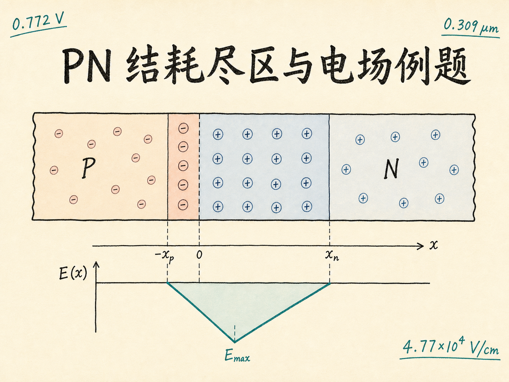
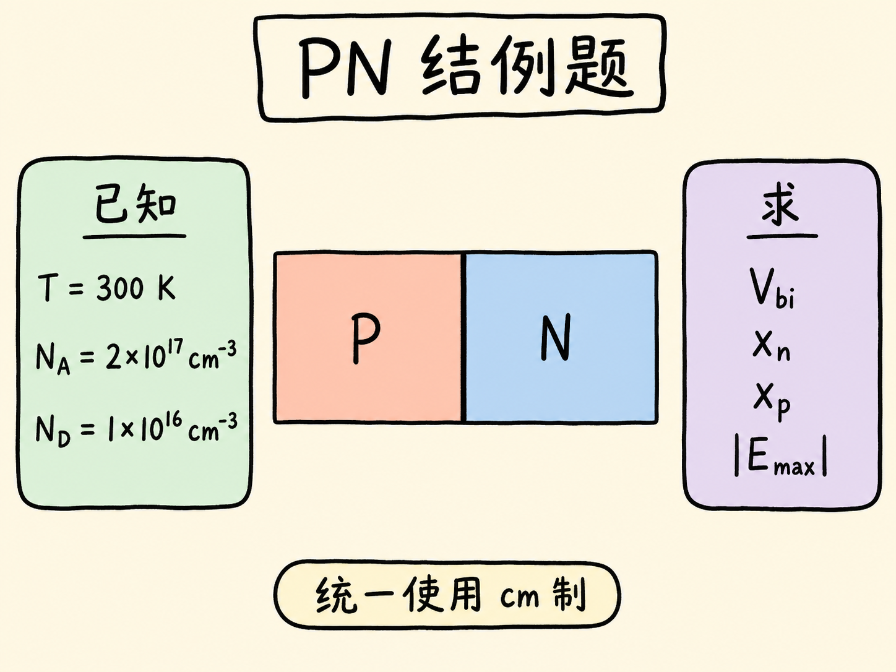
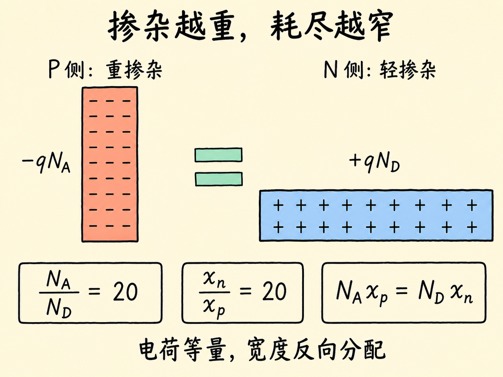
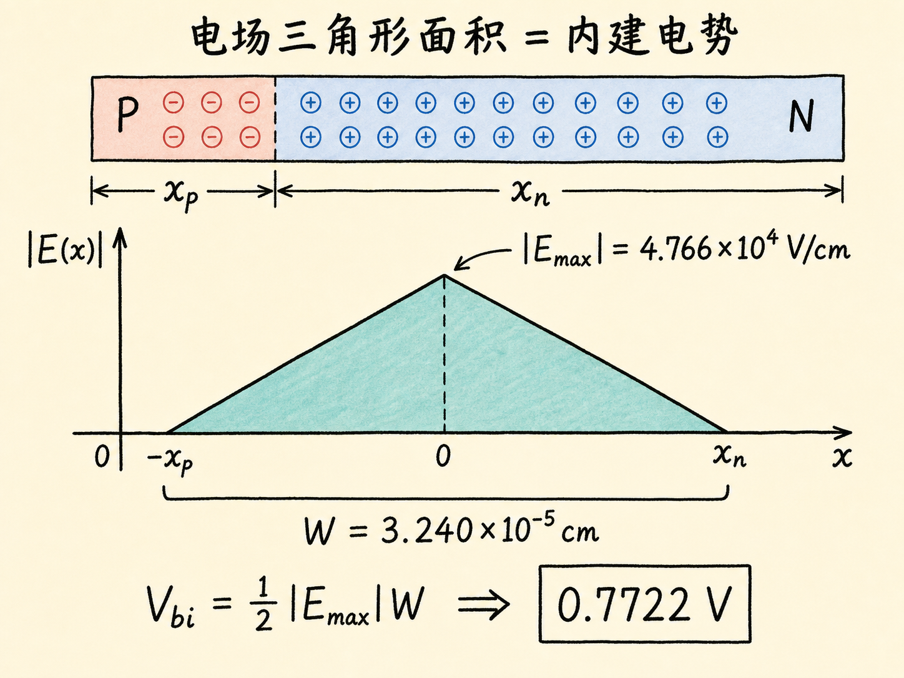
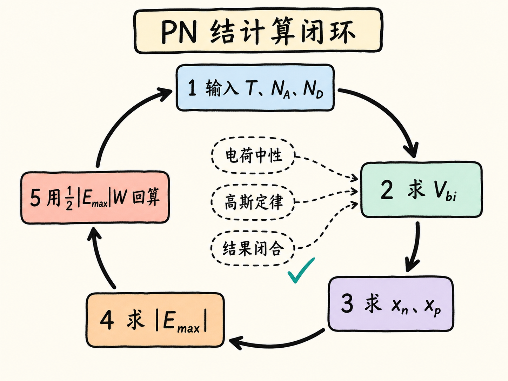

# 一道 PN 结例题，串起内建电势、耗尽区宽度与峰值电场

学完 PN 结的电荷、电场和耗尽区公式，最容易产生一种错觉：每条公式似乎都懂，可一到计算题，还是不知道先写哪一条。

这道例题正好把它们串成一条完整链路。我们只从温度和两侧掺杂浓度出发，依次算出内建电势、两侧耗尽宽度和峰值电场。更重要的是，每得到一个结果，都用另一条物理关系交叉检查。

读完这篇，你会知道

- 为什么这道题应该先算内建电势，而不是直接套耗尽宽度公式
- 如何让 $\mathrm{F/cm}$、$\mathrm{cm^{-3}}$ 和库仑在根号里正确约分
- 为什么重掺杂 P 侧的耗尽区只有轻掺杂 N 侧的二十分之一
- 如何从任意一侧算出相同的峰值电场
- 怎样用“电场三角形的面积”一次检查前面所有结果

## 先把题目变成一张参数清单

考虑一个 300 K 的硅突变 PN 结：

$$
N_D=1.0\times10^{16}\ \mathrm{cm^{-3}},
$$

$$
N_A=2.0\times10^{17}\ \mathrm{cm^{-3}}.
$$

题目要求四个量：

$$
V_{bi},\qquad x_n,\qquad x_p,\qquad |E_{\max}|.
$$

在 300 K 下，本例使用

$$
\phi_T=\frac{kT}{q}=25.9\ \mathrm{mV},
$$

$$
n_i=1.5\times10^{10}\ \mathrm{cm^{-3}},
$$

$$
\varepsilon_{\mathrm{Si}}
=11.7\varepsilon_0
=11.7\times8.854\times10^{-14}
=1.036\times10^{-12}\ \mathrm{F/cm},
$$

以及

$$
q=1.6\times10^{-19}\ \mathrm C.
$$

这里有一个计算习惯值得固定下来：**既然掺杂浓度使用 $\mathrm{cm^{-3}}$，介电常数就使用 $\mathrm{F/cm}$，整道题都先留在厘米制里，最后再换成微米。**

## 第一步：掺杂浓度先决定内建电势

平衡状态下，内建电势为

$$
V_{bi}
=\phi_T\ln\left(\frac{N_AN_D}{n_i^2}\right).
$$

代入数值：

$$
V_{bi}
=0.0259
\ln\left[
\frac{
\left(2.0\times10^{17}\right)
\left(1.0\times10^{16}\right)
}{
\left(1.5\times10^{10}\right)^2
}
\right]
\approx0.7722\ \mathrm V.
$$

先别急着进入下一步，做一次量级检查。硅 PN 结的内建电势落在约 $0.7\ \mathrm V$ 的量级很合理；如果计算器给出几百伏或几毫伏，通常是自然对数、指数或 $n_i^2$ 输入错了。

为什么先算 $V_{bi}$？因为耗尽区的本质问题是：**需要铺开多宽的固定空间电荷，才能建立起这 $0.7722\ \mathrm V$ 的电势差。**

## 第二步：先求轻掺杂 N 侧的耗尽宽度

对于突变 PN 结，N 侧耗尽宽度为

$$
x_n=
\sqrt{
\frac{2\varepsilon_{\mathrm{Si}}V_{bi}}
{qN_D\left(1+\frac{N_D}{N_A}\right)}
}.
$$

把本题参数代入：

$$
x_n=
\sqrt{
\frac{
2\left(1.036\times10^{-12}\right)(0.7722)
}{
\left(1.6\times10^{-19}\right)
\left(1.0\times10^{16}\right)
\left(1+\frac{1.0\times10^{16}}{2.0\times10^{17}}\right)
}
}.
$$

得到

$$
x_n=3.086\times10^{-5}\ \mathrm{cm}.
$$

因为 $1\ \mathrm{cm}=10^4\ \mu\mathrm m$，

$$
x_n=0.3086\ \mu\mathrm m.
$$

### 根号里的单位为什么最后是长度

这一步是整道题最常见的失分点。先只看单位：

$$
\frac{
(\mathrm{F/cm})(\mathrm V)
}{
(\mathrm C)(\mathrm{cm^{-3}})
}.
$$

电容定义告诉我们

$$
\mathrm F\cdot\mathrm V=\mathrm C.
$$

于是法拉乘伏特与库仑约掉，剩下

$$
\frac{\mathrm{C/cm}}{\mathrm{C/cm^3}}
=\mathrm{cm^2}.
$$

再开平方，结果就是 $\mathrm{cm}$。这说明公式和单位系统是自洽的。

如果把 $\varepsilon_0$ 误用成 $\mathrm{F/m}$，同时又保留 $\mathrm{cm^{-3}}$，公式仍然能按计算器运行，但答案会悄悄错掉若干个数量级。**单位不是计算后的装饰，而是计算过程的一部分。**

## 第三步：用电荷中性直接得到 P 侧宽度

耗尽区内，P 侧留下负的离化受主，N 侧留下正的离化施主。两侧总电荷必须等量：

$$
qN_Ax_p=qN_Dx_n.
$$

约掉 $q$：

$$
N_Ax_p=N_Dx_n.
$$

所以

$$
x_p=x_n\frac{N_D}{N_A}.
$$

本题中

$$
\frac{N_D}{N_A}
=\frac{1.0\times10^{16}}{2.0\times10^{17}}
=\frac{1}{20}.
$$

因此

$$
x_p
=3.086\times10^{-5}\times\frac{1}{20}
=1.543\times10^{-6}\ \mathrm{cm}
=0.01543\ \mu\mathrm m.
$$

现在物理图像非常清楚：P 侧的掺杂浓度是 N 侧的 20 倍，每单位长度能提供的固定电荷也是 20 倍，所以它只需要 N 侧二十分之一的宽度，就能凑出相同的总电荷。

总耗尽宽度为

$$
W=x_n+x_p
=0.3086+0.01543
=0.3240\ \mu\mathrm m.
$$

其中约 $95.2\%$ 位于轻掺杂 N 侧。耗尽区不是平均分到两边，而是主要伸入轻掺杂一侧。

## 第四步：峰值电场从哪一侧算都一样

耗尽区电荷密度在每一侧近似为常数。由高斯定律

$$
\frac{\mathrm dE}{\mathrm dx}
=\frac{\rho}{\varepsilon_{\mathrm{Si}}},
$$

电场会从耗尽区边界的零值线性变化，并在冶金结处达到最大幅值。

从 P 侧积分：

$$
|E_{\max}|
=\frac{qN_Ax_p}{\varepsilon_{\mathrm{Si}}}.
$$

代入数值：

$$
|E_{\max}|
=\frac{
\left(1.6\times10^{-19}\right)
\left(2.0\times10^{17}\right)
\left(1.543\times10^{-6}\right)
}{
1.036\times10^{-12}
}
\approx4.766\times10^4\ \mathrm{V/cm}.
$$

从 N 侧也可以计算：

$$
|E_{\max}|
=\frac{qN_Dx_n}{\varepsilon_{\mathrm{Si}}}.
$$

结果仍然是

$$
|E_{\max}|\approx4.766\times10^4\ \mathrm{V/cm}.
$$

这不是巧合。因为电荷中性已经保证

$$
N_Ax_p=N_Dx_n.
$$

电场方向由 N 侧的正离化施主指向 P 侧的负离化受主。如果题目只问“maximum electric field strength”，通常给出幅值即可。

## 最有力的总检查：电场三角形的面积

耗尽区内的电场分布是一只三角形：在两端为零，在冶金结处达到峰值。电势差等于电场沿位置的积分，也就是这只三角形的面积：

$$
V_{bi}
=\int_{-x_p}^{x_n}|E(x)|\,\mathrm dx
=\frac{1}{2}|E_{\max}|(x_p+x_n).
$$

把已经算出的结果代回去：

$$
\frac{1}{2}
\left(4.766\times10^4\ \mathrm{V/cm}\right)
\left(3.240\times10^{-5}\ \mathrm{cm}\right)
\approx0.7722\ \mathrm V.
$$

它恰好回到第一步算出的内建电势。

这个检查同时覆盖了四件事：

- $x_n$ 和 $x_p$ 的数值是否合理；
- 厘米与微米是否换算正确；
- 峰值电场是否少了系数或浓度；
- 电荷—电场—电势这条链是否闭合。

如果左右两边对不上，不要继续修饰最终答案，直接回头查单位和指数。

## 把整道题压缩成一条可复用路线

以后再遇到同类题，不必背四条互不相干的公式，只要沿着这条路线走：

1. 用 $V_{bi}=\phi_T\ln(N_AN_D/n_i^2)$ 把掺杂浓度变成内建电势；
2. 保持厘米制一致，用 $V_{bi}$ 求一侧耗尽宽度；
3. 用 $N_Ax_p=N_Dx_n$ 求另一侧，并检查“重掺杂侧更窄”；
4. 用 $|E_{\max}|=qN_Ax_p/\varepsilon_{\mathrm{Si}}=qN_Dx_n/\varepsilon_{\mathrm{Si}}$ 求峰值电场；
5. 最后用 $V_{bi}=\frac12|E_{\max}|W$ 做总验算。

最终结果是

$$
\boxed{V_{bi}=0.7722\ \mathrm V},
$$

$$
\boxed{x_n=0.3086\ \mu\mathrm m},
\qquad
\boxed{x_p=0.01543\ \mu\mathrm m},
$$

$$
\boxed{W=0.3240\ \mu\mathrm m},
\qquad
\boxed{|E_{\max}|=4.766\times10^4\ \mathrm{V/cm}}.
$$

真正需要记住的不是这些数字，而是三条约束各自负责什么：**掺杂浓度决定内建电势，电荷中性决定宽度如何分配，高斯定律决定空间电荷如何长成电场。**
