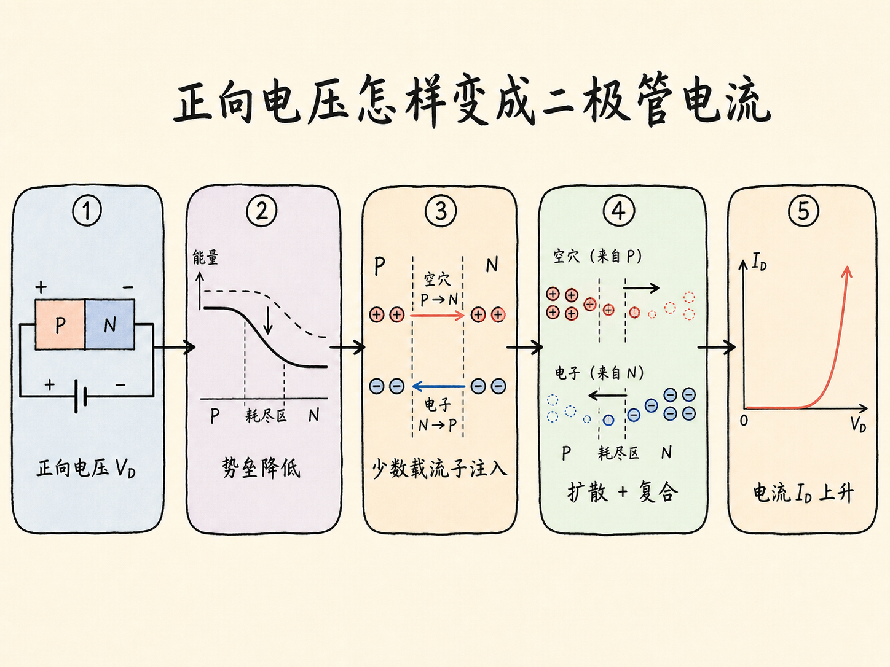
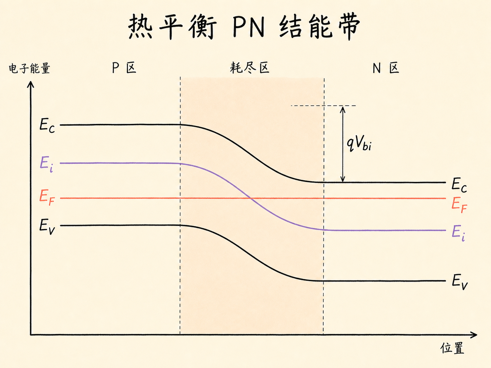
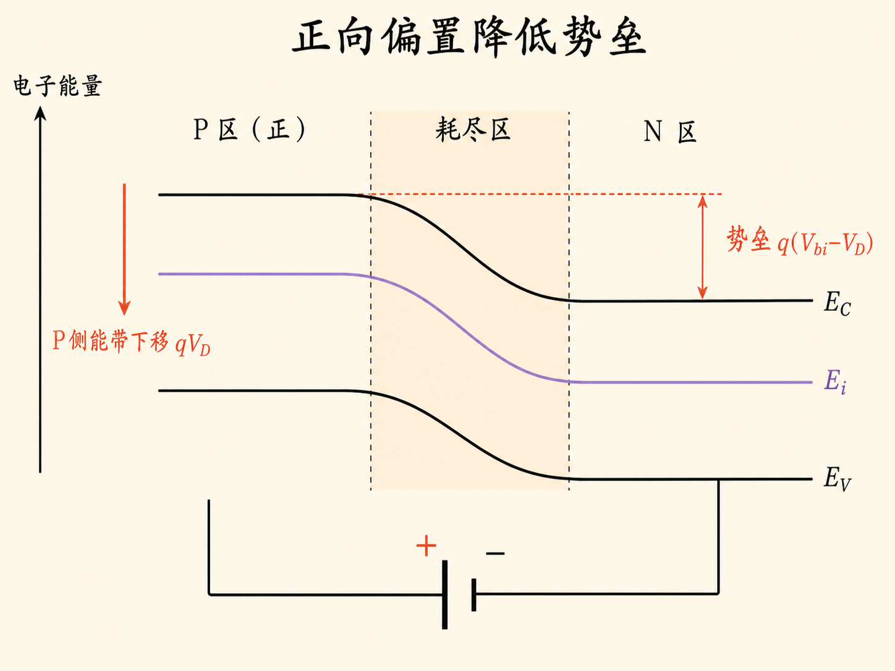
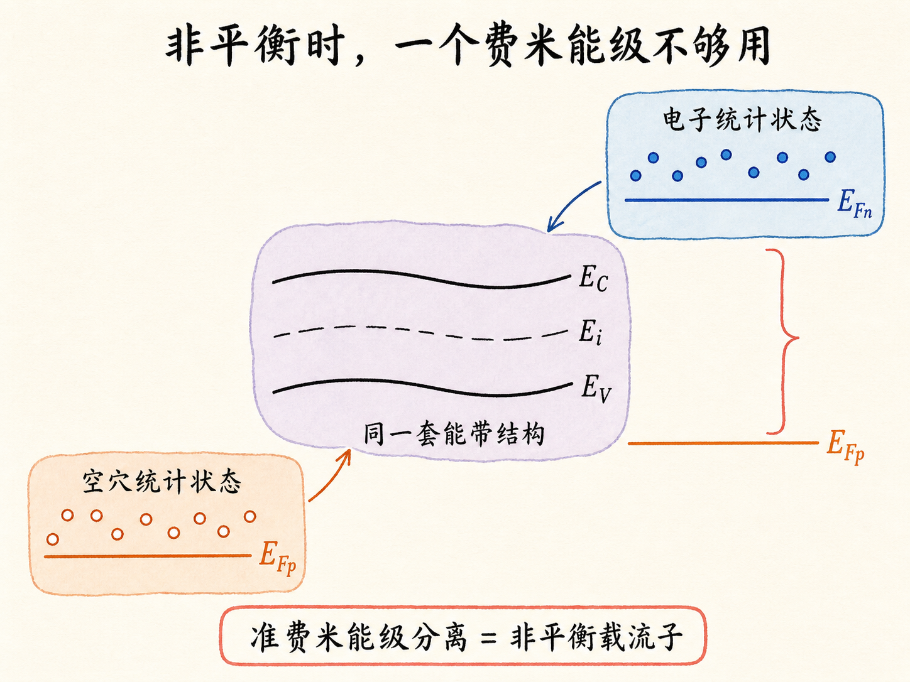
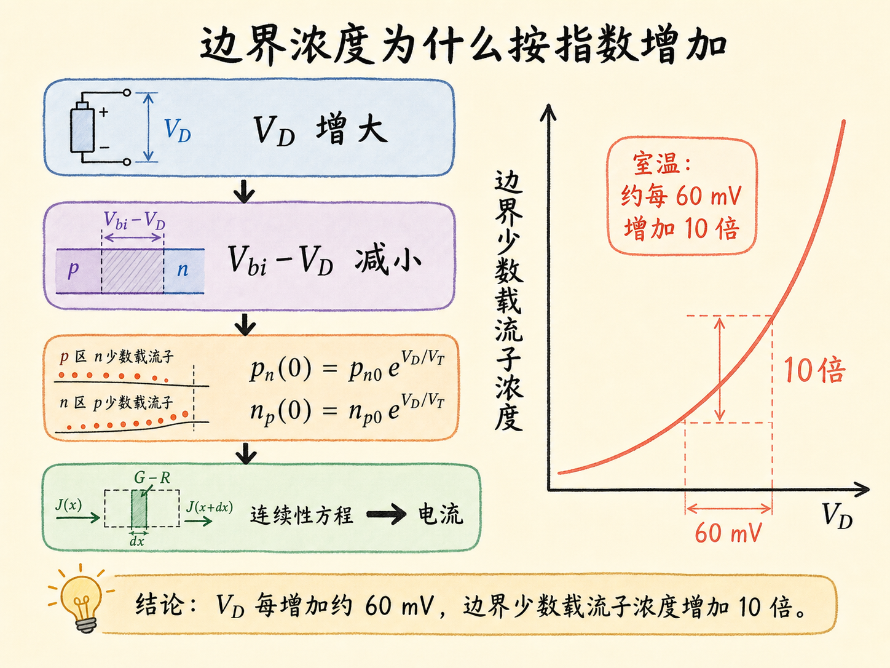

# 给 PN 结加上电压后，二极管为什么会导通？

一个没有外加电压的 PN 结，内部已经存在电场和内建势垒。这个势垒挡住两侧的多数载流子，让扩散与漂移彼此抵消，宏观上没有净电流。

二极管开始导通，并不是因为外加电压凭空“制造”了载流子，而是因为它改变了载流子越过结区的难度。正向电压把原来的势垒压低，更多空穴和电子得以跨过耗尽区；跨过去的数量又会随电压呈指数变化。这正是二极管电流快速上升的起点。

读完这篇，你会知道

- PN 结怎样变成一只有方向性的二极管
- 为什么 P 侧加正电压会让电子能带向下移动
- 正向偏压怎样把势垒从 $qV_{bi}$ 降低为 $q(V_{bi}-V_D)$
- 为什么加偏压后要用电子、空穴两个准费米能级
- 少数载流子边界浓度为什么包含 $e^{V_D/V_T}$

## 二极管要回答的核心问题：电压怎样变成电流

PN 结二极管在结构上并不神秘：一边是 P 型半导体，一边是 N 型半导体，中间形成耗尽区。P 侧耗尽区留下带负电的受主离子，N 侧留下带正电的施主离子。空间电荷建立内电场，内电场又形成内建电势 $V_{bi}$。

把这个结构接入电路后，我们真正想知道的是它的电流—电压关系：给定二极管两端电压 $V_D$，会流过多大的电流 $I_D$？

完整答案需要两层分析：

1. 用能带图看清外加电压如何改变势垒；
2. 用连续性方程求出注入载流子怎样在准中性区扩散和复合。

这一篇先完成第一层，并把第二层计算需要的边界条件准备好。

## 热平衡时，水平费米能级意味着什么

先画没有外加电压的 PN 结能带图。纵轴表示电子能量，图中有导带底 $E_C$、本征能级 $E_i$、价带顶 $E_V$ 和费米能级 $E_F$。

热平衡时，$E_F$ 必须贯穿整个 PN 结并保持水平。这里很关键：如果费米能级沿位置变化，就意味着不同位置的电子占据状态不同，系统仍有驱动力让载流子重新分布，也就还没有达到热平衡。

P 区在左、N 区在右时，$E_C$、$E_i$ 和 $E_V$ 从 P 侧到 N 侧整体向下弯曲，三条能带近似平行，带隙宽度保持不变。P 侧与 N 侧之间的能量落差就是 $qV_{bi}$。对多数载流子而言，它是一道势垒：阻碍 N 区电子继续向 P 区扩散，也阻碍 P 区空穴继续向 N 区扩散。

平衡不是“没有载流子运动”，而是两个方向的作用恰好抵消。浓度差驱动扩散，耗尽区电场驱动反向漂移；两者相等时，净电流为零。

## P 侧加正电压，为什么电子能量反而下降

现在让 P 侧相对于 N 侧为正，这就是正向偏置。假设 N 侧电势作为参考不动，P 侧电势升高 $V_D$。

直觉上，“电势升高”似乎应该在能带图上往上画，但电子带负电。电子势能满足

$$
E_{	ext{electron}}=-q\phi
$$

其中 $q$ 是元电荷的正值，$\phi$ 是电势。因此，P 侧电势升高时，P 侧电子能量反而降低。能带图上表现为 P 侧的 $E_C$、$E_i$ 和 $E_V$ 一起向下移动 $qV_D$。

对用户能直接观察到的影响是：原本阻挡多数载流子的能量台阶变矮了。电子与空穴更容易越过耗尽区，二极管电流开始迅速增大。

## 正向偏压真正改变的是势垒高度

热平衡势垒为 $qV_{bi}$。施加正向电压后，P 侧能带下降 $qV_D$，新势垒变为

$$
q(V_{bi}-V_D)
$$

这条式子就是后续推导的转轴。只要低注入、非简并、突变耗尽近似等条件成立，很多热平衡关系都可以把 $V_{bi}$ 替换成 $V_{bi}-V_D$，从而得到加偏压后的边界关系。

它也解释了正向与反向偏置的不对称：

- $V_D>0$ 时，势垒降低，多数载流子更容易跨结，形成明显注入；
- $V_D<0$ 时，势垒升高，多数载流子更难跨结，电流只剩很小的少数载流子分量。

外加电压还会改变耗尽区宽度。正向偏置使势垒和耗尽区宽度减小，反向偏置则使二者增大。不过，仅知道耗尽区变窄还不能计算电流；真正需要送入连续性方程的是耗尽区边缘的载流子浓度。

## 离开热平衡后，为什么一个费米能级不够用

热平衡时只有一个水平的 $E_F$。加上电压并产生电流后，器件进入非平衡状态，电子和空穴不再由同一个化学势描述。

因此要引入两个准费米能级：电子准费米能级 $E_{Fn}$ 和空穴准费米能级 $E_{Fp}$。它们分别记录电子群体与空穴群体的占据状态。两者分离，正是非平衡载流子存在的标志。

需要注意，这并不表示材料突然出现了两套能带。$E_C$、$E_i$ 和 $E_V$ 仍描述同一个半导体能带结构；两个准费米能级只是分别描述电子和空穴的统计状态。这个区分会影响后续计算：如果仍强行使用单一平衡费米能级，就无法正确描述注入后的载流子浓度。

## 从内建电势推出热平衡少数载流子浓度

为了把电压和边界浓度连接起来，先回到热平衡关系。对非简并、完全电离的突变 PN 结，内建电势为

$$
V_{bi}=V_T\ln\left(\frac{N_A N_D}{n_i^2}\right)
$$

其中 $N_A$ 是 P 区受主掺杂浓度，$N_D$ 是 N 区施主掺杂浓度，$n_i$ 是本征载流子浓度，$V_T=kT/q$ 是热电压。

在掺杂浓度远大于 $n_i$ 时，P 区多数空穴浓度 $p_{p0}\approx N_A$，N 区多数电子浓度 $n_{n0}\approx N_D$。热平衡质量作用定律为

$$
n_0p_0=n_i^2
$$

所以 N 区少数空穴浓度 $p_{n0}=n_i^2/N_D$。内建电势可以改写为

$$
V_{bi}=V_T\ln\left(\frac{p_{p0}}{p_{n0}}\right)
$$

整理后得到

$$
p_{n0}=p_{p0}e^{-V_{bi}/V_T}
$$

这个指数的含义很直接：势垒越高，能从 P 区跨到 N 区并作为少数载流子存在的空穴越少。

## 把势垒降低量代进去，边界浓度出现指数增长

加上正向电压后，势垒由 $V_{bi}$ 降为 $V_{bi}-V_D$。因此 N 侧耗尽区边缘的空穴浓度满足

$$
p_n(0)=p_p(0)e^{-(V_{bi}-V_D)/V_T}
$$

在低注入条件下，注入的少数载流子远少于多数载流子，P 区多数空穴浓度几乎不变，可近似令 $p_p(0)\approx p_{p0}$。再利用热平衡关系，就得到

$$
p_n(0)=p_{n0}e^{V_D/V_T}
$$

完全对称地，P 侧耗尽区边缘的少数电子浓度为

$$
n_p(0)=n_{p0}e^{V_D/V_T}
$$

这就是二极管指数特性的源头。正向电压并不是直接出现在电流公式里；它先把势垒降低，再把耗尽区边缘的少数载流子浓度按 $e^{V_D/V_T}$ 放大。连续性方程随后根据这两个边界值，求出载流子在准中性区内如何扩散和复合，浓度梯度最终形成电流。

以室温下 $V_T\approx25.9\,\text{mV}$ 为例，正向电压每增加约 $60\,\text{mV}$，理想边界浓度大约增加一个数量级。这就是硅二极管电流对电压极其敏感的根本原因之一。

## 这些结论依赖哪些条件

把 $V_{bi}$ 直接替换为 $V_{bi}-V_D$ 很方便，但不是无条件成立。这里至少用到了：

- 半导体非简并，载流子可用玻尔兹曼统计描述；
- 掺杂近似完全电离，并且 $N_A,N_D\gg n_i$；
- 低注入成立，多数载流子浓度没有被显著改变；
- 电压主要降落在耗尽区，准中性区电场较小；
- 器件尚未进入高注入、强复合、串联电阻主导或击穿状态。

这些条件决定了模型的使用边界。真实器件偏离理想指数关系时，往往不是 PN 结物理失效，而是某个被忽略的机制开始占主导。

## 最后收束：电压先改边界，边界再决定电流

PN 结二极管的正向导通可以压缩成一条因果链：**P 侧加正电压，使电子能带降低，内建势垒从 $qV_{bi}$ 变为 $q(V_{bi}-V_D)$；降低后的势垒让耗尽区边缘的少数载流子浓度按 $e^{V_D/V_T}$ 增加；这些载流子进入准中性区后扩散并复合，最终形成随电压快速增长的二极管电流。**

下一步不再是猜电流有多大，而是把 $p_n(0)$ 和 $n_p(0)$ 作为连续性方程的边界条件，求出完整的载流子空间分布，再从浓度梯度得到电流。
