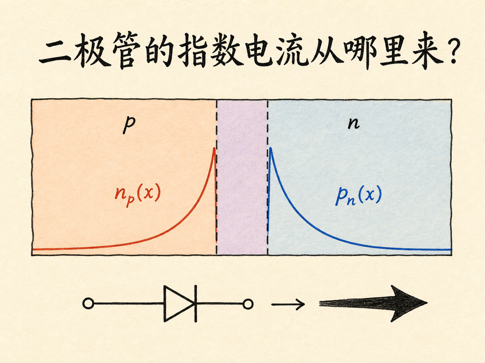
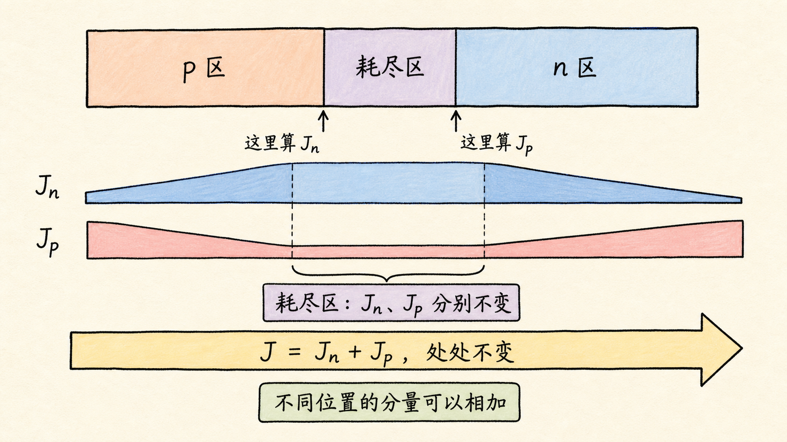
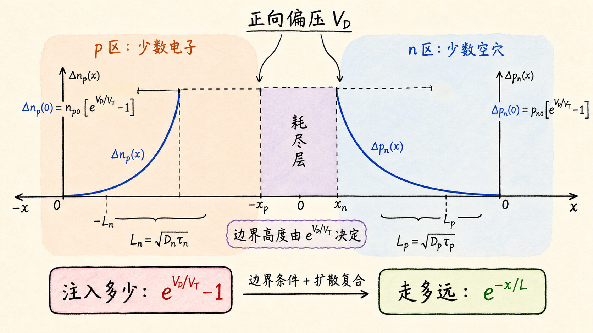
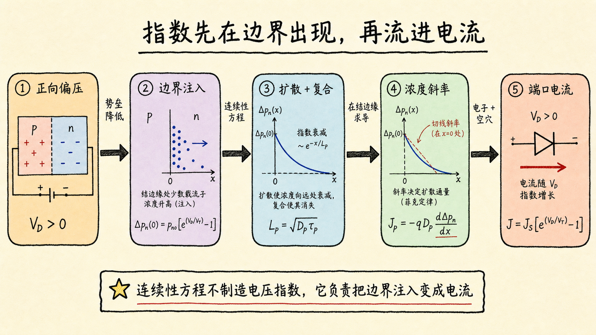

# 二极管的指数电流，是怎样从连续性方程里长出来的？

二极管方程 $I=I_s\left(e^{V_D/V_T}-1\right)$ 很容易背。难的是解释：为什么一个由 p 型区、n 型区和耗尽区组成的器件，最后会冒出一个指数？

答案不藏在某一步高深的积分里，而藏在一条因果链中：正向电压改变结边界的少数载流子浓度，连续性方程决定这些载流子进入准中性区后怎样消失，浓度梯度再变成扩散电流。指数首先出现在边界条件里，最后只是被电流“带了出来”。

读完这篇，你会知道

- 为什么只需要求 p 区的少数电子和 n 区的少数空穴
- 为什么可以在耗尽区两侧的不同位置分别计算电子电流和空穴电流
- 扩散长度 $L=\sqrt{D\tau}$ 到底表示什么
- 边界条件中的 “$-1$” 为什么不能漏
- 理想二极管方程依赖哪些假设，什么时候会失效

## 先别急着解方程，先把问题砍掉一半

正向偏置时，p 区空穴越过耗尽区进入 n 区，n 区电子也越过耗尽区进入 p 区。看起来四种载流子都在动：p 区有电子和空穴，n 区也有电子和空穴。

如果把四种浓度扰动全部写进方程，推导会很快失去物理图像。理想二极管分析先用低注入近似把问题简化。

以 n 区为例。它原本有大量多数电子，只有很少的平衡少数空穴。进入典型正向导通区后，注入空穴可以远多于原有的平衡少数空穴；但低注入真正要求的是，它们相对多数电子仍然很少：

$$
\Delta p_n \ll n_{n0}
$$
。

所以，注入可以显著改变少数空穴，却不足以明显改变多数电子。p 区同理，低注入要求：

$$
\Delta n_p \ll p_{p0}
$$
。

这就是低注入的真正作用。它不是说“注入量很小”，而是说注入量相对多数载流子仍小。于是我们只需解两个未知量：

- n 区的过剩少数空穴 $\Delta p_n$；
- p 区的过剩少数电子 $\Delta n_p$。

多数载流子并没有消失，它们仍负责维持电中性并补充复合；只是它们的相对浓度变化太小，不需要单独求一遍连续性方程。

## 为什么能在两个不同位置拼出同一个总电流

下一步先看耗尽区，而不是准中性区。

对空穴，连续性方程表达的是一件朴素的事：某一小段材料里的空穴数量变化，必须来自流入流出的差额、产生和复合：

$$
\dfrac{\partial p}{\partial t}=-\dfrac{1}{q}\dfrac{\partial J_p}{\partial x}+G_p-R_p
$$
。

在理想推导中，我们对耗尽区作三项假设：

1. 研究稳态，因此 $\partial p/\partial t=0$；
2. 耗尽区内产生可忽略；
3. 载流子穿越耗尽区很快，区内复合可忽略。

方程便只剩

$$
\dfrac{\partial J_p}{\partial x}=0
$$
。

这意味着空穴电流 $J_p$ 穿过耗尽区时不变。同理，电子电流 $J_n$ 也不变。

别把它误解为 $J_n$ 和 $J_p$ 在整个器件里都不变。进入准中性区后，注入的少数载流子会复合，少数载流子电流逐渐转移为多数载流子电流。真正处处不变的是总电流：

$$
J=J_n+J_p
$$
。

耗尽区的“分量电流分别守恒”给了我们一个计算捷径：在 p 侧耗尽区边缘计算电子电流，在 n 侧耗尽区边缘计算空穴电流，然后直接相加。虽然取的是两个位置，但它们分别穿过耗尽区而不损失，所以能拼成同一个总电流。

这一步的本质不是数学技巧，而是守恒律帮我们挑了两个最好算的位置。

## n 区中的空穴，为什么按指数衰减

现在只看 n 区。把 n 侧耗尽区边缘定义为 $x=0$，向 n 区内部为正方向。

准中性 n 区采用三项近似：

- 稳态：$\partial \Delta p_n/\partial t=0$；
- 没有光照等额外产生：$G_L=0$；
- 区内电场近似为零：空穴漂移电流可忽略。

空穴电流只剩扩散分量：

$$
J_p=-qD_p\dfrac{d\Delta p_n}{dx}
$$
。

把它代入连续性方程，得到

$$
D_p\dfrac{d^2\Delta p_n}{dx^2}=\dfrac{\Delta p_n}{\tau_p}
$$
。

左边描述扩散怎样摊平浓度，右边描述复合怎样消耗过剩空穴。两种过程竞争，决定了注入空穴能走多远。

定义

$$
L_p=\sqrt{D_p\tau_p}
$$
，

方程变成

$$
\dfrac{d^2\Delta p_n}{dx^2}=\dfrac{\Delta p_n}{L_p^2}
$$
。

$L_p$ 叫空穴扩散长度。它不是某个载流子一定会走过的固定路程，而是浓度衰减的特征尺度：

- $D_p$ 大，空穴扩散得快，来得及走得更远；
- $\tau_p$ 长，空穴更晚复合，也能走得更远；
- 两者共同给出 $L_p=\sqrt{D_p\tau_p}$。

方程的通解是

$$
\Delta p_n(x)=A e^{-x/L_p}+B e^{x/L_p}
$$
。

如果 n 区长度远大于 $L_p$，这是一个“长二极管”。远离结区时，注入造成的扰动必须消失。增长项 $e^{x/L_p}$ 会在远处发散，不符合物理边界，因此 $B=0$：

$$
\Delta p_n(x)=A e^{-x/L_p}
$$
。

所以指数衰减并不是我们事先猜出来的曲线，而是扩散—复合方程与远端边界条件共同选出的唯一物理解。

## 结边缘的边界条件，把电压放进了指数

还差常数 $A$。

上一阶段从能带和玻尔兹曼关系已经得到，正向偏压下 n 侧耗尽区边缘的总空穴浓度为

$$
p_n(0)=p_{n0}e^{V_D/V_T}
$$
。

这里最容易犯的错误，是直接把它当成 $\Delta p_n(0)$。但连续性方程求的是过剩浓度，不是总浓度：

$$
\Delta p_n(0)=p_n(0)-p_{n0}
$$
。

因此

$$
\Delta p_n(0)=p_{n0}\left(e^{V_D/V_T}-1\right)
$$
。

这就是 “$-1$” 的来源：必须扣掉偏压施加前就已经存在的平衡少数载流子。若漏掉它，$V_D=0$ 时会得到非零净电流，直接违反热平衡。

于是 n 区的完整解为

$$
\Delta p_n(x)=p_{n0}\left(e^{V_D/V_T}-1\right)e^{-x/L_p}
$$
。

p 区少数电子完全类似。若用 $x'$ 表示从 p 侧结边缘向 p 区内部的距离，则

$$
\Delta n_p(x')=n_{p0}\left(e^{V_D/V_T}-1\right)e^{-x'/L_n}
$$
，

其中 $L_n=\sqrt{D_n\tau_n}$。

现在可以看清两个不同的指数各自负责什么：

- $e^{V_D/V_T}$ 描述电压怎样提高结边缘注入；
- $e^{-x/L}$ 描述注入载流子怎样在准中性区内因复合而衰减。

一个管“注入多少”，一个管“进去以后走多远”。

## 对浓度曲线求一个斜率，电流就出来了

扩散电流取决于浓度梯度，而不是浓度本身。对 n 区空穴分布求导：

$$
\dfrac{d\Delta p_n}{dx}=-\dfrac{p_{n0}}{L_p}\left(e^{V_D/V_T}-1\right)e^{-x/L_p}
$$
。

代入 $J_p=-qD_p\,d\Delta p_n/dx$，并取结边缘 $x=0$：

$$
J_p(0)=q\dfrac{D_p p_{n0}}{L_p}\left(e^{V_D/V_T}-1\right)
$$
。

同理，p 侧结边缘的电子扩散电流为

$$
J_n(0)=q\dfrac{D_n n_{p0}}{L_n}\left(e^{V_D/V_T}-1\right)
$$
。

两者相加：

$$
J=q\left(\dfrac{D_n n_{p0}}{L_n}+\dfrac{D_p p_{n0}}{L_p}\right)\left(e^{V_D/V_T}-1\right)
$$
。

把括号里与电压无关的部分定义为反向饱和电流密度：

$$
J_s=q\left(\dfrac{D_n n_{p0}}{L_n}+\dfrac{D_p p_{n0}}{L_p}\right)
$$
。

理想二极管方程便出现了：

$$
J=J_s\left(e^{V_D/V_T}-1\right)
$$
。

若结面积为 $A_{\text{dev}}$，则

$$
I=I_s\left(e^{V_D/V_T}-1\right)
$$
，

其中 $I_s=A_{\text{dev}}J_s$。

到这里可以回答开头的问题：电流之所以呈指数，并不是连续性方程凭空制造了指数电压关系。连续性方程负责把边界注入变成空间浓度分布；真正对电压呈指数的，是耗尽区边缘的少数载流子边界条件。对空间分布求导以后，这个电压指数被完整保留下来。

## $J_s$ 为什么小，却决定了整条曲线

$J_s$ 由两侧平衡少数载流子浓度、扩散系数和扩散长度决定：

$$
J_s=q\left(\dfrac{D_n n_{p0}}{L_n}+\dfrac{D_p p_{n0}}{L_p}\right)
$$
。

其中 $n_{p0}$ 与 $p_{n0}$ 通常很小，所以 $J_s$ 也很小。但正向偏压下，它会乘上快速增长的 $e^{V_D/V_T}$，最终形成显著电流。

这对器件设计有直接影响：

- 掺杂改变平衡少数载流子浓度，因此会改变 $J_s$；
- 复合寿命与扩散系数改变扩散长度，也会改变电流前因子；
- 温度既改变 $V_T$，也强烈改变本征载流子浓度，因此二极管电流对温度很敏感。

也就是说，指数形状来自统计分布与结边界，曲线的纵向尺度则由材料、掺杂和复合输运共同决定。

## 这条方程不是无条件真理

刚才的推导成立，是因为我们搭起了一组理想条件：

- 低注入，多数载流子浓度近似不变；
- 稳态，不讨论纳秒或皮秒尺度的瞬态；
- 准中性区电场近似为零，少数载流子电流以扩散为主；
- 耗尽区内产生—复合可忽略；
- 准中性区足够长，远端扰动衰减到零；
- 非简并统计、突变耗尽区等前置近似成立；
- 欧姆接触与串联电阻尚未主导端口电压。

一旦条件改变，方程也要跟着变。短基区会改变边界条件；耗尽区复合显著时，理想因子可能接近 2；高注入会破坏“多数载流子不变”；大电流下串联电阻会吃掉一部分端电压。

所以，工程上更应该记住推导链，而不是只记一条式子。知道每个假设放在哪里，测量曲线偏离理想方程时才知道该去查哪一段物理机制。

## 最后收束：指数先出现在边界，再流进电流

整条推导可以压缩成四步：

1. 正向偏压把结边缘少数载流子浓度提高到平衡值的 $e^{V_D/V_T}$ 倍。
2. 扣除平衡浓度，得到过剩边界值 $p_{n0}(e^{V_D/V_T}-1)$ 与 $n_{p0}(e^{V_D/V_T}-1)$。
3. 连续性方程让过剩载流子以扩散长度 $L=\sqrt{D\tau}$ 为尺度向远端衰减。
4. 浓度梯度产生扩散电流，两侧分量相加得到 $J=J_s(e^{V_D/V_T}-1)$。

一句话复述：**正向电压决定结边缘注入，扩散与复合决定空间斜率，斜率变成电流；二极管的指数，先长在边界条件里，再被连续性方程送到端口。**
