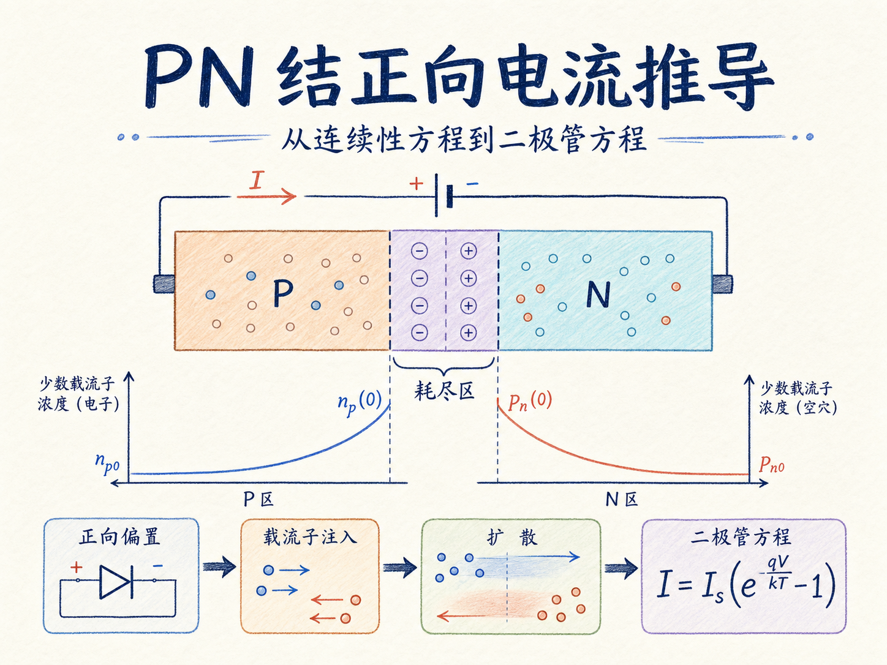
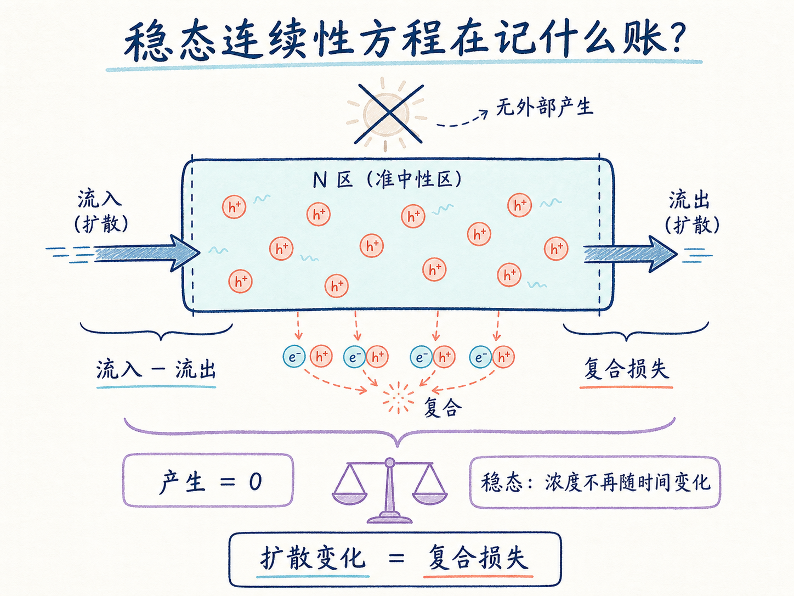
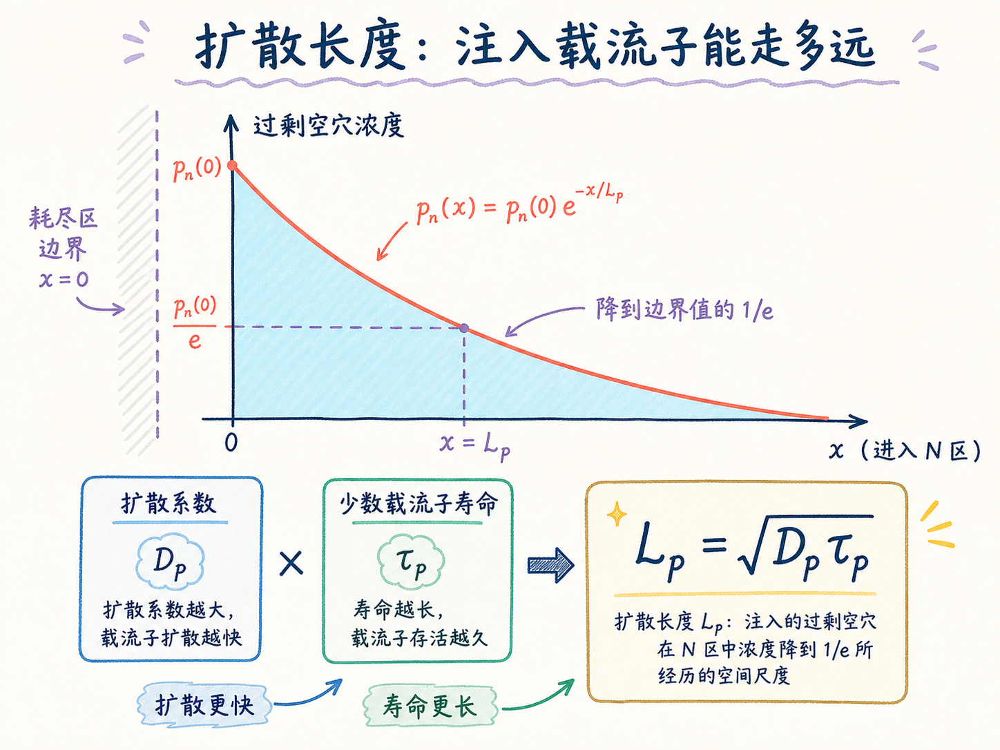
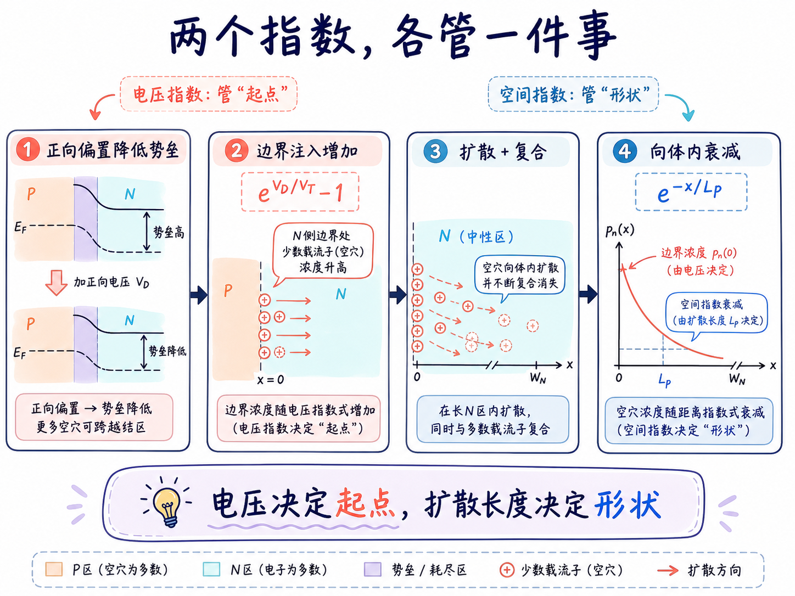
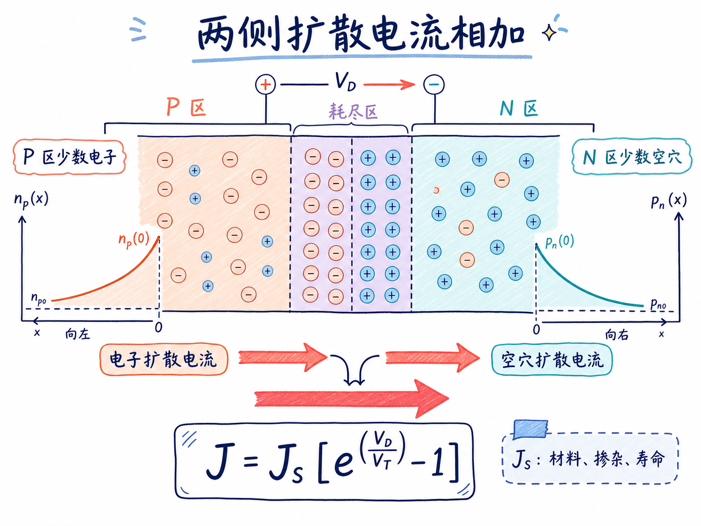

# PN 结正向电流：二极管方程是怎样从连续性方程长出来的？

理想二极管方程 $J=J_S(e^{V_D/V_T}-1)$ 看起来像一个突然出现的经验公式：电压进到指数里，前面再乘一个常数。可如果继续追问，真正需要解释的是两件事：这个指数从哪里来？前面的 $J_S$ 又装进了哪些器件物理？

答案藏在耗尽区外的准中性区。正向偏置降低结势垒，把少数载流子注入对侧；这些载流子一边扩散，一边复合。连续性方程描述它们如何随位置衰减，扩散电流公式再把这个浓度斜率变成电流。二极管方程就是这两步接起来后的结果。

读完这篇，你会知道

- 为什么求二极管电流要先求少数载流子的空间分布
- 稳态、无外部产生和准中性区近似怎样简化连续性方程
- 扩散长度 $L_p=\sqrt{D_p\tau_p}$ 的物理意义是什么
- 长二极管边界条件为什么只留下衰减指数项
- $J_S$ 与指数因子分别代表哪一部分器件物理

## 总电流为什么可以拆到耗尽区两侧去算

把 PN 结的冶金结附近设为耗尽区，P 区在左、N 区在右。稳态下，器件任意截面通过的总电流密度都相同，因此

$$
J=J_n+J_p
$$

这里 $J_n$ 是电子电流密度，$J_p$ 是空穴电流密度。正向偏置时，P 区的空穴越过势垒注入 N 区，成为 N 区少数载流子；N 区的电子则注入 P 区，成为 P 区少数载流子。

所以最直接的做法不是在耗尽区内部追踪所有载流子，而是分别求出：N 侧耗尽区边界处的空穴扩散电流，以及 P 侧耗尽区边界处的电子扩散电流。把两者相加，就得到总电流。

## 第一步：用连续性方程追踪注入空穴

先看 N 区。令 $x=0$ 位于 N 侧耗尽区边界，$x>0$ 指向 N 区内部。用 $\Delta p_n(x)$ 表示 N 区相对于热平衡值多出来的空穴浓度。

一维空穴连续性方程可以写成

$$
\frac{\partial \Delta p_n}{\partial t}=-\frac{1}{q}\frac{\partial J_p}{\partial x}+G_L-\frac{\Delta p_n}{\tau_p}
$$

每一项都在做载流子“记账”：左边记录过剩空穴随时间的变化；电流散度记录有多少空穴流入或流出；$G_L$ 表示光照等外部产生；$\Delta p_n/\tau_p$ 表示过剩空穴因复合而消失，其中 $\tau_p$ 是空穴寿命。

为了得到最基础的理想二极管模型，我们采用三个简化条件：

- **稳态**：加压后的快速瞬态已经结束，因此 $\partial \Delta p_n/\partial t=0$；
- **无外部产生**：没有光照或其他激励，因此 $G_L=0$；
- **准中性区电场近似为零**：耗尽区外的 N 区满足 $E\approx0$，因此少数空穴电流以扩散为主。

空穴扩散电流为 $J_p=-qD_p\,d\Delta p_n/dx$，其中 $D_p$ 是空穴扩散系数。代回连续性方程，得到

$$
D_p\frac{d^2\Delta p_n}{dx^2}=\frac{\Delta p_n}{\tau_p}
$$

这一步把一个包含时间、产生、复合和输运的完整问题，压缩成了只关于位置的二阶微分方程。

## 扩散长度：载流子能走多远再消失

把方程两边除以 $D_p$，并定义

$$
L_p=\sqrt{D_p\tau_p}，
$$

便得到

$$
\frac{d^2\Delta p_n}{dx^2}=\frac{\Delta p_n}{L_p^2}
$$

$L_p$ 叫作空穴扩散长度。它把“移动能力”和“存活时间”合在一起：$D_p$ 越大，空穴扩散得越快；$\tau_p$ 越长，空穴在复合前存活得越久。两者共同决定注入空穴能深入 N 区多远。

这也解释了为什么 $L_p$ 不是随手为了简化符号而造出的常数。它直接给出了浓度曲线的空间衰减尺度：走过一个 $L_p$，过剩浓度降为边界值的 $1/e$。

微分方程的通解为

$$
\Delta p_n(x)=A e^{-x/L_p}+B e^{x/L_p}
$$

接下来，数学不能自己决定 $A$ 和 $B$；必须回到器件的物理边界。

## 长二极管边界条件为什么删掉增长项

先假设 N 区长度远大于 $L_p$，也就是一只“长二极管”。远离结区时，注入造成的扰动应当消失，$\Delta p_n(x)$ 应回到零，而不是无限增大。

当 $x\rightarrow\infty$ 时，$e^{x/L_p}$ 会发散。要满足远端边界，唯一可能是 $B=0$。因此

$$
\Delta p_n(x)=A e^{-x/L_p}
$$

这条结论有明确适用范围。如果准中性区长度与扩散长度相当，远端接触的边界条件就会影响浓度分布，增长项不能简单删除，需要使用有限基区解。

第二个边界条件在耗尽区边缘。正向电压 $V_D$ 把势垒从 $V_{bi}$ 降低为 $V_{bi}-V_D$，于是 N 侧边界的少数空穴总浓度相对平衡值被放大为

$$
p_n(0)=p_{n0}e^{V_D/V_T}
$$

其中 $p_{n0}$ 是 N 区热平衡少数空穴浓度，$V_T=kT/q$ 是热电压。需要注意，我们求的是**过剩**空穴而不是总空穴，所以必须减去平衡背景：

$$
\Delta p_n(0)=p_n(0)-p_{n0}=p_{n0}\left(e^{V_D/V_T}-1\right)
$$

因此 $A=p_{n0}(e^{V_D/V_T}-1)$，完整分布为

$$
\Delta p_n(x)=p_{n0}\left(e^{V_D/V_T}-1\right)e^{-x/L_p}
$$

这个式子包含两种完全不同的指数：$e^{V_D/V_T}$ 描述外加电压怎样提高边界注入量；$e^{-x/L_p}$ 描述注入载流子怎样在准中性区内因扩散与复合而衰减。不要把它们混成同一件事。

## 从浓度斜率得到空穴扩散电流

电流不是由“有多少过剩空穴”单独决定，而是由它们的空间梯度决定。对浓度分布求导：

$$
\frac{d\Delta p_n}{dx}=-\frac{p_{n0}}{L_p}\left(e^{V_D/V_T}-1\right)e^{-x/L_p}
$$

代入 $J_p=-qD_p\,d\Delta p_n/dx$，再取耗尽区边界 $x=0$，得到

$$
J_p(0)=q\frac{D_p p_{n0}}{L_p}\left(e^{V_D/V_T}-1\right)
$$

负的浓度斜率与扩散电流公式中的负号相消，所以正向偏置下的空穴常规电流取正方向。

P 区的少数电子完全对称。用 $n_{p0}$ 表示 P 区热平衡少数电子浓度，$D_n$ 和 $L_n$ 分别表示电子扩散系数与扩散长度，可得

$$
J_n(0)=q\frac{D_n n_{p0}}{L_n}\left(e^{V_D/V_T}-1\right)
$$

## 两侧相加，二极管方程出现了

把电子与空穴两部分相加：

$$
J=q\left(\frac{D_p p_{n0}}{L_p}+\frac{D_n n_{p0}}{L_n}\right)\left(e^{V_D/V_T}-1\right)
$$

定义反向饱和电流密度

$$
J_S=q\left(\frac{D_p p_{n0}}{L_p}+\frac{D_n n_{p0}}{L_n}\right)，
$$

就得到熟悉的理想二极管方程

$$
J=J_S\left(e^{V_D/V_T}-1\right)
$$

现在可以看清公式的分工：指数项由耗尽区边界的玻尔兹曼关系决定，它告诉我们正向电压如何改变载流子注入；$J_S$ 则由两侧少数载流子浓度、扩散系数和扩散长度决定，它告诉我们材料与掺杂允许多大的扩散电流。

若器件面积为 $A_D$，总电流就是 $I=A_DJ$。面积只负责把单位面积电流放大，并不改变电压的指数依赖。

## 这条理想公式省略了什么

这套推导还隐含了低注入条件，即注入少数载流子没有显著改变多数载流子浓度；同时假设准中性区内电场很小、耗尽区复合可忽略、温度均匀，并采用长二极管边界。

真实二极管偏离理想关系时，通常不是指数规律“突然失效”，而是某个被忽略的机制开始占主导。例如低电流区可能受耗尽区复合影响，高电流区可能进入高注入或受到串联电阻限制，短基区器件则需要改写边界条件。

这些条件对器件分析的影响很直接：$J_S$ 不是一个与工艺无关的拟合常数。掺杂改变 $p_{n0}$ 与 $n_{p0}$，复合寿命改变 $L_n$ 与 $L_p$，缺陷和温度也会改变电流。因此，同样的外加电压可以在不同工艺、不同面积和不同温度下产生数量级不同的电流。

## 最后收束：一个边界指数，两个空间衰减

理想二极管方程可以压缩成一条可复述的因果链：**正向电压降低势垒，使耗尽区边界的少数载流子浓度按 $e^{V_D/V_T}$ 增加；载流子进入准中性区后按扩散长度指数衰减；浓度梯度形成扩散电流；两侧电流相加得到 $J=J_S(e^{V_D/V_T}-1)$。**

记住这条链，比单独背公式更可靠。只要能写出连续性方程、给出正确边界条件，再把浓度斜率代回扩散电流，二极管方程就可以从器件物理重新推出来。
