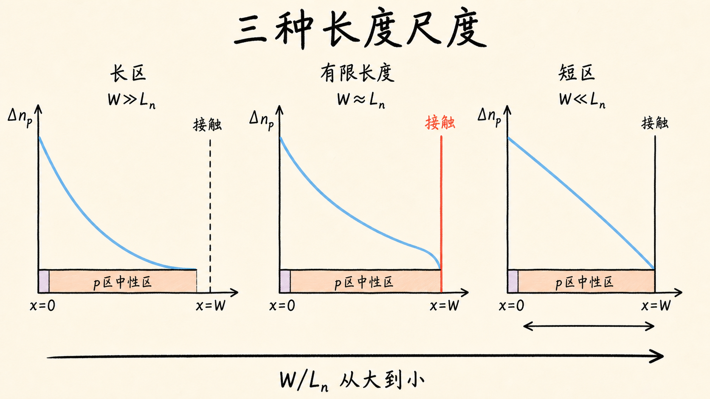
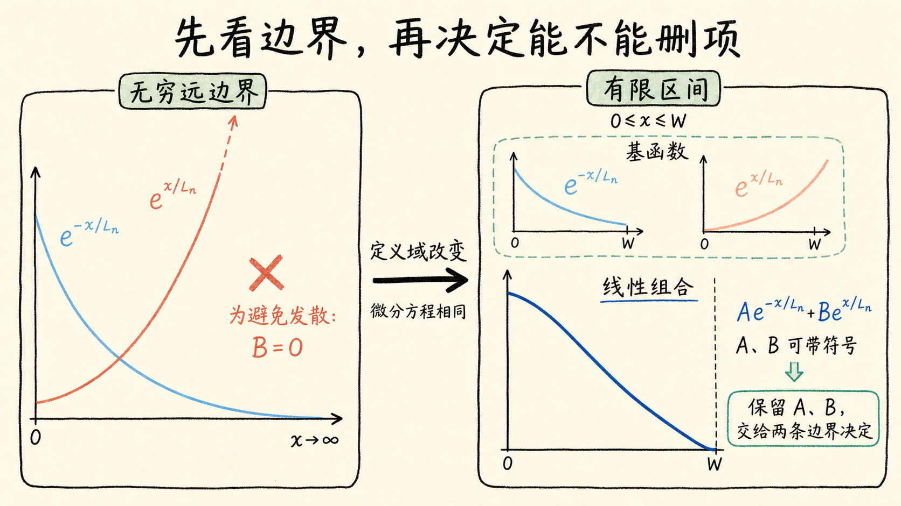
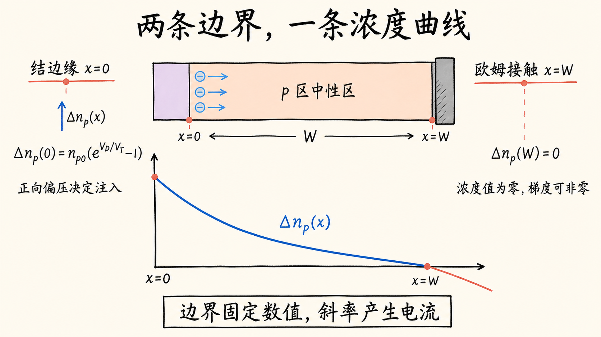
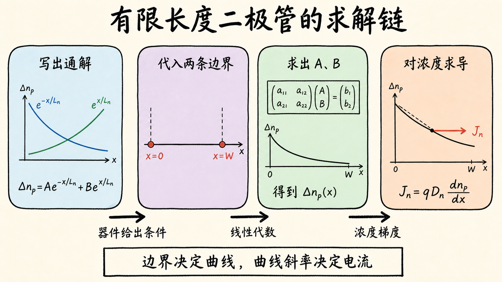

# 有限长度二极管：第二个指数项为什么不能再扔掉？

推导二极管电流时，我们经常看到一条漂亮的指数衰减曲线：少数载流子刚越过耗尽区时浓度最高，随后一路衰减，远处回到平衡值。这个图像很顺手，却偷偷借用了一个条件——中性区必须足够长。

如果 p 区宽度只有 $10\,\mu\text{m}$，电子扩散长度却有 $6\,\mu\text{m}$，载流子还没来得及“忘掉”结边缘的注入，器件就已经碰到金属接触了。此时把器件末端当成无穷远，不是近似得粗糙一点，而是边界条件用错了。

读完这篇，你会知道

- “有限长度”真正改变的是哪一个推导前提
- 为什么通解里的两个指数项都必须保留
- 耗尽区边缘怎样给出第一条边界条件
- 欧姆接触怎样给出第二条边界条件
- 为什么“远端过剩浓度为零”不等于“远端浓度梯度为零”

## 所谓中等长度，是近似失效，不是器件换了名字

先把问题钉在一个无量纲比值上：

$$
\dfrac{W}{L_n}
$$
。

这里 $W$ 是 p 侧准中性区的宽度，$L_n$ 是 p 区少数电子的扩散长度。扩散长度满足：

$$
L_n=\sqrt{D_n\tau_n}
$$
，

其中 $D_n$ 是电子扩散系数，$\tau_n$ 是电子寿命。它描述一名过剩少数电子在复合之前，通常能扩散多远。

当 $W\gg L_n$ 时，电子在抵达接触端以前已经基本复合完。对结边缘附近的分布而言，器件末端在哪里几乎不重要，这就是长二极管近似。

当 $W$ 与 $L_n$ 同量级时，接触端会直接影响整个中性区的浓度分布。器件结构没有变，连续性方程也没有变；失效的是“远端可以当成无穷远”的假设。

这个区别会直接影响电流。扩散电流由浓度曲线的斜率决定，而接触端一旦改变整条曲线，也就改变了结边缘的斜率。

## 连续性方程没变，能不能删项却变了

在耗尽区之外，先只看 p 区中的少数电子。令 $\Delta n_p(x)$ 表示相对热平衡值增加的电子浓度。稳态、低注入且准中性区电场可忽略时，连续性方程化为：

$$
\dfrac{d^2\Delta n_p(x)}{dx^2}=\dfrac{\Delta n_p(x)}{L_n^2}
$$
。

这条二阶微分方程的一般解是：

$$
\Delta n_p(x)=Ae^{-x/L_n}+Be^{x/L_n}
$$
。

第一项随 $x$ 增大而衰减，第二项随 $x$ 增大而增长。看到“增长”不要急着认定它不物理；它是否能保留，取决于定义域和边界条件。

如果中性区被近似为 $x\rightarrow\infty$，为了让浓度保持有限，确实只能令 $B=0$。但有限长度器件的定义域只是 $0\le x\le W$。$e^{x/L_n}$ 在这个有限区间内完全有限，所以不能在求解前把它删掉。

这就是问题的本质：**长二极管把“无穷远处不能发散”当作一条边界条件；有限长度二极管没有这个边界。**

## 两个未知系数，需要两条真实边界条件

$A$ 和 $B$ 是两个未知数。要确定它们，必须找到两个位置，在那里我们知道 $\Delta n_p$ 应该是多少。

为了把坐标说清楚，令：

- $x=0$：耗尽区的 p 侧边缘；
- $x=W$：p 区远端的理想欧姆接触。

于是，原本抽象的求解任务变成一个很具体的问题：

1. 电子刚被注入 p 区时，过剩浓度是多少？
2. 电子走到金属接触时，过剩浓度是多少？

这两个答案就是两条边界条件。

## 第一条边界：正向偏压决定结边缘注入多少

正向偏压 $V_D$ 降低 PN 结势垒，使耗尽区边缘的少数载流子浓度按指数增加。

在低注入近似下，p 区边缘的少数电子浓度为：

$$
n_p(0)=n_{p0}e^{V_D/V_T}
$$
，

其中 $n_{p0}$ 是 p 区热平衡少数电子浓度，$V_T$ 是热电压。

我们求的是相对平衡值的增量，因此：

$$
\Delta n_p(0)=n_p(0)-n_{p0}=n_{p0}\left(e^{V_D/V_T}-1\right)
$$
。

把 $x=0$ 代入通解：

$$
A+B=\Delta n_p(0)
$$
。

这条式子把上一阶段的 PN 结势垒分析，接到了这一阶段的连续性方程上。外加电压没有直接替我们算出电流，它先规定了浓度分布的起点。

## 第二条边界：欧姆接触把远端拉回热平衡

有限长度器件最关键的新信息，来自 $x=W$。

在理想欧姆接触模型里，金属接触是一个强载流子库。它把接触附近的少数载流子浓度钳位在热平衡值，因此过剩浓度满足：

$$
\Delta n_p(W)=0
$$
。

代入通解：

$$
Ae^{-W/L_n}+Be^{W/L_n}=0
$$
。

这里要避开一个很容易混淆的说法：$\Delta n_p(W)=0$ 并不意味着 $\left.d\Delta n_p/dx\right|_{x=W}=0$。

前者说的是“接触处的浓度值回到平衡”；后者说的是“接触处的浓度曲线是水平的”。这是两种完全不同的边界条件。扩散电流与浓度梯度有关，所以即使过剩浓度在接触处为零，梯度和电流仍然可以不为零。

## 把物理边界写成一个二元方程组

现在，两条边界条件可以并排写成：

$$
A+B=\Delta n_p(0)
$$
，

$$
Ae^{-W/L_n}+Be^{W/L_n}=0
$$
。

也可以写成矩阵形式：

$$
\begin{bmatrix}1&1\\e^{-W/L_n}&e^{W/L_n}\end{bmatrix}\begin{bmatrix}A\\B\end{bmatrix}=\begin{bmatrix}\Delta n_p(0)\\0\end{bmatrix}
$$
。

数学上，这只是一个二元一次方程组。物理上，两行却各有明确分工：

- 第一行由 PN 结注入决定；
- 第二行由器件末端接触决定。

解出 $A$、$B$ 后，就能得到整个 p 区的 $\Delta n_p(x)$。再对它求导：

$$
J_n(x)=qD_n\dfrac{dn_p(x)}{dx}
$$
，

就能把浓度分布转成电子扩散电流密度。n 区少数空穴的推导完全对称，只需换成 $D_p$、$\tau_p$、$L_p$ 和 $\Delta p_n(x)$。

这一节真正完成的不是最后一行电流公式，而是把问题变成了一个可解且边界正确的方程组。下一步求解 $A,B$ 时，$W/L_n$ 会自然进入结果；长二极管和短二极管也会作为同一个通用解的两个极限出现。

## 最后收束：近似能删掉一项，边界才能决定能不能删

有限长度二极管与长二极管使用同一条连续性方程。两者的区别，不在微分方程，而在器件末端是否离结足够远。

当末端可以视为无穷远时，“不能发散”让增长指数项消失；当末端位于有限的 $W$ 处时，必须保留两项，再由结边缘和欧姆接触两条真实边界共同决定它们。

一句话复述：**不是看到增长指数项就把它删掉，而是先问器件的边界在哪里；边界条件才有权决定哪一项消失。**
