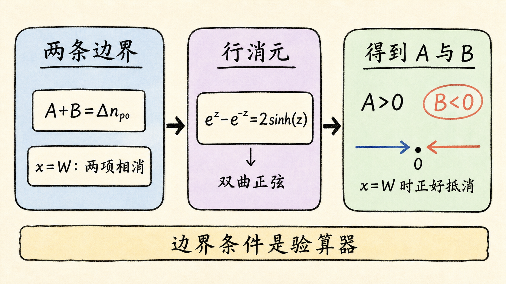
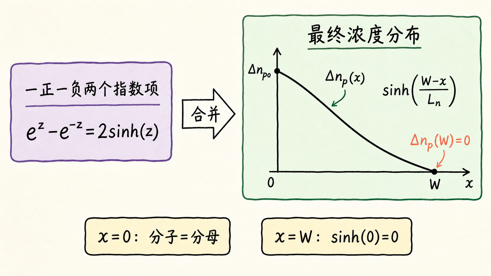
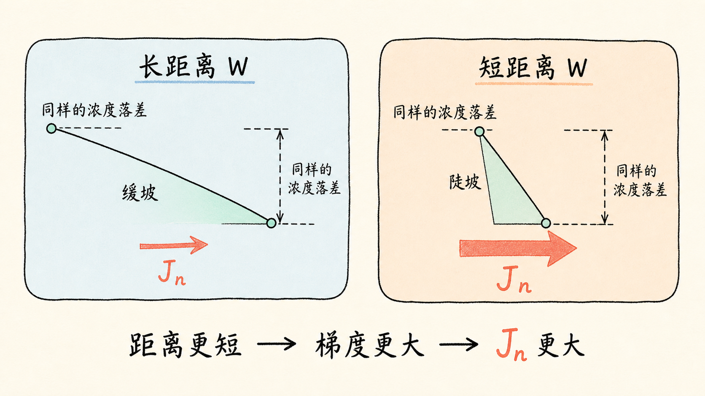
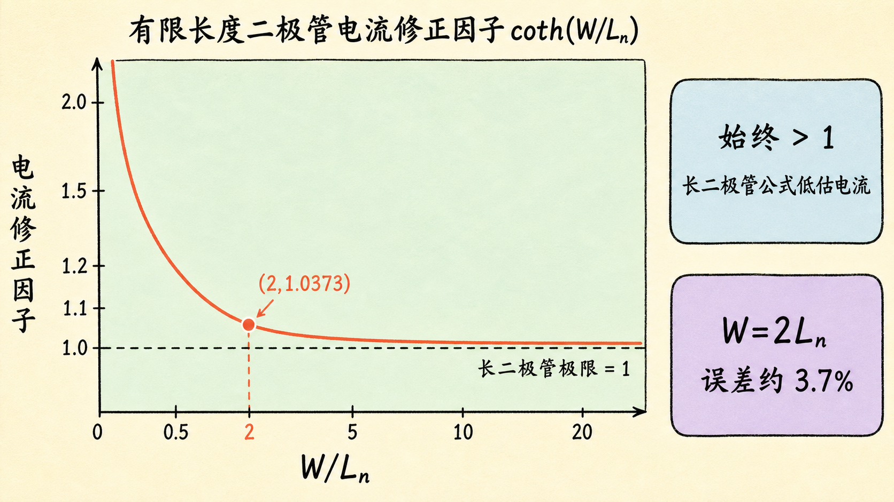

# 有限长度二极管：为什么中性区变短，反向饱和电流反而变大？

同一个 PN 结、同一组材料参数、同一个外加电压，只把中性区做短一点，电流会怎样变化？

长二极管公式容易让人产生一种直觉：少数载流子扩散由材料的扩散系数和寿命决定，器件远端只要不在耗尽区里，似乎不该影响结边缘电流。有限长度推导给出的答案恰好相反——远端接触会改变整条浓度曲线的斜率，因此反向饱和电流密度会增大。

读完这篇，你会知道

- 怎样从两条边界条件解出通解系数 $A$ 和 $B$
- 为什么解中必须出现双曲正弦 $\sinh$
- 有限长度怎样通过 $\coth(W/L_n)$ 修正电流
- 为什么长二极管公式一定低估有限长度器件的电流
- $W\ge 2L_n$ 为什么已经接近长二极管极限

## 先把上一节留下的方程组接起来

只看 p 区中的少数电子。令 $x=0$ 位于耗尽区的 p 侧边缘，$x=W$ 位于远端理想欧姆接触。稳态、低注入、准中性区电场可忽略时，过剩电子浓度的通解是：

$$
\Delta n_p(x)=Ae^{-x/L_n}+Be^{x/L_n}
$$
。

两条边界条件分别是：

$$
\Delta n_p(0)=\Delta n_{p0}
$$
，

$$
\Delta n_p(W)=0
$$
。

这里为了缩短推导，先把结边缘注入量记作：

$$
\Delta n_{p0}\equiv n_{p0}\left(e^{V_D/V_T}-1\right)
$$
。

把两个边界代入通解：

$$
A+B=\Delta n_{p0}
$$
，

$$
Ae^{-W/L_n}+Be^{W/L_n}=0
$$
。

这一步的物理意义很清楚：第一行规定曲线从多高的位置出发，第二行要求曲线在金属接触处回到平衡。接下来虽然是代数，但每个符号都仍然受这两个物理边界约束。

## 解 $A$ 和 $B$：最容易丢的是负号

把方程写成增广矩阵：

$$
\left[\begin{array}{cc|c}1&1&\Delta n_{p0}\\e^{-W/L_n}&e^{W/L_n}&0\end{array}\right]
$$
。

第二行减去第一行乘以 $e^{-W/L_n}$：

$$
\left[\begin{array}{cc|c}1&1&\Delta n_{p0}\\0&e^{W/L_n}-e^{-W/L_n}&-\Delta n_{p0}e^{-W/L_n}\end{array}\right]
$$
。

指数式很长，但它恰好符合双曲正弦的定义：

$$
2\sinh z=e^z-e^{-z}
$$
。

于是：

$$
B=-\Delta n_{p0}\dfrac{e^{-W/L_n}}{2\sinh(W/L_n)}
$$
，

$$
A=\Delta n_{p0}\dfrac{e^{W/L_n}}{2\sinh(W/L_n)}
$$
。

这里最关键的是 $B$ 前面的负号。它不是代数装饰，而是满足远端边界的必要条件。把 $x=W$ 代回去，$Ae^{-W/L_n}$ 与 $Be^{W/L_n}$ 必须一正一负、大小相等，才能让 $\Delta n_p(W)=0$。

如果漏掉这个负号，后面即使每一步求导都正确，得到的浓度分布也不可能满足接触边界。检查复杂推导时，与其从头盯每一个变形，不如优先把最终表达式代回两个边界；边界条件是最直接的验算器。

## 两个指数项，最后合成一条双曲正弦曲线

把 $A$ 和 $B$ 代回通解：

$$
\Delta n_p(x)=\dfrac{\Delta n_{p0}}{2\sinh(W/L_n)}\left[e^{(W-x)/L_n}-e^{-(W-x)/L_n}\right]
$$
。

方括号内仍然是 $e^z-e^{-z}$，因此：

$$
\Delta n_p(x)=\Delta n_{p0}\dfrac{\sinh\left((W-x)/L_n\right)}{\sinh(W/L_n)}
$$
。

这条式子看起来比两个指数项复杂，实际却更容易读：

- 当 $x=0$ 时，分子和分母相同，所以 $\Delta n_p(0)=\Delta n_{p0}$；
- 当 $x=W$ 时，分子变成 $\sinh(0)=0$，所以 $\Delta n_p(W)=0$；
- $W/L_n$ 直接控制曲线的形状，器件长度效应被明确保留下来。

把结边缘注入量展开，得到适用于任意长度的浓度分布：

$$
\Delta n_p(x)=n_{p0}\left(e^{V_D/V_T}-1\right)\dfrac{\sinh\left((W-x)/L_n\right)}{\sinh(W/L_n)}
$$
。

双曲函数没有引入新的物理过程，它只是把成对出现的指数函数压缩成更容易检验边界的写法。

## 电流不看浓度本身，而看浓度曲线有多陡

少数电子扩散电流由浓度梯度决定。对上式求导：

$$
\dfrac{d\Delta n_p}{dx}=-\dfrac{\Delta n_{p0}}{L_n}\dfrac{\cosh\left((W-x)/L_n\right)}{\sinh(W/L_n)}
$$
。

负号表示浓度沿 $+x$ 方向下降。电子带负电，因此电子运动方向与常规电流方向相反；不同坐标约定会改变中间式的符号。为了避免让符号遮住重点，下面写结边缘正向电流的幅值。

在 $x=0$ 处：

$$
J_n(0)=\dfrac{qD_nn_{p0}}{L_n}\dfrac{\cosh(W/L_n)}{\sinh(W/L_n)}\left(e^{V_D/V_T}-1\right)
$$
。

由于：

$$
\coth z=\dfrac{\cosh z}{\sinh z}
$$
，

所以：

$$
J_n(0)=\dfrac{qD_nn_{p0}}{L_n}\coth\left(\dfrac{W}{L_n}\right)\left(e^{V_D/V_T}-1\right)
$$
。

把与外加电压无关的部分定义为电子反向饱和电流密度分量：

$$
J_{n,s}=\dfrac{qD_nn_{p0}}{L_n}\coth\left(\dfrac{W}{L_n}\right)
$$
。

这就是有限长度带来的全部修正：材料参数决定的长二极管结果，乘上一个只由 $W/L_n$ 决定的无量纲因子。

## $\coth(W/L_n)$ 到底改变了什么

长二极管的电子反向饱和电流密度分量是：

$$
J_{n,s}^{(\infty)}=\dfrac{qD_nn_{p0}}{L_n}
$$
。

因此：

$$
\dfrac{J_{n,s}}{J_{n,s}^{(\infty)}}=\coth\left(\dfrac{W}{L_n}\right)
$$
。

现在可以直接读出三个结论。

第一，$\coth z>1$ 对所有 $z>0$ 都成立。因此任何有限的中性区，只要远端采用这里的理想欧姆接触边界，电流都大于长二极管公式给出的值。长二极管结果不是随机偏高或偏低，而是一个确定的低估。

第二，当 $W/L_n$ 很大时，$\coth(W/L_n)\rightarrow1$。远端接触离结足够远，载流子在到达接触前已经基本复合，器件自然回到长二极管极限。

第三，当 $W/L_n$ 很小时，$\coth z\approx1/z$，因此：

$$
J_{n,s}\approx\dfrac{qD_nn_{p0}}{W}
$$
。

此时控制梯度的有效长度从扩散长度 $L_n$ 变成了几何宽度 $W$。同样的结边缘过剩浓度必须在更短距离内降到零，曲线更陡，扩散电流就更大。

这就是“器件变短，电流反而增大”的物理原因。不是材料突然扩散得更快，而是接触端迫使相同的浓度落差发生在更短的距离里。

## $W=2L_n$ 已经有多接近长二极管

双曲余切收敛得很快：

$$
\coth(2)\approx1.0373
$$
。

也就是说，当 $W=2L_n$ 时，有限长度结果只比长二极管近似高约 $3.7\%$。如果工程误差允许这个量级，那么 $W\ge2L_n$ 已经可以把长二极管公式作为相当好的近似。

但需要注意，这不是一个脱离场景的万能判据。若电流误差预算小于 $1\%$，就需要更大的 $W/L_n$；若接触不是理想欧姆接触，远端也未必满足 $\Delta n_p(W)=0$。判据永远依赖模型边界和允许误差。

## 最后收束：长度修正，本质是边界对梯度的修正

有限长度推导最终只多出一个因子：

$$
\coth(W/L_n)
$$
。

但这个因子背后串起了完整的因果链：中性区长度有限 → 欧姆接触成为有效边界 → 浓度分布必须在 $x=W$ 回到平衡 → 结边缘浓度曲线变陡 → 扩散电流增大。

一句话复述：**有限长度没有改变载流子的扩散定律，它改变了浓度必须在多远的距离内降到零；距离越短，梯度越陡，电流越大。**
