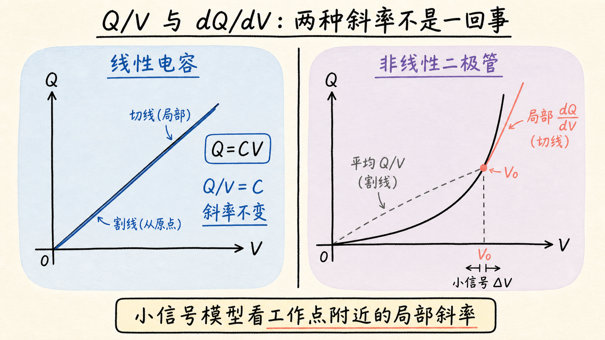
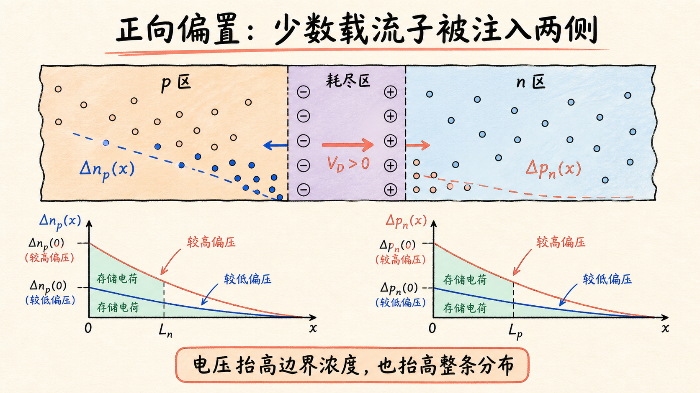
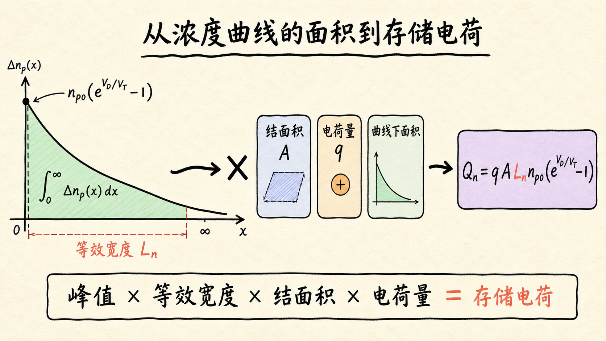
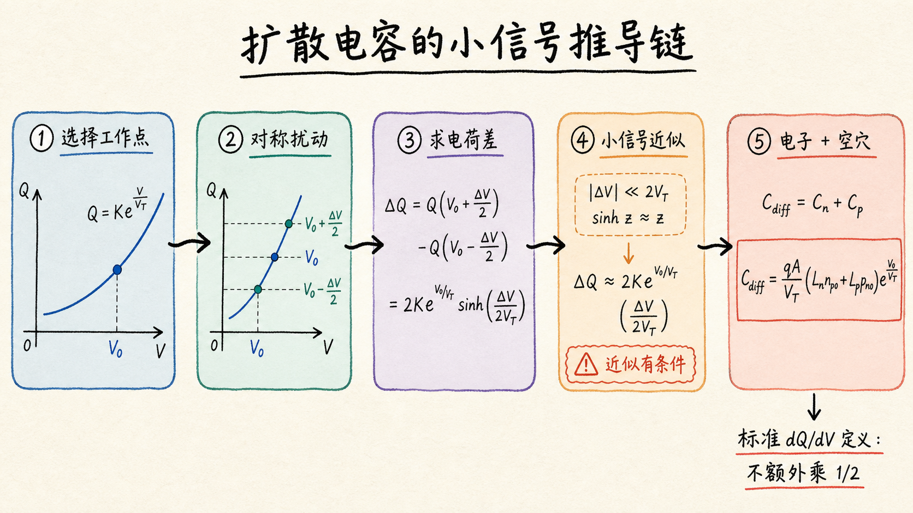

# 扩散电容从哪里来：二极管为什么会“存住”少数载流子？

一个普通电容器能存电荷，这很直观：两块金属板隔开，电压越高，板上的正负电荷越多。可 PN 结二极管并没有两块平行金属板，为什么在小信号模型里也要给它并联一个电容？

答案不只在耗尽区。二极管正向导通时，电子和空穴会越过势垒，进入对方的准中性区，形成一片随距离衰减的过剩少数载流子。电压一变，这片“载流子库存”也跟着变。端口为了增加或抽走这批载流子而提供的增量电荷，就是扩散电容的来源。

读完这篇，你会知道

- 为什么非线性二极管不能简单用 $C=Q/V$ 定义电容
- 正向偏压怎样在准中性区建立少数载流子存储电荷
- 为什么一次空间积分会带出扩散长度 $L_n$ 或 $L_p$
- 怎样在工作点附近把指数关系线性化为扩散电容
- 为什么标准小信号扩散电容公式不应无条件多乘一个 $1/2$

## 先换一个问题：电压轻轻动一下，电荷会动多少？

对线性电容，电荷与电压满足 $Q=CV$，因此 $C=Q/V$。无论从原点看总量，还是在任意工作点附近看变化量，斜率都是同一个 $C$。

二极管不同。它的电荷随电压呈指数变化，$Q/V$ 只是“从原点连到当前点的割线斜率”，并不能描述当前偏置附近的响应。小信号模型真正需要的是曲线在工作点处的局部斜率：

$$
C=\lim_{\Delta V\to 0}\dfrac{\Delta Q}{\Delta V}=\dfrac{dQ}{dV}
$$
。

可以把它想成一段山路。$Q/V$ 告诉你从山脚到当前位置的平均坡度，$dQ/dV$ 告诉你脚下这一小段究竟有多陡。小交流信号只在偏置点附近摆动，因此它感受到的是局部坡度。

这也说明“小信号线性化”到底在做什么：它没有把二极管变成线性器件，只是在给定直流工作点 $V_0$ 附近，用一条切线近似原来的非线性曲线。工作点一变，切线斜率会变，等效电容也会变。

## 二极管里有两类电荷，不要混成一个电容

PN 结中至少有两类会随端电压变化的电荷：

- 耗尽区内的离化施主和受主电荷；
- 准中性区内的过剩少数载流子存储电荷。

前者对应耗尽层电容，也常叫结电容；后者对应扩散电容。两者的物理位置、偏压依赖和主导条件不同。

反向偏置或很小的正向偏置下，耗尽区宽度随电压变化，耗尽层电容通常更重要。较强正向偏置下，大量少数载流子被注入两侧准中性区，存储电荷快速增加，扩散电容可能成为主导项。

这里要注意一个容易产生的疑问：p 区里的过剩电子带负电，n 区里的过剩空穴带正电，两边的净空间电荷似乎会互相抵消，为什么电容还要相加？

扩散电容描述的是端口为改变两侧存储载流子数量所需提供的增量电荷。电子库和空穴库都要被建立、维持和清除，所以它们对端口响应的贡献按电荷量相加。它不是在计算整个器件内部的净空间电荷。

## 正向偏压先抬高边界，再抬高整条浓度曲线

先看 p 区中的少数电子。设 $x=0$ 位于耗尽区的 p 侧边缘，$x$ 向 p 区内部延伸。在低注入、稳态和长二极管近似下，过剩电子浓度为：

$$
\Delta n_p(x,V_D)=n_{p0}\left(e^{V_D/V_T}-1\right)e^{-x/L_n}
$$
。

这里：

- $n_{p0}$ 是 p 区热平衡少数电子浓度；
- $V_D$ 是二极管电压；
- $V_T$ 是热电压；
- $L_n$ 是 p 区少数电子扩散长度。

这个式子可以拆成两个相互独立的问题。

第一部分 $n_{p0}(e^{V_D/V_T}-1)$ 决定耗尽区边缘“注入了多高”。正向电压增加，势垒降低，边缘过剩浓度按指数上升。

第二部分 $e^{-x/L_n}$ 决定这些电子离开结边缘后怎样衰减。$L_n$ 越大，电子在复合前平均能扩散得越远，浓度曲线的尾巴越长。

因此，提高 $V_D$ 不是只改变结边缘的一个点，而是按相同比例抬高整条指数曲线。曲线下面的面积增加，就意味着准中性区里存下了更多少数载流子。

## 从浓度变成电荷，只差一次空间积分

$\Delta n_p$ 的单位是”每单位体积有多少个过剩电子”。要得到 p 区里的总存储电子数，需要把浓度乘以结面积 $A$，再沿 $x$ 方向积分；要得到存储电荷量，再乘以单个载流子的电荷量 $q$：

$$
Q_n(V_D)=qA\int_0^\infty \Delta n_p(x,V_D)\,dx
$$
。

代入浓度分布：

$$
Q_n(V_D)=qA n_{p0}\left(e^{V_D/V_T}-1\right)\int_0^\infty e^{-x/L_n}\,dx
$$
。

指数尾巴的积分很简单：

$$
\int_0^\infty e^{-x/L_n}\,dx=L_n
$$
。

所以：

$$
Q_n(V_D)=qAL_n n_{p0}\left(e^{V_D/V_T}-1\right)
$$
。

为什么结果里会出现 $L_n$？因为扩散长度正是这条归一化指数曲线的“等效宽度”。在边缘峰值相同的情况下，$L_n$ 越大，曲线覆盖的空间越宽，曲线下面积越大，存储电子就越多。

n 区少数空穴完全对称：

$$
Q_p(V_D)=qAL_p p_{n0}\left(e^{V_D/V_T}-1\right)
$$
。

于是总扩散存储电荷量为：

$$
Q_D(V_D)=qA\left(L_n n_{p0}+L_p p_{n0}\right)\left(e^{V_D/V_T}-1\right)
$$
。

这一行已经包含了扩散电容的全部物理信息：结面积决定横向体积，扩散长度决定纵向存储范围，平衡少数载流子浓度决定可注入基数，而正向偏压通过指数项决定注入强度。

## 在 $V_0$ 附近取一小段，指数曲线就变成直线

设直流工作点为 $V_0$。为了看清有限扰动，可以在它两侧对称取两个电压：

$$
V_+=V_0+\dfrac{\Delta V}{2}
$$
，
$$
V_-=V_0-\dfrac{\Delta V}{2}
$$
。

先只看电子存储电荷，两个电压之间的变化为：

$$
\Delta Q_n=Q_n(V_+)-Q_n(V_-)
$$
。

代入 $Q_n(V_D)$ 后，常数项 $-1$ 自动抵消，得到：

$$
\Delta Q_n=qAL_n n_{p0}e^{V_0/V_T}\left(e^{\Delta V/2V_T}-e^{-\Delta V/2V_T}\right)
$$
。

用双曲正弦 $\sinh z=(e^z-e^{-z})/2$ 表示：

$$
\Delta Q_n=2qAL_n n_{p0}e^{V_0/V_T}\sinh\left(\dfrac{\Delta V}{2V_T}\right)
$$
。

到这里仍然是精确的有限差分，尚未线性化。只有当扰动满足 $|\Delta V|\ll 2V_T$ 时，才可以使用 $\sinh z\approx z$：

$$
\Delta Q_n\approx \dfrac{qAL_n n_{p0}}{V_T}e^{V_0/V_T}\Delta V
$$
。

于是电子一侧的扩散电容为：

$$
C_n=\dfrac{\Delta Q_n}{\Delta V}\approx \dfrac{qAL_n n_{p0}}{V_T}e^{V_0/V_T}
$$
。

空穴一侧同理：

$$
C_p\approx \dfrac{qAL_p p_{n0}}{V_T}e^{V_0/V_T}
$$
。

两者相加，得到低频准静态小信号扩散电容：

$$
C_{\mathrm{diff}}=\dfrac{qA}{V_T}\left(L_n n_{p0}+L_p p_{n0}\right)e^{V_0/V_T}
$$
。

也可以不经过对称有限差分，直接对 $Q_D(V_D)$ 求导：

$$
C_{\mathrm{diff}}=\left.\dfrac{dQ_D}{dV_D}\right|_{V_D=V_0}
$$
。

两条路径得到同一个结果。对称有限差分的价值，是把“小信号近似什么时候成立”显示得更清楚；直接求导则更简洁。

## 这个公式告诉了我们什么？

先看偏压。$C_{\mathrm{diff}}$ 含有 $e^{V_0/V_T}$，所以扩散电容会随正向偏压迅速增加。这也是为什么二极管导通后不只是一个非线性电阻，还会表现出显著的电荷存储效应。

再看扩散长度。$L_n$ 或 $L_p$ 越大，少数载流子能深入准中性区的距离越长，存储电荷越多，对应电容越大。

再看器件面积。$C_{\mathrm{diff}}$ 与 $A$ 成正比。结面积加倍，同一浓度分布对应的载流子总数加倍，电容也加倍。

还可以把它与正向电流联系起来。利用 $L_n^2=D_n\tau_n$ 和 $L_p^2=D_p\tau_p$，电子与空穴分量分别满足近似关系：

$$
C_n\approx \dfrac{\tau_n I_n}{V_T}
$$
，
$$
C_p\approx \dfrac{\tau_p I_p}{V_T}
$$
。

这里 $I_n$、$I_p$ 是对应的正向扩散电流分量，$\tau_n$、$\tau_p$ 是少数载流子寿命。这个关系揭示了扩散电容的工程含义：**电流越大、载流子存留越久，器件里需要搬运的存储电荷越多，动态响应就越慢。**

对开关应用，这直接关系到反向恢复。正向导通时存下的少数载流子不会在电压翻转的瞬间消失，外部电路必须先把它们抽走或等待复合，二极管才能真正关断。

## 为什么不能随手在结果前乘一个 $1/2$？

有些推导会在引入正弦信号后，根据“一个周期的平均”在结果前增加 $1/2$。这里必须先问：平均的到底是什么量？

如果扩散电容的定义是工作点附近的增量斜率：

$$
C_{\mathrm{diff}}=\left.dQ_D/dV_D\right|_{V_0}
$$
，

那么标准准静态小信号公式没有额外的 $1/2$。把小信号写成峰值、峰峰值或有效值，只要电压和电荷使用同一种幅值约定，比例关系中的电容不会因此统一减半。

$\langle\sin^2\omega t\rangle=1/2$ 确实会出现在平均功率、均方值或能量计算里，但它不能直接当作扩散电容的通用修正。如果某个特定推导得到 $1/2$，必须同时写清楚：

- 被平均的是电荷、电流、功率还是能量；
- 使用的是峰值、峰峰值还是 RMS；
- 电容是瞬时微分量、基波等效量还是周期平均量。

另外，频率升高后，少数载流子分布来不及准静态地跟随电压，扩散电容会变成频率相关的复数响应。那时需要求解带时间项的连续性方程，而不是给低频结果简单乘一个固定系数。

## 最后收束：扩散电容就是“载流子库存曲线”的局部斜率

正向偏压抬高耗尽区边缘的少数载流子浓度，扩散与复合把它展开成一条空间衰减曲线；对曲线沿空间积分，得到存储电荷；再对存储电荷关于端电压求导，就得到扩散电容。

一句话复述：**扩散电容不是藏在 PN 结里的另一块金属板，而是端口电压改变时，器件必须增加或清除多少少数载流子库存。**
