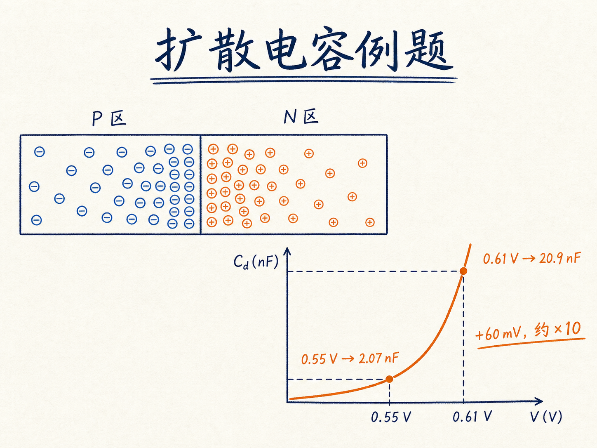
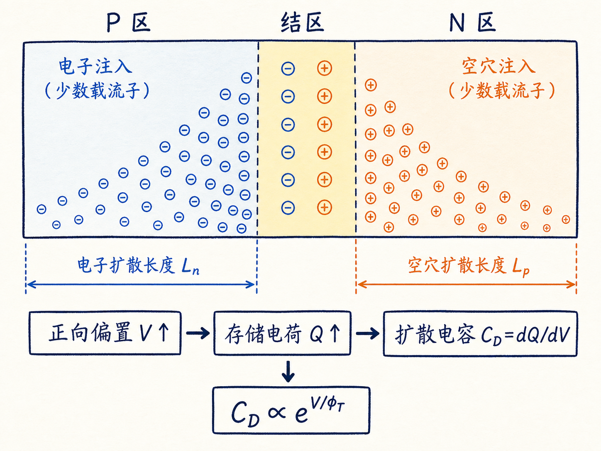
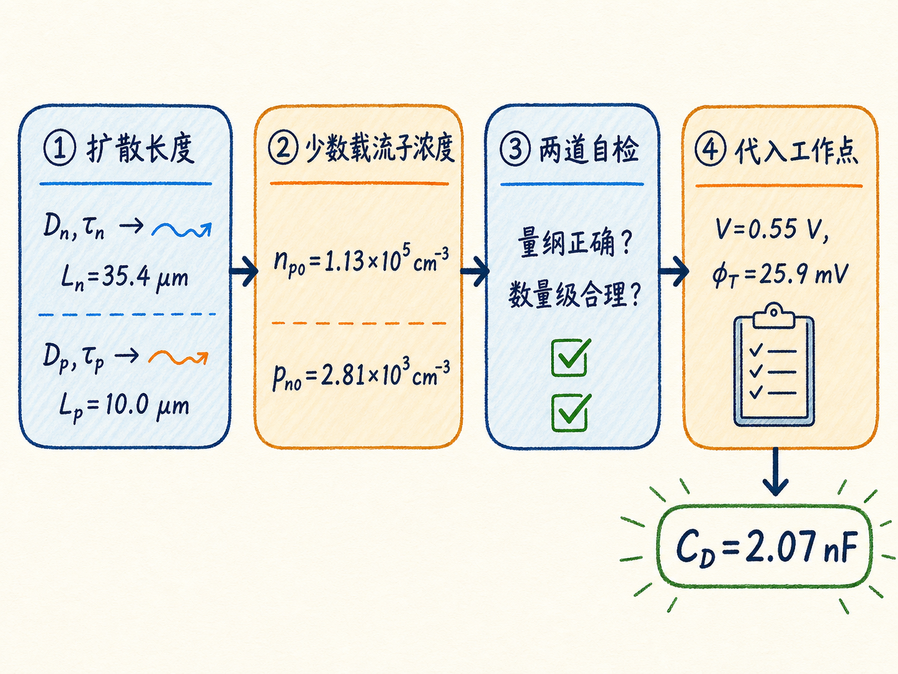
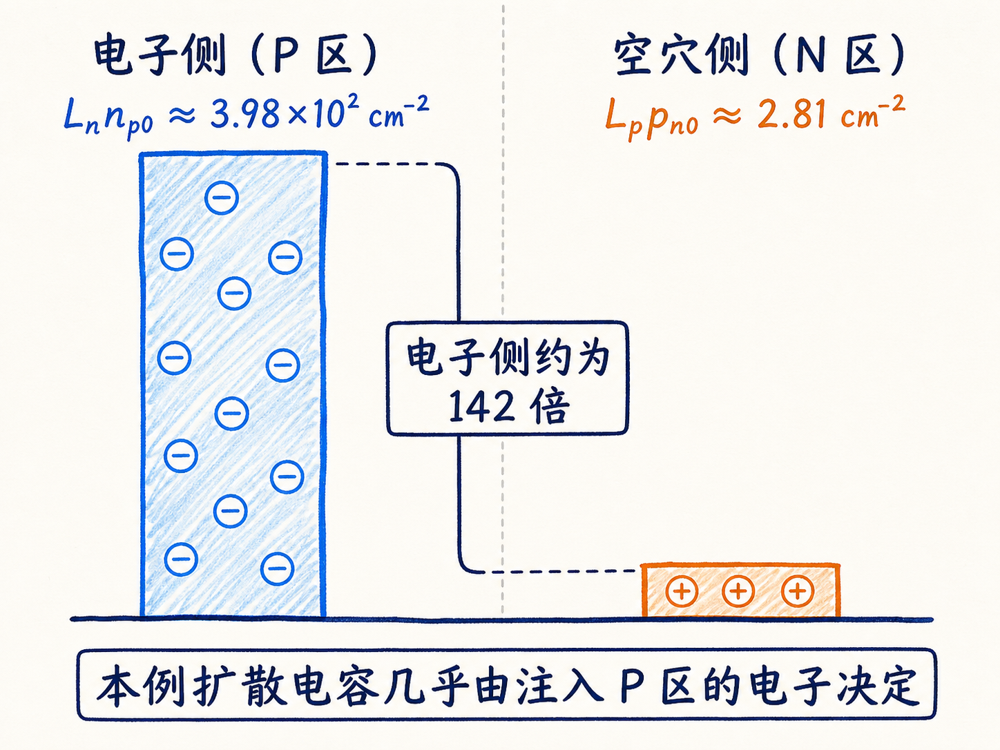
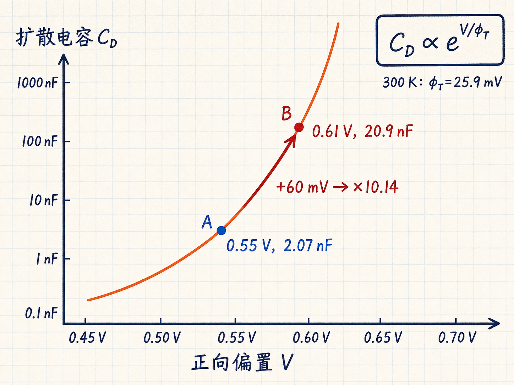

# 扩散电容例题：为什么 60 mV 能让电容增大 10 倍

一个 PN 结二极管在 $0.55\ \mathrm{V}$ 正向偏置下，扩散电容约为 $2.07\ \mathrm{nF}$。把电压只提高到 $0.61\ \mathrm{V}$，电容却跳到 $20.9\ \mathrm{nF}$。电压仅增加 $60\ \mathrm{mV}$，结果差了整整一个数量级。

这不是计算器出了问题，而是扩散电容本来就被正向偏置以指数方式控制。这个例题真正值得学的，不是把一串数字塞进公式，而是怎样沿着“参数—物理量—量纲—数量级”逐层检查，最后看清这个非线性从哪里来。

读完这篇，你会知道

- 扩散电容公式中的每一项分别代表什么
- 如何由扩散系数和载流子寿命算出扩散长度
- 如何由掺杂浓度算出平衡少数载流子浓度
- 怎样用量纲和数量级及时发现计算错误
- 为什么正向电压增加 $60\ \mathrm{mV}$，扩散电容会增大约 10 倍

## 先看全局：我们究竟在算什么

正向偏置会降低 PN 结势垒，使多数载流子跨过结区并注入对方一侧。进入对方区域后，它们变成过剩少数载流子，并在一段距离内逐渐复合。偏置改变时，这部分存储电荷也随之改变；单位电压变化引起的存储电荷变化，就是扩散电容。

本例采用的扩散电容公式是

$$
C_D=\dfrac{qA e^{V/\phi_T}}{2\phi_T}\left(L_n n_{p0}+L_p p_{n0}\right)
$$
。

其中：

- $q$ 是元电荷；
- $A$ 是结面积；
- $V$ 是二极管正向偏置；
- $\phi_T$ 是热电压；
- $L_n$、$L_p$ 分别是电子和空穴的扩散长度；
- $n_{p0}$ 是 P 区中的平衡少数电子浓度；
- $p_{n0}$ 是 N 区中的平衡少数空穴浓度。

这条公式可以分成两部分理解。括号中的 $L_n n_{p0}+L_p p_{n0}$ 描述器件两侧能够参与存储的少数载流子“底子”；前面的 $e^{V/\phi_T}$ 则描述正向偏置怎样把这部分载流子迅速放大。

## 已知参数很多，先把它们分组

题目给出的条件是：

| 类别 | 参数 | 数值 |
|---|---:|---:|
| 掺杂 | $N_D$ | $8\times10^{16}\ \mathrm{cm^{-3}}$ |
| 掺杂 | $N_A$ | $2\times10^{15}\ \mathrm{cm^{-3}}$ |
| 扩散 | $D_n$ | $25\ \mathrm{cm^2/s}$ |
| 扩散 | $D_p$ | $10\ \mathrm{cm^2/s}$ |
| 寿命 | $\tau_n$ | $5\times10^{-7}\ \mathrm{s}$ |
| 寿命 | $\tau_p$ | $1\times10^{-7}\ \mathrm{s}$ |
| 几何 | $A$ | $10^{-3}\ \mathrm{cm^2}$ |
| 工作点 | $V$ | $0.55\ \mathrm{V}$ |
| 温度 | $T$ | $300\ \mathrm{K}$ |

室温下取 $\phi_T=25.9\ \mathrm{mV}=0.0259\ \mathrm{V}$，硅的本征载流子浓度取 $n_i=1.5\times10^{10}\ \mathrm{cm^{-3}}$。

不要急着把所有数值一次代入。更稳妥的顺序是：

1. 由 $D$ 和 $\tau$ 算扩散长度；
2. 由掺杂和 $n_i$ 算平衡少数载流子浓度；
3. 做量纲与数量级检查；
4. 最后代入扩散电容公式。

## 第一步：载流子在复合前能走多远

扩散长度回答的是一个直观问题：载流子靠扩散运动，在平均寿命结束前大约能传播多远？

电子和空穴的扩散长度分别为

$$
L_n=\sqrt{D_n\tau_n}
$$
，

$$
L_p=\sqrt{D_p\tau_p}
$$
。

代入电子参数：

$$
L_n=\sqrt{25\times5\times10^{-7}}\ \mathrm{cm}\approx3.54\times10^{-3}\ \mathrm{cm}
$$
。

代入空穴参数：

$$
L_p=\sqrt{10\times10^{-7}}\ \mathrm{cm}=1.00\times10^{-3}\ \mathrm{cm}
$$
。

换成更直观的单位，就是 $L_n\approx35.4\ \mathrm{\mu m}$，$L_p=10.0\ \mathrm{\mu m}$。

这里的第一道检查是量纲：

$$
\sqrt{\dfrac{\mathrm{cm^2}}{\mathrm{s}}\cdot\mathrm{s}}=\mathrm{cm}
$$
。

第二道检查是数量级：几十微米和十微米对于半导体中的少数载流子扩散是合理尺度。如果结果变成几千米，或者比原子尺度还小，就应立即回查单位和指数。

## 第二步：两侧原本有多少少数载流子

在热平衡下，质量作用定律给出

$$
n_{p0}=\dfrac{n_i^2}{N_A}
$$
，

$$
p_{n0}=\dfrac{n_i^2}{N_D}
$$
。

代入 $n_i=1.5\times10^{10}\ \mathrm{cm^{-3}}$：

$$
n_{p0}=\dfrac{(1.5\times10^{10})^2}{2\times10^{15}}\approx1.13\times10^5\ \mathrm{cm^{-3}}
$$
，

$$
p_{n0}=\dfrac{(1.5\times10^{10})^2}{8\times10^{16}}\approx2.81\times10^3\ \mathrm{cm^{-3}}
$$
。

为什么 $p_{n0}$ 更低？因为 N 区的施主掺杂 $N_D$ 更高。对给定的 $n_i$，多数载流子浓度越高，与它成反比的少数载流子浓度就越低。

也可以从内建电势交叉验证：

$$
V_{bi}=\phi_T\ln\left(\dfrac{N_A N_D}{n_i^2}\right)\approx0.7068\ \mathrm{V}
$$
。

再由 $n_{p0}=N_D e^{-V_{bi}/\phi_T}$ 和 $p_{n0}=N_A e^{-V_{bi}/\phi_T}$，会得到同样的结果。两条路径算出同一个答案，是很有价值的自检。

## 第三步：代入前先看哪一侧贡献更大

扩散电容括号中的两项分别是

$$
L_n n_{p0}\approx(3.54\times10^{-3})(1.13\times10^5)\approx3.98\times10^2\ \mathrm{cm^{-2}}
$$
，

$$
L_p p_{n0}\approx(1.00\times10^{-3})(2.81\times10^3)\approx2.81\ \mathrm{cm^{-2}}
$$
。

电子侧贡献约为空穴侧的 142 倍。因此在这个不对称掺杂例题里，扩散电容几乎由注入 P 区的电子决定。

这一步很重要，因为它把“代公式”变成了物理判断：即使不做最后的精确计算，我们已经知道主导项是谁。以后参数变化时，也能先判断哪一个变化最可能控制结果。

## 第四步：量纲先过关，再相信数值

完整代入式为

$$
C_D=\dfrac{(1.6\times10^{-19})(10^{-3})e^{0.55/0.0259}}{2(0.0259)}\left[(3.54\times10^{-3})(1.13\times10^5)+(1.00\times10^{-3})(2.81\times10^3)\right]
$$
。

先不按计算器，检查单位：

- $L n_0$ 的单位是 $\mathrm{cm}\times\mathrm{cm^{-3}}=\mathrm{cm^{-2}}$；
- 它与面积 $A$ 的 $\mathrm{cm^2}$ 相消；
- 指数 $V/\phi_T$ 必须无量纲；
- 最后留下 $q/\phi_T$，单位是 $\mathrm{C/V}=\mathrm{F}$。

因此结果确实应该是电容。数值计算得到

$$
C_D(0.55\ \mathrm{V})\approx2.065\times10^{-9}\ \mathrm{F}\approx2.07\ \mathrm{nF}
$$
。

这里最常见的错误，是把 $25.9\ \mathrm{mV}$ 直接当成 $25.9\ \mathrm{V}$ 代入。正确写法是 $0.0259\ \mathrm{V}$。这个错误不仅影响分母，还会彻底改变指数 $e^{V/\phi_T}$，结果可能偏离许多个数量级。

## 最关键的一步：为什么只加 60 mV 就差 10 倍

保持其他条件不变，扩散电容对电压的依赖可以写成

$$
C_D\propto e^{V/\phi_T}
$$
。

因此两个工作点的电容之比不需要重新计算整条公式：

$$
\dfrac{C_D(0.61)}{C_D(0.55)}=e^{(0.61-0.55)/0.0259}=e^{0.06/0.0259}\approx10.14
$$
。

于是

$$
C_D(0.61\ \mathrm{V})\approx10.14\times2.065\ \mathrm{nF}\approx20.9\ \mathrm{nF}
$$
。

这就是答案背后的核心机制：在室温下，$60\ \mathrm{mV}$ 已经相当于约 $2.32$ 个热电压，而每增加一个热电压，指数项都会乘上 $e$。连续乘两次多一点，结果自然接近 10 倍。

## 对器件和电路意味着什么

扩散电容不是一个固定的几何电容，而是某个偏置工作点附近的增量电容。工作点改变，存储的少数载流子数量改变，测得的电容也随之改变。

对电路而言，这意味着二极管在较强正向偏置下可能表现出明显更大的动态电容。需要快速改变电流或电压时，电路必须重新建立或移除这部分存储电荷，因此工作点会直接影响瞬态速度。

所以看到“扩散电容为 $2.07\ \mathrm{nF}$”时，不能只记这个数字。必须同时记住它对应 $0.55\ \mathrm{V}$、$300\ \mathrm{K}$ 以及题目给定的掺杂、寿命、扩散系数和面积。

## 最后收束：真正要记住的计算框架

这道题可以压缩成一条清晰的因果链：

$D,\tau\rightarrow L$；$N_A,N_D,n_i\rightarrow n_{p0},p_{n0}$；再与 $A$ 和 $e^{V/\phi_T}$ 合并，得到 $C_D$。

其中材料与器件参数决定基准大小，正向偏置通过指数项决定工作点敏感性。最终最值得记住的一句话是：

**扩散电容衡量的是正向偏置下少数载流子存储电荷对电压的变化率，因此它天然是一个强烈依赖工作点的非线性电容。**
