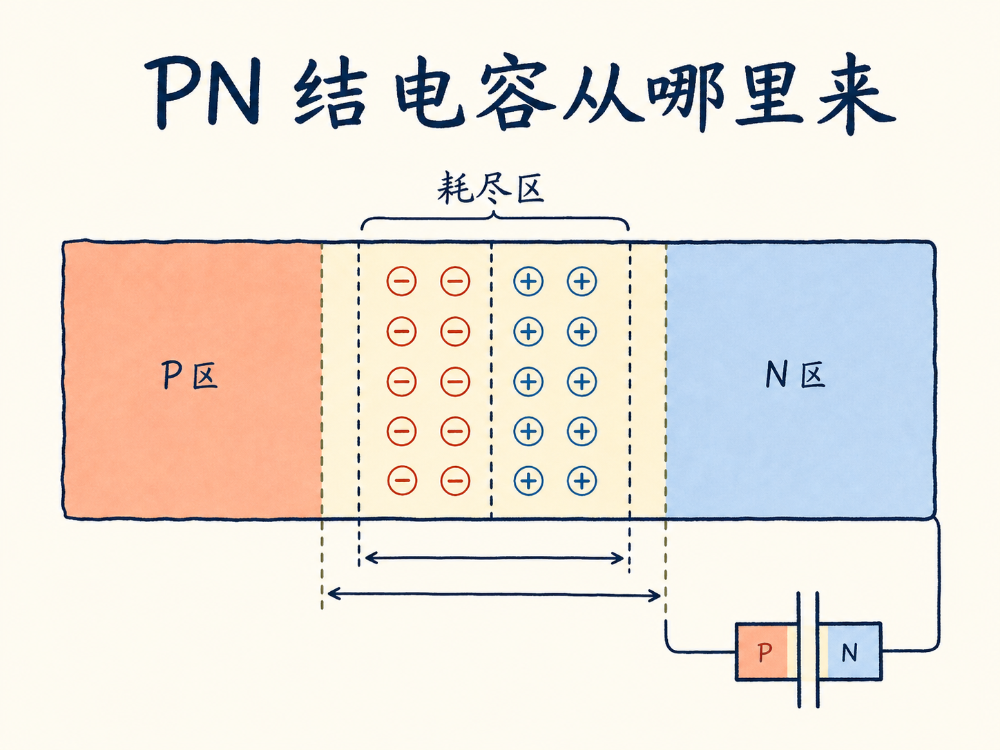
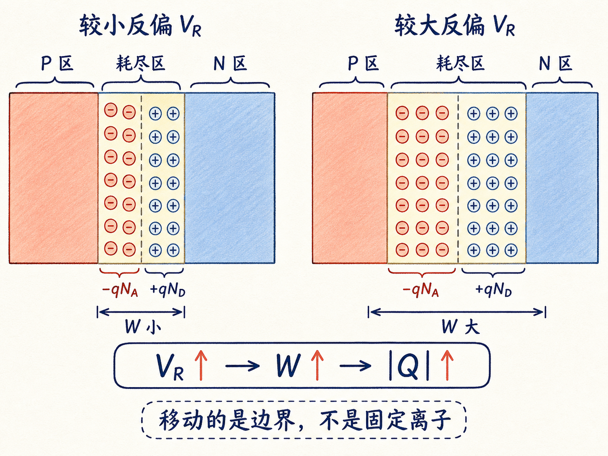
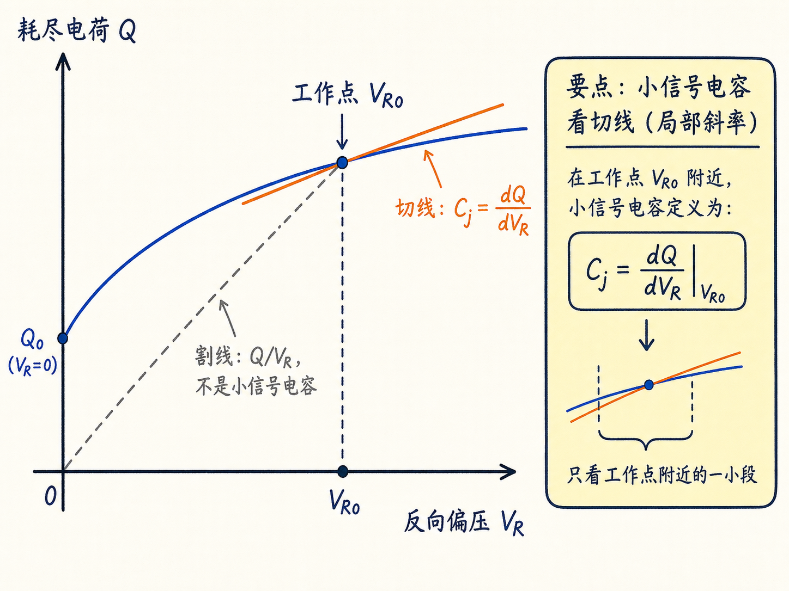
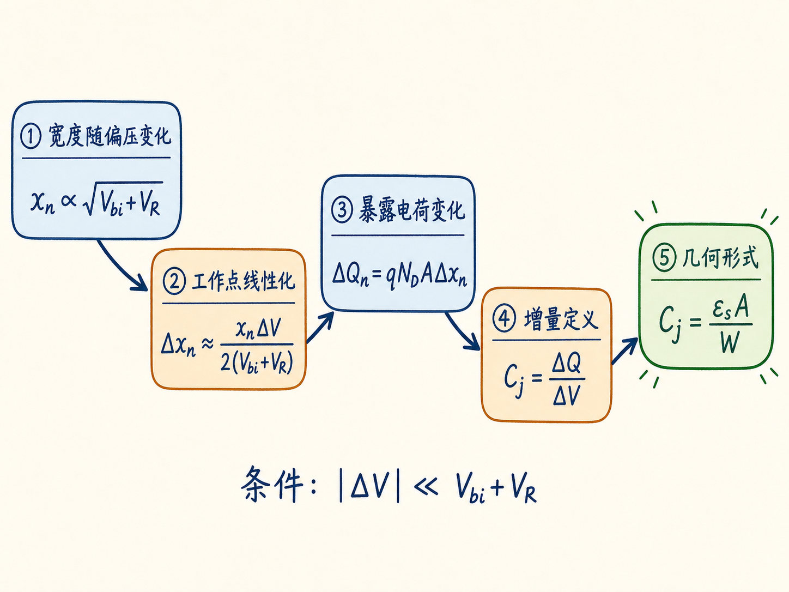
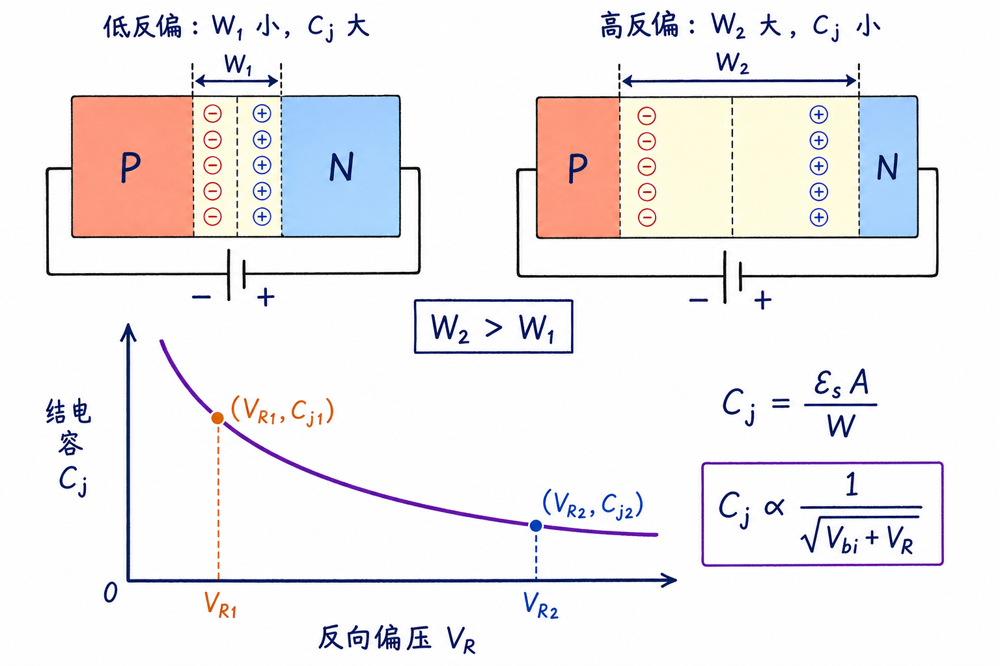

# PN 结电容从哪里来：移动的不是电荷，而是耗尽区边界

看到电容，我们通常会想到两块金属板：电压升高，一块板积累正电荷，另一块板积累负电荷。可 PN 结的耗尽区里几乎没有能够自由移动的载流子，为什么它仍然表现得像一个电容？

关键在于，端电压改变时，不一定要把新的电荷搬进器件。只要耗尽区边界移动，把原本处于准中性区的离化杂质“显露”出来，端口看到的电荷量就会变化。结电容描述的，正是电压轻微变化时，这些暴露电荷增加或减少得有多快。

读完这篇，你会知道

- 为什么耗尽区没有自由载流子，仍然能形成电容
- 怎样从 $Q_n=qN_DAx_n$ 找到电压真正控制的变量
- 为什么根号关系需要在工作点附近作小信号线性化
- 怎样从掺杂表达式得到熟悉的 $C_j=\varepsilon_sA/W$
- 为什么推导结电容只算 PN 结的一侧就够了

## 先把两种 PN 结电容分开

PN 结里常见的两个电容，来自两套不同的物理机制。

扩散电容来自准中性区里的过剩少数载流子。正向偏压降低势垒，电子和空穴越过结区，在对方一侧形成存储电荷；电压改变，载流子库存也改变。

结电容来自耗尽区里的离化杂质。反向偏压增大时，电场把多数载流子进一步推离结区，耗尽区变宽，更多固定的施主离子和受主离子暴露出来。

这里的“固定”很重要。离化施主和受主被束缚在晶格位置上，并没有像金属导线中的电子那样横穿器件。发生移动的是耗尽区边界。边界扫过一小段半导体，就把这段体积里的固定电荷纳入耗尽区。

因此，判断有没有电容效应，不能只问“自由电荷有没有移动”，而要问：

**端电压变化时，端口对应的电荷量有没有变化？**

## 电容不是 $Q/V$，而是工作点附近的电荷斜率

对于理想线性电容，$Q=CV$，所以 $C=Q/V$。但 PN 结的耗尽区宽度含有电压的平方根，电荷与电压并不成正比。

此时真正有用的是增量定义：

$$
C_j=\lim_{\Delta V\to0}\dfrac{\Delta Q}{\Delta V}=\dfrac{dQ}{dV}
$$
。

它回答的是：在当前直流偏置点附近，电压轻微变化一点，电荷会跟着变化多少。

这意味着 PN 结不是一个固定电容。工作点一变，$Q$-$V$ 曲线的局部斜率就会改变，小信号模型中的结电容也会改变。

## 先算 n 侧：电荷就是密度乘体积

先看 n 侧耗尽区。假设 PN 结横截面积为 $A$，n 侧耗尽区宽度为 $x_n$，施主浓度为 $N_D$。

耗尽区里的自由电子已经被推走，留下带正电的离化施主。每个离化施主贡献电荷量 $q$，单位体积内有 $N_D$ 个，因此体电荷密度为：

$$
\rho_n=qN_D
$$
。

n 侧耗尽区体积为 $Ax_n$，所以这一侧的耗尽电荷量为：

$$
Q_n=\rho_nAx_n=qN_DAx_n
$$
。

现在让反向偏压增加一个很小的 $\Delta V$。式子中的三个量不会变化：

- $q$ 是基本电荷量；
- $N_D$ 由掺杂决定；
- $A$ 由器件几何决定。

唯一随偏压改变的是 $x_n$。因此：

$$
\Delta Q_n=qN_DA\Delta x_n
$$
。

推导结电容的问题由此被压缩成一句话：**反向电压增加 $\Delta V$ 时，n 侧耗尽区边界会移动多远？**

## 耗尽区宽度为什么跟电压的平方根有关？

对均匀掺杂的突变 PN 结，n 侧耗尽区宽度为：

$$
x_n(V_R)=\sqrt{\dfrac{2\varepsilon_s(V_{bi}+V_R)}{qN_D(1+N_D/N_A)}}
$$
。

其中：

- $\varepsilon_s$ 是半导体介电常数；
- $V_{bi}$ 是内建电势；
- $V_R$ 是外加反向偏压；
- $N_A$、$N_D$ 分别是受主和施主浓度。

先不急着处理所有常数，只看偏压依赖：

$$
x_n\propto\sqrt{V_{bi}+V_R}
$$
。

为什么是平方根？耗尽区不是一个均匀电场的平行板间隙。均匀离化杂质产生的空间电荷使电场沿位置线性变化，电势则是电场对位置的积分，因此电势降与耗尽区宽度的平方成正比：

$$
V_{bi}+V_R\propto W^2
$$
。

反过来，耗尽区宽度自然满足：

$$
W\propto\sqrt{V_{bi}+V_R}
$$
。

这个平方根关系也预告了结电容会随反向偏压增大而下降。

## 把大偏置和小扰动拆开

设器件已经工作在反向偏压 $V_R$，此时 n 侧耗尽区宽度记为：

$$
x_{n0}=x_n(V_R)
$$
。

现在叠加一个很小的电压增量 $\Delta V$。把扰动后的宽度写成：

$$
x_n(V_R+\Delta V)=x_{n0}\sqrt{1+\dfrac{\Delta V}{V_{bi}+V_R}}
$$
。

这一步的价值，是把两个尺度分开：

- $x_{n0}$ 描述直流工作点已经形成的耗尽区；
- 根号里的小量描述交流扰动怎样改变这个工作点。

于是宽度变化为：

$$
\Delta x_n=x_{n0}\left[\sqrt{1+\dfrac{\Delta V}{V_{bi}+V_R}}-1\right]
$$
。

它仍然是非线性的，不能直接写成“某个常数乘 $\Delta V$”。但小信号模型只关心工作点附近很小的一段，可以使用一阶泰勒展开：

$$
\sqrt{1+u}\approx1+\dfrac{u}{2}\qquad(|u|\ll1)
$$
。

取 $u=\Delta V/(V_{bi}+V_R)$，得到：

$$
\Delta x_n\approx\dfrac{x_{n0}}{2(V_{bi}+V_R)}\Delta V
$$
。

小信号条件也随之明确：

$$
|\Delta V|\ll V_{bi}+V_R
$$
。

线性化没有把 PN 结变成线性器件。它只是用工作点处的一条切线，近似原来那条平方根曲线。直流偏置变化后，必须重新计算这条切线的斜率。

## 从边界位移回到结电容

前面已经得到：

$$
\Delta Q_n=qN_DA\Delta x_n
$$
。

代入线性化后的 $\Delta x_n$：

$$
\Delta Q_n\approx qN_DA\dfrac{x_{n0}}{2(V_{bi}+V_R)}\Delta V
$$
。

两边除以 $\Delta V$：

$$
C_j=\dfrac{\Delta Q_n}{\Delta V}\approx\dfrac{qN_DAx_{n0}}{2(V_{bi}+V_R)}
$$
。

这个式子已经给出了结电容，但它还没有显出最直观的几何意义。利用耗尽区的电荷中性条件：

$$
N_Ax_p=N_Dx_n
$$
，

以及总耗尽区宽度：

$$
W=x_p+x_n
$$
，

可以把耗尽区电势降写成：

$$
V_{bi}+V_R=\dfrac{qN_Dx_nW}{2\varepsilon_s}
$$
。

把它代回上式，得到更熟悉的形式：

$$
C_j=\dfrac{\varepsilon_sA}{W}
$$
。

这正是平行板电容公式的结构：介电常数乘面积，再除以两侧电荷中心之间的有效距离。

但需要注意，PN 结的“极板间距”不是固定的。这里的 $W$ 会随偏压变化，所以结电容也是偏压的函数。

## 反向偏压越大，为什么结电容越小？

突变结的总耗尽区宽度满足：

$$
W=\sqrt{\dfrac{2\varepsilon_s}{q}\left(\dfrac{1}{N_A}+\dfrac{1}{N_D}\right)(V_{bi}+V_R)}
$$
。

代入 $C_j=\varepsilon_sA/W$：

$$
C_j(V_R)=A\sqrt{\dfrac{q\varepsilon_sN_AN_D}{2(N_A+N_D)(V_{bi}+V_R)}}
$$
。

因此：

$$
C_j\propto\dfrac{1}{\sqrt{V_{bi}+V_R}}
$$
。

反向偏压增大，耗尽区变宽，相当于电容的有效极板间距增大，所以电容下降。

如果把零外加偏压时的结电容记为 $C_{j0}$，还可以写成：

$$
C_j(V_R)=\dfrac{C_{j0}}{\sqrt{1+V_R/V_{bi}}}
$$
。

这条关系对器件和电路都有直接影响：

- 在二极管高频模型中，结电容决定反向偏置下的交流旁路能力和开关速度；
- 在变容二极管中，正是利用反向偏压控制耗尽区宽度，从而把 PN 结做成可调电容；
- 在工艺设计中，增大结面积会线性增大电容，降低掺杂则通常会拓宽耗尽区、减小单位面积电容。

## 为什么只算一侧，不把两侧电荷相加？

n 侧耗尽区留下正的离化施主电荷，p 侧耗尽区留下负的离化受主电荷。电荷中性要求：

$$
qN_DAx_n=qN_AAx_p
$$
。

两侧电荷等量异号。外加电压使 n 侧增加 $+\Delta Q$ 时，p 侧同时增加 $-\Delta Q$。

计算电容时，$Q$ 指任一“极板”上的电荷量。普通平行板电容也不会把两块极板上的 $|Q|$ 相加成 $2Q$。因此，从 n 侧推导或从 p 侧推导都可以，结果相同；把两侧绝对值再相加，反而会把电容错误地算成两倍。

## 最后收束：结电容是耗尽区边界的灵敏度

整条推导可以压缩成四步：

1. 耗尽电荷等于电荷密度乘体积：$Q_n=qN_DAx_n$；
2. 端电压只通过耗尽区宽度改变电荷：$\Delta Q_n=qN_DA\Delta x_n$；
3. 在工作点附近把 $x_n\propto\sqrt{V_{bi}+V_R}$ 线性化；
4. 用 $C_j=dQ/dV$ 得到 $C_j=\varepsilon_sA/W$。

一句话复述：**PN 结的结电容，不是自由载流子在耗尽区里来回移动，而是端电压推动耗尽区边界，改变了被暴露出来的固定离子电荷。**
