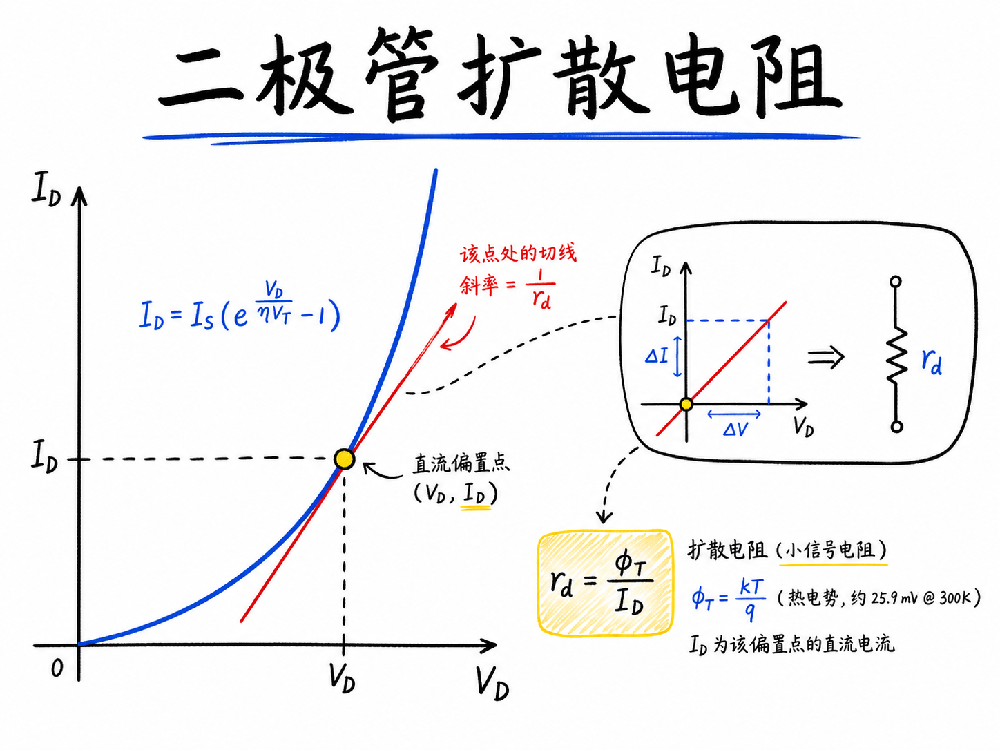
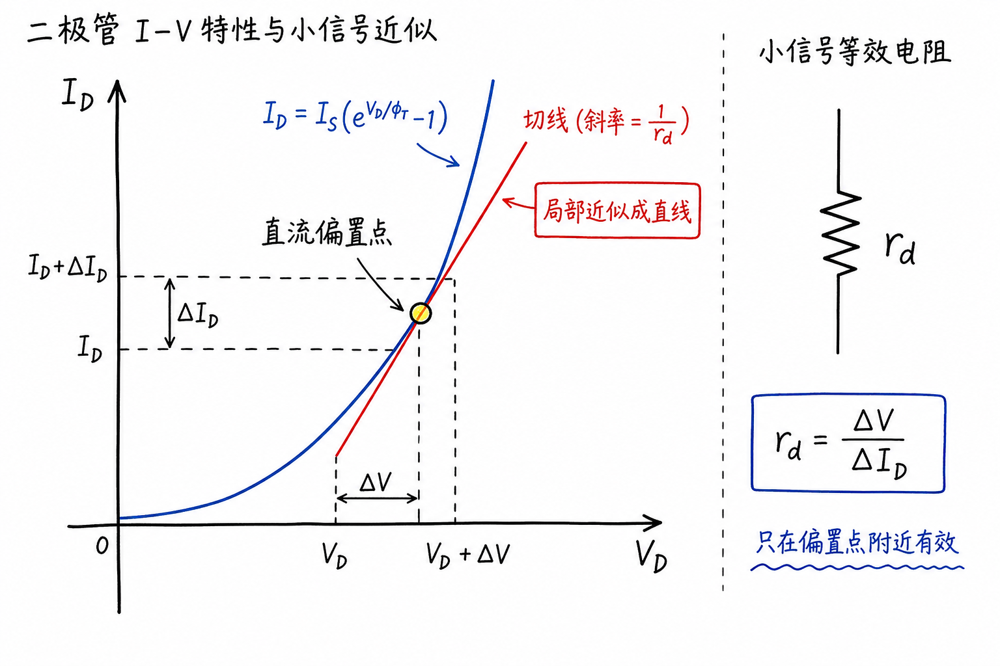
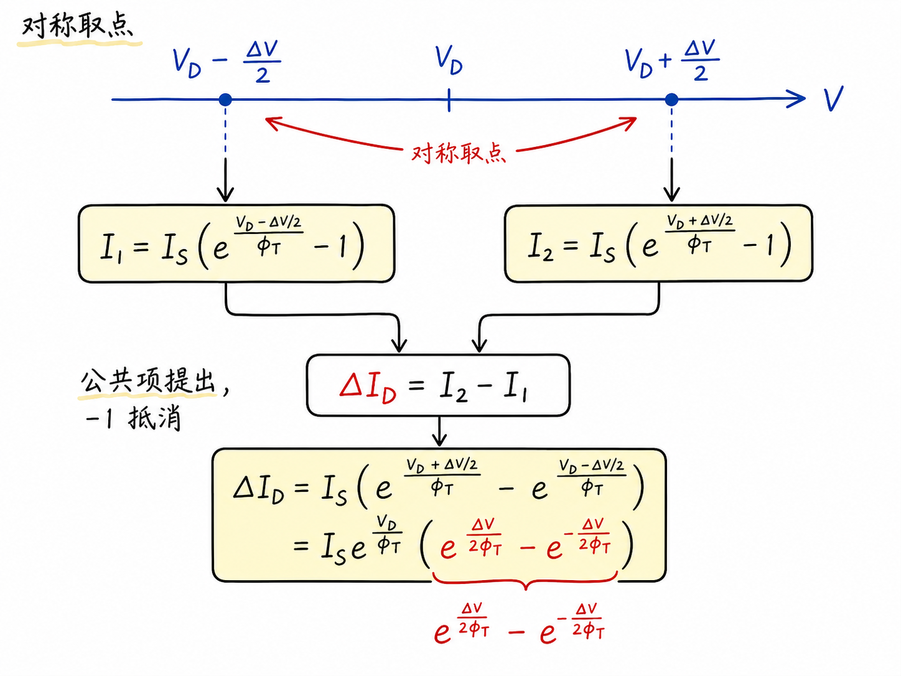
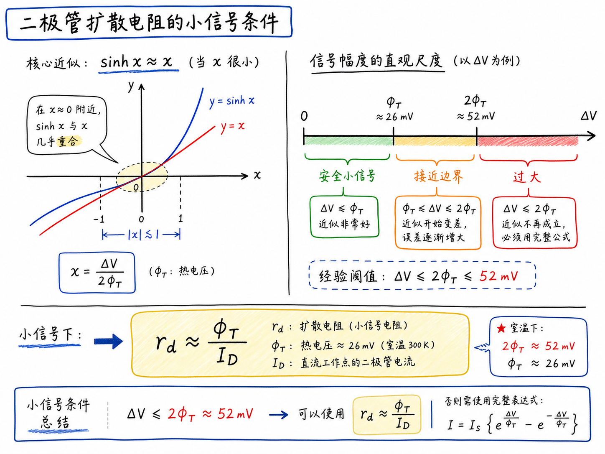

# 二极管扩散电阻：指数曲线为什么能当电阻用？

二极管的 I-V 曲线明明是指数曲线，为什么电路课里又说它在某个工作点附近有一个“电阻”？这听起来像是在把非线性器件硬塞进线性电路模型里。但小信号模型真正做的事不是假装二极管变成了普通电阻，而是只看直流偏置点附近很小的一段曲线。

如果你站得足够近，一小段弯曲的路也可以近似看成直线。二极管扩散电阻就是这个局部斜率的倒数。它回答的问题不是“二极管全局是不是电阻”，而是“在当前偏置电流下，再加一点点电压，电流会增加多少”。

读完这篇，你会知道

- 为什么二极管没有固定电阻，却可以定义小信号电阻
- 为什么推导时要取 $V_D+\Delta V/2$ 和 $V_D-\Delta V/2$ 两个对称点
- 双曲正弦 $\sinh$ 为什么会出现在扩散电阻推导里
- 为什么最终结果是 $r_d\approx \phi_T/I_D$
- 小信号近似到底要求 $\Delta V$ 小到什么程度

## 先把问题说清楚：我们不是在找普通电阻

普通线性电阻的特征很直接：电压增加 $\Delta V$，电流增加 $\Delta I$，而且两者成正比。用图像看，$\Delta I$ 对 $\Delta V$ 的斜率是 $1/R$。这个 $R$ 不依赖你站在曲线上的哪一点，因为曲线本来就是直线。

二极管不是这样。理想二极管电流满足

$$
I_D=I_S(e^{V_D/\phi_T}-1)
$$

其中 $I_S$ 是反向饱和电流，$V_D$ 是二极管电压，$\phi_T$ 是热电压，室温下大约是 $26\ \mathrm{mV}$。这个关系是指数函数，不是直线。所以如果你问“二极管的电阻是多少”，这个问题本身就不够准确。

更准确的问题应该是：二极管已经偏置在某个工作点 $V_D$、对应直流电流 $I_D$ 时，如果电压只变化一点点 $\Delta V$，电流会变化多少 $\Delta I_D$？这个局部比例关系定义出来的，就是小信号电阻，也叫微分电阻。

它的物理意义很实用：在小信号交流分析里，我们把直流偏置先定住，再研究叠加在上面的小扰动。只要扰动足够小，非线性曲线的一小段就可以近似成直线，二极管就可以被一个局部电阻替代。

## 为什么取两个对称电压点

要看电压变化 $\Delta V$ 造成多少电流变化，最直接的做法是算两个点的电流差。这里选择的两个点是

$$
V_D+\frac{\Delta V}{2}
$$
和
$$
V_D-\frac{\Delta V}{2}
$$
。

这样做的好处是对称。我们不是从某个点单边往右走，而是在偏置点左右各取一半。对称取点后，很多公共项会自然消掉，最后能清楚看到小信号近似来自哪里。

把这两个电压分别代入理想二极管方程，电流差为

$$
\Delta I_D=I_S\left(e^{(V_D+\Delta V/2)/\phi_T}-1\right)-I_S\left(e^{(V_D-\Delta V/2)/\phi_T}-1\right)
$$
。

两个 $-1$ 抵消，公共的 $e^{V_D/\phi_T}$ 可以提出去：

$$
\Delta I_D=I_S e^{V_D/\phi_T}\left(e^{\Delta V/(2\phi_T)}-e^{-\Delta V/(2\phi_T)}\right)
$$
。

这一步很关键，因为它把问题拆成了两部分：前面一项描述当前直流偏置点，后面括号描述小扰动本身。

## 前面的指数项为什么可以看成 $I_D$

偏置点的二极管直流电流是

$$
I_D=I_S(e^{V_D/\phi_T}-1)
$$
。

而推导中出现的是 $I_S e^{V_D/\phi_T}$。严格来说，它比 $I_D$ 多了一个 $I_S$。但在二极管正向导通并且 $V_D$ 明显大于 $\phi_T$ 时，$e^{V_D/\phi_T}$ 很大，$-1$ 相对可以忽略，所以

$$
I_S e^{V_D/\phi_T}\approx I_D
$$
。

于是电流变化可以写成

$$
\Delta I_D\approx I_D\left(e^{\Delta V/(2\phi_T)}-e^{-\Delta V/(2\phi_T)}\right)
$$
。

括号中的形式正好是 $2\sinh x$，其中

$$
x=\frac{\Delta V}{2\phi_T}
$$
。

所以

$$
\Delta I_D\approx 2I_D\sinh\left(\frac{\Delta V}{2\phi_T}\right)
$$
。

这个形式比直接求导更有信息量。它还没有马上把曲线线性化，而是先保留了有限小扰动带来的非线性痕迹。

## 小信号近似真正要求什么

接下来才进入小信号近似。双曲正弦在 $x$ 很小时满足

$$
\sinh x\approx x
$$
。

因此，只要

$$
\frac{\Delta V}{2\phi_T}\ll 1
$$

也就是

$$
\Delta V\ll 2\phi_T
$$

就可以把上式近似为

$$
\Delta I_D\approx 2I_D\frac{\Delta V}{2\phi_T}=I_D\frac{\Delta V}{\phi_T}
$$
。

室温下 $\phi_T\approx 26\ \mathrm{mV}$，所以 $2\phi_T\approx 52\ \mathrm{mV}$。这意味着小信号电压不能只是“看起来不大”，而是要相对几十毫伏这个尺度足够小。

这里需要注意：小信号模型不是无条件成立的。如果 $\Delta V$ 已经接近几十毫伏，指数曲线的弯曲就不能随便忽略。此时用一个电阻去代表二极管，只能算粗略近似。

## 扩散电阻为什么等于 $\phi_T/I_D$

现在我们已经得到局部线性关系：

$$
\Delta I_D\approx I_D\frac{\Delta V}{\phi_T}
$$
。

把它整理成电阻的形式：

$$
r_d=\frac{\Delta V}{\Delta I_D}\approx \frac{\phi_T}{I_D}
$$
。

这就是二极管扩散电阻，也常写成小信号电阻。它的含义非常直接：在同样温度下，偏置电流越大，小信号电阻越小；偏置电流越小，小信号电阻越大。

这和直觉一致。二极管在指数曲线高电流区域时，曲线非常陡。电压稍微增加一点，电流就增加很多，所以等效小信号电阻很小。反过来，在低电流区域，曲线比较平，电压变化引起的电流变化较小，所以等效小信号电阻较大。

## 为什么不用直接求导就结束

当然，也可以直接对二极管方程求导：

$$
\frac{dI_D}{dV_D}\approx \frac{I_D}{\phi_T}
$$
。

于是

$$
r_d=\left(\frac{dI_D}{dV_D}\right)^{-1}\approx \frac{\phi_T}{I_D}
$$
。

这个方法更快，但它容易让人忘掉近似的边界。求导默认你已经在取无穷小扰动；而实际电路里的信号不是数学上的无穷小，它有幅度。用对称差分推到 $\sinh$ 形式，能直接看见误差来自哪里：当 $\Delta V/(2\phi_T)$ 不够小时，$\sinh x\approx x$ 就不再可靠。

所以这个推导的价值不只是得到 $r_d$，还在于提醒我们：小信号模型的“小”，有一个由热电压决定的尺度。

## 最后收束：扩散电阻是偏置点附近的局部斜率

二极管扩散电阻不是材料里真的长出一个固定电阻，也不是二极管全范围都服从欧姆定律。它只是指数 I-V 曲线在某个直流偏置点附近的局部线性化结果。

一句话记住：

$r_d\approx \frac{\phi_T}{I_D}$，成立条件是二极管处在给定直流偏置点，并且叠加的小信号电压满足 $\Delta V\ll 2\phi_T$。

对电路分析来说，这个结果很有用。它把一个非线性二极管，在小扰动范围内变成了可以放进线性电路里的电阻。这样我们才能继续用熟悉的电阻、电容和线性网络方法，分析二极管的交流响应和动态行为。
