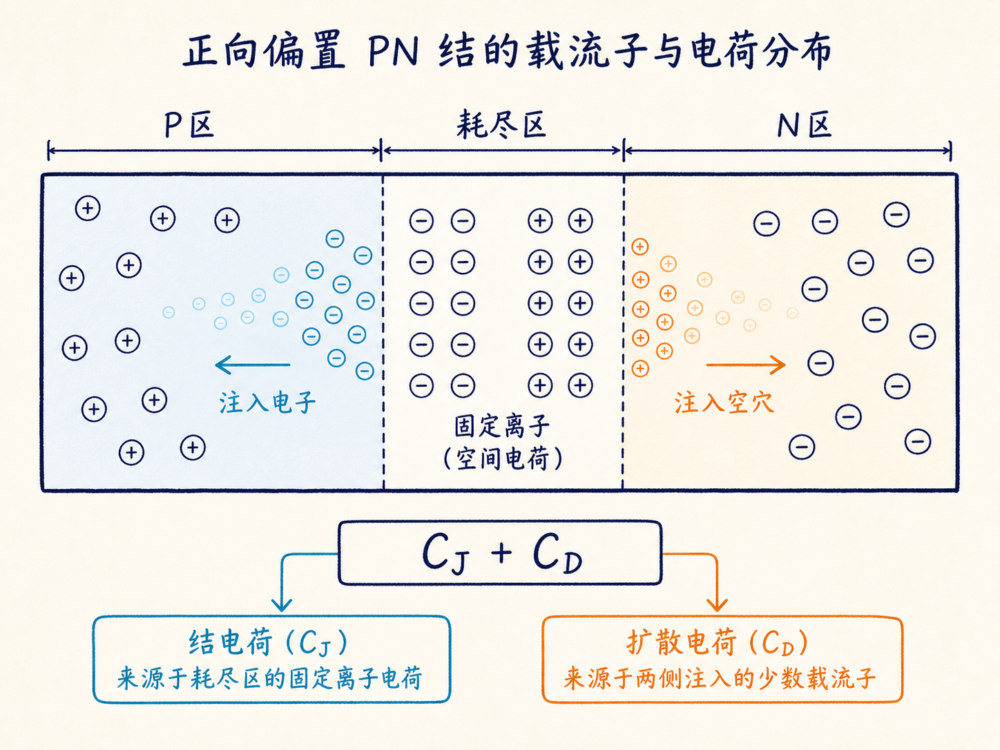
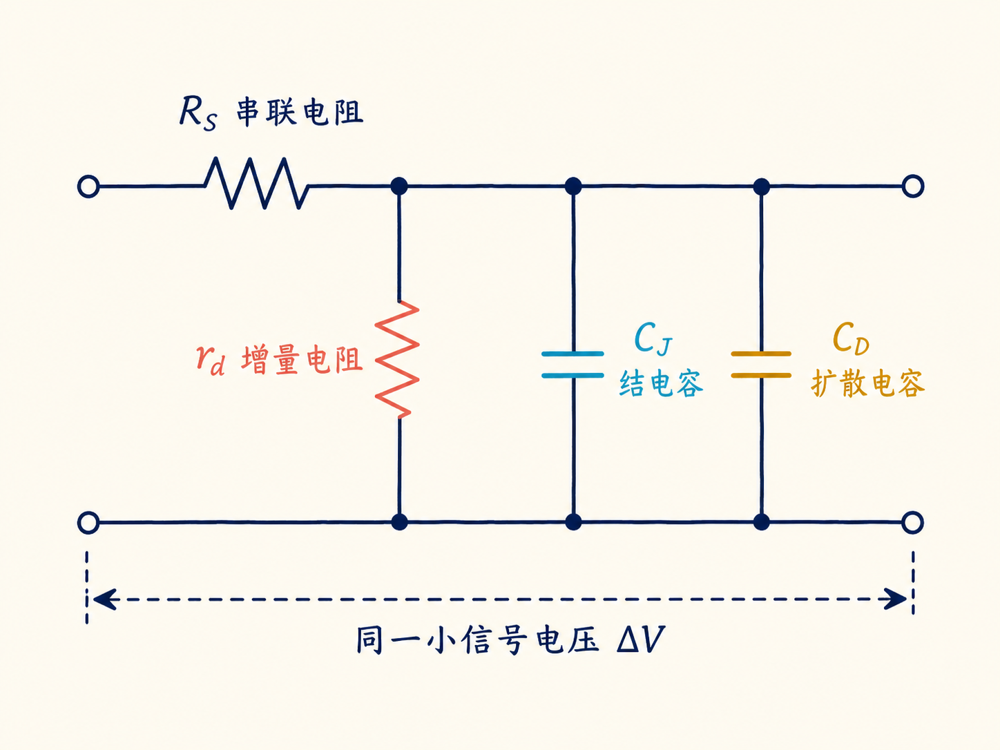
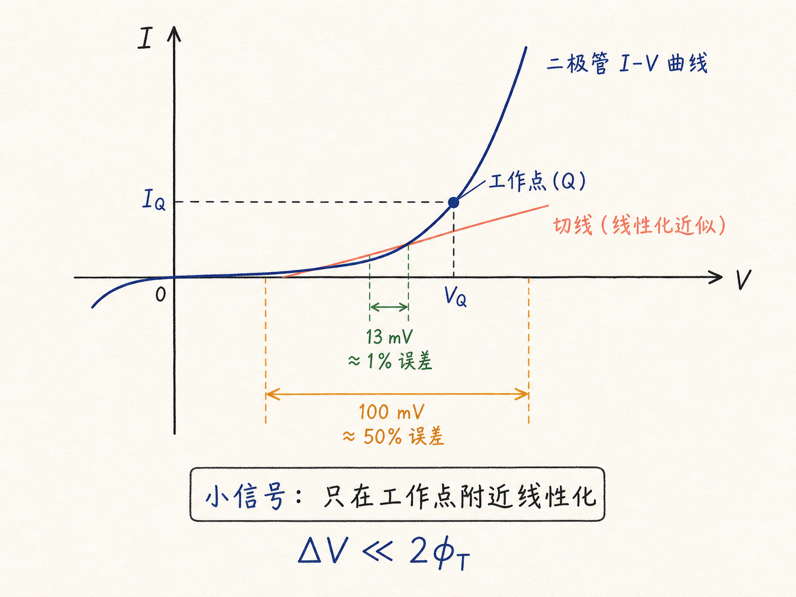

# 二极管小信号模型：把一个非线性器件拆成四个元件

二极管的 $I$-$V$ 曲线是指数关系，天生不线性。但电路设计里，我们经常只关心工作点附近那一点点波动：一个毫伏级交流信号叠加在直流偏置上时，电流怎么变、频率升高后又会发生什么？这时不必每次都和指数方程硬碰硬，可以把二极管暂时看成几个普通元件的组合。

这个“暂时”就是小信号模型的边界。它不是说二极管变成了线性器件，而是说：只要扰动足够小，在工作点附近用直线近似曲线，误差可以接受。

读完这篇，你会知道

- 结电容 $C_J$ 和扩散电容 $C_D$ 为什么可以直接相加？
- 为什么扩散电阻 $r_d$ 与扩散电容 $C_D$ 是并联关系？
- 串联电阻 $R_S$ 来自哪里，它是否可以忽略？
- “小信号”到底要小到什么程度，误差又怎样估算？

## 先把二极管里的电荷分成两类

以正向偏置的 PN 结为例，结内同时储存着两类随电压变化的电荷。

第一类在耗尽区。P 侧留下带负电的受主离子，N 侧留下带正电的施主离子；它们构成空间电荷区。改变端电压时，耗尽区宽度会改变，存储的电荷也会改变，这对应结电容 $C_J$。

第二类来自正向注入。N 区的空穴进入 P 区，P 区的电子进入 N 区；这些过剩少子离开结边缘后会逐渐扩散、复合，浓度最终回到平衡值。改变电压时，这批扩散电荷也会改变，对应扩散电容 $C_D$。

电容的定义就是 $C=\Delta Q/\Delta V$。总电荷由两部分组成：$\Delta Q=\Delta Q_J+\Delta Q_D$。在同一个小电压变化 $\Delta V$ 下，两边同时相除，就得到

$$
C_{total}=\frac{\Delta Q_J+\Delta Q_D}{\Delta V}=C_J+C_D
$$
。

这不是一个额外假设，而是电荷守恒在小信号下的直接结果。

## 为什么两个电容要并联

从电路端口看，$C_J$ 和 $C_D$ 都接在同一对端点之间：P 端和 N 端。两者承受的是同一个小信号电压，而总电流是两条支路电流之和，这正是并联元件的行为。

所以二极管的电容部分不是二选一，而是两条并联支路：一条是耗尽区的 $C_J$，另一条是储存少子扩散电荷的 $C_D$。反向偏置时通常以 $C_J$ 为主；正向偏置、尤其较高频时，$C_D$ 往往不能忽略。

## 扩散电阻为什么也放在并联支路

小信号电阻 $r_d$ 描述的是工作点附近电流对电压变化的敏感程度：$r_d=\Delta V/\Delta I$。它不是材料里凭空多出来的一段电阻丝，而是指数 $I$-$V$ 关系在工作点附近的斜率倒数。

关键在于，形成 $r_d$ 的小信号电流，同样由那批注入后扩散的少子造成。电压的小变化一方面改变扩散电荷，表现为 $C_D$ 的充放电；另一方面改变扩散电流，表现为 $r_d$ 的导电。它们面对的是同一对端口、同一个小信号电压，因此在等效模型中 $r_d$ 与 $C_D$ 并联。严格的连续性方程推导能够得到同一结论，但从物理来源已经能看出这种连接不是随意画出来的。

## 完整模型还要加一个串联电阻

到这里，二极管本体由三条并联支路构成：$C_J$、$C_D$ 与 $r_d$。真实器件还通过引线、金属接触、半导体体区连接到外部世界，这些路径都有有限电阻。把它们合并成一个串联电阻 $R_S$，就得到常用的完整小信号模型。

通常 $R_S$ 是数欧姆，$r_d$ 是数十欧姆；$C_J$ 与 $C_D$ 常在 nF 量级，某些小面积或特定结构二极管的 $C_J$ 可低到 pF 量级。是否忽略 $R_S$ 不能只看它“只有几欧姆”：当外部阻抗很低、电流很大或频率很高时，它会直接改变增益、相位与损耗。

## 这个模型的适用范围：信号必须足够小

小信号模型背后用到了近似 $\sinh(\Delta V/2\phi_T)\approx\Delta V/2\phi_T$，其中 $\phi_T$ 是热电压，$ΔV$ 是叠加在偏置点上的小交流电压。近似成立的条件是 $\Delta V\ll2\phi_T$。

在室温附近，若 $\Delta V\approx0.5\phi_T\approx13\,\text{mV}$，近似误差约为 1%。这解释了为什么“毫伏级”是一个实用的尺度。若增大到约 $100\,\text{mV}$，误差可能达到约 50%，这时再用线性模型会明显偏离真实二极管行为。

允许 1% 还是 10% 的误差，不是由模型替你决定，而是由应用决定：精密模拟放大、射频匹配与粗略量级估算，容许的误差完全不同。

## 可以记住的一张电路图

把二极管在某一偏置点附近想成：外面串着 $R_S$，里面并着 $r_d$、$C_J$、$C_D$。其中 $r_d$ 管直流工作点附近的增量导电，$C_J$ 管耗尽区电荷变化，$C_D$ 管少子储存与扩散。

一句话收束：小信号模型不是把二极管“简化错了”，而是在明确电压摆幅和误差上限后，用最少的线性元件保留它在该工作点附近最重要的物理响应。
