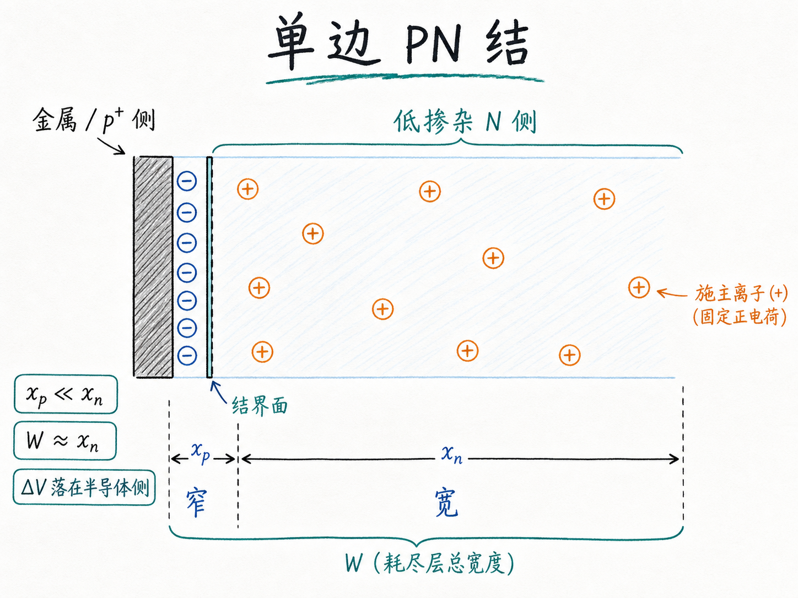
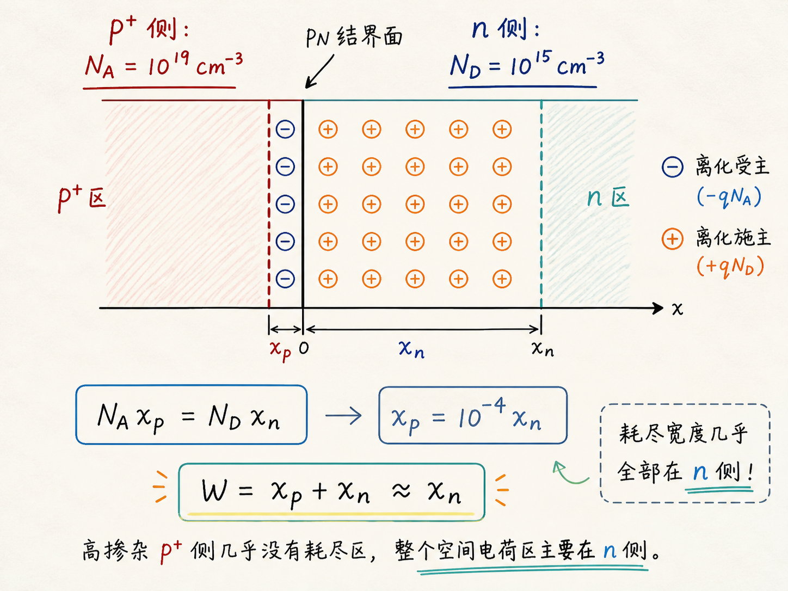
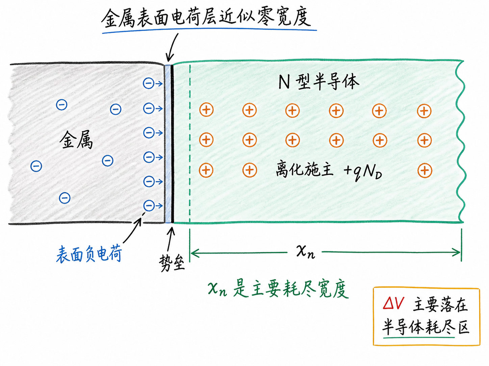
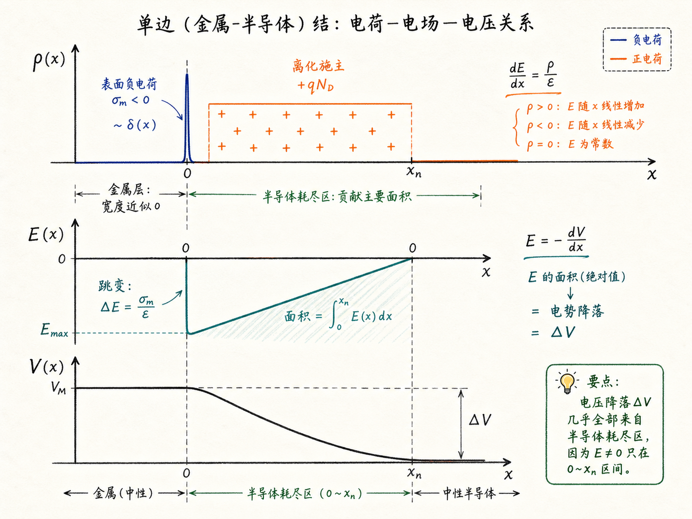

# 为什么耗尽区会变成单边：从 $p^+n$ 结到金属-半导体结

PN 结的耗尽区看起来像是长在 P 区和 N 区之间的一段空间。但在真实器件里，它并不一定“两边平均分”。如果一边掺得特别重，耗尽区会几乎全部伸到另一边；如果一边是金属，电荷甚至可以压缩到一个几乎没有宽度的表面层里。

这就是“单边结”的核心：不是没有两边电荷，而是其中一边太薄、太重掺杂，或者太像金属，以至于在计算耗尽宽度和电压降时可以近似忽略它。这个近似很实用，因为后面讲 MOSFET、肖特基二极管和欧姆接触时，经常不是一个标准对称 PN 结，而是“一个薄电荷层 + 一个半导体耗尽区”。

读完这篇，你会知道

- 为什么 $p^+n$ 结的耗尽区几乎全部伸进低掺杂一侧
- 电荷中性如何决定 $x_p$ 和 $x_n$ 的比例
- 为什么金属-半导体结不能直接套 PN 结的 $V_{bi}$ 公式
- 为什么金属表面电荷层几乎不贡献电压降
- 单边结公式为什么能用于 MOSFET 和肖特基二极管的静电分析

## 先看普通 PN 结：耗尽区宽度由“电荷相等”决定

一个突变 PN 结，左边是 P 区，右边是 N 区。耗尽区里，P 侧留下带负电的离化受主，N 侧留下带正电的离化施主。

记 P 侧耗尽宽度为 $x_p$，N 侧耗尽宽度为 $x_n$。如果受主浓度是 $N_A$，施主浓度是 $N_D$，那么单位面积上的耗尽区电荷量可以近似写成：

- P 侧负电荷大小：$qN_Ax_p$
- N 侧正电荷大小：$qN_Dx_n$

整个半导体必须保持电荷中性，所以两边电荷大小相等：

$$
qN_Ax_p=qN_Dx_n
$$

约掉 $q$，得到最关键的比例关系：

$$
N_Ax_p=N_Dx_n
$$

也就是：

$$
x_p=x_n\frac{N_D}{N_A}
$$

这句话很朴素：哪一边掺杂浓度高，哪一边只需要很窄的耗尽宽度，就能提供同样多的空间电荷。

## 为什么 $p^+n$ 结会变成单边

假设 P 侧是重掺杂，$N_A=10^{19}\ \text{cm}^{-3}$；N 侧是轻掺杂，$N_D=10^{15}\ \text{cm}^{-3}$。两者相差 $10^4$ 倍。

代入比例式：

$$
x_p=x_n\frac{10^{15}}{10^{19}}=10^{-4}x_n
$$

这意味着 P 侧耗尽宽度只有 N 侧的万分之一。总耗尽宽度是：

$$
W=x_p+x_n=x_n(1+10^{-4})
$$

工程上几乎就可以写成：

$$
W\approx x_n
$$

这就是 $p^+n$ 单边结。$p^+$ 这一侧不是没有耗尽区，而是太窄；低掺杂 N 侧承担了几乎全部耗尽宽度。

这个结论对器件分析很有用。因为很多时候我们真正关心的是电场分布、击穿位置、电容和电压降。如果耗尽区几乎都在轻掺杂侧，那么模型就可以简化成“只求低掺杂侧的宽度”。

## 单边近似不是技巧，而是电荷账本

单边结容易被误解成一种数学偷懒。其实它只是电荷账本的结果。

耗尽区必须满足两件事：

1. 两边总电荷大小相等
2. 电压降由电场积分决定

重掺杂侧的空间电荷密度很大，所以只要很短一段宽度，就能凑够与轻掺杂侧相等的电荷。轻掺杂侧电荷密度小，只能用更宽的耗尽区来补足电荷。

因此，掺杂越不对称，耗尽区越偏向低掺杂侧。当浓度差足够大时，重掺杂侧宽度就可以在一阶近似里忽略。

## 更一般的单边结：另一边可以是金属

现在把问题推进一步：如果左边不是重掺杂 P 区，而是金属，会怎样？

金属里有大量可移动电子。只要金属表面需要承载负电荷，这些电子会迅速移动到界面附近，集中在极薄的一层内。这个厚度可以是纳米级甚至更小。和半导体耗尽区相比，它小到可以近似成零宽度。

右边仍然是 N 型半导体。为了平衡金属表面的负电荷，半导体一侧会留下正的离化施主，形成宽度为 $x_n$ 的耗尽区。

于是结构变成：

- 金属侧：一层几乎零宽度的负电荷
- 半导体侧：一段有限宽度的正电荷耗尽区

这就是更一般的单边结。它不再是标准 PN 结，但静电本质还是同一件事：界面两边的总电荷要平衡，电场和电势由电荷分布决定。

## 这里不能把 $N_A$ 当成无穷大

在普通 PN 结里，内建电势可以写成：

$$
V_{bi}=\phi_T\ln\frac{N_AN_D}{n_i^2}
$$

其中 $\phi_T$ 是热电压，$n_i$ 是本征载流子浓度。

但金属-半导体结不能直接把金属侧当成“$N_A$ 无穷大”的 P 区。这样代入会让 $V_{bi}$ 变成无穷大，明显不符合物理。

原因是金属不是一个普通的掺杂半导体。金属侧的电荷浓度、能级和界面势垒需要额外信息决定，不能用半导体受主浓度那套公式描述。

所以在一般单边结里，更稳妥的写法是不用 $V_{bi}$，而是直接使用半导体耗尽区上的实际电压降 $\Delta V$。这个 $\Delta V$ 可以来自测量，也可以来自后续器件模型的边界条件。

一旦知道 $\Delta V$，就可以继续用单边耗尽区的静电关系。对 N 型半导体一侧，常见形式是：

$$
x_n=\sqrt{\frac{2\epsilon_s\Delta V}{qN_D}}
$$

这里 $\epsilon_s$ 是半导体介电常数，$q$ 是元电荷，$N_D$ 是施主浓度。这个式子只依赖半导体侧的掺杂和耗尽区电压降，不需要给金属侧硬塞一个虚假的 $N_A$。

## 为什么电压几乎都落在半导体耗尽区

这个问题很关键：金属侧明明有很多电荷，为什么它几乎不贡献电压降？

答案在积分里。

从高斯定律出发：

$$
\nabla\cdot E=\frac{\rho}{\epsilon}
$$

在一维近似下：

$$
\frac{dE}{dx}=\frac{\rho}{\epsilon}
$$

电势和电场的关系是：

$$
E=-\frac{dV}{dx}
$$

也就是说，先对电荷密度 $\rho$ 积分得到电场 $E$，再对电场积分得到电势 $V$。

金属表面的负电荷层可以近似成一个 delta 函数：电荷密度极高，但空间宽度极小。它会让电场在界面处发生跳变；但因为这段区域的宽度近似为零，对电场再积分时，它贡献的面积近似为零。

半导体耗尽区不同。它有有限宽度 $x_n$，里面的正电荷密度约为 $qN_D$。电场会在这段空间里逐渐变化，电场曲线下面的面积就是电压降。因此主要的 $\Delta V$ 落在半导体耗尽区里。

用图像想象就是：

- 金属侧像一根很尖的针：高度可能很大，但宽度几乎为零
- 半导体侧像一个有宽度的三角形：面积明显，电压降也主要来自这里

电压看的是电场曲线下面的面积，不只看电荷密度有多高。

## 这个近似后面为什么重要

单边结不是只为 PN 结服务。它是理解很多器件边界问题的基础。

在 MOSFET 里，栅极一侧像金属或高导电电极，半导体一侧形成耗尽区、反型层或积累层。我们通常关心的是硅里的电势、耗尽宽度和表面电场，而不是把栅极电荷层当成一个普通耗尽区。

在肖特基二极管里，金属和半导体直接形成势垒。金属侧电荷层极薄，耗尽区主要进入半导体。因此分析反偏电容、势垒调制和电场分布时，也会使用类似的单边耗尽区图像。

在欧姆接触里，接触区常常需要重掺杂，让耗尽区变得足够窄，从而有利于隧穿和低接触电阻。这里的工程目标反过来就是：把势垒区压薄。

## 最后收束：单边结是在说“谁承担空间”

单边结的核心不是“只有一边有电荷”，而是“主要空间、电场积分和电压降由哪一边承担”。

在 $p^+n$ 结里，重掺杂侧只需要极窄宽度就能提供足够电荷，所以耗尽区几乎全部进入轻掺杂侧。在金属-半导体结里，金属表面电荷层几乎零宽，电压降主要落在半导体耗尽区。

一句话记住：单边结把复杂界面问题简化成半导体一侧的耗尽区问题，而这个简化成立的根本原因，是电荷中性和电场积分。
