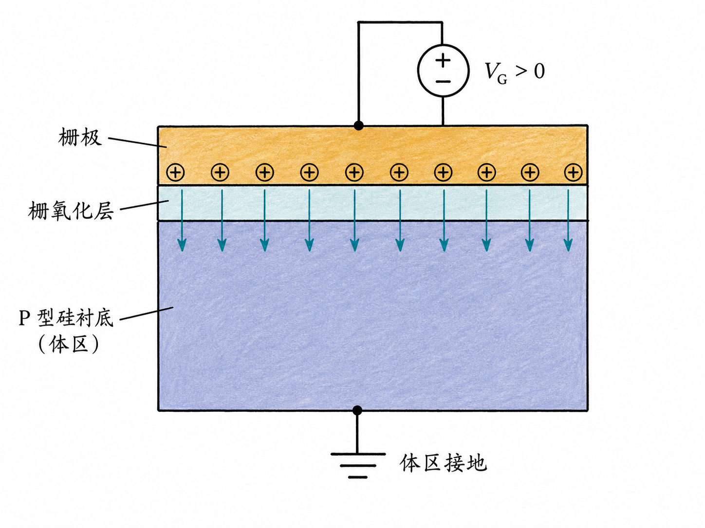
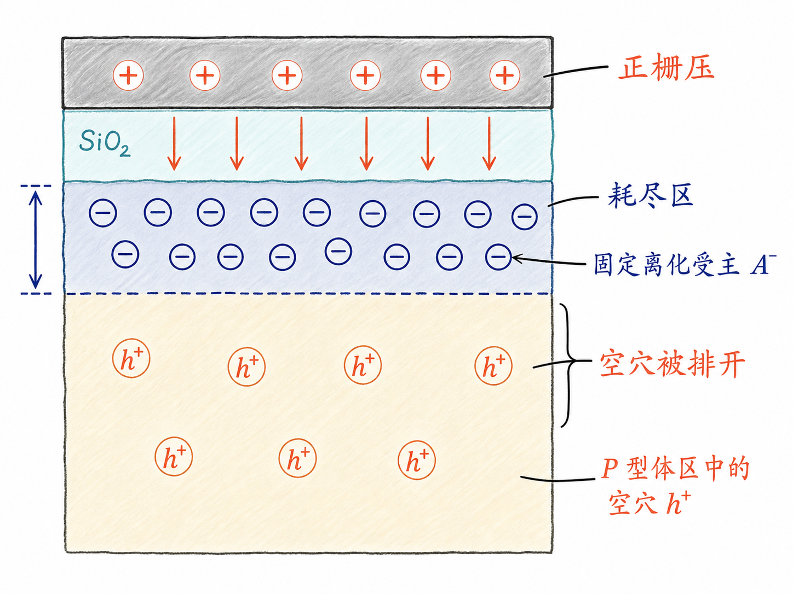
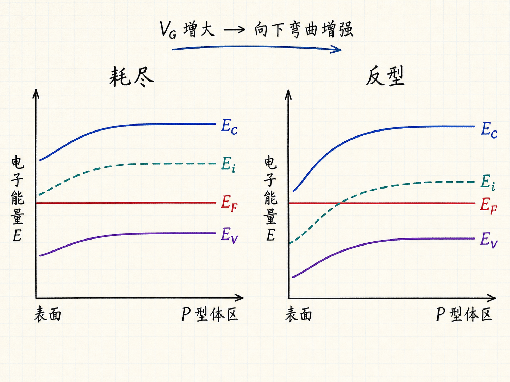
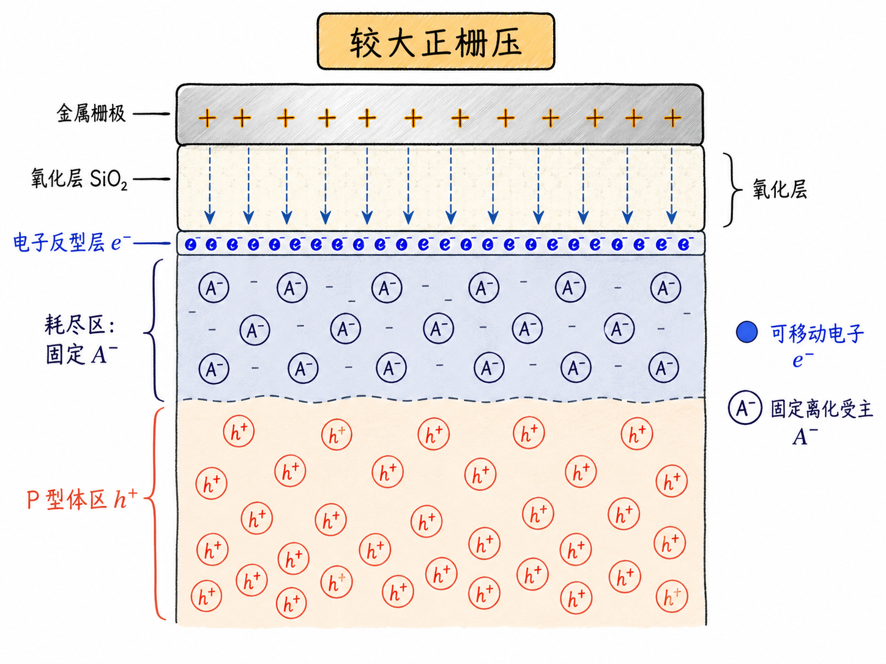

# 一块绝缘层，如何让 P 型硅表面变成 N 型？

MOSFET 最关键的动作，不是电子从源极跑到漏极，而是栅极先隔着一层绝缘氧化层，重新安排半导体表面的载流子。栅极没有直接向硅里注入电流，却能把原本以空穴为多数载流子的 P 型表面，逐步变成由电子导电的区域。

这件事发生在一个看起来很简单的结构里：金属、氧化层、半导体，三层叠在一起，就是 MOS 电容。理解它怎样从耗尽走到反型，就抓住了 MOSFET 的静电控制核心。

读完这篇，你会知道

- MOS 电容为什么是 MOSFET 的核心部分？
- 正栅压怎样在 P 型衬底表面形成耗尽区？
- 能带为什么在氧化层附近向下弯曲？
- 什么时候表面不再只是耗尽，而是进入反型？
- 为什么栅极绝缘，仍然可以控制半导体是否导电？

## 先把 MOS 电容拆成三层

MOS 是 metal–oxide–semiconductor 的缩写，也就是“金属—氧化层—半导体”。从上到下看，它包含三部分：

1. **栅极（gate）**：通常由金属或多晶硅构成，用来施加控制电压。
2. **栅氧化层（oxide）**：绝缘层，把栅极与半导体隔开。
3. **半导体衬底（substrate）**：也常叫体区（body）或体材料（bulk）。这里先取 P 型硅。

氧化层不让直流电荷轻易穿过，却允许栅极电压建立电场。这正是关键：栅极不是靠接触半导体来控制它，而是靠电场改变表面载流子的分布。

下面都假设体区接地，所以栅极电压 $V_G$ 是栅极相对体区的电压。

## 小的正栅压：先把空穴推开

P 型硅中的多数载流子是空穴。没有外加栅压时，空穴分布在衬底中，靠近氧化层的表面也不例外。

当栅极加上正电压，栅极一侧积累正电荷，氧化层下方随之建立电场。粗略地说，电场强度由电压差和距离决定，可写成 $E\approx\Delta V/d$，其中 $d$ 是电压降所跨越的距离。

空穴带正电，因此受到排斥，离开硅—氧化层界面，向体内移动。空穴走后，受主原子形成的离化受主 $A^-$ 留在原位。它们是固定的负空间电荷，不会像自由载流子那样移动。

于是，表面出现一个自由空穴显著减少、主要暴露出固定离化受主的区域，这就是**耗尽区（depletion region）**。

需要注意，耗尽并不是“这里绝对没有载流子”。耗尽近似表达的是：与准中性体区相比，多数载流子浓度已经很低，固定空间电荷开始主导这个区域的静电行为。

## 同一件事，换成能带图怎么看

器件剖面告诉我们“电荷去了哪里”，能带图则告诉我们“载流子为什么会重新分布”。

在远离界面的 P 型体区，导带底记作 $E_C$，价带顶记作 $E_V$，本征能级记作 $E_i$，费米能级记作 $E_F$。因为是 P 型材料，体区的 $E_F$ 位于 $E_i$ 下方，更靠近 $E_V$。

正栅压主要影响靠近氧化层的表面。体区很大且接地，离界面足够远的位置近似不变；越靠近表面，电势变化越明显。对电子能量来说，电势升高意味着能带能量降低，因此 $E_C$、$E_i$ 和 $E_V$ 在表面附近一起向下弯曲，而热平衡时的 $E_F$ 仍保持水平。

当表面的 $E_i$ 逐渐靠近 $E_F$，局部空穴浓度下降，能带图所描述的正是耗尽过程。也就是说：

$$
\text{正栅压}\;\rightarrow\;\text{表面电势升高}\;\rightarrow\;\text{能带向下弯曲}\;\rightarrow\;\text{空穴被排开}
$$

器件剖面中的耗尽区，与能带图中的向下弯曲，是同一个静电过程的两种表达。

## 栅压继续增大：耗尽区不会无限承担全部变化

继续提高 $V_G$，表面电场增强，耗尽区会向体内扩展。能带弯曲也会更明显，并从更深的位置开始过渡。

在最简化的讲法里，如果暂时忽略氧化层上的电压降，可以把栅压变化近似看成全部转化为半导体表面电势变化。但真实 MOS 结构中，外加栅压会分配在氧化层和半导体两部分，因此不能在所有情况下都把 $V_G$ 直接等同于能带弯曲对应的电势。

不过，定性趋势不会改变：正栅压越大，P 型表面的能带越向下弯曲，空穴越少，固定的耗尽电荷越多。

接下来会出现一个转折。

## 当 $E_i$ 越过 $E_F$：表面开始像 N 型材料

在 P 型体区，$E_F<E_i$，空穴多于电子。随着表面能带不断向下弯曲，表面处的 $E_i$ 会先接近 $E_F$，然后降到 $E_F$ 下方。

当表面满足 $E_i<E_F$ 时，电子浓度开始超过空穴浓度。衬底深处仍然是 P 型，但紧贴氧化层的薄层已经表现出 N 型特征：电子成为这里的多数载流子。

这就是**反型（inversion）**。“反型”不是说整块 P 型衬底都被永久改造成了 N 型，也不是受主掺杂消失了；改变的是表面附近的自由载流子类型。固定的离化受主仍在耗尽区内，而界面附近又聚集起可以移动的电子。

从电荷角度看，过程可以分成两步：

1. 较小正栅压先排斥空穴，形成耗尽区；
2. 更大正栅压继续吸引负电荷，最终在界面附近聚集自由电子，形成反型层。

从能带角度看，同样是两步：

1. $E_i$ 向 $E_F$ 靠近，对应空穴浓度持续下降；
2. $E_i$ 下弯到 $E_F$ 以下，对应电子在表面占据优势。

## 为什么这就是 MOSFET 的核心

MOS 电容只有栅极、氧化层和体区，还没有完整 MOSFET 的源极与漏极。但它已经完成了最关键的控制动作：用栅极电场决定半导体表面有没有一层可由电子导电的区域。

在完整的 N 沟道 MOSFET 中，源极和漏极位于栅极两侧。当正栅压把 P 型表面推入反型后，界面附近的电子层可以把源极与漏极连接起来，形成沟道。栅压降低，反型层减弱或消失，沟道也随之关闭。

这就是**场效应（field effect）**：输入端几乎不需要通过氧化层输送直流电荷，只需改变电场，就能控制输出通道中的载流子分布和导电能力。

## 最后把整条因果链串起来

对接地的 P 型体区施加正栅压后，MOS 电容依次经历：

$$
\text{正栅压}
\rightarrow\text{排斥空穴}
\rightarrow\text{形成耗尽区}
\rightarrow\text{能带继续向下弯曲}
\rightarrow\text{吸引电子}
\rightarrow\text{形成反型层}
$$

最值得记住的一句话是：**MOSFET 的栅极不需要碰到半导体，也能借助电场把 P 型表面临时变成由电子导电的区域。**

MOS 电容解释了沟道为什么能够出现；下一步再把源极、漏极和完整能带接进来，就能进一步理解 MOSFET 怎样把这层反型电荷变成可控电流。
