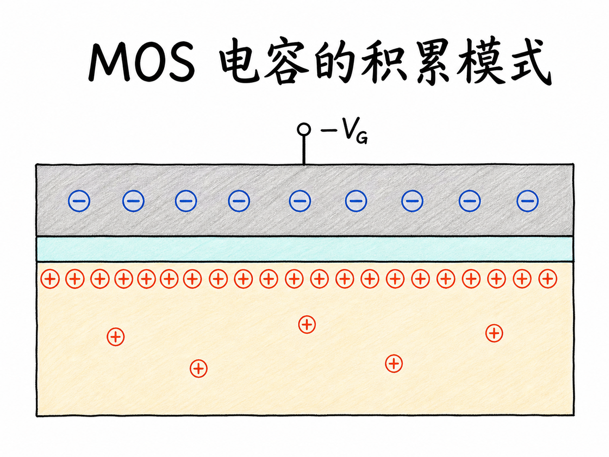
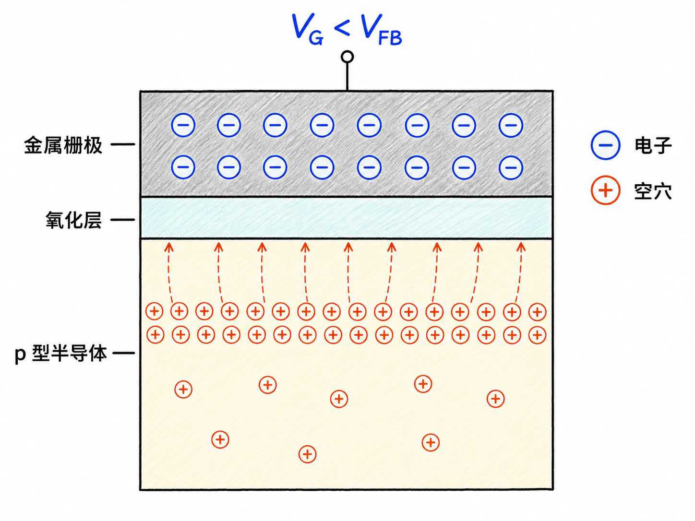
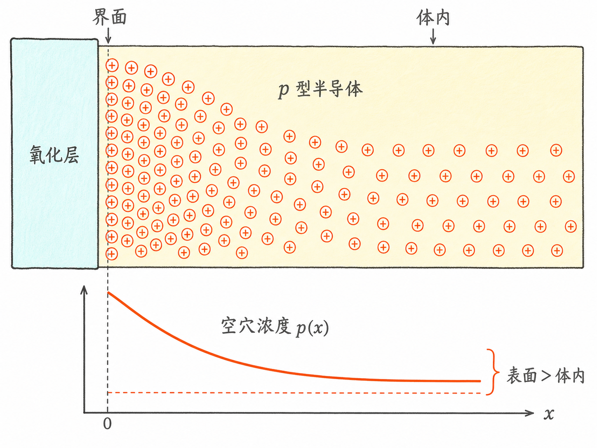
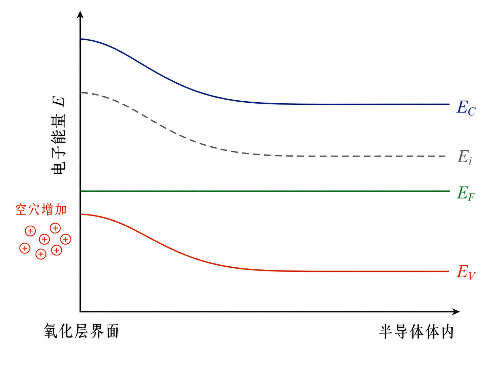
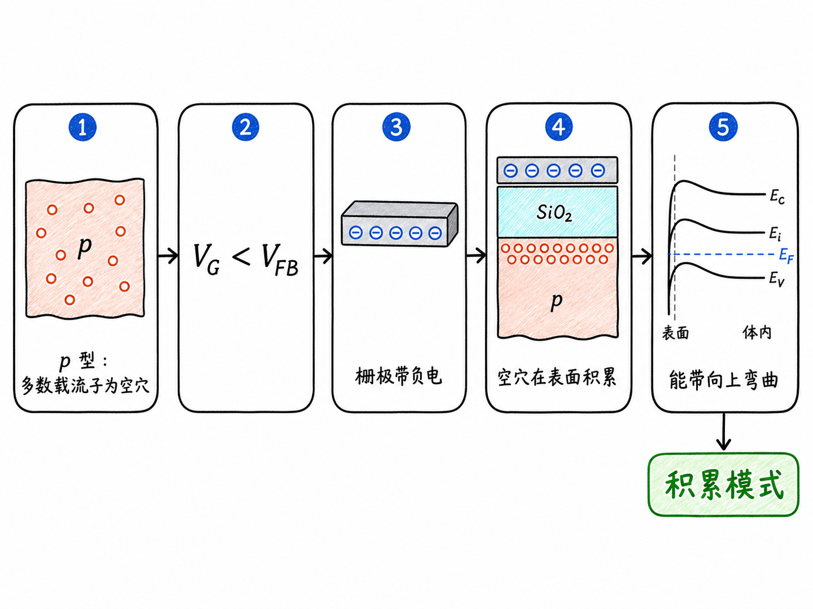

# MOS 电容的积累模式：负栅压为什么会把空穴拉到界面

一块 p 型半导体里本来就有很多空穴。如果在它上方隔着一层氧化物放一块金属，再把金属电压调成负值，这些空穴会发生什么？它们不会穿过氧化层，却会向氧化层—半导体界面聚集。

这就是 MOS 电容的积累模式。看懂它的关键，不是只背一句“p 型衬底加负栅压会积累”，而是把三件事连起来：栅极电荷的极性、半导体表面的多数载流子，以及能带为什么向上弯曲。

读完这篇，你会知道

- MOS 电容的三层结构为什么能像电容一样储存电荷
- p 型半导体进入积累时，电子和空穴分别在哪里
- 为什么负栅压对应半导体表面能带向上弯曲
- 为什么判断积累不能只看栅压是否小于零，还要看平带电压

## 先把结构摆清楚：电荷隔着氧化层相互作用

MOS 是 Metal–Oxide–Semiconductor 的缩写，也就是金属—氧化物—半导体。最上层的金属是栅极，中间的氧化层是绝缘体，最下层是半导体。

氧化层很薄，但它阻止了栅极与半导体之间的直流导通。于是，栅极上的电荷不能直接流进半导体，只能通过电场改变半导体表面的载流子分布。这正是“电容”的工作方式：两侧储存等量异号电荷，中间由绝缘层隔开。

下面只讨论 p 型半导体，并把半导体体端接地。p 型材料的多数载流子是空穴；栅极电压 $V_G$ 则以半导体体端为参考。

## 负栅压做了什么：金属存电子，表面聚空穴

当 $V_G$ 变负时，金属栅极得到更多电子，因此栅极一侧带负电。隔着氧化层，这些负电荷会吸引 p 型半导体中的正电载流子——空穴。

空穴不能进入氧化层，只能在半导体一侧靠近界面的区域重新分布。结果是：表面空穴浓度高于体内空穴浓度。这里积累的不是少数载流子，而是 p 型半导体原本就占多数的空穴，所以这个状态叫作积累模式（accumulation mode）。

可以把它记成一条清楚的因果链：

$$
\text{负栅压}
\rightarrow \text{栅极电子增加}
\rightarrow \text{电场吸引空穴}
\rightarrow \text{表面空穴浓度升高}
$$

“表面空穴变多”不等于半导体凭空产生了新的净电荷。它描述的是多数载流子从体内重新分布到界面附近；与之对应的负电荷留在金属栅极上。

## 为什么能带要向上弯曲

载流子图给出了直觉，能带图给出更精确的判断。

在 p 型半导体体内，费米能级 $E_F$ 靠近价带顶 $E_V$。越靠近价带顶，空穴浓度越高。因此，如果界面附近要比体内拥有更多空穴，就必须让界面处的 $E_V$ 更靠近 $E_F$。

在热平衡下，$E_F$ 保持水平。要缩小界面处 $E_F$ 与 $E_V$ 的距离，只能让靠近界面的整组能带——导带底 $E_C$、本征能级 $E_i$ 和价带顶 $E_V$——一起向上弯曲。三条能级应保持近似平行，带隙并不会因为积累而突然改变。

这里最容易把符号想反。能带图的纵轴是电子能量，而电子的势能与电势满足：

$$
E=-qV
$$

其中，$q$ 是元电荷的正值，$V$ 是电势。电势降低时，电子能量反而升高。所以，对接地的 p 型半导体施加负栅压，会使表面电势降低，对应半导体表面的能带向上弯曲。

## “负电压”还不够精确：真正参照是平带电压

如果金属和半导体的功函数完全匹配，而且氧化层与界面中没有电荷，那么 $V_G=0$ 时半导体能带可以是平的。但真实结构中，金属功函数 $\phi_m$ 与半导体功函数 $\phi_s$ 通常不同。它们的差值

$$
\phi_{ms}=\phi_m-\phi_s
$$

会让 MOS 结构在零外加偏压时就出现初始能带弯曲。

因此，判断积累不能把 $0\,\text{V}$ 当成永远不变的边界。更可靠的参照是平带电压 $V_{FB}$：当 $V_G=V_{FB}$ 时，外加电压刚好抵消结构原有的能带弯曲，半导体能带恢复平直。

对于这里讨论的 p 型半导体，栅压从平带点继续向更负方向移动，表面能带向上弯曲，空穴开始积累：

$$
V_G < V_{FB}\quad\Rightarrow\quad\text{积累模式}
$$

这个写法比“$V_G<0$ 就积累”更准确。不同栅极金属会改变 $\phi_{ms}$，氧化层或界面电荷也会改变实际的 $V_{FB}$；因此，同样的外加栅压，在不同器件上未必对应完全相同的表面状态。

## 从电压一路检查到载流子

遇到 MOS 电容工作模式题，可以沿着下面的顺序判断：

1. 先确认半导体类型。这里是 p 型，多数载流子为空穴。
2. 再看栅极相对体端的电压。负栅压使金属栅极带负电。
3. 判断电场吸引谁。负栅极吸引带正电的空穴靠近表面。
4. 检查能带方向。p 型表面空穴增加时，$E_C$、$E_i$、$E_V$ 在界面处共同向上弯曲，$E_V$ 更靠近水平的 $E_F$。
5. 最后与 $V_{FB}$ 比较。对 p 型半导体，$V_G<V_{FB}$ 才是积累区的精确判断。

这五步必须互相一致。如果图中画的是负栅压，却让电子在 p 型半导体表面积累；或者空穴增加了，价带却远离费米能级，那么极性、载流子或能带至少有一处画反了。

## 一句话收束

p 型 MOS 电容的积累模式，就是栅极相对平带点变得更负，金属侧电子增加，半导体表面空穴增加，并表现为界面处能带向上弯曲。

接下来讨论耗尽模式时，栅压会朝相反方向推动多数载流子离开界面；理解积累态，正好给那一变化提供清楚的起点。

