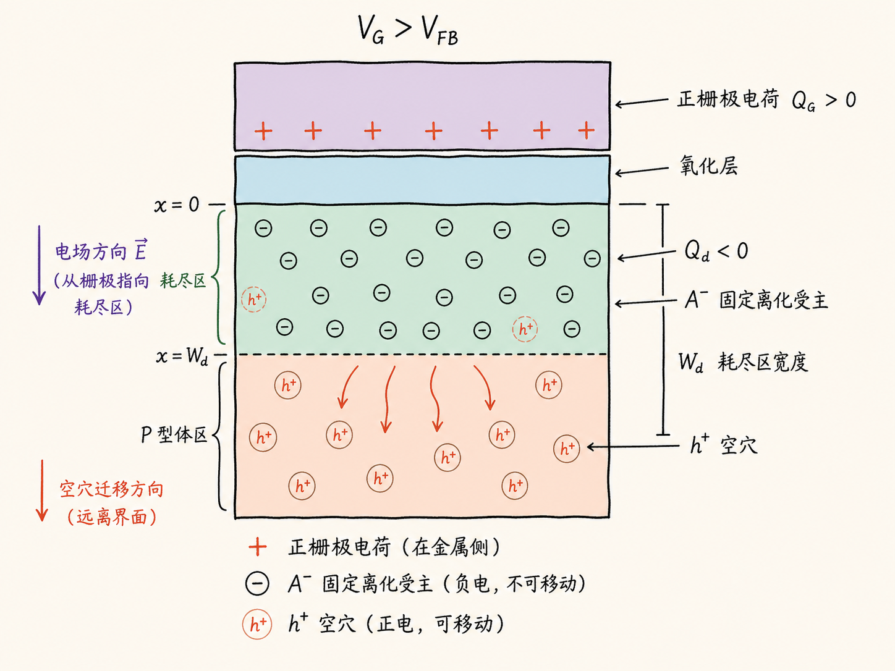
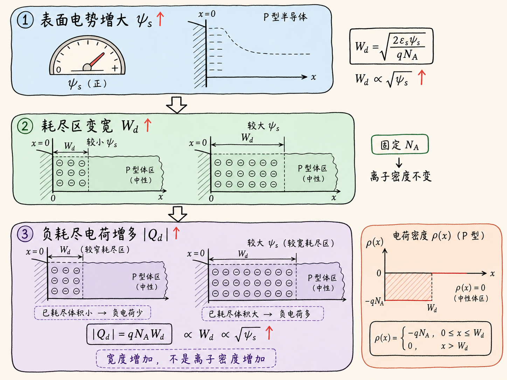
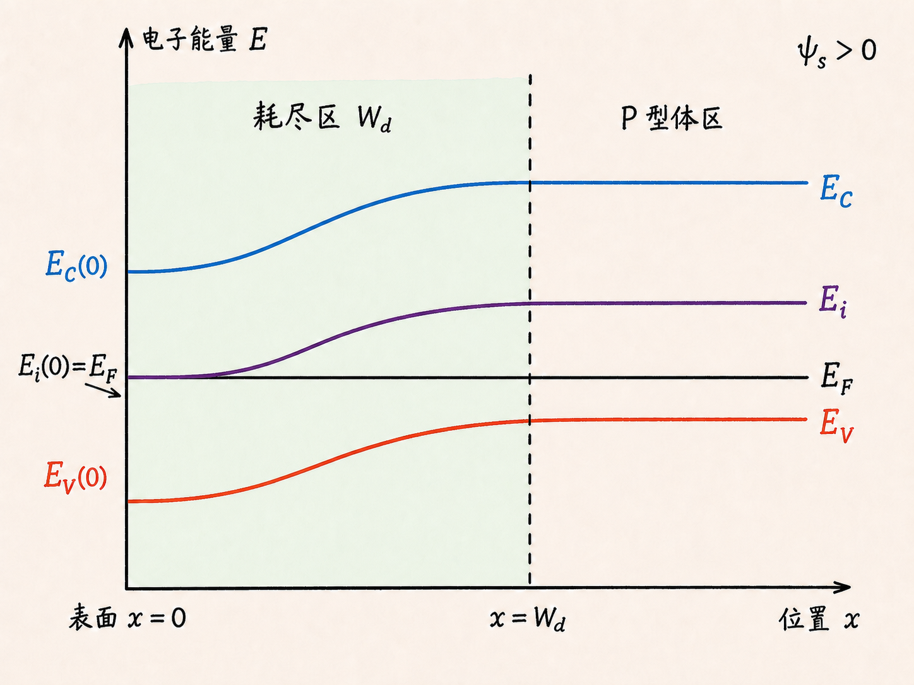
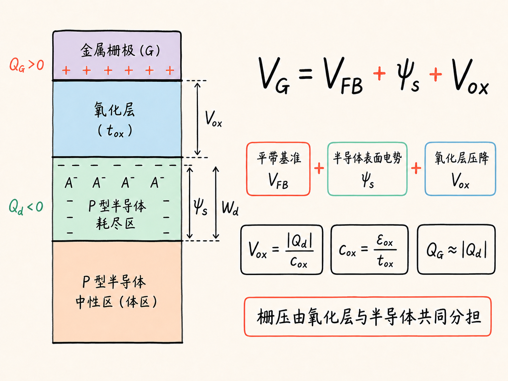

# MOS 电容为什么会进入耗尽模式？

给 P 型 MOS 电容的栅极加正电压时，界面附近的空穴会被推走。奇怪的是，那里并不会变成一片“什么电荷都没有”的真空：留下来的是固定在晶格中的负离化受主。这个由可移动载流子退出、固定空间电荷显露出来的区域，就是耗尽区。

耗尽模式真正串起了五件事：栅极正电荷、P 型衬底中的离化受主、耗尽区宽度、表面电势和能带弯曲。把这条因果链理顺，后面的反型、阈值电压和 MOSFET 沟道形成就有了共同的物理底座。

读完这篇，你会知道

- 为什么正栅压会让 P 型表面的空穴减少，却留下负空间电荷
- 栅极电荷与耗尽区电荷为什么必须相互对应
- 表面电势增大时，耗尽区宽度为什么会继续增加
- P 型半导体的能带在表面应该向哪个方向弯曲
- 为什么栅压不能简单地全部算在半导体表面电势上

## 先别把“耗尽”理解成没有电荷

MOS 电容由金属栅极、绝缘氧化层和半导体组成。这里考虑 P 型衬底，并把衬底接地。P 型半导体中有两类与耗尽过程直接相关的电荷：可以移动的空穴，以及固定在晶格位置上的负离化受主 $A^-$。

在远离表面的均匀体区，空穴的正电荷与离化受主的负电荷近似抵消，所以材料整体保持电中性。给栅极施加足够正的电压后，栅极下表面积累正电荷。正电荷排斥空穴，空穴便从氧化层—半导体界面向衬底深处移动。

离化受主不能跟着移动。于是，表面附近出现一层空穴浓度显著降低、却含有固定负电荷的区域。所谓“耗尽”，耗尽的是多数载流子空穴，不是所有电荷。

在耗尽近似下，这一层的体电荷密度可以写成

$$
\rho(x)\approx -qN_A,
$$

其中 $q$ 是元电荷，$N_A$ 是受主掺杂浓度。这个负号来自离化受主的负电荷。

## 栅极正电荷把负空间电荷“显露”出来

氧化层阻止直流载流子穿过，但电场可以穿过氧化层。栅极的正电荷 $Q_G$ 在半导体中建立电场，推动空穴离开表面；半导体一侧留下的耗尽电荷记作 $Q_d$，它为负。

若暂时忽略氧化层固定电荷和界面态，整个 MOS 电容必须满足近似电荷平衡：

$$
Q_G+Q_d\approx 0,
$$

也就是 $Q_G\approx |Q_d|$。栅极不是隔着氧化层“直接抓住”某一批受主，而是通过电场重新分布半导体中的可移动空穴，最终让两侧总电荷互相对应。

如果把单位面积耗尽电荷写成

$$
Q_d\approx -qN_AW_d,
$$

那么 $W_d$ 就是从半导体表面到准中性体区之间的耗尽区宽度。正栅压继续增大时，需要更多负耗尽电荷与栅极电荷平衡；在 $N_A$ 固定时，只能让耗尽区向更深处扩展。

## 表面电势决定耗尽区能扩展多深

把半导体体区电势作为参考，表面相对体区的电势变化记作表面电势 $\psi_s$。对于这里的 P 型衬底和正栅压，进入耗尽时 $\psi_s>0$。

在一维耗尽近似下，表面电势、掺杂浓度和耗尽区宽度之间满足

$$
W_d\approx \sqrt{\frac{2\varepsilon_s\psi_s}{qN_A}},
$$

其中 $\varepsilon_s$ 是半导体介电常数。这个关系给出两个直接结论：

- $\psi_s$ 增大，$W_d$ 按平方根关系增加；
- $N_A$ 越高，同样的 $\psi_s$ 只能形成更窄的耗尽区。

把 $W_d$ 代回耗尽电荷，还可以得到

$$
|Q_d|\approx \sqrt{2q\varepsilon_sN_A\psi_s}.
$$

因此，正栅压增强并不是只改变界面最薄的一层。它提高表面电势，扩大耗尽区，同时增加固定负空间电荷的总量。

## 能带为什么在表面向下弯

能带图是同一套静电关系的能量表达。电子能量与电势的关系是 $E=-q\psi$。因此，当 P 型半导体表面电势相对体区升高，也就是 $\psi_s>0$ 时，表面附近的导带底 $E_C$、本征能级 $E_i$ 和价带顶 $E_V$ 都相对体区降低。

如果横轴从氧化层—半导体界面指向半导体体内，那么三条能带从表面向体区逐渐升高并恢复平坦；换成“从体区走向表面”的观察方向，就是能带向下弯曲。三条带边应近似平行，硅的禁带宽度不会因为静电势而改变。

热平衡时，费米能级 $E_F$ 必须保持水平。体区仍是 P 型，所以体区的 $E_F$ 位于 $E_i$ 下方并更靠近 $E_V$。正栅压使表面的 $E_i$ 下移、逐渐靠近水平的 $E_F$，这正对应表面空穴浓度下降。

P 型体区的费米势幅值可写成

$$
\phi_{Fp}=\frac{kT}{q}\ln\left(\frac{N_A}{n_i}\right),
$$

其中 $k$ 是玻尔兹曼常数，$T$ 是绝对温度，$n_i$ 是本征载流子浓度。当 $\psi_s\approx\phi_{Fp}$ 时，表面的 $E_i$ 接近 $E_F$，表面载流子分布接近本征状态。此时体区仍然是 P 型，只是表面已经被明显耗尽。

需要注意，这还不是强反型条件。继续提高正栅压，表面少数载流子电子会变得重要；在常用理想近似中，强反型通常与 $\psi_s\approx2\phi_{Fp}$ 联系起来。耗尽模式正是从平带走向反型之间不可跳过的阶段。

## 栅压被氧化层和半导体共同分担

如果只看能带需要移动多少，很容易误以为栅压只要比平带电压高出 $\psi_s$ 就够了。但栅极与半导体之间隔着氧化层，耗尽电荷产生的电场也会在氧化层上形成电压降。

理想情况下，栅压的分配可写成

$$
V_G=V_{FB}+\psi_s+V_{ox},
$$

其中 $V_{FB}$ 是平带电压，$V_{ox}$ 是氧化层电压降。若单位面积氧化层电容为 $c_{ox}=\varepsilon_{ox}/t_{ox}$，并忽略其他电荷，则

$$
V_{ox}\approx\frac{|Q_d|}{c_{ox}}.
$$

合起来就是

$$
V_G\approx V_{FB}+\psi_s+\frac{|Q_d|}{c_{ox}}.
$$

这条式子解释了为什么“把表面能带弯到目标位置”所需的实际栅压，要高于只计算 $\psi_s$ 得到的结果：新增栅压一部分继续改变半导体表面电势，另一部分落在氧化层上。

## 把五个量连成一条因果链

现在可以从栅压一路讲到能带：

1. 正栅压使金属栅极积累正电荷；
2. 电场排斥 P 型表面空穴，固定的负离化受主显露出来；
3. 为了提供更多负耗尽电荷，耗尽区宽度 $W_d$ 增大；
4. 半导体表面电势 $\psi_s$ 升高；
5. 因为电子能量满足 $E=-q\psi$，$E_C$、$E_i$ 和 $E_V$ 在表面相对体区下移，而 $E_F$ 保持水平。

一句话记住耗尽模式：**正栅压不是把 P 型表面变成“无电荷区”，而是把可移动空穴推开，让固定负受主形成空间电荷，并用表面电势和能带弯曲记录这次重新分布。**

下一步继续提高正栅压，表面就会从“空穴被耗尽”走向“电子形成反型层”，MOS 电容也由耗尽阶段进入 MOSFET 沟道形成的关键一步。
