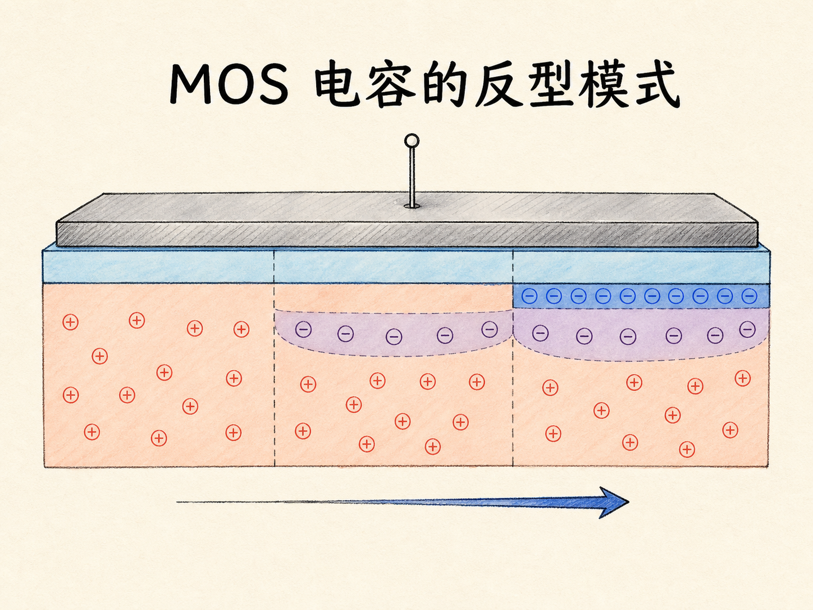
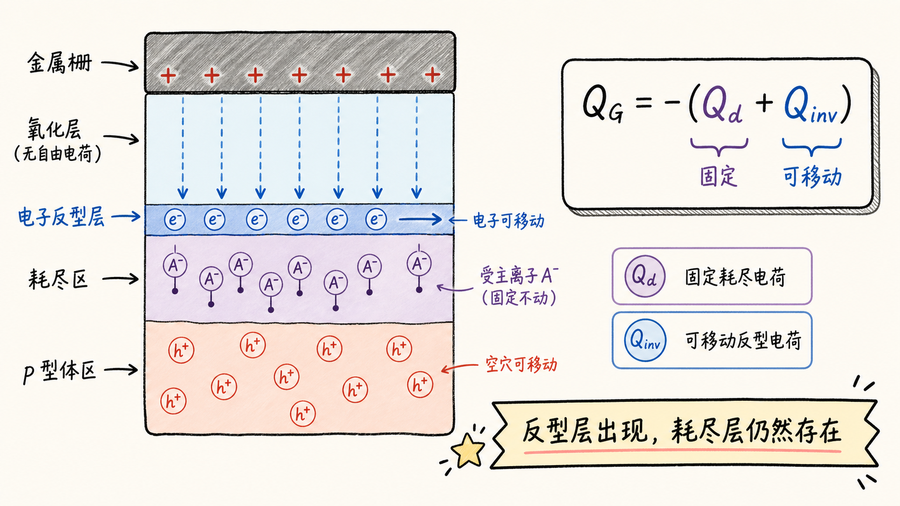
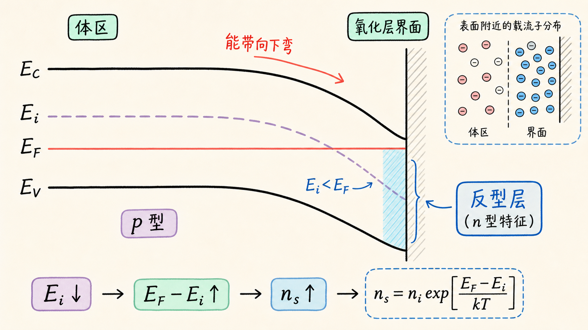
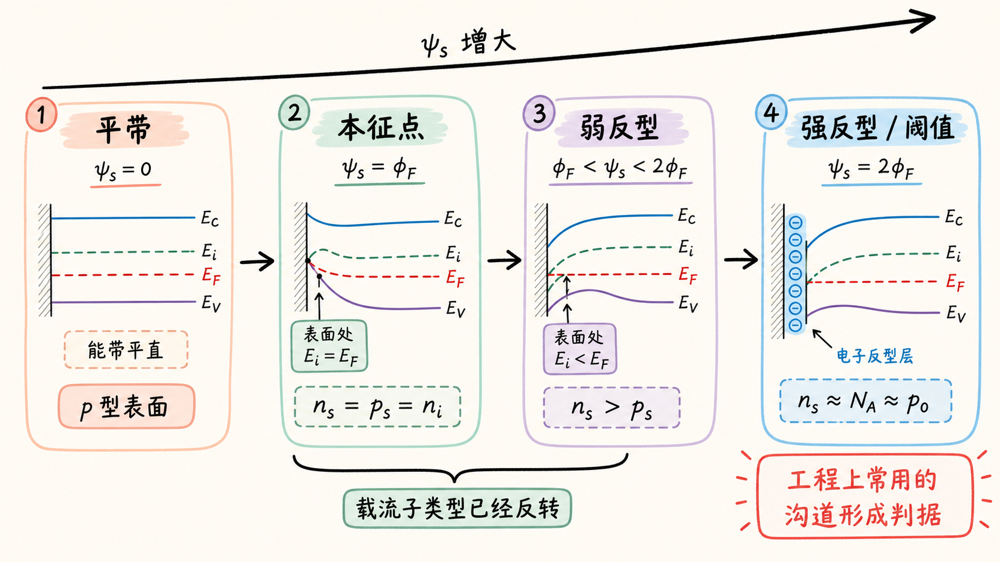
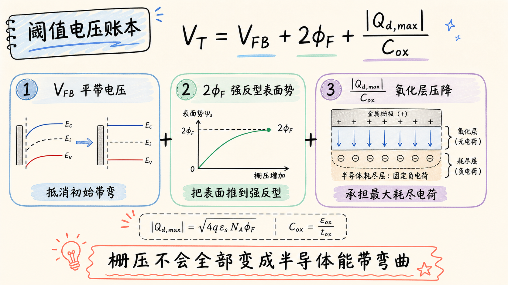

# MOS 电容的反型模式：P 型表面为什么会变成 N 型

一块 p 型硅，掺杂没有改变，为什么只靠栅极上的电压，就能让它的表面表现得像 n 型硅？反型最容易让人困惑的地方就在这里：材料没有被重新掺杂，但表面的多数载流子却真的换了角色。

原因是 MOS 电容不需要改变晶格里的杂质，只需要重新安排界面附近的载流子。正栅压先把空穴推开，再把少数载流子电子吸引到表面；当电子多到超过空穴时，p 型表面就发生了反型。

读完这篇，你会知道

- 正栅压如何让 p 型 MOS 电容依次经历耗尽、弱反型和强反型
- 为什么固定受主离子与反型电子会同时存在
- 能带向下弯曲为什么意味着表面电子浓度上升
- 为什么表面势达到 $\phi_F$ 只是本征点，而达到 $2\phi_F$ 才是常用的强反型判据
- 阈值电压 $V_T$ 为什么不等于单纯的能带弯曲电压

## 反型不是重新掺杂，而是重新安排载流子

先固定结构：上面是金属栅，中间是绝缘氧化层，下面是 p 型硅，硅衬底接地。氧化层阻止直流电流穿过栅极，却允许栅极电场影响半导体表面。

p 型硅的多数载流子是空穴，少数载流子是电子。晶格中还存在受主掺杂留下的固定负离子。它们不能像空穴和电子那样自由移动，因此改变栅压时，真正被重新分布的是移动载流子。

给栅极施加正电压后，金属栅上积累正电荷。它对带正电的空穴产生排斥，对电子产生吸引。这个过程并不是一步跳到反型，而是按顺序经过三个状态：

1. 空穴离开界面，形成耗尽区；
2. 表面空穴继续减少，电子逐渐增加，进入弱反型；
3. 表面电子浓度达到足够高的水平，进入强反型。

所以，反型并不是耗尽的替代状态。进入反型后，耗尽区仍然存在，固定负受主离子也仍在；只是在氧化层下方又多出了一层很薄、可以移动的电子反型层。

## 从电荷图看：先把空穴推走，再把电子拉来

在栅压刚超过平带电压 $V_{FB}$ 时，界面附近的空穴开始退向体区。空穴离开后，原来被它们补偿的受主离子显露出来，构成负的耗尽电荷 $Q_d$。

继续增加正栅压，耗尽区会加宽，但不会无限加宽。与此同时，界面处电子的势能下降，少数载流子电子开始在表面聚集。电子可以来自半导体体内的热产生、扩散与外部接触；MOS 电容的电场负责决定它们在表面是否具有更低的能量。

这里需要分清两类负电荷：

- 耗尽区里的固定受主离子不能移动，构成 $Q_d$；
- 界面附近的反型电子能够沿表面移动，构成反型电荷 $Q_{inv}$。

栅极正电荷最终要同时平衡这两部分负电荷。对理想结构，可以写成

$$
Q_G=-(Q_d+Q_{inv})
$$

这就是为什么“有了反型层”并不意味着“耗尽层消失了”。

## 从能带图看：电子为什么愿意留在表面

载流子图告诉我们电子到了哪里，能带图则告诉我们它们为什么愿意去那里。

在 p 型体区，费米能级 $E_F$ 位于本征能级 $E_i$ 下方，更靠近价带 $E_V$。施加正栅压后，靠近氧化层界面的静电势升高。电子带负电，其势能变化为

$$
\Delta E=-q\Delta\psi
$$

因此，表面电势 $\psi_s$ 上升时，导带 $E_C$、本征能级 $E_i$ 和价带 $E_V$ 都向下弯，而热平衡时的 $E_F$ 保持水平。

电子浓度与 $E_i-E_F$ 的关系近似为

$$
n=n_i\exp\left(\frac{E_F-E_i}{kT}\right)
$$

当表面处的 $E_i$ 向下靠近 $E_F$，指数中的 $E_F-E_i$ 变大，电子浓度便迅速上升。能带弯曲不是一张附带的示意图，它正是在能量语言中描述表面载流子浓度的变化。

## “变成 N 型”只发生在一层很薄的表面

反型并没有把整块衬底变成 n 型。远离界面的体区几乎感受不到表面带弯，仍保持原来的 p 型平衡状态。只有靠近氧化层的薄层中，电子浓度超过空穴浓度，表现出 n 型特征。

可以把它想成同一块材料中同时存在两种区域：

- 深处体区：$p_0\approx N_A$，仍是 p 型；
- 界面表层：$n_s>p_s$，已经反型。

这里的下标 0 表示体区平衡值，下标 s 表示表面值。反型说的是“表面载流子类型反转”，不是“掺杂类型改变”。

## 本征点、弱反型与强反型不是同一个门槛

定义 p 型体区的费米势大小为

$$
\phi_F=\frac{kT}{q}\ln\left(\frac{N_A}{n_i}\right)>0
$$

在平带状态，体区的 $E_i$ 比 $E_F$ 高 $q\phi_F$。当正栅压使表面势达到 $\psi_s=\phi_F$ 时，表面的 $E_i$ 恰好与 $E_F$ 相交，因此

$$
n_s=p_s=n_i
$$

这一点表示表面从 p 型跨过本征状态。再继续增加表面势，$E_i$ 降到 $E_F$ 以下，表面电子多于空穴，进入弱反型。

工程上通常把强反型的起点定义为

$$
\psi_s=2\phi_F
$$

此时表面电子浓度满足

$$
n_s\approx N_A\approx p_0
$$

也就是说，表面的少数载流子电子浓度，已经上升到与体区多数载流子空穴浓度相当的量级。这比“电子刚刚超过空穴”的条件更严格，也更适合作为 MOSFET 沟道形成的工程判据。

## 阈值电压是一份栅压账本

达到强反型时的栅压称为阈值电压 $V_T$。容易犯的错误是把它直接写成 $V_{FB}+2\phi_F$，仿佛全部额外栅压都用于半导体能带弯曲。

实际上，耗尽区中的固定负电荷会在氧化层中建立电场，氧化层也要承担一部分电压降。对均匀掺杂、理想 p 型衬底，强反型处的最大耗尽电荷大小为

$$
|Q_{d,\max}|=\sqrt{4q\varepsilon_sN_A\phi_F}
$$

因此理想长沟道结构的阈值电压可写成

$$
V_T=V_{FB}+2\phi_F+\frac{|Q_{d,\max}|}{C_{ox}}
$$

其中 $C_{ox}=\varepsilon_{ox}/t_{ox}$ 是单位面积氧化层电容。三项分别对应：

- $V_{FB}$：先抵消功函数差和固定电荷造成的初始带弯；
- $2\phi_F$：把表面势推到强反型条件；
- $|Q_{d,\max}|/C_{ox}$：承担耗尽电荷引起的氧化层压降。

真实器件还会受到氧化层电荷、界面态、衬底偏压和短沟道效应影响，但这份栅压账本已经抓住了反型的核心静电关系。

## 超过阈值以后，新增栅压主要增加反型电荷

接近强反型后，耗尽区宽度逐渐接近最大值。此后再提高栅压，表面势仍会变化，但相对缓慢；更多新增栅极电荷会由反型层电子来平衡。

这一步把 MOS 电容与 MOSFET 连接起来：在 MOS 电容中，我们看到的是一层表面电子；在 MOSFET 中，只要源极和漏极提供电子并施加横向电场，这层电子就成为可导电的沟道。

因此，反型模式不是一个孤立的静电现象，而是 MOSFET 能够被栅极“打开”的物理基础。

## 把整条因果链收起来

对 p 型 MOS 电容，反型可以压缩成一条清晰的因果链：

$$
V_G\uparrow
\Rightarrow \psi_s\uparrow
\Rightarrow E_C,E_i,E_V\downarrow
\Rightarrow p_s\downarrow,\ n_s\uparrow
\Rightarrow \text{耗尽}
\Rightarrow \text{弱反型}
\Rightarrow \text{强反型}
$$

最需要记住的不是“正栅压吸引电子”这一句话，而是三个层次：电场重新分布电荷，表面势让能带弯曲，能带弯曲又以指数方式改变表面载流子浓度。把这三层连起来，p 型表面为什么能表现成 n 型，就不再神秘。
