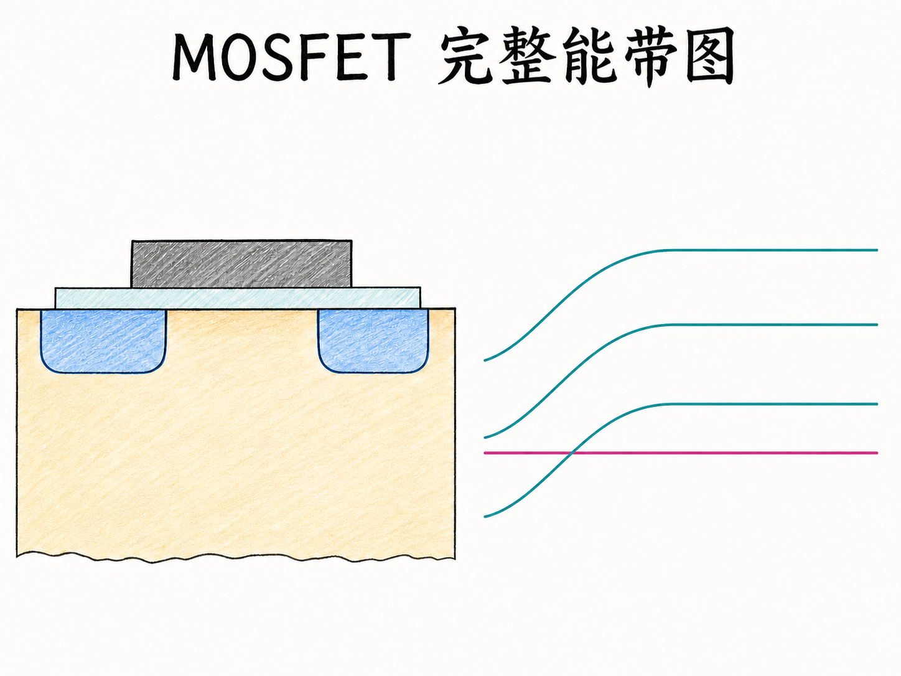
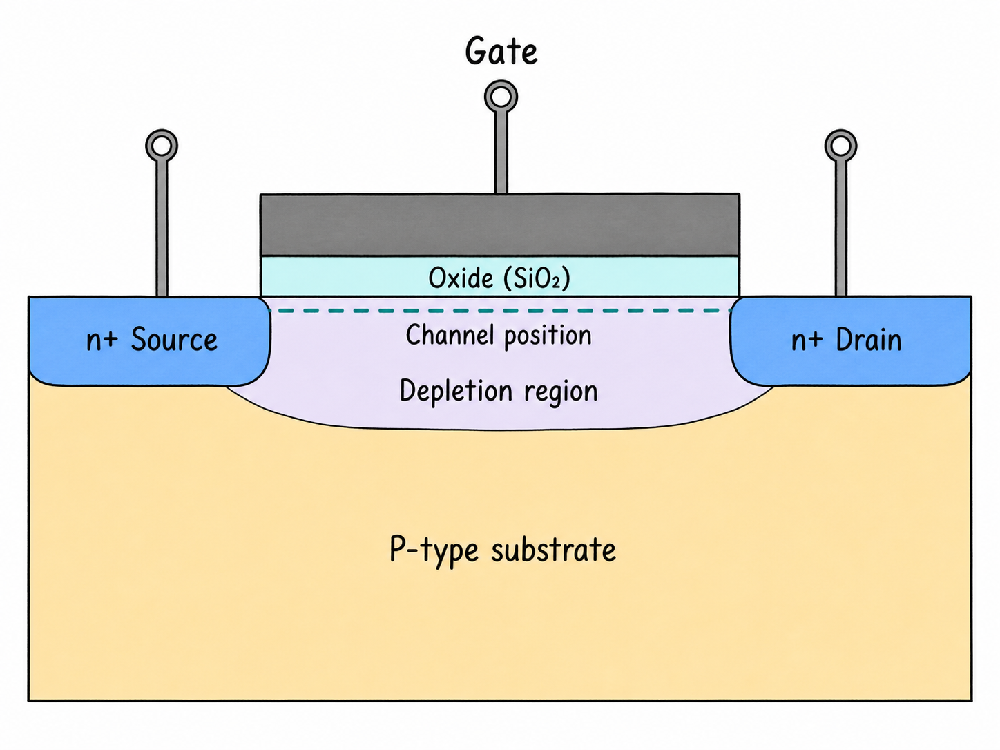
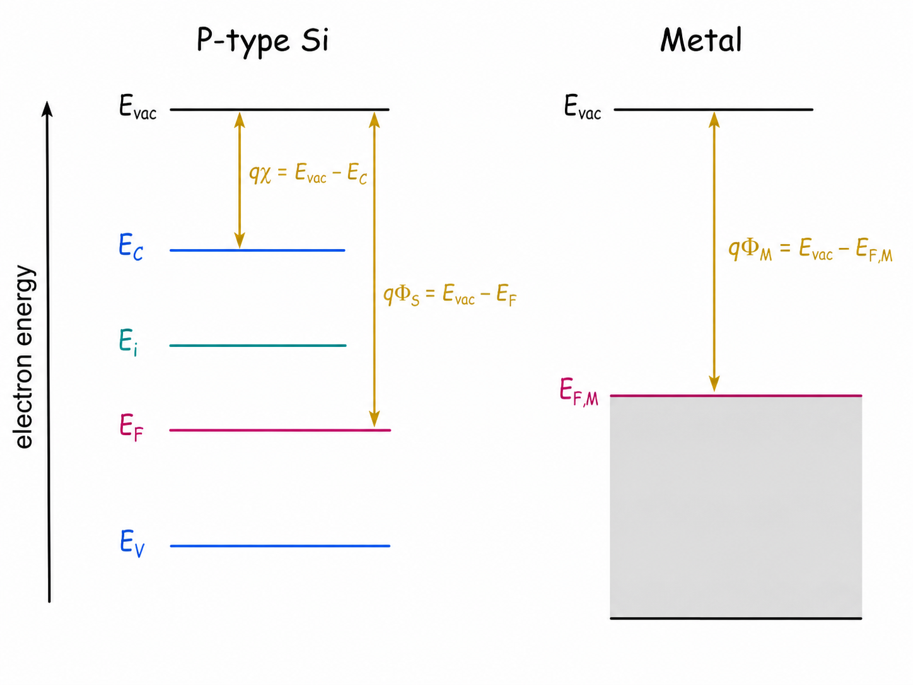
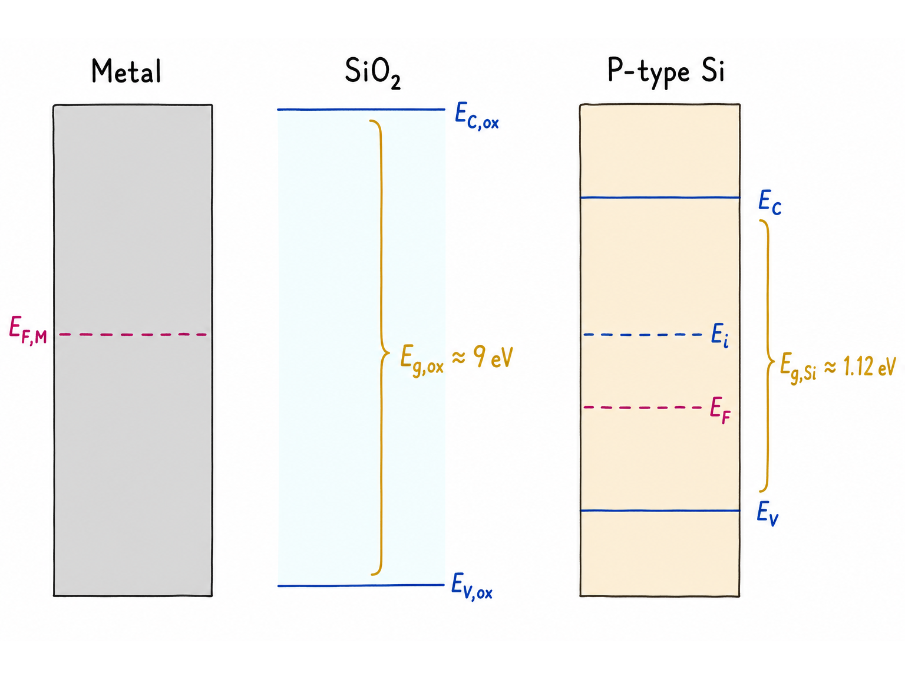
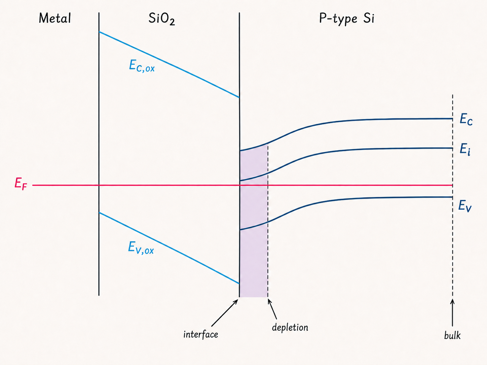

# MOSFET 完整能带图：三种材料如何对齐同一条费米能级

只画硅的能带时，MOS 结构看起来并不复杂：给 P 型衬底施加正栅压，表面能带向下弯，空穴被排斥，耗尽区逐渐形成；栅压再增大，表面进入反型。

但真正的 MOSFET 不只有硅。栅极是金属或重掺杂多晶硅，中间还有近乎不导电的氧化层。要把三种材料放进同一张能带图，关键不是多画几条线，而是回答一个问题：它们达到热平衡后，为什么必须共享同一个电化学势参考？

读完这篇，你会知道

- 真空能级为什么能把金属、氧化层和硅放在同一把能量尺上
- 电子亲和势、功函数和金属—半导体功函数差分别表示什么
- 为什么热平衡时 $E_F$ 必须水平，而氧化层里通常不讨论独立的费米能级
- 正表面电势为何让 P 型硅的 $E_C$、$E_i$、$E_V$ 一起向下弯
- 氧化层电压降和半导体表面势怎样共同承担功函数差

## 先把器件和画图方向固定下来

考虑一个 n 沟道 MOSFET：P 型衬底上有两个 n+ 区，分别作为源极和漏极；栅极位于两者之间，栅与硅之间隔着二氧化硅。沿垂直于栅氧界面的方向观察，栅下区域就是一个 MOS 电容。

讨论能带时必须同时固定两个坐标：

- 横轴是从金属栅极，经氧化层，进入 P 型硅体区的位置；
- 纵轴是电子能量，越向上表示电子能量越高。

正栅压使硅表面电势 $\psi_s$ 增大。电子能量与电势的关系是 $E=-q\psi+\text{常数}$，因此 $\psi_s>0$ 会让表面附近的 $E_C$、$E_i$、$E_V$ 同时向下弯。对 P 型衬底而言，这意味着 $E_i$ 朝 $E_F$ 靠近：先出现耗尽，再继续走向反型。三条能带必须保持正确顺序 $E_C>E_i>E_V$，不能交叉或调换。

## 真空能级：给不同材料一把共同的尺

真空能级 $E_{\mathrm{vac}}$ 可以理解为电子刚刚脱离材料、进入自由空间时的能量参考。

对硅而言，真空能级与导带底之间的能量差定义电子亲和势 $\chi$：

$$
q\chi=E_{\mathrm{vac}}-E_C
$$

$\chi$ 是材料参数。电势变化会让 $E_{\mathrm{vac}}$ 和各条能带一起移动或倾斜，但同一均匀材料中的能量间隔 $E_{\mathrm{vac}}-E_C$ 不会因此改变。

对金属而言，更常用的是功函数 $\Phi_M$：

$$
q\Phi_M=E_{\mathrm{vac}}-E_{F,M}
$$

它表示把一个位于金属费米能级附近的电子移到真空所需的最小能量。光电效应里，光子必须跨过的就是这道功函数门槛。

半导体也有功函数。对 P 型硅，

$$
\Phi_S=\chi+\frac{E_C-E_F}{q}
$$

这里很关键：电子亲和势只量到导带底，半导体功函数则一直量到费米能级。掺杂会改变 $E_F$ 在禁带中的位置，因此会改变 $\Phi_S$，但不会改变同种材料的 $\chi$。

## 三种材料各自是什么样

硅的禁带中需要画出 $E_C$、$E_i$、$E_F$ 和 $E_V$。在远离界面的 P 型体区，费米能级位于本征能级下方，所以能级顺序是

$$
E_C>E_i>E_F>E_V
$$

二氧化硅的禁带约为 $9\ \text{eV}$，远大于硅约 $1.12\ \text{eV}$ 的禁带。导带很高、价带很低，使电子和空穴都难以穿过理想氧化层。它之所以适合做栅介质，正是因为它能让栅极以电场控制硅表面，却在直流上近似隔绝载流子。

氧化层不是一个处于局域热平衡的普通导体，因此通常不为它指定一个可测的、独立的“氧化层费米能级”。完整图中贯穿氧化层画出的水平 $E_F$，应理解为金属与半导体达到热平衡后的共同电化学势参考，不表示氧化层里存在大量可自由交换的电子。

金属没有像半导体那样的禁带图景。它的费米能级落在允许能带内，附近有大量可占据态，因此能导电。画 MOS 完整能带图时，金属最重要的两个量是 $E_{F,M}$ 和 $\Phi_M$。

## 接触以后，先对齐 $E_F$

把金属、氧化层和半导体画在一起之前，可以先分别画它们的真空能级和费米能级。此时金属与 P 型硅的功函数通常不同：

$$
\Phi_{MS}=\Phi_M-\Phi_S
$$

当栅极与半导体通过外部回路相连，并在无电流条件下达到热平衡，电子会重新分布，直到整个结构的电化学势一致。最终图上的 $E_F$ 必须是一条水平线；如果金属一条、半导体另一条，或者 $E_F$ 随位置弯曲，那张图就不是热平衡图。

对 n 沟道 MOSFET 的整器件横向截面也一样：在热平衡且源、漏、体、栅没有外加电位差时，P 型体区、n+ 源区、n+ 漏区和栅极共享同一个水平 $E_F$。源/体和漏/体结附近可以发生能带弯曲，但不能把平衡费米能级画成斜线或分裂成多条。

需要注意，热平衡规则不能直接搬到有外加栅压或漏压的工作状态。施加 $V_{GS}$ 或 $V_{DS}$ 后，不同端子的电化学势由外部电源拉开；有电流时还要使用电子与空穴准费米能级。把“平衡时 $E_F$ 水平”和“加偏压时能带弯曲”混成同一张图，是最常见的概念错误之一。

## 功函数差怎样分给氧化层和硅

对理想 MOS 结构，先忽略氧化层固定电荷和界面态。金属与半导体的功函数差不能凭空消失，它会通过静电势分布表现出来。定性地说，总的能量变化由两部分承担：

- 氧化层中的电压降 $V_{ox}$；
- 半导体表面相对体区的表面势 $\psi_s$。

理想氧化层内部没有体空间电荷，所以电场近似为常数，电势随位置近似线性变化。反映到电子能量图上，氧化层的真空能级、导带边和价带边近似呈直线倾斜。

硅中若形成耗尽区，固定的离化受主 $A^-$ 构成空间电荷，电场不再恒定，电势和能带也就不是简单直线。对 P 型衬底施加足够正的栅电势时，表面 $E_C$、$E_i$、$E_V$ 向下弯；$E_i$ 在表面接近并越过 $E_F$，对应从耗尽走向反型。

理想情况下，平带电压满足

$$
V_{FB}=\Phi_{MS}
$$

实际器件还会受到氧化层电荷、界面态和栅材料选择的影响，平带电压会发生偏移。本篇先忽略这些非理想因素，目的是把三条基本规则建立起来：用真空能级统一能量基准，用功函数差确定对齐前的偏移，用水平 $E_F$ 检验热平衡。

## 一张图的自检清单

画完 MOSFET 完整能带图，可以按下面顺序检查：

1. 器件结构是否是 P 型衬底、n+ 源漏、栅/氧化层/沟道自上而下位置一致；
2. 热平衡图中的 $E_F$ 是否贯穿金属与半导体并保持水平；
3. 金属—氧化层—半导体层序是否明确，氧化层禁带是否显著大于硅；
4. P 型体区是否满足 $E_C>E_i>E_F>E_V$；
5. 正表面电势是否让硅表面三条能带同向下弯，并对应耗尽到反型；
6. $E_C$、$E_i$、$E_V$ 是否始终保持次序，带隙是否没有被错误压缩或翻转。

MOS 完整能带图真正要表达的，不是“哪条线画得更弯”，而是三种材料如何在同一个静电势分布中满足能量间隔、功函数和热平衡约束。先把共同的水平 $E_F$ 固定住，再分配氧化层电压降与半导体表面势，复杂的图就有了可以逐项核对的骨架。
