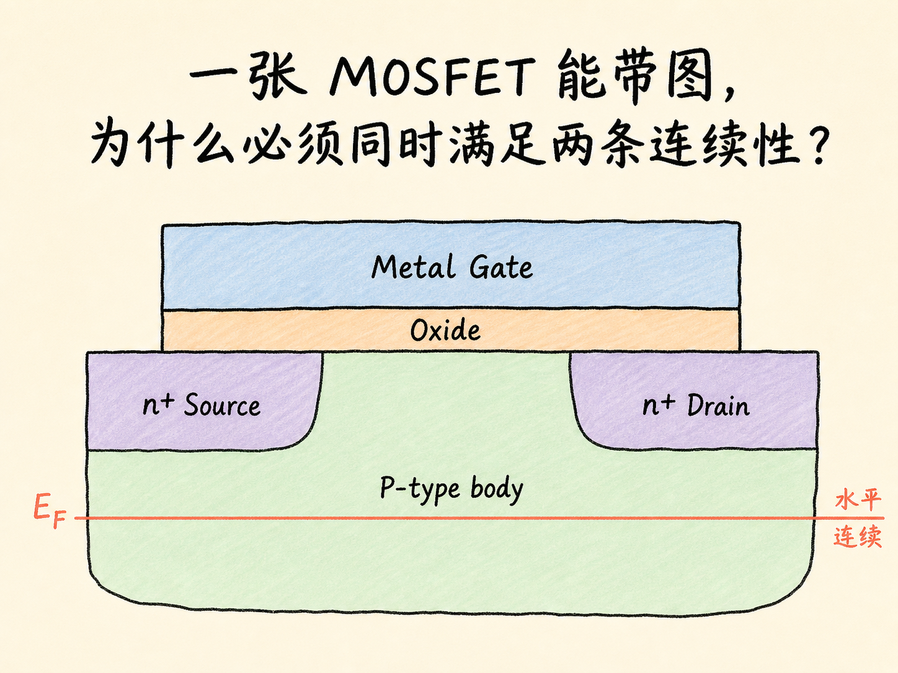
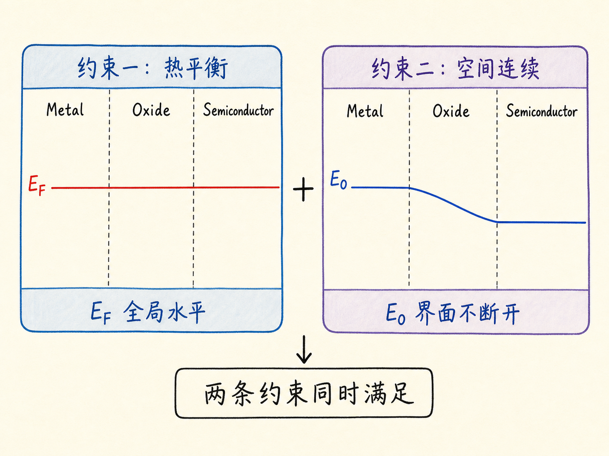
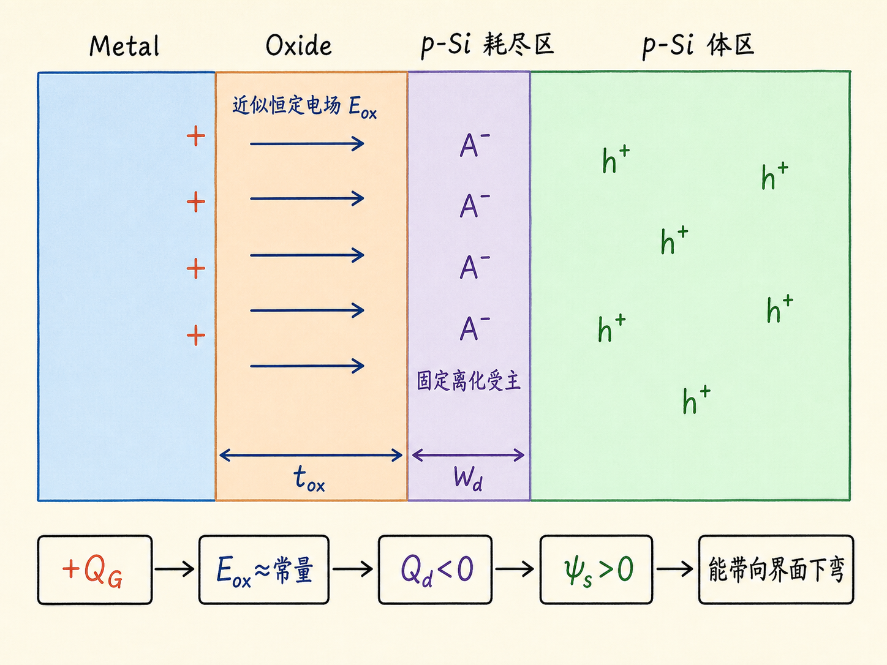
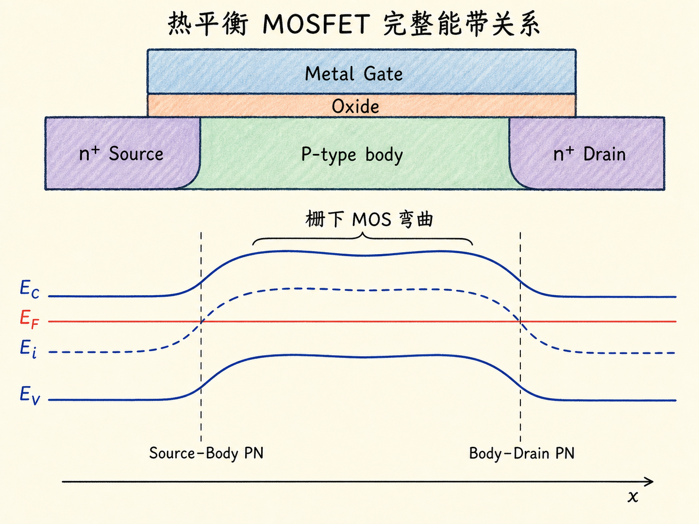

# 一张 MOSFET 能带图，为什么必须同时满足两条连续性？

画 MOSFET 能带图时，最容易犯的错是把金属、氧化层和半导体分别画对，却在拼接时得到一张互相矛盾的图。真正约束整张图的，不是某条曲线画得像不像，而是两个必须同时成立的条件：热平衡时费米能级处处水平，真空能级跨界面连续。

这两个条件一旦固定下来，氧化层为什么近似画成斜直线、半导体表面为什么发生能带弯曲、耗尽区为什么带负电，就不再是需要背诵的结论，而是同一套静电关系的不同表现。

读完这篇，你会知道

- 为什么热平衡费米能级 $E_F$ 必须贯穿整个器件并保持水平
- 为什么真空能级 $E_0$ 可以弯曲，却不能在材料界面突然断开
- P 型体区表面耗尽时，电荷、氧化层电场和能带弯曲如何对应
- 为什么氧化层能带近似线性倾斜，而半导体能带是弯曲的
- 总电势变化怎样分配到氧化层电势降和半导体表面势

## 先把三个区域分开

沿着栅极到体区的方向，一只 MOSFET 的栅叠层依次是金属栅、氧化层和半导体。完整器件还包含嵌在 P 型体区中的 n+ 源区与 n+ 漏区；它们与体区形成两个 PN 结。不过，本篇的推导主轴是穿过栅叠层的纵向切面：先把金属、氧化层和 P 型体区的能量基准连接起来，再把这段 MOS 弯曲放回完整器件的空间关系中。

对 P 型半导体，常用四条能级线是：

- 真空能级 $E_0$
- 导带底 $E_C$
- 本征能级 $E_i$
- 价带顶 $E_V$

费米能级 $E_F$ 在热平衡时由整个结构共同决定。对 P 型体区，在远离界面的准中性区域，$E_F$ 位于 $E_i$ 下方、靠近 $E_V$；因此从高能量到低能量的顺序是 $E_C$、$E_i$、$E_F$、$E_V$。

氧化层也有真空能级、导带底和价带顶。真空能级到导带底的间距是电子亲和势，记作 $\chi_{ox}$。同一种均匀氧化层中，$\chi_{ox}$ 和带隙近似不随位置改变，因此氧化层的几条能带应当大致平行。

金属没有半导体那样清楚的禁带画法。对这里的拼图，最重要的是金属功函数 $\phi_M$：它给出金属费米能级到真空能级的能量差。

## 第一条硬约束：热平衡的 $E_F$ 必须水平

热平衡意味着器件内部没有持续的净载流子流动。如果不同位置的费米能级不同，电子就存在降低自由能的方向，系统还会继续重新分布电荷，直到这种驱动力消失。

所以，正确的作图顺序不是先画三种材料的能带，再试着把 $E_F$ 接起来；而是先画一条贯穿金属、氧化层和半导体的水平 $E_F$，然后在这条共同参考线上安排其余能级。

把完整 MOSFET 的源、漏和体区也纳入同一个热平衡结构后，这条规则仍然成立：n+ 源区、P 型体区、n+ 漏区以及栅极共享同一条水平 $E_F$。源—体和漏—体 PN 结附近可以发生能带弯曲，但 $E_F$ 不能跟着弯，也不能在结区断成几段。

## 第二条硬约束：真空能级不能在界面跳变

想象一个自由电子悬浮在器件上方，能量只比当地真空能级高一点。它从金属上方横向移动到氧化层上方时，不能因为跨过一条材料边界，就在没有交换能量的情况下突然变成束缚电子。

因此，真空能级 $E_0$ 可以随电势变化而升降，却必须在空间中连续。材料的电子亲和势、功函数和带隙可以不同，所以导带底或价带顶在异质界面处允许出现偏移；但代表自由电子能量基准的真空能级不能凭空断裂。

这条连续性还告诉我们：在同一种均匀材料内部，如果电子亲和势保持不变，那么 $E_C$ 与 $E_0$ 的间距也应保持不变。于是 $E_0$ 怎样变化，$E_C$ 就怎样变化；$E_i$ 和 $E_V$ 也要保持带隙关系，沿同一方向移动。

## P 型表面为什么会耗尽

考虑 P 型体区表面能带朝氧化层方向下弯的情形。电子能量与静电势满足

$$E_C(x)=\text{常数}-q\psi(x)$$

因此，半导体表面电势升高时，电子能带向低能量方向移动。与此同时，表面附近的空穴浓度下降，原来被空穴补偿的受主显露为固定的离化受主 $A^-$，形成带负空间电荷的耗尽区。

这里必须区分两类负电荷：

- 空穴离开后留下的 $A^-$ 是固定晶格电荷，不能像载流子那样自由移动；
- 耗尽区并非绝对没有载流子，而是移动载流子浓度相对显著降低。

在耗尽近似下，单位面积耗尽电荷可写成

$$Q_d\approx-qN_AW_d<0$$

其中 $N_A$ 是受主掺杂浓度，$W_d$ 是从半导体表面量向准中性体区的耗尽区宽度。

## 氧化层为什么画成斜直线

半导体表面出现负的耗尽电荷后，金属栅中的自由电荷会重新分布，在靠近氧化层的一侧形成等量异号的正电荷。金属内部的自由载流子会把内部电场抵消掉；氧化层中没有可自由移动的电荷，于是电场主要落在氧化层内。

对面积远大于氧化层厚度的近似平行板结构，氧化层内电场 $\mathcal{E}_{ox}$ 近似为常量。电势满足

$$\mathcal{E}_{ox}=-\frac{d\psi}{dx}$$

常电场积分后得到线性电势，因此氧化层中的 $E_0$、$E_C$ 和 $E_V$ 都近似沿直线倾斜，而且相互保持平行。注意，图上“能量向下”对应“电势向上”，两者的方向相反，原因正是电子带负电。

半导体内的空间电荷并不为零，电场会随位置变化，所以半导体能带通常是弯曲曲线，而不是简单的斜直线。到了准中性体区，空间电荷和电场逐渐趋近于零，能带也恢复平坦。

## 放回完整 MOSFET：栅下弯曲与两个 PN 结怎样衔接

完整器件的横向结构是 n+ 源区—P 型体区—n+ 漏区，栅极和氧化层位于体区表面上方。热平衡时，源—体与漏—体都是 n+P 结。若能量纵轴向上，并从 P 型体区走向 n+ 区，$E_C$、$E_i$ 和 $E_V$ 应整体向下弯曲；反方向从 n+ 区走向 P 区则整体向上弯曲。无论在哪一侧，带隙宽度应保持一致，$E_F$ 始终是一条水平线。

因此，一张合格的完整示意图要同时表达两种空间变化：

1. 纵向上，栅极—氧化层—P 型体区构成 MOS 电容，表面电势控制栅下半导体的能带弯曲；
2. 横向上，栅下体区向左右过渡到 n+ 源区和 n+ 漏区，能带必须连续接入两个 PN 结的内建弯曲。

不能把 MOS 弯曲与 PN 结弯曲画成互不相关的三幅图，也不能把两个结画成同向下降。若横轴从 n+ 源区经 P 型体区走向 n+ 漏区，三条半导体能带会先从源区向体区整体抬高，再从体区向漏区整体降低，形成中间较高、两侧较低的轮廓；$E_F$ 则保持完全水平。

## 总弯曲量怎样分配

半导体表面相对准中性体区的电势差称为表面电势 $\psi_s$。在能量图上，对应的能量变化量是 $q\psi_s$。整个栅叠层上的电势变化可以拆成两部分：

$$V_{\text{total}}=V_{ox}+\psi_s$$

其中 $V_{ox}$ 是氧化层电势降，$\psi_s$ 是半导体内部从体区到表面的电势变化。它们不是两套独立现象，而是同一组栅电荷、耗尽电荷和电场共同决定的电势分配。

这也是能带图与阈值电压之间的桥梁。栅压并不会全部用来移动半导体表面能带：一部分落在氧化层，一部分建立表面势。只有把这两部分算清楚，才能判断表面何时从耗尽进入强反型，并得到 MOSFET 的阈值电压 $V_{TH}$。

## 最后记住一条作图顺序

先画水平的 $E_F$，再保证连续的 $E_0$，然后用电子亲和势、带隙和空间电荷决定其余能带。

这套顺序把看似复杂的 MOSFET 能带图压缩成一条因果链：电荷重新分布产生电场，电场改变电势，电势使能带弯曲，而氧化层电势降与半导体表面势共同决定器件距离阈值还有多远。
