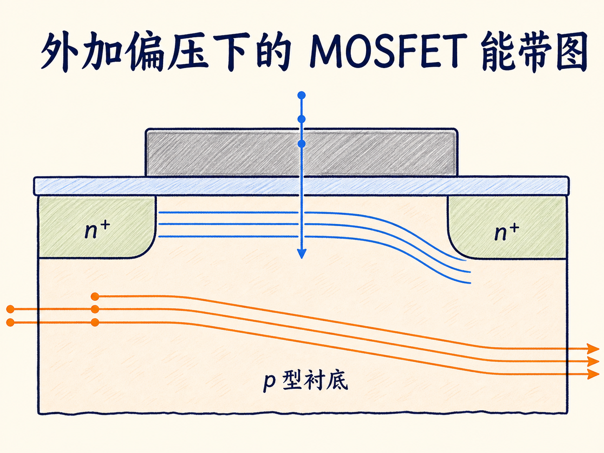
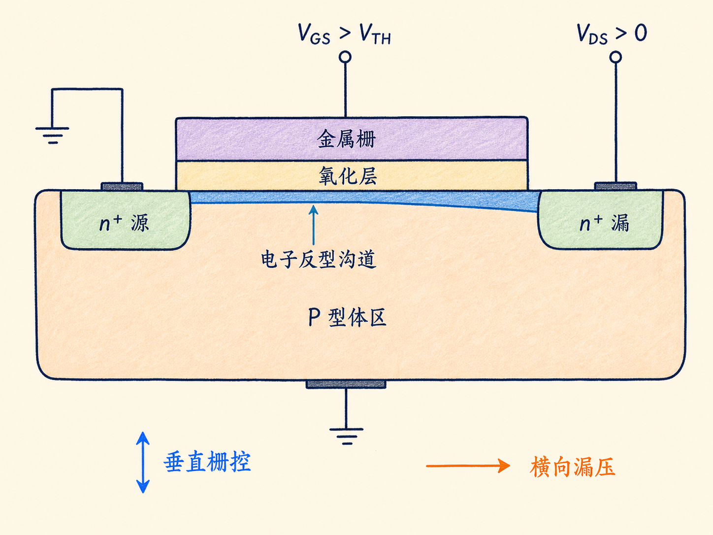
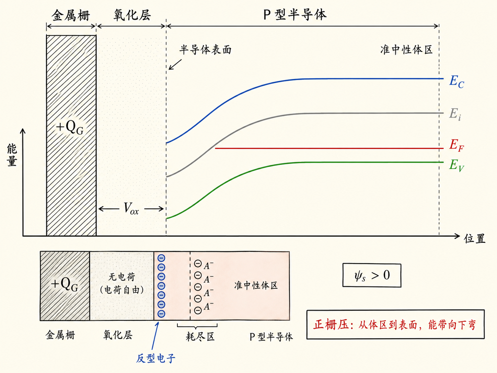
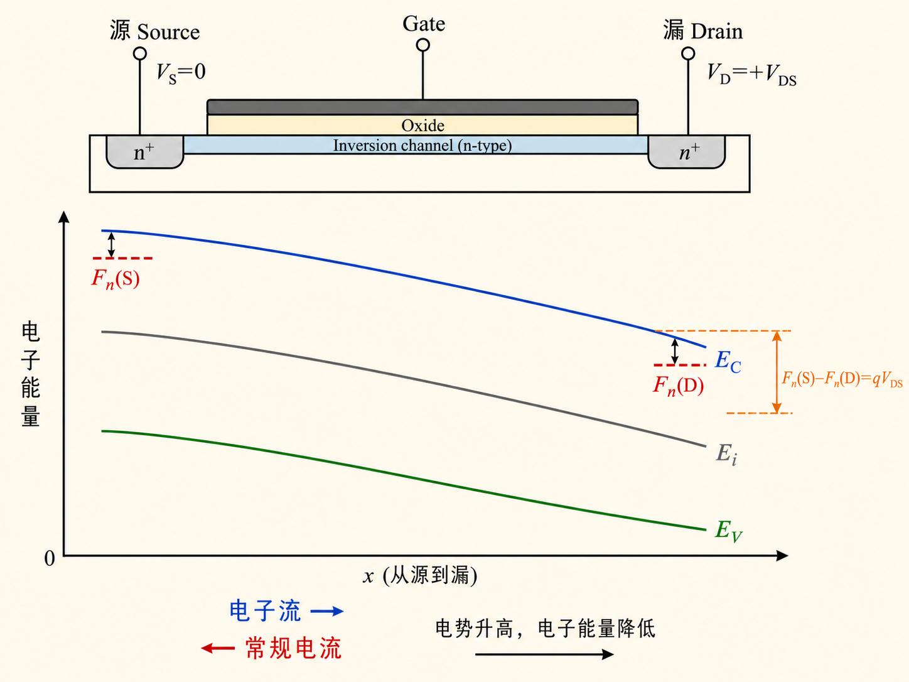
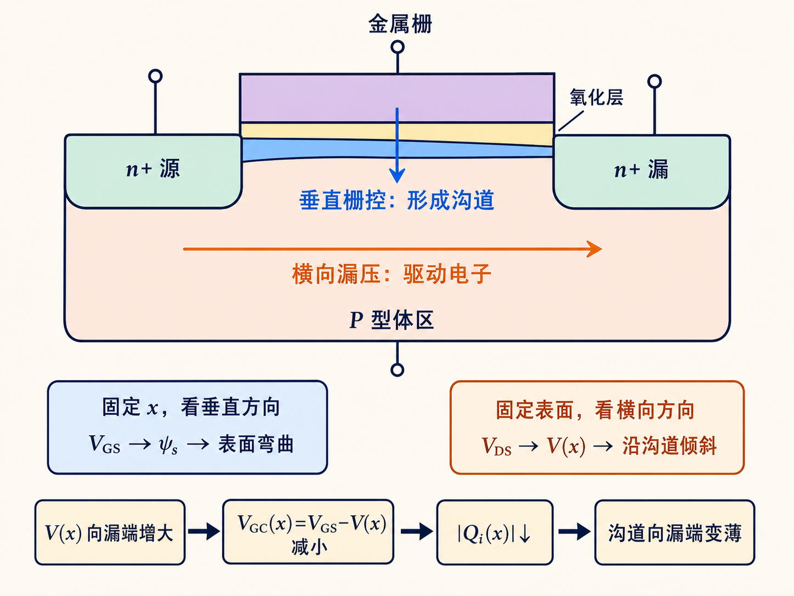

# 外加偏压下的 MOSFET 能带图：栅压负责弯曲，漏压负责倾斜

一张 MOSFET 能带图最容易让人混乱的地方，不是曲线多，而是两种不同方向的变化经常被画在同一张纸上：栅压改变的是从栅极穿过氧化层、进入半导体的垂直能带弯曲；漏压改变的是从源端沿沟道走向漏端的横向能带倾斜。

只要先把这两个方向拆开，再把它们放回同一个器件，外加偏压下的能带图就不再是一组需要背诵的曲线，而是一张电势如何分配的地图。

读完这篇，你会知道

- 为什么正栅压会把 P 型体区表面的能带向下弯曲
- 栅压为什么要分配给氧化层压降和半导体表面势
- 耗尽电荷如何把 $V_G$ 与 $\psi_s$ 联系起来
- 加上 $V_{DS}$ 后，源端和漏端的电子电化学势为什么不再相同
- 如何判断沿沟道的能带倾斜方向有没有画反

## 先认清器件：谁在控制哪一个方向

考虑长沟道 nMOSFET：P 型体区中有两个 n+ 区，分别作为源极和漏极；上方是金属栅，栅与半导体之间隔着氧化层。体区和源极先接地，栅极施加正的 $V_{GS}$，漏极再施加正的 $V_{DS}$。

这三个端口并不做同一件事：

- 栅极通过氧化层建立垂直电场，控制表面是否耗尽、是否形成电子反型沟道。
- 漏极在沟道方向建立横向电场，推动电子从源端流向漏端。
- 体区提供掺杂背景与表面势的参考；这里先令 $V_B=0$。

因此，读能带图时必须先问：横坐标是“栅—氧化层—半导体”的垂直剖面，还是“源—沟道—漏”的横向剖面？没有这个问题，曲线向下弯和向下倾斜很容易被误认为同一回事。

## 第一张图：只有栅压时，垂直能带为什么向下弯

先暂时令 $V_{DS}=0$，只看栅压。正栅压使金属栅的电势升高。电子电荷为 $-q$，所以电子能量随电势变化满足

$$
\Delta E=-q\Delta V
$$

于是金属侧的电子能级相对接地体区降低 $qV_{GS}$。金属的功函数不会因为接上一个电压源而自行改变，因此金属侧真空能级 $E_0$ 要与金属费米能级一起移动，二者间距 $q\phi_M$ 保持不变。

真空能级不能在金属—氧化层界面突然断开。为了保持连续，新增电势必须表现为氧化层中的近似线性降落，以及半导体表面附近的能带弯曲。对 P 型体区施加足够正的栅压时，表面电势 $\psi_s\gt0$，而电子能量与电势符号相反，所以 $E_C$、$E_i$、$E_V$ 在靠近表面处一起向下弯。

能级顺序不能改变：

$$
E_C\gt E_i\gt E_V
$$

在准中性 P 型体区，$E_F$ 位于 $E_i$ 下方、靠近 $E_V$。从体内走向表面，$E_C$、$E_i$、$E_V$ 近似保持相同带隙并共同下弯；当 $E_i$ 在表面下降到 $E_F$ 以下，表面开始表现出电子占优的反型特征。

这里的下弯是垂直方向的结果。它回答的是“栅极怎样改变半导体表面”，还没有回答“电子怎样沿沟道运动”。

## 栅压去了哪里：氧化层和半导体共同分担

工程上更方便把材料功函数差和固定电荷等影响收进平带电压 $V_{FB}$。于是栅压预算写成

$$
V_{GB}=V_{FB}+V_{ox}+\psi_s
$$

其中：

- $V_{ox}$ 是氧化层压降；
- $\psi_s$ 是半导体表面相对准中性体区的表面电势；
- $V_{FB}$ 是把能带恢复到平带状态所需的基准电压。

在耗尽近似下，P 型表面附近的空穴被排斥，留下固定的负离化受主 $A^-$。单位面积耗尽电荷为

$$
Q_d\approx-qN_AW_d\lt0
$$

金属栅上出现等量正电荷。栅与半导体被氧化层隔开，就像一个平板电容器，因此

$$
V_{ox}=-\frac{Q_d}{c_{ox}}
=\frac{|Q_d|}{c_{ox}}
$$

均匀掺杂、耗尽近似下，高斯定律给出

$$
|Q_d(\psi_s)|
=\sqrt{2q\varepsilon_sN_A\psi_s}
$$

代回栅压预算：

$$
V_{GB}-V_{FB}
=\psi_s+\frac{\sqrt{2q\varepsilon_sN_A\psi_s}}{c_{ox}}
$$

这条式子说明了一个重要事实：栅压不会全部变成表面势。一部分电压落在氧化层，另一部分用来弯曲半导体能带。氧化层越薄、$c_{ox}$ 越大，同样的栅压越能有效控制表面势；受主掺杂越高，建立同样的耗尽深度需要的电荷越多。

接近强反型后，新增栅压主要增加反型层电子电荷，单纯“只含耗尽电荷”的近似开始失效。因此，上式最适合解释耗尽到强反型边缘的电压分配，而不是替代完整的反型电荷模型。

## 第二张图：加上漏压后，横向能带为什么向漏端降低

现在保持 $V_{GS}\gt V_{TH}$，让源端接地，并给漏端施加正电压 $V_{DS}\gt0$。沿沟道定义局部电势 $V(x)$：

$$
V(0)=0,\qquad V(L)=V_{DS}
$$

从源端到漏端，静电势升高。电子能量满足 $E=-qV+\text{常数}$，所以 $E_C$、$E_i$、$E_V$ 的横向参考整体向较低能量方向倾斜：

$$
E_C(L)-E_C(0)\approx-qV_{DS}
$$

也就是说，如果横坐标从左侧源端指向右侧漏端，且纵轴向上表示电子能量，那么能带应当从源到漏向下倾斜。把它画成向上倾斜，就等于把电势降落方向画反了。

端口接上不同电压后，整个器件不再处于全局热平衡，不能再用一条贯穿源漏的水平 $E_F$ 描述电子。更合适的是电子准费米能级 $F_n$，或等价的电子电化学势。对于源端接地、漏端为正电压的 nMOSFET：

$$
F_n(D)=F_n(S)-qV_{DS}
$$

源端与漏端的电子电化学势相差 $qV_{DS}$。这个差值正是横向驱动力的能量表达。常规电流从漏流向源，而电子漂移方向相反，从源流向漏。

## 两种变化叠加后，沟道为什么在漏端更“薄”

栅极真正控制沟道的，不是单独的 $V_{GS}$，而是栅极相对局部沟道的电压：

$$
V_{GC}(x)=V_{GS}-V(x)
$$

源端附近 $V(x)\approx0$，栅对沟道的有效控制最强；越靠近漏端，$V(x)$ 越接近 $V_{DS}$，有效栅压越小。因此，反型电荷的幅值沿源到漏逐渐减小。在线性区的一阶渐变沟道近似中：

$$
Q_i(x)\approx-c_{ox}\bigl[V_{GS}-V_{TH}-V(x)\bigr]
$$

当 $V_{DS}$ 增大到接近 $V_{GS}-V_{TH}$ 时，漏端反型电荷趋近于零，进入夹断条件。需要注意，夹断不是漏端 n+ 区消失，也不是整个沟道突然断路；它表示漏端附近的反型层电荷不再能按线性区公式保持为有限值。

现在可以把两种几何关系放在一起：

- 在任意一个固定的沟道位置，沿垂直方向看，正栅压使 P 型表面能带下弯，形成耗尽并最终反型。
- 在固定的表面深度，沿横向从源到漏看，正 $V_{DS}$ 使电势升高，电子能带向漏端降低，电子准费米能级也降低 $qV_{DS}$。
- 因为局部有效栅压 $V_{GS}-V(x)$ 向漏端减小，漏端的反型层比源端薄。

垂直弯曲回答“沟道能不能形成”，横向倾斜回答“沟道中的电子为什么移动”。这就是外加偏压下 MOSFET 能带图最值得记住的分工。

## 读图时的六项自检

看到一张 nMOSFET 偏压能带图，可以依次检查：

1. 结构是否为 P 型体区、n+ 源/漏，上方栅极与半导体之间是否有氧化层。
2. 正栅压下，半导体表面的 $E_C$、$E_i$、$E_V$ 是否一起向下弯，而不是只弯其中一条。
3. 任意位置是否始终保持 $E_C\gt E_i\gt E_V$，带隙没有被随意压缩或翻转。
4. 非平衡源漏偏压下，是否避免把一条水平 $E_F$ 贯穿整个沟道。
5. 对 $V_D\gt V_S$，电子准费米能级是否满足 $F_n(D)\lt F_n(S)$，差值为 $qV_{DS}$。
6. 横轴从源指向漏、纵轴表示电子能量时，能带是否向漏端降低；同时是否把这种横向倾斜与栅压引起的垂直弯曲分开。

## 最后收束：把能带图当作电势地图

外加偏压并没有为 MOSFET 增加一套新的物理。栅压、漏压和体区参考最终都通过电势改变电子能量：

$$
E_{\text{electron}}=\text{常数}-q\phi
$$

正栅压沿垂直方向重排表面电荷并弯曲能带；正漏压沿横向建立电势差，使能带和电子电化学势从源到漏降低。先分清方向，再核对符号，阈值电压、渐变沟道、夹断和体效应就都能从同一张电势地图中自然长出来。
