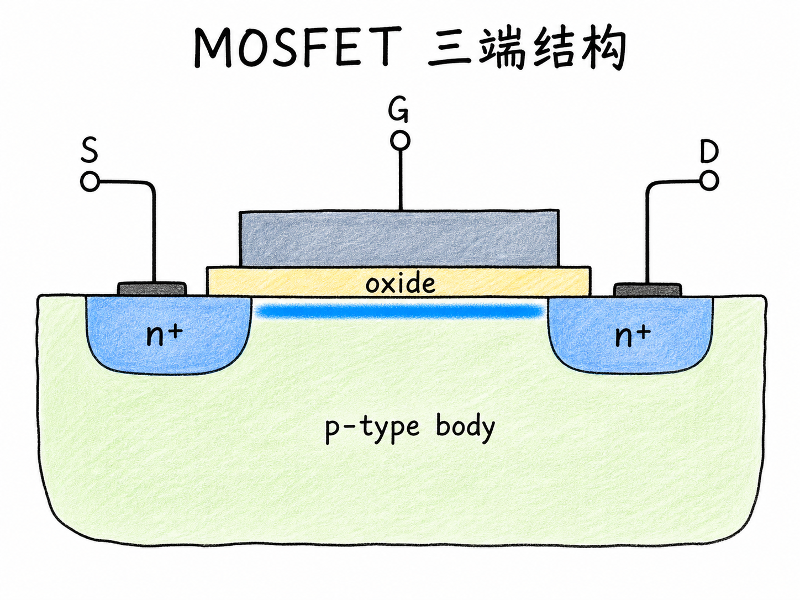
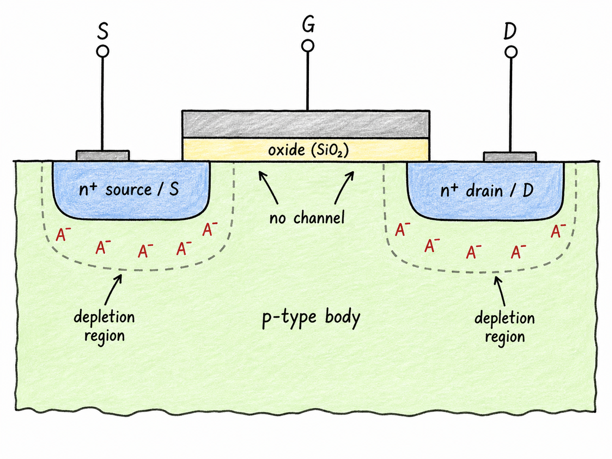
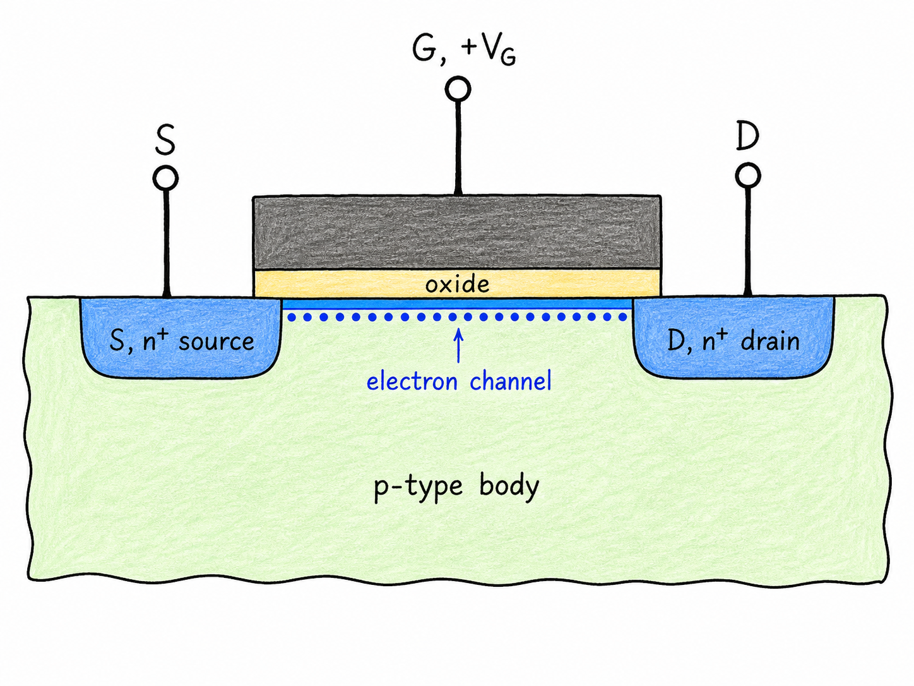
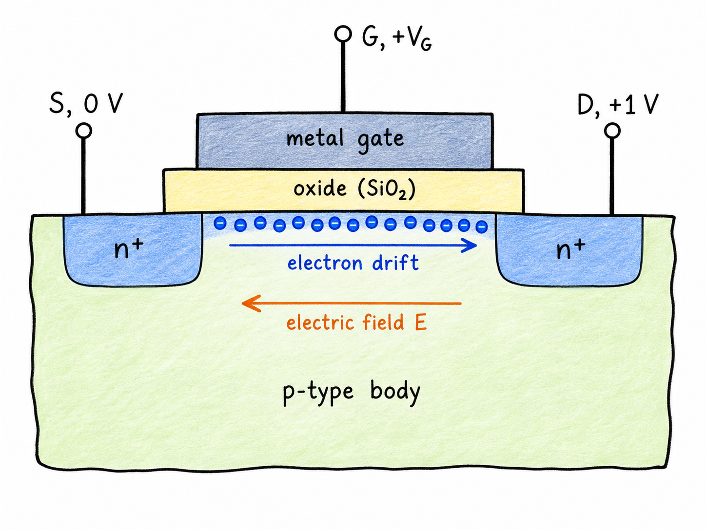

# MOSFET 三端结构：为什么栅压能把两个 N+ 区变成一个开关

MOSFET 最常见的用法之一，是做电子开关。开关断开时，两端像被隔离；开关闭合时，两端像被一条可控的导电通道接起来。MOSFET 的关键不在于它“有一个栅极”这么简单，而在于栅极能在原本不导通的 P 型体区表面，临时造出一条电子沟道。

这篇只讲结构和物理图像，不急着推电流公式。先把三端结构看清楚，后面再谈阈值电压、$I$-$V$ 特性和体效应，才不会把 source、drain、gate、body 的角色混在一起。

读完这篇，你会知道

- 为什么两个 $n^+$ 区嵌在 P 型体区里，默认不是一根导线
- gate、oxide 和 P 型 body 怎样一起形成可控电子沟道
- source 和 drain 为什么不是由材料名称决定，而是由电子流动角色决定
- MOSFET 说“三端”和“四端”分别是什么意思
- 为什么 body 常接地，但不能把 body 错当成三端结构里的第三端

## 先做一个“天然断开”的开关

想做电子开关，第一步不是先想怎样导通，而是先保证它在默认状态下确实断开。

一个简单办法是利用 PN 结。把两个重掺杂 N 型区域，也就是 $n^+$ source/drain 区，放进 P 型 body 或 substrate 里。每个 $n^+$ 区和周围 P 型体区之间都会形成 PN 结。零偏时，结附近形成耗尽区；在 P 型一侧，耗尽区里留下固定的离化受主 $A^-$。

因为 $n^+$ 区掺杂很重，耗尽区主要伸进 P 型体区，而不是大量伸进 $n^+$ 区。结果是，左边 $n^+$ 区里的电子和右边 $n^+$ 区里的电子，中间隔着 P 型区域和耗尽区。它们不能自然连成一条低阻通路。

这就是 MOSFET 作为开关的“断开态”底座：两个 N 型岛放在 P 型海里，默认彼此隔开。这个结构不是一开始就导通，而是必须被栅压改造之后才导通。

## gate 的任务：在氧化层下面造出电子沟道

接下来把 MOS 结构放到两个 $n^+$ 区之间：上面是金属 gate，中间是 oxide，下面是 P 型半导体表面。

当 gate 加正电压 $V_G$ 时，P 型体区表面的能带会弯曲。刚开始，表面附近的空穴被排走，留下固定的受主离子，形成耗尽区。栅压继续升高后，表面会吸引足够多电子，形成一层反型电子。

这层电子不是漂在氧化层里，而是在半导体表面、氧化层正下方。它位于 source 和 drain 之间。如果 gate 和 oxide 在几何上稍微覆盖到两侧 $n^+$ 区边缘，那么这层反型电子就能和左、右两个 $n^+$ 区接上，形成一条连续电子沟道。

这一刻，MOSFET 的开关含义就出现了：

$$
V_G \text{ 足够正} \Rightarrow \text{表面形成电子沟道} \Rightarrow \text{source 与 drain 可导通}
$$

需要注意，这里的 gate 不是直接往沟道里注入电子。oxide 把 gate 和半导体隔开，gate 通过电场改变半导体表面的载流子分布。MOSFET 能低功耗控制大电流，正是因为控制端主要靠电场工作，而不是靠 gate 直流注入。

## source 和 drain：一个供电子，一个收电子

有了沟道，只表示 source 和 drain 之间出现了可导电路径。要让电流真正流动，还需要在 source 和 drain 之间加电压。

以 NMOS 为例，常见约定是 source 接较低电位，例如 $V_S=0$，drain 接较高电位，例如 $V_D=1\ \mathrm{V}$。于是

$$
V_{DS}=V_D-V_S\gt0
$$

电场方向从 drain 指向 source，而电子带负电，漂移方向与电场相反，所以电子从 source 侧流向 drain 侧。左侧提供电子，叫 source；右侧收集电子，叫 drain。

因此 source/drain 的名字不只是几何标签。对 NMOS 来说，在这个偏置下，source 是电子来源，drain 是电子流入的端子。后面讨论电流方向时，还要区分“电子流方向”和“传统电流方向”：电子从 source 到 drain，传统电流方向通常从 drain 到 source。

这个开关也不是理想导线。source 和 drain 之间要有电压，电子才会漂移；gate 电压越高，沟道电子越多，等效电阻越低。后续推导 MOSFET 的 $I$-$V$ 特性，本质上就是把“栅压决定沟道电荷，漏源电压驱动沟道电荷运动”这句话定量化。

## 三端结构：gate、source、drain

现在可以给三端 MOSFET 下一个清楚定义。

在最常用的电路视角里，MOSFET 是三端器件：

- gate：控制端，通过 oxide 下面的电场调节沟道是否形成
- source：电子来源端，通常作为 NMOS 的低电位参考端
- drain：电子收集端，通常接较高电位

这三端对应一个开关问题：gate 决定通不通，source 和 drain 是被接通或断开的两端。

但这不等于器件里只有三块材料。P 型 body/substrate 一直存在，而且 source、drain 与 body 之间本来就形成 PN 结。没有 body，就没有承载耗尽区、表面反型和沟道形成的半导体区域。

所以，“三端”说的是电路里重点拿出来控制和传输的三个端子，不是说 body 在物理结构中不存在。

## 四端结构：body 是真实存在的第四端

严格说，MOSFET 还有第四个端子：body，也叫 bulk 或 substrate。

对于这里讨论的 NMOS，body 是 P 型区域。为了让分析简单，body 通常接到最低电位或接地。这样 source-body 和 drain-body 的 PN 结大多保持反偏，不会意外导通；同时也把体区电位固定下来，让阈值电压的讨论更稳定。

但 body 不是永远可以忽略。只要 $V_B$ 不等于 source 电位，source-body 电压就会改变体区耗尽状态，进一步改变阈值电压。这就是下一讲要讨论的 body effect。

所以更准确的说法是：

$$
\text{电路简化视角：三端 MOSFET} = G, S, D
$$

$$
\text{完整物理结构：四端 MOSFET} = G, S, D, B
$$

body 可以在某些电路里被固定接地或接源端，但它不能被错误地当成三端结构里的“第三端”。第三端是 gate；body 是完整结构中的第四端。

## 把这张结构图记成一句话

NMOS 三端结构可以这样记：

一个 P 型 body 里嵌着两个 $n^+$ 区，默认被 PN 结耗尽区隔开；gate 隔着 oxide 加正电压，在 oxide 下方、source 和 drain 之间诱导出电子沟道；source 提供电子，drain 收集电子，于是开关闭合。

这句话里最重要的顺序是：先有被隔开的两个 $n^+$ 区，再用 gate 电场形成沟道，最后由 $V_{DS}$ 驱动电子流动。后面所有 MOSFET 公式，都是围绕这三步展开。
